## 一、Flume的安装部署

安装Flume就需要有Flume的安装包，Flume包可以在[官网](https://flume.apache.org/download.html)下载到：

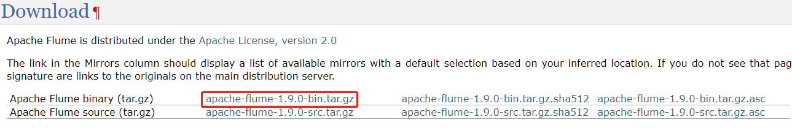

然后：

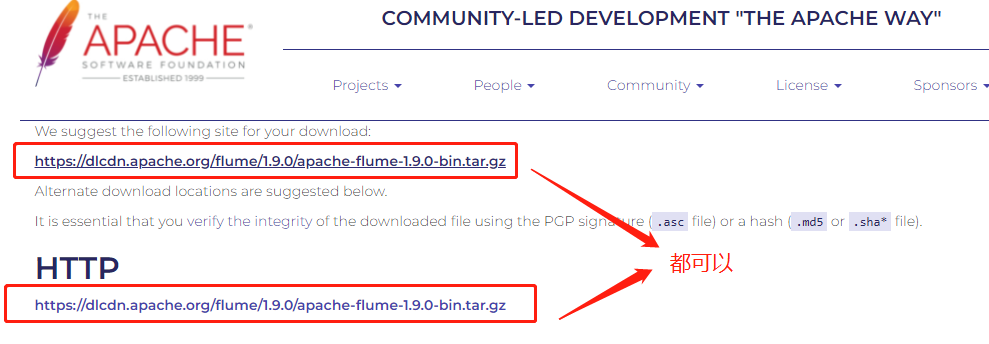

> 如果要下载往期版本可以，点击第一张图片所在网页下方的：[archive repository](http://archive.apache.org/dist/flume)
>
> 在这里可以下载Flume的所有版本：
>
> 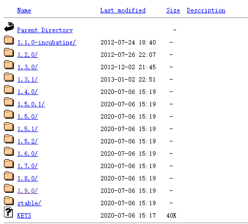


把下载之后的`tar`包上传到`hadoop102`的`/opt/software`目录下，随后解压到`/opt/module`：

```bash
# 解压文件
[wzq@hadoop102 software]$ tar -zxvf apache-flume-1.9.0-bin.tar.gz -C /opt/module/

# cd到module
[wzq@hadoop102 software]$ cd /opt/module/

# 改个名字，一般是：框架名+版本号
[wzq@hadoop102 module]$ mv apache-flume-1.9.0-bin flume-1.9.0
```

打开这个文件夹，发现这个文件和以往的那些框架都大差不差，都是由bin、conf、lib等组成，下图展示了各个文件夹都是干嘛的

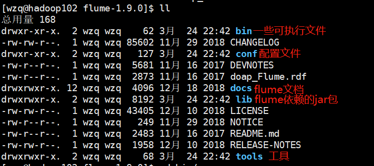

删除`lib`目录下的`guava`包，这个包是`Google`开源的一个工具类，但是比较恶心，大数据框架里面引用这个包，大家的版本都不一致，所以为了解决兼容性问题，这个包我们应该删掉：

```bash
[wzq@hadoop102 flume-1.9.0]$ ls lib/ | grep guava
guava-11.0.2.jar
[wzq@hadoop102 flume-1.9.0]$ rm -rf lib/guava-11.0.2.jar
```


至此，Flume已经安装部署好了，但是值得注意的是：**必须要有Java的环境变量**，因为在前面的Hadoop、Zookeeper、Hive都已经配置好了，所以这里不做演示


## 二、Flume入门案例

### 1、监控端口数据官方案例

**需求**：使用Flume监听一个端口，收集该端口数据，并打印到控制台

#### 1.1 需求分析

如下图所示，首先借助`netcat`工具向本机的44444端口发送数据；Flume监控本机的44444端口，通过Flume的Source端读取数据；最后Flume将获取到的数据通过Sink端写出到控制台

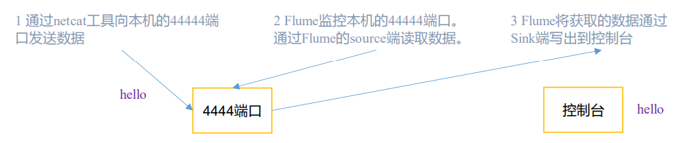


最终要达到的一个效果是：输入数据，flume端在控制台输出：

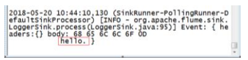


#### 1.2 netcat简单使用

首先需要安装`netcat`：

```bash
[wzq@hadoop102 flume-1.9.0]$ sudo yum install nc
```


安装完成，我们简单使用一下`netcat`，开启一个端口的命令是：

```bash
[wzq@hadoop102 flume-1.9.0]$ nc -lk 9999
```

监听一个端口的命令是：

```bash
[wzq@hadoop102 flume-1.9.0]$ nc localhost 9999
```

> 必须首先开启端口，然后才能监听

这时候就可以两个窗口就可以互相发送信息了：

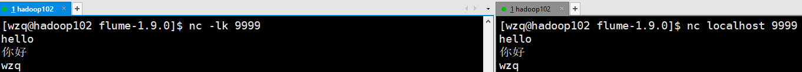


#### 1.3 实现步骤

首先判断`44444`端口是不是已经被占用了：

```bash
[wzq@hadoop102 flume-1.9.0]$ sudo netstat -tlp | grep 44444
```

如果没有弹出任何东西，就是说44444端口没有被占用，如果该端口被占用，有两个解决方案：

- 找到占用该端口的进程号，杀掉这个进程
- 换一个端口

**创建Flume Agent配置文件 netcat-flume-logger.conf**，该文件需要在`flume/job/`目录下：

```bash
[wzq@hadoop102 flume-1.9.0]$ mkdir job
[wzq@hadoop102 flume-1.9.0]$ vim job/netcat-flume-logger.conf
```

然后将以下配置信息填进去：

```properties
# example.conf: A single-node Flume configuration

# Name the components on this agent
a1.sources = r1
a1.sinks = k1
a1.channels = c1

# Describe/configure the source
a1.sources.r1.type = netcat
a1.sources.r1.bind = localhost
a1.sources.r1.port = 44444

# Describe the sink
a1.sinks.k1.type = logger

# Use a channel which buffers events in memory
a1.channels.c1.type = memory
a1.channels.c1.capacity = 1000
a1.channels.c1.transactionCapacity = 100

# Bind the source and sink to the channel
a1.sources.r1.channels = c1
a1.sinks.k1.channel = c1
```

> 注意：这个配置文件名称是有讲究的`netcat-flume-logger.conf`，一般情况下是这样命名的：`数据源-flume-输出位置.conf`

现在来解读一下这个配置文件的信息：

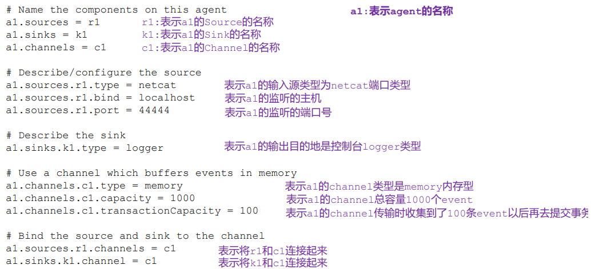

> **注意：**
>
> - **`agent`的名字是`a1`，这个`a1`需要保证全局唯一！**
> - **事务的个数需要小于channel中event的个数**
> - **一个channel可以有多个source**
> - **一个channel只能有一个sink**


其实这样子就算配置好了

#### 1.4 测试

首先要开启`Flume`监听端口，开启`Flume`监听端口有两种写法：

第一种：

```bash
[wzq@hadoop102 flume-1.9.0]$ bin/flume-ng agent --conf conf/ --name a1 --conf-file job/netcat-flume-logger.conf -Dflume.root.logger=INFO,console
```

第二种写法：

```bash
[wzq@hadoop102 flume-1.9.0]$ bin/flume-ng agent -c conf/ -n a1 -f job/netcat-flume-logger.conf -Dflume.root.logger=INFO,console
```

参数说明：

- `--conf`等价于`-c`：指定配置文件所在目录
- `--name`等价于`-n`：指定agent的名字a1
- `--conf-file`等价于`-f`：flume本次启动读取的配置文件是job目录下的netcat-flume-logger.conf
- `-Dflume.root.logger=INFO,console`：-D表示flume运行时动态修改`flume.root.logger`参数属性值，并将控制台日志打印级别设置为INFO，日志级别包括`log、info、warn、error`


然后使用`netcat`工具向本机44444端口发送内容：

```bash
[wzq@hadoop102 flume-1.9.0]$ nc localhost 44444
```

结果如下图所示：

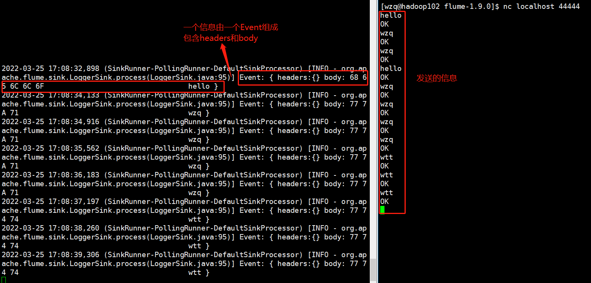


### 2、实时监控单个追加文件

#### 2.1 需求分析

**需求：**实时监控Hive日志，并上传到HDFS

如下图所示：我们首先需要创建符合条件的flume配置文件，然后执行该配置文件开启监控，随后打开Hive生成日志，最后再输出到HDFS。

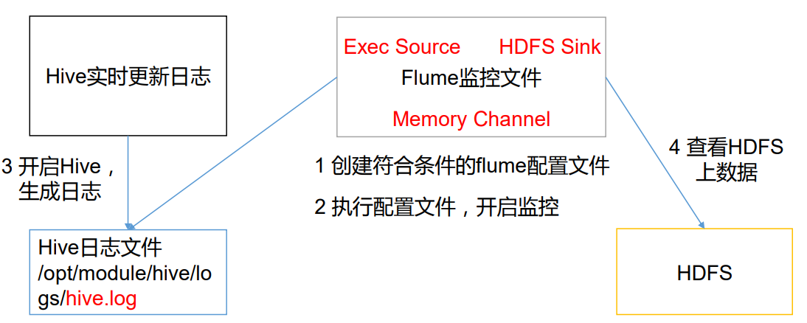


#### 2.2 写配置文件

> 做这个案例服务器必须要有Java、Hadoop、Hive的环境

首先在`/opt/module/flume-1.9.0/job/`目录下创建一个文件：`file-flume-hdfs.conf`：

```bash
[wzq@hadoop102 flume-1.9.0]$ vim job/file-flume-hdfs.conf
```


**首先写Agent配置**，这里就是给Agent起名字，包括sources、channel、sinks的名字：

```properties
# Name the components on this agent
a1.sources = r1
a1.sinks = k1
a1.channels = c1
```

**然后写source配置**，这里的配置我们可以参考[Apach Flume官网的文档](https://flume.apache.org/releases/content/1.9.0/FlumeUserGuide.html)：因为我们想监控一个文件，这个文件是实时追加的，我们平常可以使用`tail -f 文件`去监控这个文件，所以在Source这块需要使用`exec source`，下表是这个模块的配置信息：

| Property Name   | Default     | Description                                                  |
| :-------------- | :---------- | :----------------------------------------------------------- |
| **channels**    | –           |                                                              |
| **type**        | –           | The component type name, needs to be `exec`                  |
| **command**     | –           | The command to execute                                       |
| shell           | –           | A shell invocation used to run the command. e.g. /bin/sh -c. Required only for commands relying on shell features like wildcards, back ticks, pipes etc. |
| restartThrottle | 10000       | Amount of time (in millis) to wait before attempting a restart |
| restart         | false       | Whether the executed cmd should be restarted if it dies      |
| logStdErr       | false       | Whether the command’s stderr should be logged                |
| batchSize       | 20          | The max number of lines to read and send to the channel at a time |
| batchTimeout    | 3000        | Amount of time (in milliseconds) to wait, if the buffer size was not reached, before data is pushed downstream |
| selector.type   | replicating | replicating or multiplexing                                  |
| selector.*      |             | Depends on the selector.type value                           |
| interceptors    | –           | Space-separated list of interceptors                         |
| interceptors.*  |             |                                                              |

> 其中加粗的字体是必须要有的配置

我们先配必须要有的，一会儿再来扩展：

```properties
# Describe/configure the source
a1.sources.r1.type = exec
a1.sources.r1.command = tail -F /opt/module/hive-3.1.2/logs/hive.log
a1.sources.r1.channels = c1
```

> 注意这里`tail -F`，他和`tail -f`的区别是：
>
> - `-f`：如果文件删掉了，不会再继续监控
> - `-F`：如果文件没有了，tail依旧会帮助我们建立连接持续监控

**然后是写sink配置**，这里需要使用`HDFS sink`，因为我们最终需要输出到HDFS，看一下HDFS sink的所有配置信息：（表格太长了，这里贴一张图片吧！）


和上面一样黑色字体是必须要配置的，先配必须的：

```properties
# Describe the sink
a1.sinks.k1.type = hdfs
a1.sinks.k1.hdfs.path = hdfs://hadoop102:8020/flume
a1.sinks.k1.channel = c1
```

> 注意：这里的hdfs.path，指定的hadoop端口，必须是hdfs通信的内网端口，可以在hadoop配置文件core-site.xml种查看这个端口


**最后我们再配置一下channel：**

| Property Name                | Default         | Description                                                  |
| :--------------------------- | :-------------- | :----------------------------------------------------------- |
| **type**                     | –               | The component type name, needs to be `memory`                |
| capacity                     | 100             | The maximum number of events stored in the channel           |
| transactionCapacity          | 100             | The maximum number of events the channel will take from a source or give to a sink per transaction |
| keep-alive                   | 3               | Timeout in seconds for adding or removing an event           |
| byteCapacityBufferPercentage | 20              | Defines the percent of buffer between byteCapacity and the estimated total size of all events in the channel, to account for data in headers. See below. |
| byteCapacity                 | see description | Maximum total **bytes** of memory allowed as a sum of all events in this channel. The implementation only counts the Event `body`, which is the reason for providing the `byteCapacityBufferPercentage` configuration parameter as well. Defaults to a computed value equal to 80% of the maximum memory available to the JVM (i.e. 80% of the -Xmx value passed on the command line). Note that if you have multiple memory channels on a single JVM, and they happen to hold the same physical events (i.e. if you are using a replicating channel selector from a single source) then those event sizes may be double-counted for channel byteCapacity purposes. Setting this value to `0` will cause this value to fall back to a hard internal limit of about 200 GB. |

配置必须要有的：

```properties
# Memory Channel
a1.channels.c1.type = memory
```


综合来看这个配置信息：

```properties
# Name the components on this agent
a1.sources = r1
a1.sinks = k1
a1.channels = c1

# Describe/configure the source
a1.sources.r1.type = exec
a1.sources.r1.command = tail -F /opt/module/hive-3.1.2/logs/hive.log
a1.sources.r1.channels = c1

# Describe the sink
a1.sinks.k1.type = hdfs
a1.sinks.k1.hdfs.path = hdfs://hadoop102:8020/flume
a1.sinks.k1.channel = c1

# Memory Channel
a1.channels.c1.type = memory
```


#### 2.3 再多一点配置

我们可以在`sinks`里面多加一些配置，比如将这些个日志文件以年月日的形式存储到各个文件夹，多长时间创建一个文件，文件达到多少兆再创建一个等等：

```properties
# 给这个地址加上时间分文件
a1.sinks.k1.hdfs.path = hdfs://hadoop102:8020/flume/%Y-%m-%d/%H
# 上传文件的前缀
a1.sinks.k1.hdfs.filePrefix = logs-
# 是否按照时间滚动文件夹
a1.sinks.k1.hdfs.round = true
# 多少时间单位创建一个新的文件夹
a1.sinks.k1.hdfs.roundValue = 1
# 重新定义时间单位
a1.sinks.k1.hdfs.roundUnit = hour
# 是否使用本地时间戳，这个一定要设置为true
a1.sinks.k1.hdfs.useLocalTimeStamp = true
# 积攒多少个 Event 才 flush 到 HDFS 一次
a1.sinks.k1.hdfs.batchSize = 100
# 设置文件类型，可支持压缩
a1.sinks.k1.hdfs.fileType = DataStream
# 多久生成一个新的文件
a1.sinks.k1.hdfs.rollInterval = 30
# 设置每个文件的滚动大小
a1.sinks.k1.hdfs.rollSize = 134217700
# 文件的滚动与 Event 数量无关
a1.sinks.k1.hdfs.rollCount = 0
```

也可以指定Channel的容量，以及事务容量：

```properties
a1.channels.c1.capacity = 1000
a1.channels.c1.transactionCapacity = 100
```

所以这个配置文件是这样的：

```properties
# Name the components on this agent
a1.sources = r1
a1.sinks = k1
a1.channels = c1

# Describe/configure the source
a1.sources.r1.type = exec
a1.sources.r1.command = tail -F /opt/module/hive-3.1.2/logs/hive.log
a1.sources.r1.channels = c1

# Describe the sink
a1.sinks.k1.type = hdfs
a1.sinks.k1.hdfs.path = hdfs://hadoop102:8020/flume/%Y-%m-%d/%H
a1.sinks.k1.channel = c1
# 上传文件的前缀
a1.sinks.k1.hdfs.filePrefix = logs-
# 是否按照时间滚动文件夹
a1.sinks.k1.hdfs.round = true
# 多少时间单位创建一个新的文件夹
a1.sinks.k1.hdfs.roundValue = 1
# 重新定义时间单位
a1.sinks.k1.hdfs.roundUnit = hour
# 是否使用本地时间戳
a1.sinks.k1.hdfs.useLocalTimeStamp = true
# 积攒多少个 Event 才 flush 到 HDFS 一次
a1.sinks.k1.hdfs.batchSize = 100
# 设置文件类型，可支持压缩
a1.sinks.k1.hdfs.fileType = DataStream
# 多久生成一个新的文件
a1.sinks.k1.hdfs.rollInterval = 30
# 设置每个文件的滚动大小
a1.sinks.k1.hdfs.rollSize = 134217700
# 文件的滚动与 Event 数量无关
a1.sinks.k1.hdfs.rollCount = 0


# Memory Channel
a1.channels.c1.type = memory
a1.channels.c1.capacity = 1000
a1.channels.c1.transactionCapacity = 100
```

#### 2.4 测试

写完之后就可以测试了，执行一下命令：

```bash
[wzq@hadoop102 flume-1.9.0]$ bin/flume-ng agent -c conf/ -n a1 -f job/file-flume-hdfs.conf 
```


运行Hive：

```bash
[wzq@hadoop102 hive-3.1.2]$ hive
```

随便执行几条命令：

```sql
use gulivideo;
show tables;
select * from gulivideo_orc limit 10;
```

打开`hdfs`可以发现日志已经有啦：

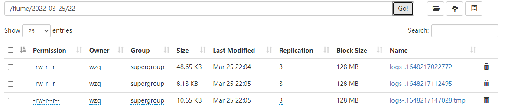


### 3、实时监控目录下多个新文件

#### 3.1 需求分析

**需求：**使用Flume监听一个目录下的文件，并上传至HDFS

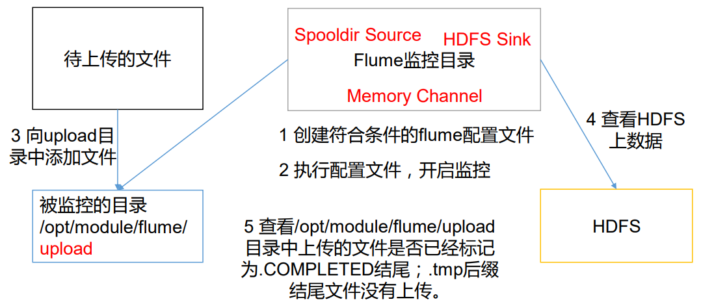

在这一部分`source`就要变一变了，监控的是目录下的新文件，所以应该使用`Spooldir Source`其他不变


#### 3.2 写配置文件

首先在`/opt/moudle/flume-1.9.0/job/`下创建文件`dir-flume-hdfs.conf`：

```bash
[wzq@hadoop102 flume-1.9.0]$ touch job/dir-flume-hdfs.conf
```


然后开始写配置文件了，第一个**Agent部分**：

```properties
# Agent
a3.sources = r3
a3.sinks = k3
a3.channels = c3
```

第二个写**Source部分**，这次需要使用的是`Spooldir Source`，所以可以在官网上找一找找个source都需要配置一些什么东西：

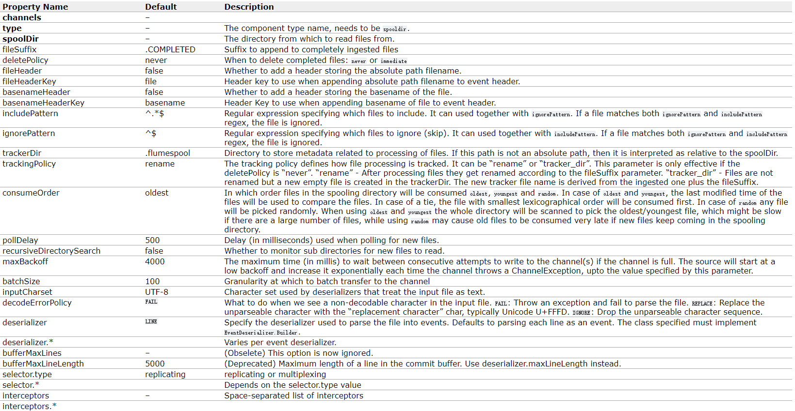

需要关注的是加粗字体，还有`fileSuffix`、`includePattern`、`ignorePattern`还有`fileHeader`

- `type`：source的类型，是什么就指定什么，前两个案例已经写了`netcat`和`exec`了
- `spoolDir`：要监控哪个文件夹，这个案例监控`/opt/module/flume`下的`upload`目录，读者可以自己创建一个
- `channels`：与哪个channel绑定，这次我们在最后再绑定channel
- `fileSuffix`：文件后缀，默认值`.COMPLETED`，Flume会扫描指定的文件夹，如果某个文件后缀是`.COMPLETED`就不会被上传，如果往监控目录扔一个文件，该文件会立刻被Flume扫描，并加上这个后缀
- `includePattern`：只有被你定义的正则表达式匹配的文件才会上传
- `ignorePattern`：忽略你定义的正则表达式匹配的文件
- `fileHeader`：是否添加存储绝对路径文件名的标头，这个默认值是`false`，需要设置为`true`

所以就可以写配置了：

```properties
# Source
a3.sources.r3.type = spooldir
a3.sources.r3.spoolDir = /opt/module/flume-1.9.0/upload
a3.sources.r3.fileSuffix = .COMPLETED
a3.sources.r3.fileHeader = true
# 文件后缀为tmp的文件不上传
a3.sources.r3.ignorePattern = ([^ ]*\.tmp)
```


第三个部分写`sink`，这里直接照搬第二个案例`sink`的配置，因为我们想上传到`hdfs`：

```properties
# Sink
a3.sinks.k3.type = hdfs
a3.sinks.k3.hdfs.path = hdfs://hadoop102:8020/flume/upload/%Y-%m-%d/%H
# 上传文件的前缀
a3.sinks.k3.hdfs.filePrefix = upload-
# 是否按照时间滚动文件夹
a3.sinks.k3.hdfs.round = true
# 多少时间单位创建一个新的文件夹
a3.sinks.k3.hdfs.roundValue = 1
# 重新定义时间单位
a3.sinks.k3.hdfs.roundUnit = hour
# 是否使用本地时间戳
a3.sinks.k3.hdfs.useLocalTimeStamp = true
# 积攒多少个Event才刷新到HDFS一次
a3.sinks.k3.hdfs.batchSize = 100
# 设置文件类型，可支持压缩
a3.sinks.k3.hdfs.fileType = DataStream
# 多久生成一个新的文件
a3.sinks.k3.hdfs.rollInterval = 20
# 设置每个文件的滚动大小大概是128M
a3.sinks.k3.hdfs.rollSize = 134217700
# 文件的滚动与Event数量无关
a3.sinks.k3.hdfs.rollCount = 0
```


第四个部分写`channel`，也和上面一样：

```properties
# Channel
a3.channels.c3.type = memory
a3.channels.c3.capacity = 1000
a3.channels.c3.transactionCapacity = 100
```


最后一部分是channels与soure和sink绑定：

```properties
# Bind
a3.sources.r3.channels = c3
a3.sinks.k3.channel = c3
```


#### 3.3 测试

然后就可以测试了，输入下面的命令开启监控：

```bash
[wzq@hadoop102 flume-1.9.0]$ bin/flume-ng agent -n a3 -c conf/ -f job/dir-flume-hdfs.conf
```

然后我们可以在外部创建一个文件，然后丢入本地的`upload`文件夹：

```bash
[wzq@hadoop102 flume-1.9.0]$ vim 1.txt
[wzq@hadoop102 flume-1.9.0]$ mv 1.txt upload/
```

移动到本地的upload文件夹后，这个文件被加了`.COMPLETED`后缀：

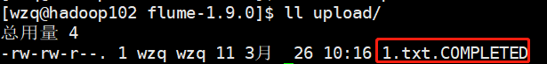


再去看看`hdfs`，已经成功上传了

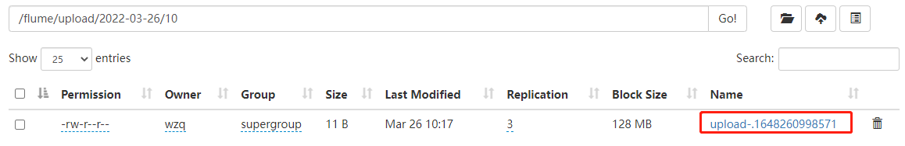


> 但是注意：
>
> - 同名的文件不能扔到一个文件夹
> - 不能扔进去一个和指定的`.COMPLETED`后缀一样的文件到本地目录
> - 不能在本地目录动态修改文件


### 4、实时监控目录下的多个追加文件

`exec source`适用于监控一个实时追加的文件，但不能保证数据丢失；`Spooldir source`能保证数据不丢失，而且能够实现断点续传，但不能实时监控，而`Taildir source`既能实现实时追加，也可以实现断点续传，保证数据不丢失。

#### 4.1 需求分析

**需求：**使用Flume监听整个目录的实时追加文件，并上传至HDFS

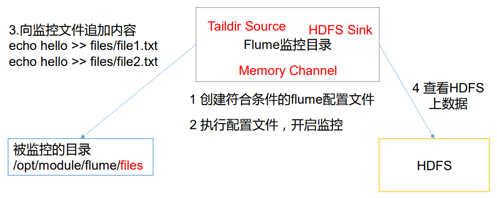


#### 4.2 写配置文件

首先创建一个文件：`taildir-flume-hdfs.conf`：

```bash
[wzq@hadoop102 flume-1.9.0]$ touch job/taildir-flume-hdfs.conf
```

然后开始写配置，第一部分依旧是`agent`：

```properties
# Agent
a4.sources = r4
a4.sinks = k4
a4.channels = c4
```

然后是`source`，这次需要使用`taildir source`，去官网看一下配置：

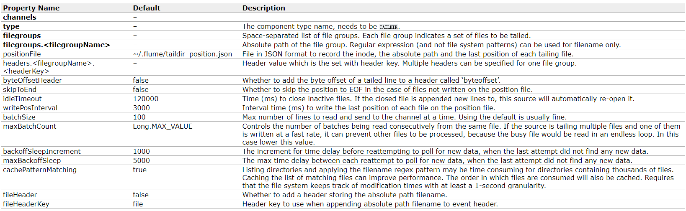

除了关注黑体字之外，还需要关注一个配置`positionFile`：

- `type`：source类型
- `filegroups`：这个字段可以为要监控的目录命名
- `filegroups.<filegroupName>`：为上一步命名的目录指定目录，可以写入正则规则
- `positionFile`：要实现断点续传，就需要有一个文件标记某个要上传的文件到了哪一行，这个文件默认存储位置是：`~/.flume/taildir_position.json`，可以把它更改到别的地方

所以就可以写配置了：

```properties
# Source
a4.sources.r4.type = TAILDIR
a4.sources.r4.filegroups = f1 f2
a4.sources.r4.filegroups.f1 = /opt/module/flume-1.9.0/files/file1/.*file.*
a4.sources.r4.filegroups.f2 = /opt/module/flume-1.9.0/files/file2/.*log.*
a4.sources.r4.positionFile = /opt/module/flume-1.9.0/tail_dir.json
```

接下来的sinks、channels和绑定都可以和上面的一样，唯一不一样的就是可以换个在hdfs上存储的目录，这里只贴这一部分：

```properties
a4.sinks.k4.hdfs.path = hdfs://hadoop102:8020/flume/upload2/%Y-%m-%d/%H
```


#### 4.3 测试

首先启动flume的agent进程：

```bash
[wzq@hadoop102 flume-1.9.0]$ bin/flume-ng agent -n a4 -c conf/ -f job/taildir-flume-hdfs.conf
```


然后写入一些文件：

```bash
[wzq@hadoop102 files]$ touch file1/file1.txt
[wzq@hadoop102 files]$ echo hello >> file1/file1.txt 
[wzq@hadoop102 files]$ touch file2/log1.txt
[wzq@hadoop102 files]$ echo wzq >> file2/log1.txt 
```

观察hdfs：

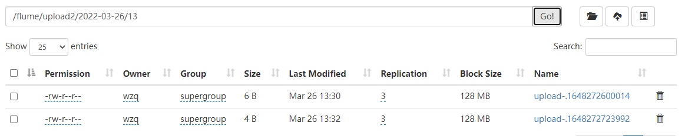


已经成功上传

> 但是美中不足的是，如果对已有的文件进行更名操作，flume就会再次上传一份数据，这就导致了上传重复数据，如果要解决这一问题，有两种解决方案：
>
> - 不对文件进行更名
>
> - 修改flume tailsource的源码
>
>   找到源码位置删掉后面的这一部分，只判断`inode`，这一部分代码在：[github](https://github.com/apache/flume/blob/trunk/flume-ng-sources/flume-taildir-source/src/main/java/org/apache/flume/source/taildir/TailFile.java)
>
>   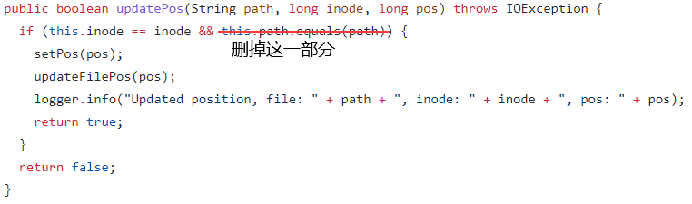
>
>   这一部分在：[github](https://github.com/apache/flume/blob/trunk/flume-ng-sources/flume-taildir-source/src/main/java/org/apache/flume/source/taildir/ReliableTaildirEventReader.java)
>
>   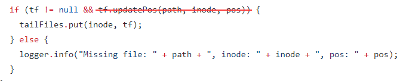
>
>   可以将这些代码clone到本地，修改之后再次打包上传到flume/libs目录下就好了


## 参考资料

- 尚硅谷Flume教学视频
- [Apache Flume官网](https://flume.apache.org/)
