> 这篇blog的内容比较多，包括Flume中的事务、Agent内部原理、可以组成的拓扑结构，以及各种拓扑结构对应的案例。


## 一、Flume事务

废话不多，直接上图，看图说话：

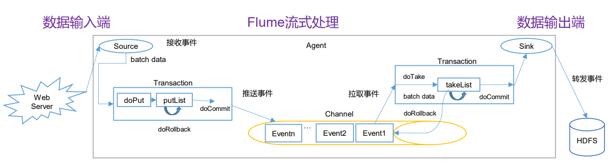

如上图所示，`source`和`channel`、`channel`和`sink`之间都有事务操作，其中source是`put`给channel的、但是sink是主动`take`channel中的数据的

- Put事务流程
  - `doPut`：将批数据（batch data）写入临时缓冲区
  - `doCommit`：检查channel内存队列是否足够合并
  - `doRollback`：channel内存队列空间不足时，会回滚数据
- Take事务流程
  - `doTake`：将数据取到临时缓冲区`takeList`，并将数据发送给HDFS
  - `doCommit`：如果数据全部发送成功，则清除临时缓冲区`takeList`
  - `doRollback`：数据发送过程中如果出现异常，rollback将临时缓冲区中的数据归还给channel内存对列

## 二、Agent内部原理

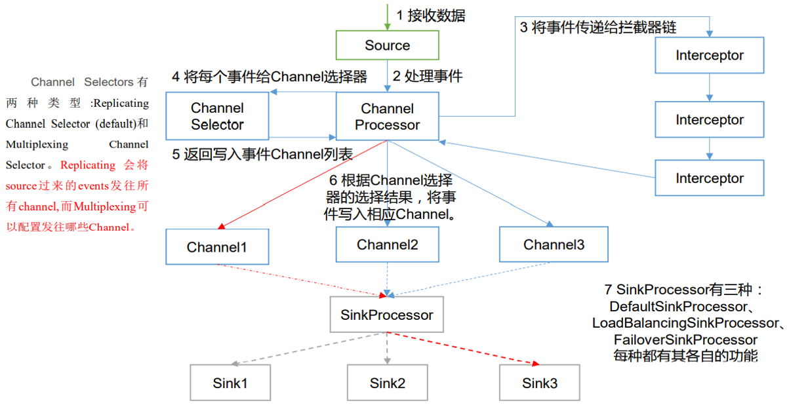

这个就是Agent的内部流程：

- 首先source接收数据
- 接收完数据之后source并没有直接发给channel，而是发送到了`Channel Processor`，在这一部分做了两件事情：
  - `Interceptor`拦截器首先会排除不符合条件的数据
  - 再把数据发送给`Channel Selector`，他的作用就是选则Event要发送给哪个channel，共有两个选择：`Replicating`（复制）和`Multiplexing`（多路复用），默认值是第一个复制
- 紧接着就是根据Channel Selector选择的结果，将事件写入响应的Channel
- 在Channel之后，要经过一个`SinkProcessor`，共有三种SinkProcessor：`DefalutSinkProcessor`（对应单个Sink）、`LoadBalancingSinkProcessor`（可以实现负载均衡、故障转移功能）和`FailoverSinkProcessor`（对应Sink Group）

## 三、拓扑结构及其案例

### 1、简单串联

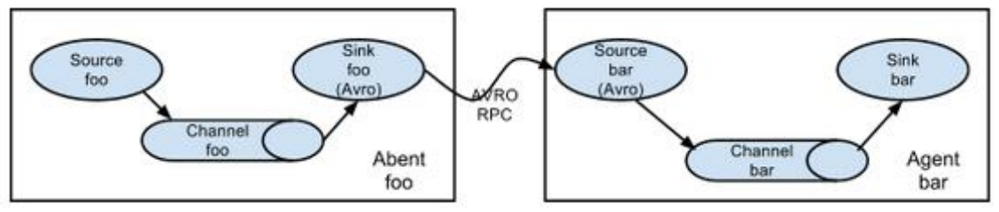

这种模式就是将多个`flume agent`顺序串联起来，第一个agent的sink连接第二个agent的source，中间使用的`avor sink`和`avor source`，这个模式不建议桥接过多的flume，因为它会影响传输速率，并且如果中间某个flume宕机会影响整个传输系统

### 2、复制和多路复用

#### 2.1 是个什么东西？


如上图所示，`Flume`支持将事件流向一个或者多个目的地，这种模式可以将相同数据复制到多个channel中，或者将不同数据分发到不同的channel中，sink可以选择传送到不同的目的地

下面来个案例，看一看这玩意是怎么配置的

#### 2.2 案例

##### 2.2.1 需求分析

**需求：**使用`Flume-1`监控文件（Hive的日志文件）变动，`Flume-1`将变动内容传递给`Flume-2`，`Flume-2`负责存储到`HDFS`，同时`Flume-1`将变动内容传递给`Flume-3`，`Flume-3`负责输出到本地。

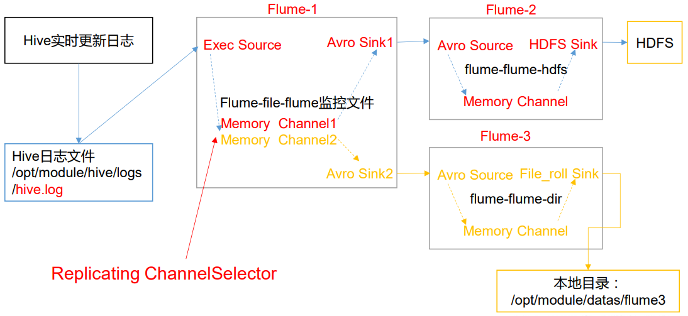

上面的这张图帮助我们很好的理解了这个架构，我们需要写三个配置文件，分别是：

- `flume-file-flume.conf`：对应Flume-1，表示读取Hive的日志文件然后对接两个channel和两个sink
- `flume-flume-hdfs.conf`：对应Flume-2，表示读取Flume-1的第一个sink，最终输出到HDFS
- `flume-flume-file.conf`：对应Flume-3，表示读取Flume-1的第二个sink，最终输出到本地文件

为了管理好每个配置文件，可以专门建一个文件夹存储这三个配置信息：

```bash
[wzq@hadoop102 job]$ pwd
/opt/module/flume-1.9.0/job
[wzq@hadoop102 job]$ mkdir group1
```

Flume-1和Flume-2、Flume-3之间是要avro进行连接，这个avro是一个轻量级的RPC通信框架，有服务端和客户端才可以通信，对应的，Flume-2与Flume-3中的`source`是服务端，Flume-1中的两个sink则是客户端，所以如果配置什么的都写好了，应该先启动Flume-2与Flume-3，最后启动Flume-1

在这个案例中，我们规定**Flume-1与Flume-2中间的通信端口是4141，Flume-1与Flume-3中间的通信端口是4142**

##### 2.2.2 flume-file-flume.conf

在上面那个文件夹中创建这个文件：

```bash
[wzq@hadoop102 group1]$ touch flume-file-flume.conf
```


在这一部分需要写一个source、两个channel和两个sink，首先写agent，命名：

```properties
# Agent 命名组件
a1.sources = r1
a1.channels = c1 c2
a1.sinks = k1 k2
```

然后我们先配置source，这一部分我们要监控Hive的日志文件，所以用`exec source`就够了：

```properties
# Source
a1.sources.r1.type = exec
a1.sources.r1.command = tail -F /opt/module/hive-3.1.2/logs/hive.log
a1.sources.r1.shell = /bin/bash -c
```

紧接着就要配置channel了，我们有两个channel，都可以使用基于内存的：

```properties
# Channels
a1.channels.c1.type = memory
a1.channels.c1.capacity = 1000
a1.channels.c1.transactionCapacity = 100

a1.channels.c2.type = memory
a1.channels.c2.capacity = 1000
a1.channels.c2.transactionCapacity = 100
```

然后配置这个sinks，有两个source，如果是要发送给另外两个flume，就需要是要`avro`了，看一下avro sink都有哪些配置吧：

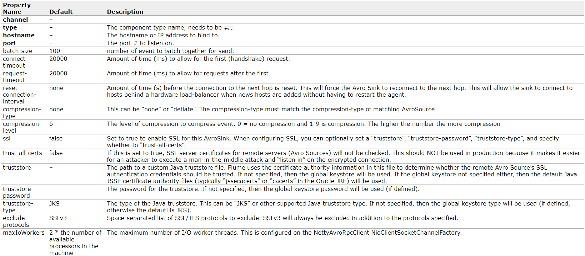

黑体字是必须要配置的，现在来配置一下

```properties
# Sink 数据发送者
a1.sinks.k1.type = avro
a1.sinks.k1.hostname = hadoop102
a1.sinks.k1.port = 4141

a1.sinks.k2.type = avro
a1.sinks.k2.hostname = hadoop102
a1.sinks.k2.port = 4142
```

最后就是绑定Channel、source和sink了：

```properties
# bind
a1.sources.r1.channels = c1 c2
a1.sinks.k1.channel = c1
a1.sinks.k2.channel = c2
```

##### 2.2.3 flume-flume-hdfs.conf

这个对应Flume-2，从Flume-1读数据输出到hdfs，创建这个文件：

```bash
[wzq@hadoop102 group1]$ touch flume-flume-hdfs.conf
```

先写agent，为每个组件命名：

```properties
# Agent
a2.sources = r1
a2.channels = c1
a2.sinks = k1
```

然后写`sources`，这个source应该是`avro source`找一下配置：

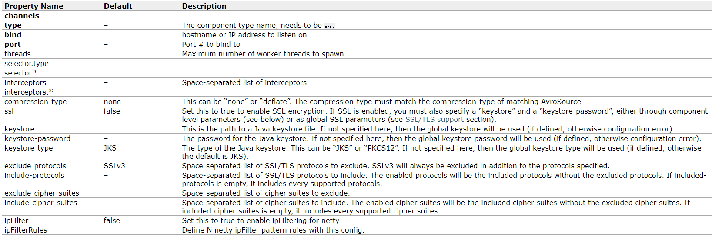

黑色字体是必须要配置的，这个监听的flume-1的4141端口：

```properties
# Sources
a2.sources.r1.type = avro
a2.sources.r1.bind = hadoop102
a2.sources.r1.port = 4141
```

然后是配置sink，输出到hdfs，在[上一篇blog](http://wzqwtt.club/2022/03/25/flume-an-zhuang-bu-shu-yi-ji-ru-men-an-li/)中已经写了很多了，这里直接粘贴了：

```properties
# Sink
a2.sinks.k1.type = hdfs
a2.sinks.k1.hdfs.path = hdfs://hadoop102:8020/flume2/%Y-%m-%d/%H
# 上传文件的前缀
a2.sinks.k1.hdfs.filePrefix = flume2-
# 是否按照时间滚动文件夹
a2.sinks.k1.hdfs.round = true
# 多少时间单位创建一个新的文件夹
a2.sinks.k1.hdfs.roundValue = 1
# 重新定义时间单位
a2.sinks.k1.hdfs.roundUnit = hour
# 是否使用本地时间戳
a2.sinks.k1.hdfs.useLocalTimeStamp = true
# 积攒多少个Event才刷新到HDFS一次
a2.sinks.k1.hdfs.batchSize = 100
# 设置文件类型，可支持压缩
a2.sinks.k1.hdfs.fileType = DataStream
# 多久生成一个新的文件
a2.sinks.k1.hdfs.rollInterval = 20
# 设置每个文件的滚动大小大概是128M
a2.sinks.k1.hdfs.rollSize = 134217700
# 文件的滚动与Event数量无关
a2.sinks.k1.hdfs.rollCount = 0
```

接着是配置channel，还是使用内存的吧：

```properties
# Channels
a2.channels.c1.type = memory
a2.channels.c1.capacity = 1000
a2.channels.c1.transactionCapacity = 100
```

最后绑定：

```properties
# Bind
a2.sources.r1.channels = c1
a2.sinks.k1.channel = c1
```

##### 2.2.4 flume-flume-file.conf

对应Flume-3，创建这个文件：

```bash
[wzq@hadoop102 group1]$ touch flume-flume-file.conf
```

先写agent，为组件命名：

```properties
# Agent
a3.sources = r1
a3.channels = c1
a3.sinks = k1
```

然后是配置source，是avro类型的，监听的端口是4142，所以：

```properties
# Source
a3.sources.r1.type = avro
a3.sources.r1.bind = hadoop102
a3.sources.r1.port = 4142
```

接着写channels：

```properties
# Channels
a3.channels.c1.type = memory
a3.channels.c1.capacity = 1000
a3.channels.c1.transactionCapacity = 100
```

然后是写sink，这个sink输出到本地文件，应该使用`file_roll`类型：

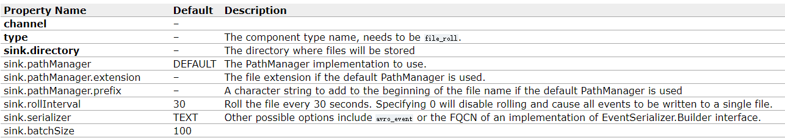

黑色字体是必须配置的，包含类型和一个存储的目录

> 这个目录必须是已经创建的，我们创建一下，然后指定这个配置到本地的这个目录：
>
> ```bash
> [wzq@hadoop102 group1]$ mkdir /opt/module/datas/flume2
> ```
>
> 

配置信息：

```properties
# Sink
a3.sinks.k1.type = file_roll
a3.sinks.k1.sink.directory = /opt/module/datas/flume2
```

最后绑定：

```properties
# bind
a3.sources.r1.channels = c1
a3.sinks.k1.channel = c1
```


##### 2.2.5 测试

至此所有的配置都写完了，现在启动一下看看，因为要先启动服务端，所以要依次启动`flume-flume-hdfs.conf`、`flume-flume-file.conf`、`flume-file-flume.conf`，开启的这个是一个窗口进程，因此需要复制会话，在各个会话分别启动，不想复制会话使用`nohup`也可以：

```bash
[wzq@hadoop102 flume-1.9.0]$ bin/flume-ng agent -n a2 -c conf/ -f job/group1/flume-flume-hdfs.conf
[wzq@hadoop102 flume-1.9.0]$ bin/flume-ng agent -n a3 -c conf/ -f job/group1/flume-flume-file.conf
[wzq@hadoop102 flume-1.9.0]$ bin/flume-ng agent -n a1 -c conf/ -f job/group1/flume-file-flume.conf
```


现在我们启动一下hive

```bash
[wzq@hadoop102 hive-3.1.2]$ hive
```

启动hive的时候，hive.log就打印了许多东西，可以看一下本地和hdfs都有没有文件被创建：

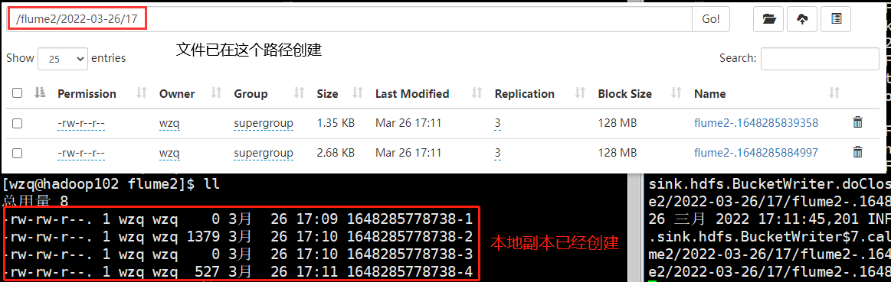

### 3、负载均衡和故障转移

#### 3.1 是个什么东西？

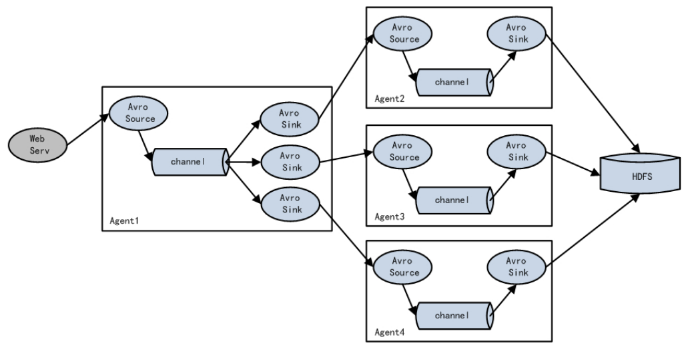

Flume支持使用将多个sink分到一个sink组（sink group）上，sink组配合不同的sinkProcessor可以实现负载均衡和故障转移的功能。下面通过案例来加深对这个东西的理解

#### 3.2 故障转移案例

##### 3.2.1 需求分析

**需求：**使用Flume-1监控一个端口，他的sink组中的sink分别对接Flume-2与Flume-3，采用FailoverSinkProcessor实现故障转移功能

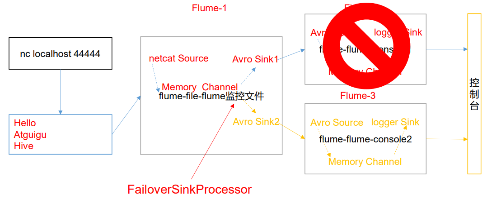

如上图所示，如果Flume-2挂掉，Flume-3还可以继续接收数据然后打印到控制台

我们有三个Flume，所以需要写三个配置文件，分别是：

- `flume-netcat-flume.conf`：对应Flume-1，负责接收netcat的数据，然后输出到一个sink组
- `flume-flume-console1.conf`：对应Flume-2，负责接收Flume-1的数据，然后输出到控制台
- `flume-flume-console2.conf`：对应Flume-3，如果Flume-2挂掉了，就负责接收Flume-1数据，然后输出到控制台

为了方便管理，创建一个文件夹存储这三个配置文件：

```bash
[wzq@hadoop102 flume-1.9.0]$ mkdir job/group2
```

接下来逐个击破

##### 3.2.2 flume-netcat-flume.conf

首先创建出来这个文件：

```bash
[wzq@hadoop102 flume-1.9.0]$ touch job/group2/flume-netcat-flume.conf
```

使用`Falilover Sink Processor`需要为sink创建sink group，所以在命名这块就也需要给sink group命名：

```properties
# Agent 命名组件
a1.sources = r1
a1.channels = c1
a1.sinks = k1 k2
a1.sinkgroups = g1
```

`sink group`管理后续的两个Flume，可以为后续的两个Flume设置优先级，我们先配置source，再配置channel，最后再配置这个sink group

```properties
# sources
a1.sources.r1.type = netcat
a1.sources.r1.bind = localhost
a1.sources.r1.port = 44444

# channels
a1.channels.c1.type = memory
a1.channels.c1.capacity = 1000
a1.channels.c1.transactionCapacity = 100
```

然后配置`sink group`，先看看这个都可以配置什么：


需要关注的是加黑字体：

- `sinks`：这个表示绑定sink，绑定的这一步操作统一最后做
- `processor.type`：该组件的类型，默认是defalut，需要将他改为`failover`，表示故障转移
- `processor.priority.<sinkName>`：设置每个sink的优先级，优先级大的先执行

所以就可以进行配置了：

```properties
# Sinkgroups
a1.sinkgroups.g1.processor.type = failover
# 优先执行sink k1
a1.sinkgroups.g1.priority.k1 = 10
a1.sinkgroups.g1.priority.k2 = 5
```

然后是配置两个sink，两个sink都是avro类型的，和上面类似：

```properties
# sinks
a1.sinks.k1.type = avro
a1.sinks.k1.hostname = hadoop102
a1.sinks.k1.port = 4141

a1.sinks.k2.type = avro
a1.sinks.k2.hostname = hadoop102
a1.sinks.k2.port = 4142
```

最后写绑定的配置信息，记得把`sinkgroups`也配置上：

```properties
# bind
a1.sources.r1.channels = c1
a1.sinks.k1.channel = c1
a1.sinks.k2.channel = c1
a1.sinkgroups.g1.sinks = k1 k2
```

##### 3.2.3 flume-flume-console1.conf

创建出这个文件：

```bash
[wzq@hadoop102 flume-1.9.0]$ touch job/group2/flume-flume-console1.conf
```

这个就是常规的从flume到控制台的配置信息，直接给出完整版：

```properties
# Agent
a2.sources = r1
a2.channels = c1
a2.sinks = k1

# sources
a2.sources.r1.type = avro
a2.sources.r1.bind = hadoop102
a2.sources.r1.port = 4141

# channels
a2.channels.c1.type = memory
a2.channels.c1.capacity = 1000
a2.channels.c1.transactionCapacity = 100

# sinks
a2.sinks.k1.type = logger

# bind
a2.sources.r1.channels = c1
a2.sinks.k1.channel = c1
```

##### 3.2.4 flume-flume-console2.conf

创建出这个文件：

```bash
[wzq@hadoop102 flume-1.9.0]$ touch job/group2/flume-flume-console2.conf
```

和上面一样的配置，只需要修改端口号还有命名就好了：

```properties
# Agent
a3.sources = r1
a3.channels = c1
a3.sinks = k1

# sources
a3.sources.r1.type = avro
a3.sources.r1.bind = hadoop102
a3.sources.r1.port = 4142

# channels
a3.channels.c1.type = memory
a3.channels.c1.capacity = 1000
a3.channels.c1.transactionCapacity = 100

# sinks
a3.sinks.k1.type = logger

# bind
a3.sources.r1.channels = c1
a3.sinks.k1.channel = c1
```

##### 3.2.5 测试

需要先启动服务端的`flume-flume-console1和2.conf`，才可以启动`flume-netcat-flume.conf`：（需要复制会话打开不同的窗口）

```bash
[wzq@hadoop102 flume-1.9.0]$ bin/flume-ng agent -n a2 -c conf/ -f job/group2/flume-flume-console1.conf -Dflume.root.logger=INFO,console
[wzq@hadoop102 flume-1.9.0]$ bin/flume-ng agent -n a3 -c conf/ -f job/group2/flume-flume-console2.conf -Dflume.root.logger=INFO,console
[wzq@hadoop102 flume-1.9.0]$ bin/flume-ng agent -n a1 -c conf/ -f job/group2/flume-netcat-flume.conf 
```

然后开启`netcat`：

```bash
[wzq@hadoop102 flume2]$ nc localhost 44444
```

在这里发几个信息，a2的窗口会立马收到，a3的不会收到：


如果a2挂掉了，再次发信息的话，a3会收到：


#### 3.3 负载均衡案例

**需求：**还是上面的案例，但是实现负载均衡只需要把第一个文件配置的`failover`该文`load_balance`，然后把优先级设置的那个干掉就好了，就不罗嗦了，直接看只需要修改的那一行：

```properties
# Sinkgroups
a1.sinkgroups.g1.processor.type = load_balance
```

直接测试，启动三个Flume：

```bash
[wzq@hadoop102 flume-1.9.0]$ bin/flume-ng agent -n a2 -c conf/ -f job/group2/flume-flume-console1.conf -Dflume.root.logger=INFO,console
[wzq@hadoop102 flume-1.9.0]$ bin/flume-ng agent -n a3 -c conf/ -f job/group2/flume-flume-console2.conf -Dflume.root.logger=INFO,console
[wzq@hadoop102 flume-1.9.0]$ bin/flume-ng agent -n a1 -c conf/ -f job/group2/flume-netcat-flume.conf 
```

打开`netcat`，发送信息，两个sink都会收到

### 4、聚合:star:

#### 4.1 是个什么东西？

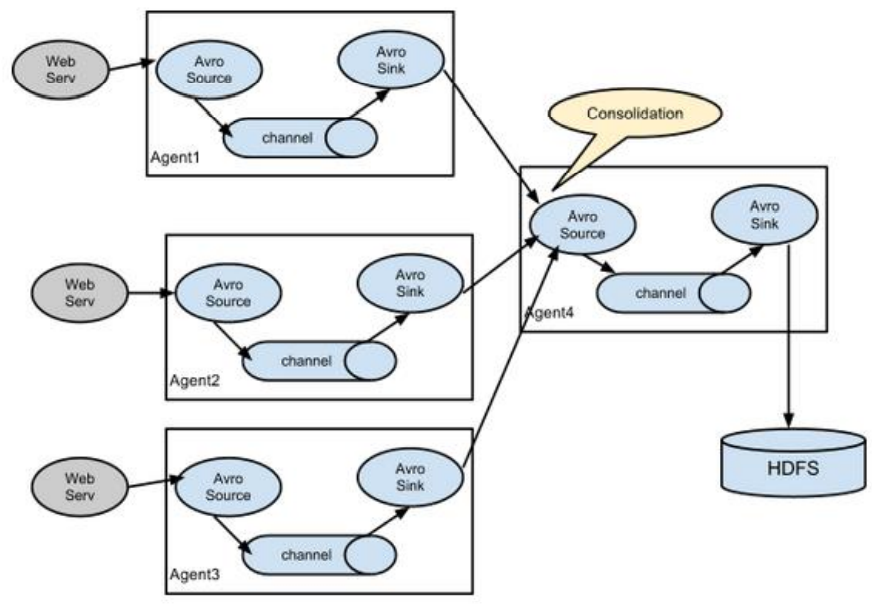

在生产环境开发中，数据源往往不会是一台服务器传过来的，而是集群传过来的。使用Flume可以做到收集不同的数据源，然后聚合到一块

#### 4.2 案例

##### 4.2.1 需求分析

**需求：**

- hadoop102上的Flume-1监控文件`/opt/module/datas/group.log`
- hadoop103上的Flume-2监控某一端口的数据流
- Flume-1与Flume-2将数据发送给hadoop104上的Flume-3，Flume-3最终将数据打印到控制台

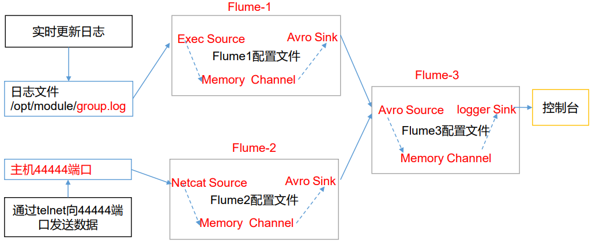

如上图所示，我们要分别在102、103、104创建flume配置文件：

- `flume-logger-flume.conf`：对应Flume-1，写在hadoop102上，监控文件group.log
- `flume-netcat-flume.conf`：对应Flume-2，写在hadoop103上，监控端口44444数据
- `flume-flume-logger.conf`：对应Flume-3，写在hadoop104上，将数据聚合并写到控制台

统一把这些文件都放在`job/group3`下：

```bash
[wzq@hadoop102 flume-1.9.0]$ mkdir job/group3
```

要实现一个集群式的Flume，首先先将Flume分发到103和104：

```bash
[wzq@hadoop102 module]$ xsync flume-1.9.0/
```

##### 4.2.2 hadoop102 flume-logger-flume.conf

首先在hadoop102创建出这个文件：

```bash
[wzq@hadoop102 flume-1.9.0]$ touch job/group3/flume-logger-flume.conf
```

这个就是常规步骤了，source使用exec，sink使用avro：

```properties
# agent
a1.sources = r1
a1.channels = c1
a1.sinks = k1

# sources
a1.sources.r1.type = exec
a1.sources.r1.command = tail -F /opt/module/datas/group.log
a1.sources.r1.shell = /bin/bash -c

# channels
a1.channels.c1.type = memory
a1.channels.c1.capacity = 1000
a1.channels.c1.transactionCapacity = 100

# sinks
a1.sinks.k1.type = avro
# 因为服务端在hadoop104，所以这个主机应该写hadoop104或者hadoop104的IP
a1.sinks.k1.hostname = hadoop104
a1.sinks.k1.port = 4141

# bind
a1.sources.r1.channels = c1
a1.sinks.k1.channel = c1
```

##### 4.2.3 hadoop103 flume-netcat-flume.conf

首先在hadoop103创建这个文件：

```bash
[wzq@hadoop103 flume-1.9.0]$ touch job/group3/flume-netcat-flume.conf
```

这个就是常规步骤了，source使用netcat，sink使用avro：

```properties
# agent
a1.sources = r1
a1.channels = c1
a1.sinks = k1

# sources
a1.sources.r1.type = netcat
a1.sources.r1.bind = hadoop103
a1.sources.r1.port = 44444

# channels
a1.channels.c1.type = memory
a1.channels.c1.capacity = 1000
a1.channels.c1.transactionCapacity = 100

# sinks
a1.sinks.k1.type = avro
a1.sinks.k1.hostname = hadoop104
a1.sinks.k1.port = 4141

# bind
a1.sources.r1.channels = c1
a1.sinks.k1.channel = c1
```

> 之前的blog讲过agent不可以有相同的名字，因为这是在hadoop103上，所以名字也可以是a1

##### 4.2.4 hadoop104 flume-flume-logger.conf

最后在`hadoop104`上创建一个文件：

```bash
[wzq@hadoop104 flume-1.9.0]$ touch job/group3/flume-flume-logger.conf
```

这里的source是avro，绑定4141端口，sink则为logger

```properties
# agent
a1.sources = r1
a1.channels = c1
a1.sinks = k1

# sources
a1.sources.r1.type = avro
a1.sources.r1.bind = hadoop104
a1.sources.r1.port = 4141

# channels
a1.channels.c1.type = memory
a1.channels.c1.capacity = 1000
a1.channels.c1.transactionCapacity = 100

# sinks
a1.sinks.k1.type = logger

# bind
a1.sources.r1.channels = c1
a1.sinks.k1.channel = c1
```

##### 4.2.5 测试

分别在hadoop104、102、103，启动对应的flume：

```bash
[wzq@hadoop104 flume-1.9.0]$ bin/flume-ng agent -n a1 -c conf/ -f job/group3/flume-flume-logger.conf -Dflume.root.logger=INFO,console
[wzq@hadoop102 flume-1.9.0]$ bin/flume-ng agent -n a1 -c conf/ -f job/group3/flume-logger-flume.conf
[wzq@hadoop103 flume-1.9.0]$ bin/flume-ng agent -n a1 -c conf/ -f job/group3/flume-netcat-flume.conf
```

现在我们在hadoop102`/opt/module/datas/`上创建一个文件`group.log`并且追加一些内容进去：

```bash
[wzq@hadoop102 datas]$ touch group.log
[wzq@hadoop102 datas]$ echo hello >> group.log 
[wzq@hadoop102 datas]$ echo wzq >> group.log 
[wzq@hadoop102 datas]$ echo wtt >> group.log
```

hadoop104已经打印到控制台了：


然后在hadoop103上开启一个netcat：

```bash
[wzq@hadoop103 ~]$ nc hadoop103 44444
wzq
OK
wtt
OK
```

hadoop104同样打印到了控制台：


## 参考资料

- 尚硅谷Flume教学视频
- [Apache Flume官网](https://flume.apache.org/)

