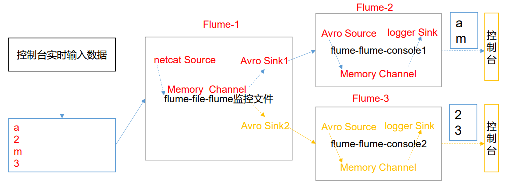
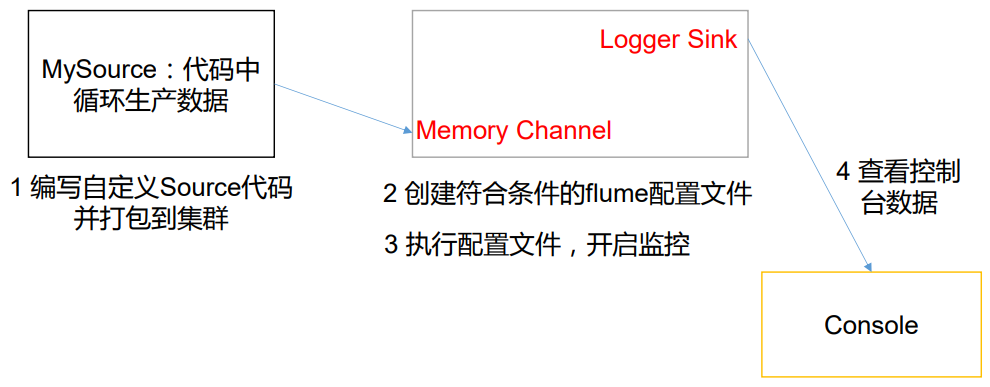
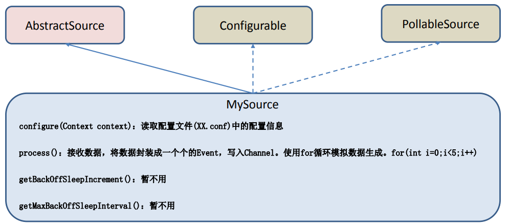
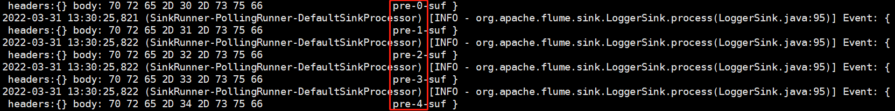
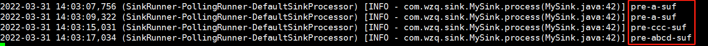

> Flume允许用户自定义其中的一些组件，本blog主要记录了自定义Interceptor、自定义Source和自定义Sink的学习过程


## 一、自定义Interceptor

### 1、需求分析

在[上一篇blog](http://wzqwtt.club/2022/03/26/flume-zhong-de-shi-wu-agent-nei-bu-yuan-li-tuo-bu-jie-gou-ji-dui-ying-an-li/)中，提到了复制和多路复用，其中有一个案例将一条信息分别传送给了Flume-2和Flume-3，实现了复制的功能

这次自定义`Interceptor`实现一个将不同的信息的数据发送到不同的sink的功能



如上图所示，总共需要三个Flume，我们期望三个Flume分别位于Hadoop102、103、104三台主机，其中：

- `Flume-1`：位于hadoop102，负责接收端口数据，接收到数据之后经过我们自定义的拦截器（Interceptor），选择性的将数据发送给Flume-2或者Flume-3
- `Flume-2`：位于hadoop103，负责接收Flume-1的数据，只接收是单词的Event，并将其打印到控制台
- `Flume-3`：位于hadoop104，负责接收Flume-1的数据，只接收是数字的Event，并将其打印到控制台

### 2、实现

#### 2.1 自定义Interceptor

在[上一篇blog](http://wzqwtt.club/2022/03/26/flume-zhong-de-shi-wu-agent-nei-bu-yuan-li-tuo-bu-jie-gou-ji-dui-ying-an-li)中，剖析了Agent的内部原理，Interceptor处于source下面、Channel上面；实现上面的功能需要用到：`Multiplexing Channel Selector`：


看上面这个图看不出所以然，结合官网的例子来看一下：

```properties
a1.sources = r1
a1.channels = c1 c2 c3 c4
a1.sources.r1.selector.type = multiplexing
a1.sources.r1.selector.header = state
a1.sources.r1.selector.mapping.CZ = c1
a1.sources.r1.selector.mapping.US = c2 c3
a1.sources.r1.selector.default = c4
```

- 使用这个拦截器，首先要明确`type`是`multiplexing`
- 拦截器如果想要实现“分发”的功能，就需要有判断的依旧，这个判断是依旧就是每个Event的头信息，每个Event的头信息都是Map结构
- `header`：这里要写头信息的Map中的K对应的字段值
- `mapping.CZ`：如果K对应的V是CZ，则给c1 channel
- `mapping.US`：如果K对应的V是US，则给c2、c3 channel
- `defalut`：如果头信息的V在前面两个都对应不上就分发给c4 channel

所以，我们在自定义Interceptor的时候需要根据Event的body信息在header里面放东西，然后在配置文件中写对应的规则

**这个案例规定，设置的头信息K是type，如果body的信息是数字那么对应的V设置为number，如果是字母对应的V设置为letter**


接下来开始写代码了，首先打开idea创建一个maven工程，在pom.xml文件中导入Flume的包：

```xml
<dependencies>
    <dependency>
        <groupId>org.apache.flume</groupId>
        <artifactId>flume-ng-core</artifactId>
        <version>1.9.0</version>
    </dependency>
</dependencies>
```


创建一个包`com.wzq.interceptor`，在该包下创建一个类`TypeInterceptor`

自定义`Interceptor`需要实现一个接口`Interceptor`中的方法，以下只显示方法签名：

```java
// 包一定要导Flume
import org.apache.flume.Event;
import org.apache.flume.interceptor.Interceptor;

// 自定义拦截器需要实现Interceptor接口
public class TypeInterceptor implements Interceptor {

    // 初始化方法
    @Override
    public void initialize() 

    // 处理单个事件
    @Override
    public Event intercept(Event event) 

    // 批处理
    @Override
    public List<Event> intercept(List<Event> list) 

    @Override
    public void close() 
}
```

我们只需要关注`intercept`单个处理和批处理的方法就好了

之前规定，event的body包含数字就给头信息的type设置number、字母就设置letter，所以可以写处理单个event的方法了：

```java
@Override
public Event intercept(Event event) {
    byte[] body = event.getBody();
    if (body[0] >= 'a' && body[0] <= 'z') {
        event.getHeaders().put("type", "letter");
    } else if (body[0] >= '0' && body[0] <= '9') {
        event.getHeaders().put("type", "number");
    }
    return event;
}
```

也需要写批处理的方法，批处理的方法传递了一个`List<Event>`，只需要遍历这个List每次调用intercept就好了：

```java
private List<Event> addHeaderEvents;

@Override
public void initialize() {
    addHeaderEvents = new ArrayList<>();
}

@Override
public List<Event> intercept(List<Event> list) {
    addHeaderEvents.clear();
    for (Event event : list) {
        addHeaderEvents.add(intercept(event));
    }
    return addHeaderEvents;
}
```


到最后我们还需要加上一个构造类：

```java
public static class Builder implements Interceptor.Builder {

    @Override
    public Interceptor build() {
        return new TypeInterceptor();
    }

    @Override
    public void configure(Context context) {

    }
}
```

#### 2.2 写配置文件

接下来就是写配置文件了，总共有三个配置文件：

##### 2.2.1 Fluem-1

Flume-1写在hadoop102，负责监听端口数据，然后经历拦截器，经过Memory Channel，最后再交给Avro Sink

首先在hadoop102上创建这个文件：

```bash
[wzq@hadoop102 flume-1.9.0]$ pwd
/opt/module/flume-1.9.0
[wzq@hadoop102 flume-1.9.0]$ mkdir job/group4
[wzq@hadoop102 flume-1.9.0]$ touch job/group4/flume-1.conf
```

然后开始写配置，首先是命名：

```properties
# Name
a1.sources = r1
a1.channels = c1 c2
a1.sinks = k1 k2
```

然后是写source部分了，不过这次的sources要加上在上一节中的拦截器配置：

```properties
# Source
a1.sources.r1.type = netcat
a1.sources.r1.bind = localhost
a1.sources.r1.port = 44444

# Interceptor
a1.sources.r1.interceptors = i1
a1.sources.r1.interceptors.i1.type = com.wzq.interceptor.TypeInterceptor$Builder
a1.sources.r1.selector.type = multiplexing
# 这里要填自定义拦截器中的自己定义的头的k
a1.sources.r1.selector.header = type 
# 这里要填自定义拦截器中的自己定义的几个V
a1.sources.r1.selector.mapping.letter = c1
a1.sources.r1.selector.mapping.number = c2
```

然后，sinks、channel和绑定都和以前的一样啦：

```properties
# channels
a1.channels.c1.type = memory
a1.channels.c1.capacity = 1000
a1.channels.c1.transactionCapacity = 100

a1.channels.c2.type = memory
a1.channels.c2.capacity = 1000
a1.channels.c2.transactionCapacity = 100

# sinks
a1.sinks.k1.type = avro
a1.sinks.k1.hostname = hadoop103
a1.sinks.k1.port = 4141

a1.sinks.k2.type = avro
a1.sinks.k2.hostname = hadoop104
a1.sinks.k2.port = 4142

# bind
a1.sources.r1.channels = c1 c2
a1.sinks.k1.channel = c1
a1.sinks.k2.channel = c2
```

##### 2.2.2 Flume-2

Flume-2写在hadoop103上，监听字母信息，他就是一个常规的avro source、memory channel和logger sink，创建这个文件：

```bash
[wzq@hadoop103 ~]$ cd /opt/module/flume-1.9.0/
[wzq@hadoop103 flume-1.9.0]$ mkdir job/group4
[wzq@hadoop103 flume-1.9.0]$ touch job/group4/flume-2.conf
```

直接写配置吧：

```properties
# Name
a1.sources = r1
a1.channels = c1
a1.sinks = k1

# sources
a1.sources.r1.type = avro
a1.sources.r1.bind = hadoop103
a1.sources.r1.port = 4141

# channels
a1.channels.c1.type = memory
a1.channels.c1.capacity = 1000
a1.channels.c1.transactionCapacity = 100

# sinks
a1.sinks.k1.type = logger

# bind
a1.sources.r1.channels = c1
a1.sinks.k1.channel = c1
```

##### 2.2.3 Flume-3

Flume-3写在hadoop104上，监听数字信息，他就是一个常规的avro source、memory channel和logger sink，创建这个文件：

```bash
[wzq@hadoop104 ~]$ cd /opt/module/flume-1.9.0/
[wzq@hadoop104 flume-1.9.0]$ mkdir job/group4
[wzq@hadoop104 flume-1.9.0]$ touch job/group4/flume-3.conf
```

写配置：

```properties
# Name
a1.sources = r1
a1.channels = c1
a1.sinks = k1

# sources
a1.sources.r1.type = avro
a1.sources.r1.bind = hadoop104
a1.sources.r1.port = 4142

# channels
a1.channels.c1.type = memory
a1.channels.c1.capacity = 1000
a1.channels.c1.transactionCapacity = 100

# sinks
a1.sinks.k1.type = logger

# bind
a1.sources.r1.channels = c1
a1.sinks.k1.channel = c1
```


### 3、测试

写好之后，我们需要将在idea写的自定义拦截器打包，上传到hadoop102的lib目录下

```bash
[wzq@hadoop102 lib]$ ll | grep flume-demo
-rw-r--r--. 1 wzq wzq    4867 3月  30 21:55 flume-demo-1.0-SNAPSHOT.jar
```

然后就可以启动了：

```bash
[wzq@hadoop103 flume-1.9.0]$ bin/flume-ng agent -n a1 -c conf/ -f job/group4/flume-2.conf -Dflume.root.logger=INFO,console
[wzq@hadoop104 flume-1.9.0]$ bin/flume-ng agent -n a1 -c conf/ -f job/group4/flume-3.conf -Dflume.root.logger=INFO,console
[wzq@hadoop102 flume-1.9.0]$ bin/flume-ng agent -n a1 -c conf/ -f job/group4/flume-1.conf
```

然后在hadoop102启动netcat，并且发送几条数据

```bash
[wzq@hadoop102 flume-1.9.0]$ nc localhost 44444
a
OK
1
OK
b
OK
1
OK
```

hadoop103输出字母，hadoop104输出数字，实验成功，读者可以自行尝试一下，因为我不小心关掉一个窗口，截不了图了

## 二、自定义Source

Source是负责接收数据的组件，Flume官方也为我们提供了：Avro、Thrift、Exec、JMS、Spooling Directory、Taildir、Kafka、netcat、syslog、HTTP等很多组件，虽然Flume官方提供了这么多组件，但有时候并不能满足实际开发中的需求，于是Flume提供了自定义Source的接口，允许用户自定义Source

### 1、需求分析

**需求：**使用Flume接收数据，数据每`delay`秒自动生成（数据自己生成），并将每条数据添加前缀和后缀，输出到控制台，前缀后缀和delay需要在配置文件中读取



这只需要我们编写一个自定义Source和一个配置文件就好了，在hadoop102上完成即可

### 2、实现

#### 2.1 自定义Source

根据官方说明，实现[自定义Source](https://flume.apache.org/releases/content/1.9.0/FlumeDeveloperGuide.html#source)需要继承`AbstractSource`，实现`Configurable`、`PollableSource`接口，并且实现下列方法：

- `process`：获取数据将数据封装为event写入channel
- `configure`：读取配置文件内容，用户可以自定义配置信息
- `getBackOffSleepIncrement()`：设置退避规则，暂时不用
- `getMaxBackOffSleepInterval()`：最大退避，暂时不用

如下图所示：




所以我们在刚刚创建的项目下，再创建一个包`com.wzq.source`，在该包下创建一个类：`MySource`

在process里面生成数据，在configure里面读取配置文件，所以我们可以写代码了：

```java
package com.wzq.source;

import org.apache.flume.Context;
import org.apache.flume.Event;
import org.apache.flume.EventDeliveryException;
import org.apache.flume.PollableSource;
import org.apache.flume.conf.Configurable;
import org.apache.flume.event.SimpleEvent;
import org.apache.flume.source.AbstractSource;

import java.util.HashMap;

public class MySource extends AbstractSource implements Configurable, PollableSource {

    private String prefix;
    private String suffix;
    private Long delay;

    @Override
    public void configure(Context context) {
        // 读取配置文件
        // 这个传递两个值，代表如果配置文件没有配置就取第二参数默认值
        prefix = context.getString("prefix", "pre-");
        // 这里一个值，没有给默认值
        suffix = context.getString("suffix");
        delay = context.getLong("delay", 5L);
    }

    @Override
    public Status process() throws EventDeliveryException {
        try {
            // 在这里循环放入数据
            for (int i = 0; i < 5; i++) {
                Event event = new SimpleEvent();    //Event是个接口，可以用他的实现类SimpleEvent
                HashMap<String, String> map = new HashMap<>();
                event.setHeaders(map);  // 设置头，这里头设置的空
                event.setBody((prefix + i + suffix).getBytes());    // 设置body信息，这里body必须是bytes类型
                getChannelProcessor().processEvent(event);  // 调用channels发送event
            }
            Thread.sleep(delay);    // 睡眠delay秒
            return Status.READY;    // 一切正常就返回READY
        } catch (Exception e) {
            e.printStackTrace();
            return Status.BACKOFF;  // 出现异常返回BACKOFF
        }
    }

    // 下面两个方法返回0就好了
    @Override
    public long getBackOffSleepIncrement() {
        return 0;
    }

    @Override
    public long getMaxBackOffSleepInterval() {
        return 0;
    }

}
```

#### 2.2 写配置文件

只需要写一个配置文件就好了，这个是我们自定义的source，所以source的type的值应该写为上面这个类的全类名，然后设置自己定义的属性；Channle继续使用memory channel，Sink就打印到控制台，创建这个文件：

```bash
[wzq@hadoop102 ~]$ cd /opt/module/flume-1.9.0/
[wzq@hadoop102 flume-1.9.0]$ touch job/customSource_flume.conf
```

写配置：

```properties
# Name
a1.sources = r1
a1.channels = c1
a1.sinks = k1

# sources
a1.sources.r1.type = com.wzq.source.MySource
a1.sources.r1.prefix = pre-
a1.sources.r1.suffix = -suf
a1.sources.r1.delay = 5000

# channels
a1.channels.c1.type = memory
a1.channels.c1.capacity = 1000
a1.channels.c1.transactionCapacity = 100

# sinks
a1.sinks.k1.type = logger

# bind
a1.sources.r1.channels = c1
a1.sinks.k1.channel = c1
```

### 3、测试

首先将写好的类打包上传到flume的lib目录下：

```bash
# 删除之前上传的
[wzq@hadoop102 flume-1.9.0]$ ll lib/ | grep flume-demo
-rw-r--r--. 1 wzq wzq    4867 3月  30 21:55 flume-demo-1.0-SNAPSHOT.jar
[wzq@hadoop102 flume-1.9.0]$ rm -rf lib/flume-demo-1.0-SNAPSHOT.jar 

# 上传，打开xftp直接拖到这个文件夹就好
[wzq@hadoop102 flume-1.9.0]$ ll lib/ | grep flume-demo
-rw-r--r--. 1 wzq wzq    4867 3月  30 21:55 flume-demo-1.0-SNAPSHOT.jar
```

然后启动这个demo：

```bash
[wzq@hadoop102 flume-1.9.0]$ bin/flume-ng agent -n a1 -c conf/ -f job/customSource_flume.conf -Dflume.root.logger=INFO,console
```



## 三、自定义Sink

Sink不断轮询Channel中的事件且批量的移除他们，并将他们交给其他的系统或者另一个Flume Agent

### 1、需求分析

**需求：**使用Flume接收数据，在sink端给每条数据加上前后缀并且输出到控制台，前后缀可以在配置文件中配置

所以我们只需要到官网看一下自定义Sink咋用，然后写一个配置文件就好了

### 2、实现

#### 2.1 自定义Sink

自定义Sink需要继承`AbstractSink`抽象类，实现`Configurable`接口，需要实现两个方法：

- `configure`：读取配置信息

- `process`：处理从Channel中拉取到的每条信息，我们可以看一眼官网的例子：

  ```java
  @Override
  public Status process() throws EventDeliveryException {
      Status status = null;
  
      // 拿到选择器
      Channel ch = getChannel();
      // Start transaction 这里需要开启事务
      Transaction txn = ch.getTransaction();
      txn.begin();
      try {
          // This try clause includes whatever Channel operations you want to do
  
          Event event = ch.take();
  		
          // 在这里我们可以些event存储到哪里，比如输出到控制台鸭，或者写到MySQL等等
          // Send the Event to the external repository.
          // storeSomeData(e);  // 这里他们抽取了一个方法
  
          // 提交事务 
          txn.commit();
          status = Status.READY;	// 如果成功返回status
      } catch (Throwable t) {
  		// 如果发生异常则回滚
          txn.rollback();
  
          // Log exception, handle individual exceptions as needed
          status = Status.BACKOFF;
  
          // re-throw all Errors
          if (t instanceof Error) {
              throw (Error)t;
          }
      }
      // 官方案例没有加事务的关闭，实际上事务是需要关闭的
      return status;
  }
  ```

  


ok，可以写代码了：

```java
package com.wzq.sink;

import org.apache.flume.*;
import org.apache.flume.conf.Configurable;
import org.apache.flume.sink.AbstractSink;
import org.apache.flume.sink.LoggerSink;
import org.slf4j.Logger;
import org.slf4j.LoggerFactory;

import java.util.Stack;

public class MySink extends AbstractSink implements Configurable {
    private static final Logger logger = LoggerFactory.getLogger(MySink.class);
    private String prefix;
    private String suffix;

    // 创建一个Logger对象

    @Override
    public void configure(Context context) {
        // 读取配置文件，这里可以给某个字段设置默认值
        prefix = context.getString("prefix", "pre-");
        suffix = context.getString("suffix");
    }

    @Override
    public Status process() throws EventDeliveryException {
        Status status;
        Channel channel = getChannel();
        Transaction txn = channel.getTransaction();
        // 开启事务
        txn.begin();
        try {
            Event event;   // 从channel拿一个Event
            while (true) {
                event = channel.take();
                if (event != null) {    // 直到
                    break;
                }
            }
            // 打印信息到控制台
            logger.info(prefix + new String(event.getBody()) + suffix);

            txn.commit();
            status = Status.READY;
        } catch (Exception e) {
            txn.rollback();
            e.printStackTrace();
            status = Status.BACKOFF;
        } finally {
            txn.close();
        }
        return status;
    }
}
```

#### 2.2 写配置文件

只需要写一个配置文件就好了，创建这个配置文件：

```bash
[wzq@hadoop102 flume-1.9.0]$ touch job/customSink-flume.conf
```


然后写配置文件：

```properties
# Name
a1.sources = r1
a1.channels = c1
a1.sinks = k1

# sources
a1.sources.r1.type = netcat
a1.sources.r1.bind = localhost
a1.sources.r1.port = 44444

# channels
a1.channels.c1.type = memory
a1.channels.c1.capacity = 1000
a1.channels.c1.transactionCapacity = 100

# sinks
a1.sinks.k1.type = com.wzq.sink.MySink
a1.sinks.k1.prefix = pre-
a1.sinks.k1.suffix = -suf

# bind
a1.sources.r1.channels = c1
a1.sinks.k1.channel = c1
```


### 3、测试

首先需要需要把写好的Java打包一下，上传到flume的lib目录下，然后启动flume：

```bash
[wzq@hadoop102 flume-1.9.0]$ bin/flume-ng agent -n a1 -c conf/ -f job/customSink-flume.conf -Dflume.root.logger=INFO,console
```


启动一个`netcat`，发送一些东西：

```bash
[wzq@hadoop102 flume-1.9.0]$ nc localhost 44444
a
OK
a
OK
ccc
OK
abcd
OK
```



## 参考资料

- 尚硅谷Flume教学视频
- [Apache Flume官网](https://flume.apache.org/)
