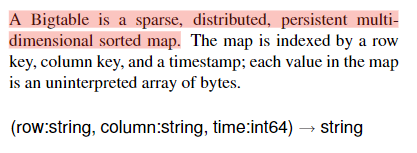
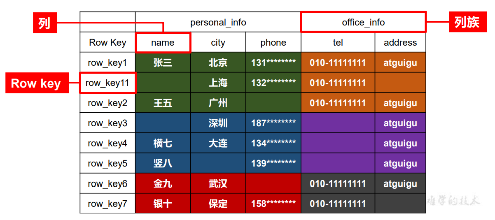
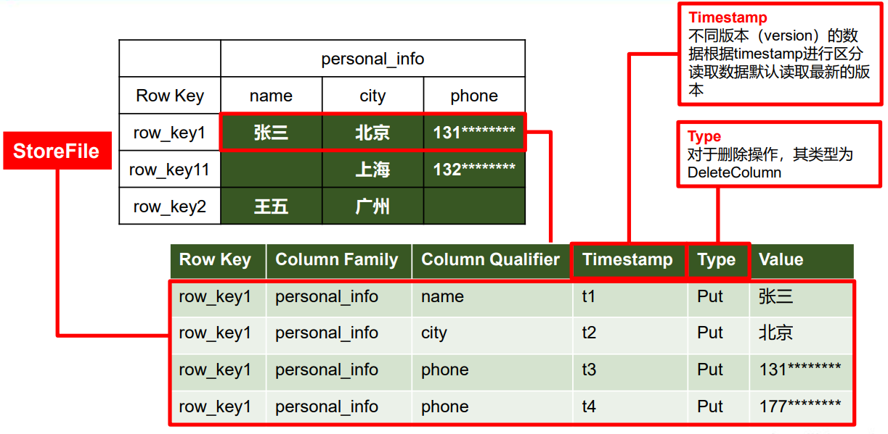
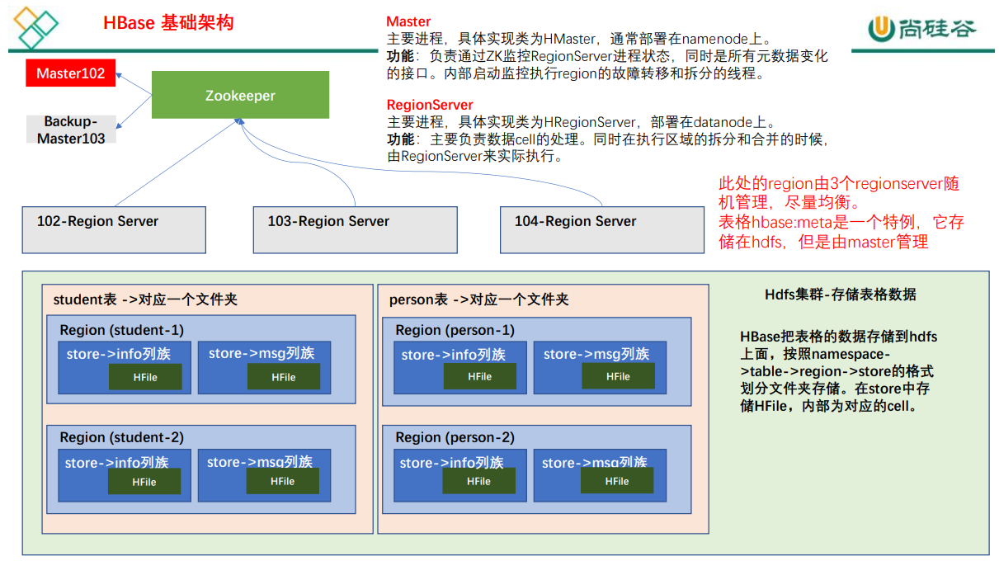

HBase是Apache下的一款NoSQL数据库，HBase就是`H(HDFS) + Base(DataBase)`，所以HBase的数据存储在HDFS，是一种分布式的、可扩展的NoSQL数据库。


# 一、HBase数据模型

HBase的设计理念来源于Google的[BigTable论文](https://www.usenix.org/legacy/event/osdi06/tech/chang/chang.pdf)，在这篇论文中给出了BigTable的定义：



**BigTable是一个稀疏的、分布式的、持久的多维排序的map**，紧随其后，对于map的定义是：**这个map由行键、列键喝时间戳作为索引，映射中的每个值都是一个未解释的字节数组**

`HBase`关于数据模型和BigTable的对应关系如下：

**HBase使用与BigTable非常相似的数据模型。用户将数据行存储在带标签的表中。数据行具有可排序的键和任意数量的列。该表存储稀疏，因此如果用户可以人已变化列（动态的增加列等）**


最终HBase的数据模型的关键在于稀疏、分布式、多维、排序的映射，其中映射就是指代非关系型数据库的`key-value`结构


## 1、HBase逻辑结构

HBase的逻辑结构就是一张表，这个表的由列族、列、和Row key组成，数据存储稀疏、多维，不同的行具有不同的列。

并且数据存储整体有序，按照Row key的字典序排列，Row key为Byte数组



HBase可以用于存储多种结构的数据，以JSON为例，存储的数据原貌如下：

```json
{
    "row_key1": {
        # 列族 
        "personal_info": {
            "name": "wzq",
            "city": "南京",
            "phone": "176********"
        },
        "office_info": {
            "tel": "010-1111111",
            "address": "njau"
        }
    },
    # 按照字典序排序
    "row_key11": {
        "personal_info": {
            "name": "wtt",
            # 这里可以少一列 
            "phone": "138********"
        },
        "office_info": {
            "tel": "010-1111111",
        }
    },
    "row_key2": {
        #...
    }
}
```


## 2、HBase物理存储结构

在概念级别上，一张表可能被视为一组稀疏的行，但是在物理存储结构上，他们是按照`列族(column family)`存储的。




## 3、数据模型


- `NameSpace`：命名空间，类似于关系型数据库的`库database`的概念，每个命名空间下可以有多个表，HBase有两个自带的命名空间，分别是：`hbase`和`default`：
  - `hbase namespace`：存放的HBase内置的表，就像MySQL数据库里面的mysql表，一般不去动他
  - `defalut namespace`：这是用户默认使用的命名空间
- `Table`：类似于关系型数据库中表的概念。不同的是，HBase定义表时只需要声明列族就可以了，不需要声明具体的列。因为数据存储是稀疏的，所有往HBase写入数据的时候，字段都可以**动态、按需**指定。因此，和关系型数据库相比，HBase能够轻松应对字段变更的场景
- `Row`：HBase表中的每行数据都由一个RowKey和多个Column组成，数据是按照RowKey的字典序排序存储的，并且查询数据的时候只能根据RowKey进行检索，所以RowKey的设计十分重要。同时RowKey是一个未解释的字节数组
- `Column`：HBase中的每个列都由**Column Family（列族）**和**Column Qualifier（列限定符）**进行限定。
- `Time Stamp`：用于表示数据的不同版本（version），每条数据写入时，系统回自动为其加上该字段，其值为写入HBase的时间
- `Cell`：由`{rowkey,column Family:column Qualifier,timestamp}`唯一确定的单元，cell中的数据全部是字节码形式存储。相当于一行数据


# 二、HBase基本架构

HBase架构如下图所示：




架构共有以下几个角色：

## 1、Master

实现类为`HMaster`，负责监控集群中所有的`RegionServer`实例。主要作用如下：

- 管理元数据表格`hbase:meta`，接收用户对表格创建修改删除的命令并执行
- 监控region是否需要进行负载均衡，故障转移和region的拆分


## 2、Region Server


Region Server实现类为`HRegionServer`，主要作用如下：

- 负责数据cell的处理，例如写入数据put、查询数据get等
- 拆分合并region的实际执行者，有master监控，有regionserver执行


## 3、Zookeeper

HBase通过[Zookeeper](https://github.com/wzqwtt/BigData#%E4%BA%8Czookeeper)来做master的高可用、记录RegionServer的部署信息、并且存储有meta表的位置信息


HBase对于数据的读写操作是直接访问Zookeeper的


## 4、HDFS

HDFS为HBase提供最终的底层数据存储服务，同时为HBase提供高容错的支持


# 参考资料

- [尚硅谷 HBase 2.x 学习视频](https://www.bilibili.com/video/BV1PZ4y1i7gZ)
- [HBase 官方文档](https://hbase.apache.org/2.3/book.html)