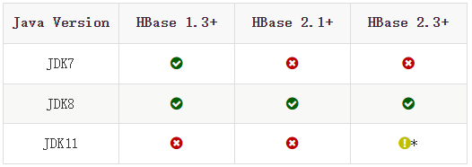
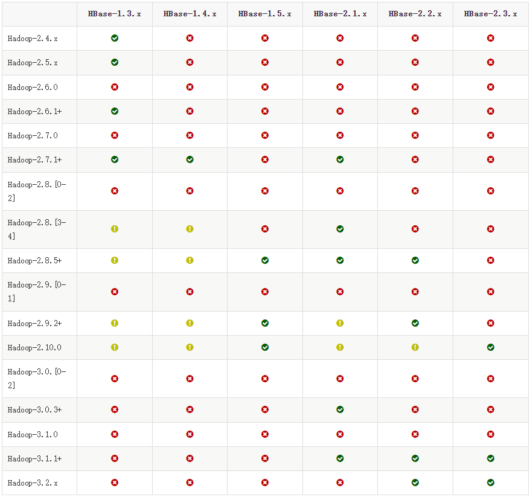
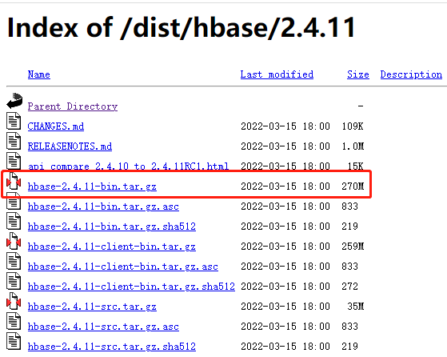
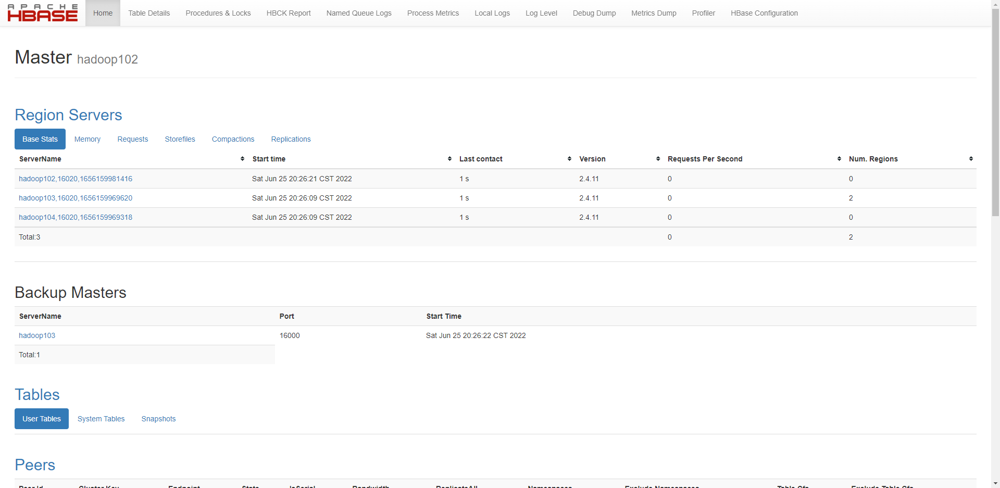

HBase是基于Hadoop和HBase的，并且HBase对两者的版本也有严格的要求，HBase对应的Java版本如下：



HBase与Hadoop对应版本如下：



HBase内置Zookeeper，如果不想安装自己的Zookeeper也可以，但是Hadoop是一定要安装的。所以在开始之前，请先确保安装的Hadoop、Zookeeper（可选），如果没有，访问以下链接进行安装：

- [搭建Hadoop分布式集群](https://github.com/wzqwtt/BigData#%E4%B8%80hadoop)
- [Zookeeper分布式安装部署](https://github.com/wzqwtt/BigData/blob/main/Zookeeper/2%E3%80%81Zookeeper%E6%9C%AC%E5%9C%B0%E4%B8%8E%E5%88%86%E5%B8%83%E5%BC%8F%E5%AE%89%E8%A3%85.md)


安装好之后，就可以启动Hadoop和Zookeeper了：

```bash
[wzq@hadoop102 module]$ jpsall
-------------------hadoop102-------------------
3425 JobHistoryServer
2788 NameNode
2903 DataNode
3531 QuorumPeerMain
3245 NodeManager
-------------------hadoop103-------------------
2562 DataNode
2759 ResourceManager
2874 NodeManager
3274 QuorumPeerMain
-------------------hadoop104-------------------
2692 SecondaryNameNode
2836 NodeManager
2617 DataNode
2986 QuorumPeerMain
```


# 一、下载、上传HBase到服务器

首先下载HBase，这次学习的是HBase 2.4.11 一个稳定版本，[点击这串文字直达下载专场](https://archive.apache.org/dist/hbase/2.4.11/)，下载如下图所示的这个文件：



下载之后上传到服务器`Hadoop102`的`/opt/software/`目录下：

```bash
[wzq@hadoop102 software]$ pwd
/opt/software
[wzq@hadoop102 software]$ ll | grep hbase
-rw-r--r--. 1 wzq wzq 283415422 6月  21 22:01 hbase-2.4.11-bin.tar.gz
```

> 当然，如果不去页面下载，也可以使用`wget`命令下载hbase包：
>
> ```bash
> [wzq@hadoop102 ~]$ wget https://archive.apache.org/dist/hbase/2.4.11/hbase-2.4.11-bin.tar.gz
> ```


上传之后，将HBase安装解压到`/opt/module/`目录下：

```bash
[wzq@hadoop102 software]$ tar -zxvf hbase-2.4.11-bin.tar.gz -C /opt/module/
```

来到解压缩后的目录，可以看到有以下文件，这个目录已经很熟悉了：

```bash
[wzq@hadoop102 software]$ cd /opt/module/hbase-2.4.11/
[wzq@hadoop102 hbase-2.4.11]$ ll
总用量 1880
drwxr-xr-x.  4 wzq wzq    4096 6月  23 14:35 bin				# 有一些操作HBase的命令
-rw-r--r--.  1 wzq wzq  111891 1月  22 2020 CHANGES.md
drwxr-xr-x.  2 wzq wzq     208 1月  22 2020 conf				# 配置文件
drwxr-xr-x. 11 wzq wzq    4096 1月  22 2020 docs				# HBase官方文档，写的很详细
drwxr-xr-x.  8 wzq wzq      94 1月  22 2020 hbase-webapps	# HBase启动的网页链接
-rw-r--r--.  1 wzq wzq     262 1月  22 2020 LEGAL
drwxrwxr-x.  7 wzq wzq    8192 6月  23 14:33 lib				# 存放HBase所需要的一些以来
-rw-r--r--.  1 wzq wzq  139582 1月  22 2020 LICENSE.txt
-rw-r--r--.  1 wzq wzq  572839 1月  22 2020 NOTICE.txt
-rw-r--r--.  1 wzq wzq    1477 1月  22 2020 README.txt
-rw-r--r--.  1 wzq wzq 1062132 1月  22 2020 RELEASENOTES.md
```

> 这里需要“删除”lib目录下的log4j包，这是为了解决HBase和Hadoop的兼容性问题：
>
> ```bash
> # 给这个jar包改个名字，等价于删除了
> [wzq@hadoop102 hbase-2.4.11]$ mv lib/client-facing-thirdparty/slf4j-reload4j-1.7.33.jar lib/client-facing-thirdparty/slf4j-reload4j-1.7.33.jar.bak
> ```
>
> 

然后我们可以添加HBase的环境变量：

```bash
[wzq@hadoop102 hbase-2.4.11]$ sudo vim /etc/profile.d/my_env.sh
```

添加以下内容：

```bash
# HBASE_HOME
export HBASE_HOME=/opt/module/hbase-2.4.11
export PATH=$PATH:$HBASE_HOME/bin
```

然后分发这个文件：

```bash
[wzq@hadoop102 hbase-2.4.11]$ sudo /home/wzq/bin/xsync /etc/profile.d/my_env.sh
[wzq@hadoop102 hbase-2.4.11]$ source /etc/profile.d/my_env.sh
```


# 二、编写配置文件

然后我们来编写配置文件，配置文件都在HBase安装目录的`conf`目录下面，HBase的配置文件共有下面这几个文件：

- `backup-masters`：默认不展示，这是一个纯文本文件，主要作用就是列出来备份Master主机，在本blog第三个部分配置HBase高可用会用到这个文件
- `hadoop-metrics2-hbase.properties`：这是用于链接HBase Hadoop的Metrics2框架配置
- `hbase-env.cmd` and `hbase-env.sh`：这是建立起HBase工作环境的Windows / Linux脚本，里面包含Java、Java options和其他环境变量，同时这个文件也提供了很多注释掉的示例
- `hbase-policy.xml`：RPC服务器用于客户端请求进行授权决策的默认策略配置文件
- :star:`hbase-site.xml`：最主要的HBase配置文件！
- `log4j.properties`：log4j打印日志的配置文件
- :star:`regionservers`：这是一个纯文本文件，里面列出了所有HBase regionservers进程的服务器，这个文件每一行都应该是IP地址或者域名


下面来配置HBase，首先我们希望使用自己的Zookeeper，所以我们可以在`hbase-env.sh`中添加一行：（这一步的操作是可选的）

```bash
export HBASE_MANAGES_ZK=false
```

然后修改`hbase-site.xml`文件，添加以下关于zookeeper和Hadoop的配置：（删掉该文件中多余的配置）

```xml
<property>
    <name>hbase.zookeeper.quorum</name>
    <value>hadoop102,hadoop103,hadoop104</value>
    <description>The directory shared by RegionServers.</description>
</property>
<property>
    <name>hbase.rootdir</name>
    <value>hdfs://hadoop102:8020/hbase</value>
    <description>The directory shared by RegionServers.</description>
</property>
<property>
    <name>hbase.cluster.distributed</name>
    <value>true</value>
</property>
```


然后添加`Region Server`，编辑`regionservers`文件，写入：

```bash
hadoop102
hadoop103
hadoop104
```


# 三、配置HBase的高可用


在HBase中HMaster负责监控HRegionServer的生命周期，均衡RegionServer的负载，如果HMaster挂掉了，那么整个HBase集群将陷入不健康的状态，所以HBase支持对HMaster的高可用配置


首先在conf目录下创建`backup-masters`文件，然后写入`hadoop103`主机作为备份主机：

```bash
[wzq@hadoop102 conf]$ touch backup-masters
[wzq@hadoop102 conf]$ echo hadoop103 > backup-masters 
```


最后一步，分发HBase到其他两台主机：

```bash
[wzq@hadoop102 module]$ pwd
/opt/module
[wzq@hadoop102 module]$ xsync hbase-2.4.11/
```


# 四、启动HBase


至此，HBase配置完成，可以启动HBase了

首先可以单台主机启动HBase：

```bash
[wzq@hadoop102 hbase-2.4.11]$ bin/hbase-daemon.sh start master
[wzq@hadoop102 hbase-2.4.11]$ bin/hbase-daemon.sh start regionserver
```


也可以群起HBase集群：（HBase直接帮我们封装好了群起脚本，但是需要配置ssh免密登录）

```bash
[wzq@hadoop102 hbase-2.4.11]$ bin/start-hbase.sh 
running master, logging to /opt/module/hbase-2.4.11/logs/hbase-wzq-master-hadoop102.out
hadoop104: running regionserver, logging to /opt/module/hbase-2.4.11/logs/hbase-wzq-regionserver-hadoop104.out
hadoop103: running regionserver, logging to /opt/module/hbase-2.4.11/logs/hbase-wzq-regionserver-hadoop103.out
hadoop102: running regionserver, logging to /opt/module/hbase-2.4.11/logs/hbase-wzq-regionserver-hadoop102.out
hadoop103: running master, logging to /opt/module/hbase-2.4.11/logs/hbase-wzq-master-hadoop103.out
```

从上面的信息可以看到，master运行在hadoop102，其中hadoop102、hadoop103、hadoop104均运行region server，hadoop103另外运行备份Master


此时，可以打开HBase的页面，在浏览器中输入：`http://hadoop102:16010`：




关闭HBase也很简单：

```bash
[wzq@hadoop102 hbase-2.4.11]$ bin/stop-hbase.sh
```


# 参考资料

- [尚硅谷 HBase 2.x 学习视频](https://www.bilibili.com/video/BV1PZ4y1i7gZ)
- [HBase 官方文档](https://hbase.apache.org/2.3/book.html)