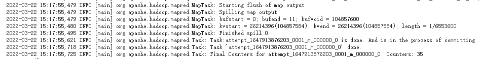
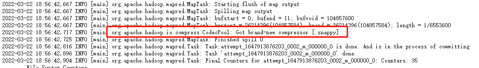
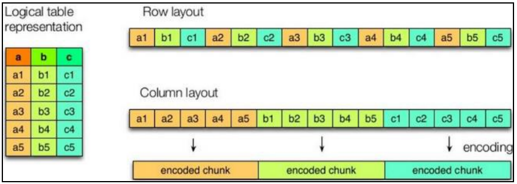
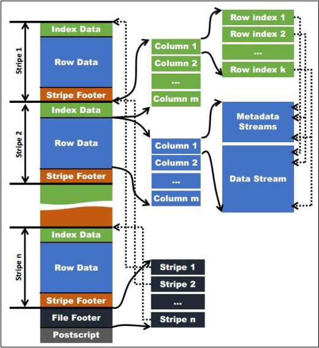
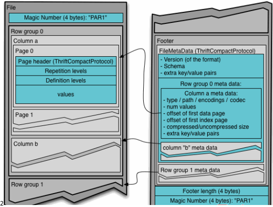

## 一、压缩配置

### 1、MR支持的压缩编码

下表是MR支持的压缩编码，其中比较常用的是`Snappy`

| 压缩格式 | 算法    | 文件扩展名 | 是否可切分 |
| -------- | ------- | ---------- | ---------- |
| DEFLATE  | DEFLATE | .deflate   | 否         |
| Gzip     | DEFLATE | .gz        | 否         |
| bzip2    | bzip2   | .bz2       | 是         |
| LZO      | LZO     | .lzo       | 是         |
| `Snappy` | Snappy  | .snappy    | 否         |


为了支持多种压缩/解压缩算法，Hadoop引入了编码/解码器：

| 压缩格式 | 对应的编码/解码器                          |
| -------- | ------------------------------------------ |
| DEFLATE  | org.apache.hadoop.io.compress.DefaultCodec |
| gzip     | org.apache.hadoop.io.compress.GzipCodec    |
| bzip2    | org.apache.hadoop.io.compress.BZip2Codec   |
| LZO      | com.hadoop.compression.lzo.LzopCodec       |
| Snappy   | org.apache.hadoop.io.compress.SnappyCodec  |


压缩性能比较：

| 压缩算法 | 原始文件大小 | 压缩文件大小 | 压缩速度 | 解压速度 |
| -------- | ------------ | ------------ | -------- | -------- |
| gzip     | 8.3GB        | 1.8GB        | 17.5MB/s | 58MB/s   |
| bzip2    | 8.3GB        | 1.1GB        | 2.4MB/s  | 9.5MB/s  |
| LZO      | 8.3GB        | 2.9GB        | 49.3MB/s | 74.6MB/s |


### 2、压缩参数配置

要在Hadoop中启用压缩，可以在`mapred-site.xml`中配置以下参数：

| 参数                                              | 默认值                                                       | 阶段         | 建议                                              |
| ------------------------------------------------- | ------------------------------------------------------------ | ------------ | ------------------------------------------------- |
| io.compression.codecs（在 core-site.xml 中配置）  | org.apache.hadoop.io.compress.DefaultCodec, org.apache.hadoop.io.compress.GzipCodec, org.apache.hadoop.io.compress.BZip2Codec, org.apache.hadoop.io.compress.Lz4Codec | 输入压缩     | Hadoop 使用文件扩展 名判断是否支持某种 编解码器   |
| mapreduce.map.output.com press                    | false                                                        | mapper 输出  | 这个参数设为 true 启 用压缩                       |
| mapreduce.map.output.com press.codec              | org.apache.hadoop.io.compress.DefaultCodec                   | mapper 输出  | 使用 LZO、LZ4 或 snappy 编解码器在此 阶段压缩数据 |
| mapreduce.output.fileoutput format.compress       | false                                                        | reducer 输出 | 这个参数设为 true 启 用压缩                       |
| mapreduce.output.fileoutput format.compress.codec | org.apache.hadoop.io.compress. DefaultCodec                  | reducer 输出 | 使用标准工具或者编 解码器，如 gzip 和 bzip2       |
| mapreduce.output.fileoutput format.compress.type  | RECORD                                                       | reducer 输出 | SequenceFile 输出使用 的压缩类型：NONE 和 BLOCK   |


### 3、在Hive中开始Map输出阶段压缩

> Note：本blog所有实验都是Hadoop MR引擎

在Map输出阶段压缩的一个作用是：减少job中map和ReduceTask间数据的传输量


首先写一个可以运行MR的SQL：

```sql
select count(*) from emp;
```

打开历史服务器查看Map阶段的日志：



主要看这一段，在MapTask之后就Finished了，没有开启压缩


在Hive中如果想开启Map输出阶段的压缩需要在Hive窗口设置一些内容：

```bash
# 开启hive中间传输数据压缩功能
hive (db_hive)> set hive.exec.compress.intermediate=true; 

# 开启MapReduce中map输出压缩功能
hive (db_hive)> set mapreduce.map.output.compress=true; 

# 设置MapReduce中Map输出数据的压缩方式
hive (db_hive)> set mapreduce.map.output.compress.codec= org.apache.hadoop.io.compress.SnappyCodec;
```

然后再执行一次查询：

```sql
select count(*) from emp;
```

打开日志，可以看到多了一个`snappy`压缩的步骤：




### 4、在Hive中开启Reduce输出阶段压缩


Hive输出的内容同样也可以进行压缩，如果想开启只需要：

```bash
# 开启hive最终输出压缩数据的功能
hive (db_hive)> set hive.exec.compress.output=true; 

# 开启MapReduce最终数据压缩
hive (db_hive)> set mapreduce.output.fileoutputformat.compress=true;

# 设置MapReduce最终数据压缩形式为Snappy
hive (db_hive)> set mapreduce.output.fileoutputformat.compress.codec = org.apache.hadoop.io.compress.SnappyCodec;

# 设置最终数据输出压缩为块压缩
hive (db_hive)> set mapreduce.output.fileoutputformat.compress.type=BLOCK;
```


然后我们测试一下输出结果是否是压缩文件：

```sql
insert overwrite local directory '/opt/module/datas/distribute-result' select * from emp distribute by deptno sort by empno desc;
```


数据以压缩形式存储在本地：


## 二、文件存储格式


Hive支持的存储数据的格式主要有：`textfile`、`sequencefile`、`orc`、`parquet`，前两个是按行存储、后两个是按列存储


### 1、行式存储和列式存储



如上图所示，右边上边的是行式存储、下边的是列式存储


### 2、TextFile格式

这个是默认的格式，就是普通的文本，数据不做压缩，磁盘开销大，数据解析开销大。可以结合`Gzip`、`Bzip2`使用


### 3、orc格式

看下图：




它适合存储**高表**，高表就是行数特别多的表，它对行进行切割，然后每隔1万行做一个索引，最后根据索引找值

- Index Data：一个轻量级的 index，默认是每隔 1W 行做一个索引。这里做的索引应该 只是记录某行的各字段在 Row Data 中的 offset。

- Row Data：存的是具体的数据，先取部分行，然后对这些行按列进行存储。对每个 列进行了编码，分成多个 Stream 来存储。

- Stripe Footer：存的是各个 Stream 的类型，长度等信息。

每个文件有一个 File Footer，这里面存的是每个 Stripe 的行数，每个 Column 的数据类 型信息等；每个文件的尾部是一个 PostScript，这里面记录了整个文件的压缩类型以及 FileFooter 的长度信息等。在读取文件时，会 seek 到文件尾部读 PostScript，从里面解析到 File Footer 长度，再读 FileFooter，从里面解析到各个 Stripe 信息，再读各个 Stripe，即从后 往前读。

### 4、parquet格式

看下图：




Parquet 文件是以二进制方式存储的，所以是不可以直接读取的，文件中包括该文件的 数据和元数据，因此 Parquet 格式文件是自解析的。

- 行组(Row Group)：每一个行组包含一定的行数，在一个 HDFS 文件中至少存储一 个行组，类似于 orc 的 stripe 的概念。

- 列块(Column Chunk)：在一个行组中每一列保存在一个列块中，行组中的所有列连 续的存储在这个行组文件中。一个列块中的值都是相同类型的，不同的列块可能使用不同的 算法进行压缩。

- 页(Page)：每一个列块划分为多个页，一个页是最小的编码的单位，在同一个列块 的不同页可能使用不同的编码方式。

通常情况下，在存储 Parquet 数据的时候会按照 Block 大小设置行组的大小，由于一般 情况下每一个 Mapper 任务处理数据的最小单位是一个 Block，这样可以把每一个行组由一 个 Mapper 任务处理，增大任务执行并行度。Parquet 文件的格式。


### 5、文件存储格式对比实验

#### 5.1 TextFile格式

首先造数据，我们有个`log.data`文件，把它上传至`hadoop102`然后建表，然后load数据：

```bash
create table log_text ( track_time string,
    url string, session_id string, referer string,
    ip string, end_user_id string, city_id string
)
row format delimited fields terminated by '\t' 
stored as textfile;

load data local inpath '/opt/module/datas/log.data' into table log_text ;
```

可以看到建表语句中指定了`stroed as textfile` ，其实不加也是可以的，因为`textfile`是默认格式


看一下它在hdfs上占了多少空间：


#### 5.2 ORC格式

测试ORC格式，创建ORC格式表就需要指定`stored as orc`了，并且再设置一下不压缩：

```sql
create table log_text_orc ( track_time string,
    url string, session_id string, referer string,
    ip string, end_user_id string, city_id string
)
row format delimited fields terminated by '\t' stored as orc
tblproperties("orc.compress"="NONE");
```

向表中加载数据：

```bash
insert into table log_text_orc select * from log_text;
```


#### 5.3 Parquet格式

创建表：

```sql
create table log_parquet( track_time string,
    url string, session_id string, referer string,
    ip string, end_user_id string, city_id string
)
row format delimited fields terminated by '\t'
stored as parquet;
```

加载数据：

```sql
insert into table log_parquet select * from log_text;
```


综上所示：`orc < parquet < textfile`，但他们在查询速度上也是不相上下的，读者可以自己实验查询时间


## 参考资料

- 尚硅谷Hive学习视频
- [Apache Hive官网](https://hive.apache.org/)
- https://cwiki.apache.org/confluence/display/Hive/LanguageManual+Select
- https://cwiki.apache.org/confluence/display/Hive/HivePlugins

