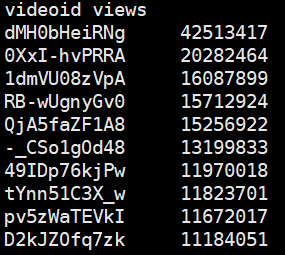
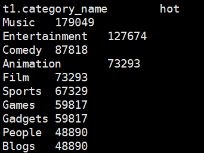
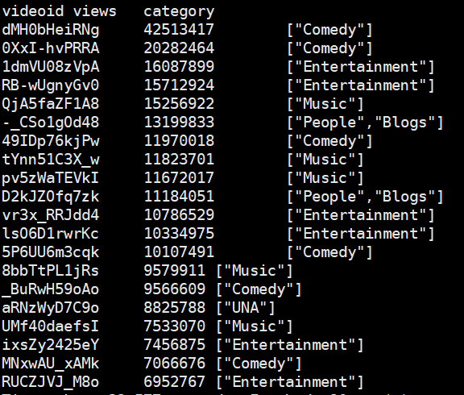
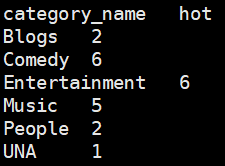
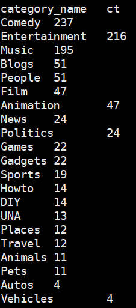
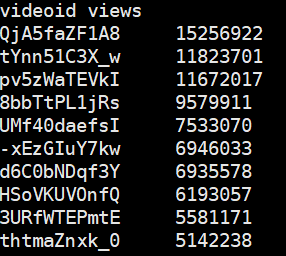

> 本blog是Hive入门篇的最后一篇，是实战篇。在这篇blog会对Youtube视频播放量数据集进行分析，计算各种TopN指标。

## 一、需求分析


统计Youtube视频网站的常规指标，各种TopN指标：

- 统计视频观看数Top10
- 统计视频类别热度Top10
- 统计出视频观看最高的20个视频的所属分类以及类别包含Top20视频的个数
- 统计视频观看数Top50所关联视频的所属类别排序
- 统计每个类别中的视频热度Top10，以Music为例
- 统计每个类别视频观看数Top10
- 统计上传视频最多的用户Top10以及他们上传的视频观看次数在前20的视频


## 二、准备数据

### 2.1 数据结构

我们有两个大文件：视频数据文件和用户文件

取一条视频数据文件中的数据（数据比较长，这一行数据本身是以`\t`分割的，现在按行分割看的清楚一点）：

```
SDNkMu8ZT68		# 视频唯一id
w00dy911		# 视频的上传者
630				# 视频在平台上传的天数
People&Blogs	# 视频分类，一个可以有好多分类，所以这里用 & 分割
186				# 视频长度
10181			# 观看次数
3.49			# 观看评分
494				# 视频流量
257				# 评论数
rjnbgpPJUks&udr9sLkoZ0s		# 相关视频id，可以有好多（最多20个）相关视频，这里用 & 分割
```

取一条用户文件中的数据：

```
bonk65	89	144
```

有三个值，分别是视频上传用户名`bonk65`，上传的视频数`89`以及朋友数量`144`


有了这些就可以创建表了，看一下表的数据结构：

视频表：

| 字段      | 备注                           | 详细描述               |
| --------- | ------------------------------ | ---------------------- |
| videoId   | 视频唯一Id（String）           | 11位字符串             |
| uploader  | 视频上传者（String）           | 上传视频的用户名       |
| age       | 视频年龄（int）                | 视频在平台上的整数天   |
| category  | 视频类别（Array< String >）    | 上传视频指定的视频分类 |
| length    | 视频长度（int）                | 整形数字标识的视频长度 |
| views     | 观看次数（int）                | 视频被浏览的次数       |
| rate      | 视频评分（Double）             | 满分5分                |
| Ratings   | 流量（int）                    | 视频的流量             |
| conments  | 评论数（int）                  | 一个视频的整数评论数   |
| ralatedId | 相关视频id（Array < String >） | 相关视频的id，最多20个 |

用户表：

| 字段     | 备注         | 字段类型 |
| -------- | ------------ | -------- |
| uploader | 上传者用户名 | string   |
| videos   | 上传视频数   | int      |
| friends  | 朋友数量     | int      |

### 2.2 创建表

有了上述表的数据结构，我们就可以创建表了，这里创建四张表，两张是原始数据表，两张是以`orc`格式压缩存储的表（因为压缩格式的表不能直接load数据）

原始数据表：`gulivideo_ori`、`gulivideo_user_ori`

`orc`压缩格式表：`gulivideo_orc`、`gulivideo_orc`


我们直接创建一个专门的数据库：

```sql
create database gulivideo;
use gulivideo;
```


首先上传数据，然后创建表：

```sql
# 创建gulivideo_ori表
create table gulivideo_ori(
    videoId string, 
    uploader string, 
    age int,
    category array<string>, 
    length int,
    views int, 
    rate float, 
    ratings int, 
    comments int,
    relatedId array<string>
)
row format delimited fields terminated by "\t"
collection items terminated by "&"
stored as textfile;

# 创建gulivideo_user_ori表
create table gulivideo_user_ori(
    uploader string,
    videos int,
    friends int
)
row format delimited fields terminated by "\t"
stored as textfile;

# 创建orc格式存储带snappy压缩的表
# gulivideo_orc
create table gulivideo_orc(
    videoId string, 
    uploader string, 
    age int,
    category array<string>, 
    length int,
    views int, 
    rate float, 
    ratings int, 
    comments int,
    relatedId array<string>
)
row format delimited fields terminated by "\t"
collection items terminated by "&"
stored as orc;

# gulivideo_user_orc
create table gulivideo_user_orc(
    uploader string,
    videos int,
    friends int
)
row format delimited fields terminated by "\t"
stored as orc;
```

向`ori`表`load`数据：

```sql
load data local inpath '/opt/module/datas/guliVideo/video' into table gulivideo_ori;
load data local inpath '/opt/module/datas/guliVideo/user/user.txt' into table gulivideo_user_ori;
```

向`orc`表`insert`数据：

```sql
insert into table gulivideo_orc select * from gulivideo_ori;
insert into table gulivideo_user_orc select * from gulivideo_user_ori;
```


## 三、实战

### 3.1 统计视频观看数Top10

这个挺简单的，字段`views`是观看次数，那么只需要使用`order by`字段做个降序，然后使用`limit 10`只显示前10条就好了：

```sql
select
    videoId,
    views
from gulivideo_orc
order by views desc
limit 10;
```

结果如下：



### 3.2 统计视频类别热度Top10

类别热度：这个类别有多少个视频

- 即统计每个类别有多少个视频，显示出包含视频最多的前 10 个类别。
- 我们需要按照类别 group by 聚合，然后 count 组内的 videoId 个数即可。

```sql
select
    t1.category_name,
    count(t1.videoId) hot
from(
    select 
        videoId,
        category_name
    from gulivideo_orc
    lateral view explode(category) category_tmp as category_name
) t1
group by t1.category_name
order by hot desc
limit 10;
```

结果如下：



### 3.3 统计出视频观看数最高的20个视频的所属类别以及类别包含Top20视频的个数


统计出观看数最高的前20个视频，`t1`

```sql
select
    videoId,
    views,
    category
from gulivideo_orc
order by views desc
limit 20; t1
```

现在的需求变成了，求下面这个表每个类别包含多少个视频：



把`t1`表按照`category`炸开

```sql
select
    category_name,
    count(t1.videoId) hot
from (
    select
        videoId,
        views,
        category
    from gulivideo_orc
    order by views desc
    limit 20
) t1
lateral view explode(t1.category) category_tmp as category_name
group by category_name;
```

结果如下：



### 3.4 统计视频观看数Top50所关联视频的所属类别排序

首先应该先查出`Top50`他的关联视频（数组），`t1`表

```sql
select
    relatedId,
    views
from gulivideo_orc
order by views desc
limit 50; t1
```


把`t1.relatedId`炸开拿到所有的视频id：`t2`表

```sql
select
    explode(t1.relatedId) relate_Id
from t1; t2
```


关联（JOIN）原表，取出关联视频所属类别：`t3`表

```sql
select
    g.category
from t2
join gulivideo_orc g
on t2.relate_Id = g.videoId; t3
```


炸开类别字段：`t4`表

```sql
select
    explode(category) category_name
from t3; t4
```


按照类别分组，求count，并按照count排序

```sql
select
    category_name,
    count(*) ct
from t4
group by category_name
order by ct desc;
```


最终SQL：

```sql
select
    category_name,
    count(*) ct
from (
    select
        explode(category) category_name
    from (
        select
            g.category
        from (
            select
                explode(t1.relatedId) relate_Id
            from (
                select
                    relatedId,
                    views
                from gulivideo_orc
                order by views desc
                limit 50
            ) t1
        ) t2
        join gulivideo_orc g
        on t2.relate_Id = g.videoId
    ) t3
) t4
group by category_name
order by ct desc;
```

结果：



### 3.5 表的复用:star:

在前几个案例中只要跟`category类别`有关系的，都需要把它炸开，其实这一段可以**复用**，专门建立一个表格去存储炸开后的数据，建立一个用于存储炸开分类后数据的表：

```sql
create table gulivideo_orc_category(
    videoId string, 
    uploader string, 
    age int,
    category string, 
    length int,
    views int, 
    rate float, 
    ratings int, 
    comments int,
    relatedId array<string>
)
row format delimited fields terminated by "\t"
collection items terminated by "&"
stored as orc;
```

接下来为上面这张表导入数据：

```sql
insert into table gulivideo_orc_category
select 
    videoId, 
    uploader, 
    age,
    category_name, 
    length,
    views, 
    rate, 
    ratings, 
    comments,
    relatedId
from gulivideo_orc
lateral view explode(category) category_tmp as category_name;
```


### 3.6 统计每个类别中的视频热度Top10，以Music为例

有了复用的表这个就简单多了

```sql
select
   videoId,
   views
from gulivideo_orc_category
where category="Music"
order by views desc
limit 10;
```

结果如下：



在那个年代油管音乐区最火的歌是`videoId=QjA5faZF1A8`的歌，好奇点开看一下：


卡农的一首电吉他solo，发布于2005年，目前已经有9435万点击量，留下我的脚印：


### 3.7 统计每个类别视频观看数Top10


求出每个类别视频观看数的排名

```sql
select
    category,
    videoId,
    views,
    rank() over(partition by category order by views desc) rk
from gulivideo_orc_category; t1
```

取出前10名

```sql
select
    category,
    videoId,
    views
from t1
where rk <= 10;
```

最终SQL：

```sql
select
    category,
    videoId,
    views
from (
    select
        category,
        videoId,
        views,
        rank() over(partition by category order by views desc) rk
    from gulivideo_orc_category
) t1
where rk <= 10;
```


### 3.8 统计上传视频最多的用户 Top10 以及他们上传的视频 观看次数在前 20 的视频

求出上传视频最多的10个用户
```sql
select
    uploader
from gulivideo_user_orc
order by videos desc
limit 10; t1
```

拿t1表跟视频表join取出前10用户所上传的所有视频
```sql
select
    t1.uploader,
    videoId,
    views
from t1
join gulivideo_orc g
on t1.uploader = g.uploader; t2
```

根据观看次数，对用户所上传的视频进行排名
```sql
select
    uploader
    videoId,
    views,
    rank() over(partition by uploader order by views desc) rk
from t2; t3
```
取出每个上传者观看数前20的视频
```sql
select
    uploader,
    videoId,
    views
from t3
where rk <= 20;
```
最终SQL：
```sql
select
    uploader,
    videoId,
    views
from (
    select
        uploader
        videoId,
        views,
        rank() over(partition by uploader order by views desc) rk
    from (
        select
            t1.uploader,
            videoId,
            views
        from (
            select
                uploader
            from gulivideo_user_orc
            order by videos desc
            limit 10
        ) t1
        join gulivideo_orc g
        on t1.uploader = g.uploader
    ) t2    
) t3
where rk <= 20;
```


## 参考资料

- 尚硅谷Hive学习视频

- [Apache Hive官网](https://hive.apache.org/)

- https://cwiki.apache.org/confluence/display/Hive/LanguageManual+Select

- https://cwiki.apache.org/confluence/display/Hive/HivePlugins

  


