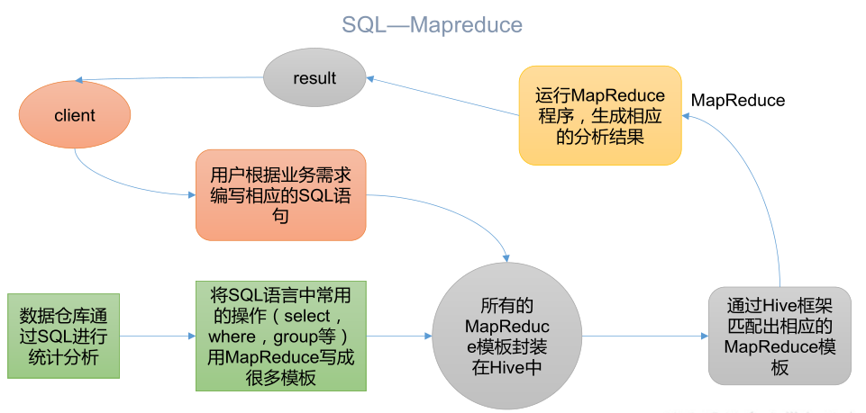
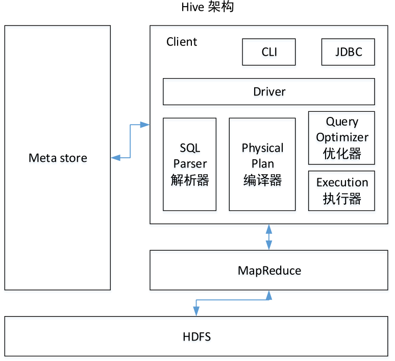
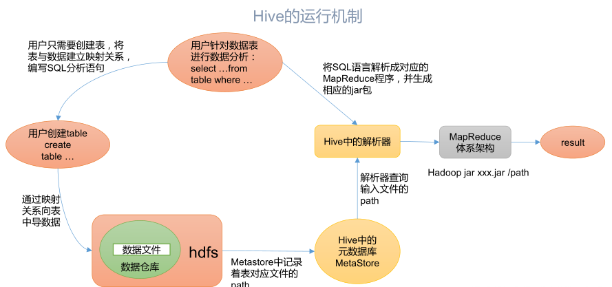

> Apache Hive 是由Facebook开源用于解决海量结构化日志的数据统计工具。也是基于Hadoop的一个数据仓库工具，可以将结构化的数据文件映射到一张表，并提供**类SQL**查询功能。

## 一、什么是Hive？

`Hive`是Hadoop的一个数据仓库工具，就是把结构化的数据文件映射为一张表，然后提供了`类SQL`功能

`Hive`的本质是：将`HQL`转换成`MapReduce`程序，也就是说，如果有了`HQL`，我们就不需要编写`MapReduce`繁琐的程序啦！下图就展示了`SQL->MapReduce`的一个步骤：

- Hive处理的数据存储在`HDFS`
- `Hive`分析数据底层的实现是`MapReduce`
- 执行程序运行在`Yarn`

## 二、Hive都有什么优缺点

优点：

- 操作接口采用`类SQL`语法，提供快速开发的能力
- 不用写`MapReduce`了，减少了开发成本
- `Hive`的执行延迟比较高，因此`Hive`常用于数据分析，对实时性要求不高的场合
- `Hive`优势在于处理大数据，对于处理小数据没有优势，因此`Hive`的执行延迟比较高
- `Hive`支持用户自定义函数，用户可以根据自己的需求来实现自己的函数

缺点：

- `HQL`表达能力有限，迭代式算法无法表达，不善于数据挖掘，由于`MapReduce`的数据处理流程限制，效率更高的算法无法实现
- `Hive`的效率比较低，自动生成的`MapReduce`作业，通常不够智能化，调优也比较困难

## 三、Hive架构

- 用户接口`Client`：CLI（command-line interface）、JDBC/ODBC（jdbc访问hive）、WEBUI（浏览器也可以访问Hive）
- 元数据`Metastore`：元数据包括表名、表所属数据库（默认default）、表的拥有者、列/分区字段、表的类型（是否有外部表）、表的数据所在目录等；默认存储在自带的`derby`数据库中，推荐使用`MySQL`存储元数据
- `Hadoop`：使用HDFS进行存储，使用`MapReduce`计算
- 驱动器`Driver`：
  - 解析器（SQL Parser）：将SQL字符串转换成抽象语法树AST，这一步一半都用第三方工具库完成，比如`antlr`；对于AST进行语法分析，比如表是否存在、字段是否存在、SQL语义是否有误
  - 编译器（Physical Plan）：将AST编译生成逻辑执行计划
  - 优化器（Query Optimizer）：对逻辑执行计划进行优化
  - 执行器（Execution）：把逻辑执行计划转换成运行的物理计划，对于`Hive`来说，就是`MR/Spark`

## 四、Hive和数据库比较

- 查询语言：由于 SQL被广泛的应用在数据仓库中，因此，专门针对 Hive的特性设计了类 SQL的查询语言 HQL。熟悉 SQL开发的开发者可以很方便的使用 Hive进行开发。
- 数据更新：由于 Hive是针对数据仓库应用设计的，而数据仓库的内容是读多写少的。因此，Hive中不建议对数据的改写，所有的数据都是在加载的时候确定好的。而数据库中的数据通常是需要经常进行修改的，因此可以使用 INSERT INTO …  VALUES 添加数据，使用 UPDATE … SET修改数据。
- 执行延迟：Hive 在查询数据的时候，由于没有索引，需要扫描整个表，因此延迟较高。另外一个导致 Hive 执行延迟高的因素是 MapReduce框架。由于 MapReduce 本身具有较高的延迟，因此在利用 MapReduce 执行 Hive查询时，也会有较高的延迟。相对的，数据库的执行延迟较低。当然，这个低是有条件的，即数据规模较小，当数据规模大到超过数据库的处理能力的时候，Hive的并行计算显然能体现出优势。
- 数据规模：Hive可以支持很大规模的数据，数据库的规模则很小

## 五、参考资料

- 尚硅谷Hive学习视频
- [Apache Hive官网](https://hive.apache.org/)

