> 本篇blog详细的介绍了如何在Linux上部署`Hive`、替换`derby`数据库为`MySQL`、编写`hive`启动脚本、几种方式访问`Hive`以及`Hive`经常使用的命令


本篇blog搭建的`Hive`基于`Hadoop`，请没有安装`Hadoop`的童鞋访问以下连接进行安装：

- [1、搭建模板虚拟机](https://blog.csdn.net/lesileqin/article/details/115396712)
- [2、克隆虚拟机](https://blog.csdn.net/lesileqin/article/details/115397591)
- [3、安装Java、Hadoop以及集群分发](https://blog.csdn.net/lesileqin/article/details/115398618)
- [4、配置Hadoop集群](https://blog.csdn.net/lesileqin/article/details/115402954)
- [5、配置历史服务器、日志聚集](https://blog.csdn.net/lesileqin/article/details/115420664)
- [6、编写集群统一启动停止脚本以及查看所有服务器Java进程脚本](https://blog.csdn.net/lesileqin/article/details/115426329)


## 一、安装Hive

安装`Hive`首先要下载`Hive`包，可以访问：https://downloads.apache.org/hive/hive-3.1.2/ 进行下载：

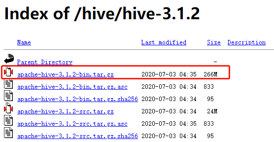

下载完成之后，可以上传到虚拟机`hadoop102`的`/opt/software/`文件夹下：

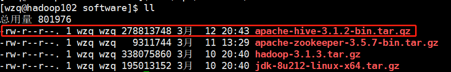

随后解压它到`/opt/module/`文件夹下：

```bash
tar -zxvf apache-hive-3.1.2-bin.tar.gz -C /opt/module/
```

进入到`/opt/module`更改`hive`文件的名称为`hive-版本号`：

```bash
cd /opt/module
mv apache-hive-3.1.2-bin hive-3.1.2
```

随后需要做的就是配置hive的环境变量：

```bash
su root
# 输入密码

# 编辑该文件
vim /etc/profile.d/my_env.sh

# 按下i把以下内容粘贴到该文件最后
#HIVE_HOME
export HIVE_HOME=/opt/module/hive-3.1.2
export PATH=$PATH:$HIVE_HOME/bin
# 按下ESC，输入:wq保存退出

# 回到wzq用户
su wzq
```


下一步工作是解决`log4j-slf4j-...-.jar`包的冲突，因为在`hadoop`集群内已经有该jar包了，如果不修改该jar包，那么hive启动的时候就会打印两遍日志，虽然没有什么大碍，但是看着不好看，于是我们把这一部分也改掉：

```bash
[wzq@hadoop102 hive-3.1.2]$ pwd
/opt/module/hive-3.1.2
[wzq@hadoop102 hive-3.1.2]$ mv lib/log4j-slf4j-impl-2.10.0.jar lib/log4j-slf4j-impl-2.10.0.bak
```

接下来初始化一下元数据库：

```bash
[wzq@hadoop102 hive-3.1.2]$ bin/schematool -dbType derby -initSchema
```

> 在初始化的时候，这里报了一个错：
>
> 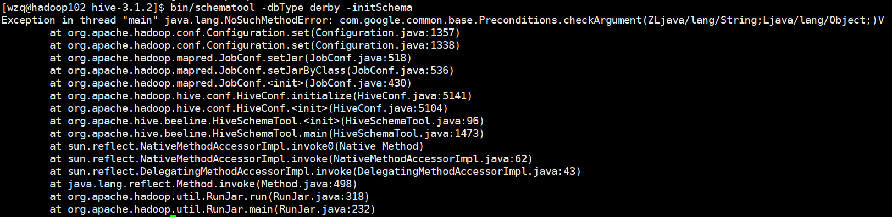
>
> 这是因为hadoop和hive的两个guava.jar版本不一致，两个位置分别位于：
>
> - /opt/module/hive-3.1.2/lib/
> - /opt/module/hadoop-3.1.3/share/hadoop/common/lib
>
> 需要做的就是把低版本的删除，把高版本的复制过来就好了
>
> ```bash
> [wzq@hadoop102 hive-3.1.2]$ mv /opt/module/hive-3.1.2/lib/guava-19.0.jar /opt/module/hive/lib/guava-19.0.bak
> [wzq@hadoop102 hive-3.1.2]$ cp /opt/module/hadoop-3.1.3/share/hadoop/common/lib/guava-27.0-jre.jar /opt/module/hive/lib/guava-27.0-jre.jar
> ```
>
> 执行完成之后再初始化元数据库就可以了

初始化完成之后是这样的：

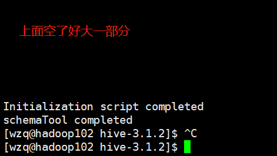


因为`hive`是基于`Hadoop yarn`的，所以在启动`hive`之前，应该运行我们写的`myhadoop.sh`启停脚本去启动`hadoop`，然后再启动`hive`


```bash
[wzq@hadoop102 ~]$ myhadoop.sh start
...
[wzq@hadoop102 ~]$ jpsall
=============== hadoop102 ===============
2502 DataNode
2999 JobHistoryServer
2377 NameNode
3437 Jps
2830 NodeManager
=============== hadoop103 ===============
2418 ResourceManager
2997 Jps
2538 NodeManager
2235 DataNode
=============== hadoop104 ===============
2307 DataNode
2515 NodeManager
2739 Jps
2381 SecondaryNameNode
```

然后启动`hive`：

```bash
[wzq@hadoop102 hive-3.1.2]$ pwd
/opt/module/hive-3.1.2
[wzq@hadoop102 hive-3.1.2]$ bin/hive
...
hive> 
```

启动`Hive`以后，就可以使用了，我们可以像使用`SQL`一样使用`Hive`，比如：

```bash
hive> show databases;
OK
default
Time taken: 0.048 seconds, Fetched: 1 row(s)
hive> show tables;
OK
test
Time taken: 0.068 seconds, Fetched: 1 row(s)
hive> create table test1(id string);
OK
Time taken: 0.141 seconds
hive> insert into test1 values('102');
...MapReduce过程...
```

插入之后，可以到`hdfs`客户端查看我们插入的数据：

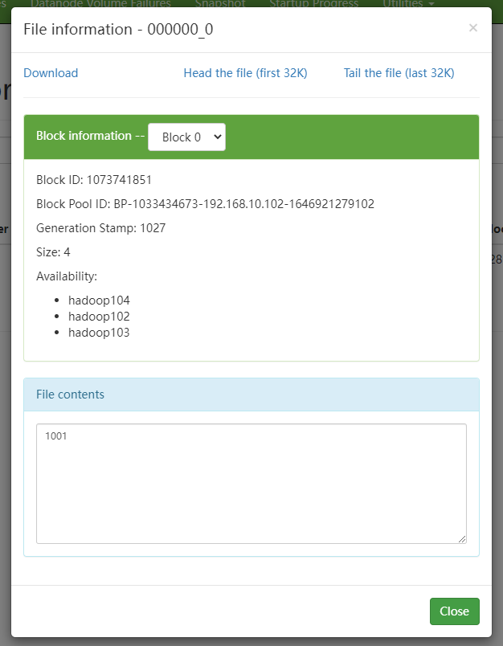


`hive`默认存储元数据使用的数据库是`derby`，但是`derby`有个缺点就是，hive客户端只能启动一个，啥意思呢？就是说如果一个公司所有的人都想操作hive客户端，但是`derby`只允许一个人操作，这个人操作完成别人才可以打开hive客户端，读者可以复制一个shell对话框测试一下，所以我们需要更改`derby`数据库为`MySQL`


## 二、安装MySQL

在安装MySQL之前应该确认一下虚拟机是否装的有：

```bash
[wzq@hadoop102 software]$ rpm -qa|grep mariadb
mariadb-libs-5.5.56-2.el7.x86_64
# 卸载自带的MySQL
[wzq@hadoop102 software]$ sudo rpm -e --nodeps mariadb-libs
```

选择安装5.7.28版本的mysql，下载地址：http://ftp.iij.ad.jp/pub/db/mysql/Downloads/MySQL-5.7/

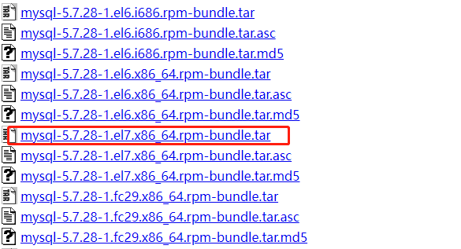


下载完成之后，直接上传到虚拟机：`/opt/software/`下，然后解压：

```bash
[wzq@hadoop102 software]$ tar -xf mysql-5.7.28-1.el7.x86_64.rpm-bundle.tar
```

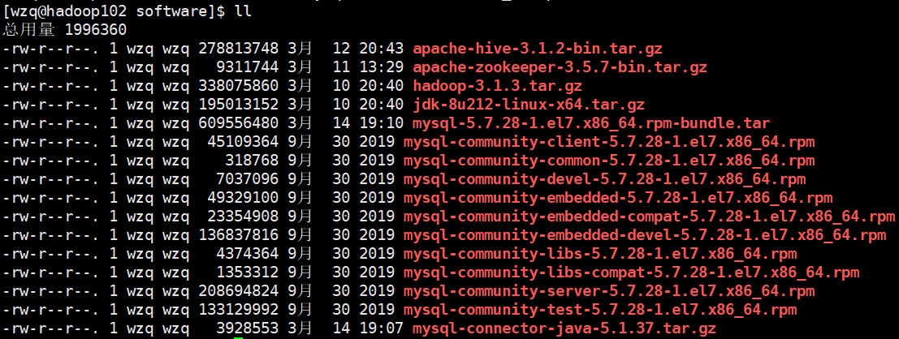


然后在此目录下，执行以下命令安装MySQL

```bash
[wzq@hadoop102 software]$ sudo rpm -ivh mysql-community-common-5.7.28-1.el7.x86_64.rpm
[wzq@hadoop102 software]$ sudo rpm -ivh mysql-community-libs-5.7.28-1.el7.x86_64.rpm
[wzq@hadoop102 software]$ sudo rpm -ivh mysql-community-libs-compat-5.7.28-1.el7.x86_64.rpm
[wzq@hadoop102 software]$ sudo rpm -ivh mysql-community-client-5.7.28-1.el7.x86_64.rpm
[wzq@hadoop102 software]$ sudo rpm -ivh mysql-community-server-5.7.28-1.el7.x86_64.rpm
```


随后就可以初始化MySQL数据库了：

```bash
[wzq@hadoop102 opt]$ sudo mysqld --initialize --user=mysql
```

查看临时生成的MySQL root用户的密码：

```bash
[wzq@hadoop102 opt]$ sudo cat /var/log/mysqld.log
```

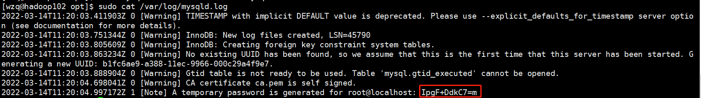

启动MySQL服务：

```bash
sudo systemctl start mysqld
```

登录数据库，更改root用户密码，这里我密码更改为`root`，并且修改root用户运行任何用户连接：

```bash
# 登录数据库
[wzq@hadoop102 opt]$ mysql -uroot -p你的临时密码（-p后没有空格）
# 设置新密码
mysql> set password = password("root")
# 设置任意主机可以连接root
mysql> update mysql.user set host='%' where user='root';
# 刷新
mysql> flush privileges;
```

接下来打开`Navicat`测试一下是否能连接上：

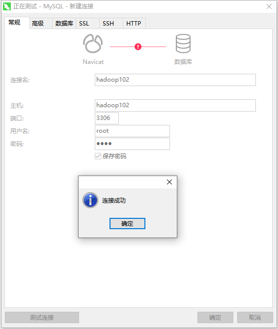


## 三、配置Hive数据库为MySQL

Hive连接MySQL需要JDBC驱动，所以需要下载JDBC驱动，下载地址：https://downloads.mysql.com/archives/c-j/

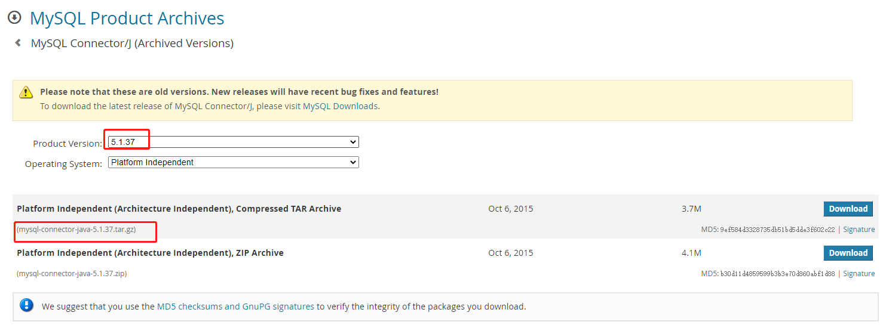


上传至`/opt/software/`下，解压缩，再把里面的jar包拷贝到`$HIVE_HOME/lib`下：

```bash
[wzq@hadoop102 software]$ tar -zxvf mysql-connector-java-5.1.37.tar.gz
[wzq@hadoop102 software]$ cd mysql-connector-java-5.1.37
[wzq@hadoop102 mysql-connector-java-5.1.37]$ cp mysql-connector-java-5.1.37-bin.jar $HIVE_HOME\lib
```


在`conf`文件夹下新建`hive-site.xml`

```bash
[wzq@hadoop102 hive-3.1.2]$ pwd
/opt/module/hive-3.1.2
[wzq@hadoop102 hive-3.1.2]$ vim conf/hive-site.xml
```

把以下内容添加到该文件中，**注意账户密码对应你设置的MySQL密码**！

```xml
<?xml version="1.0"?> 
<?xml-stylesheet type="text/xsl" href="configuration.xsl"?> 
<configuration> 
    <!-- jdbc连接的 URL --> 
    <property> 
        <name>javax.jdo.option.ConnectionURL</name> 
        <value>jdbc:mysql://hadoop102:3306/metastore?useSSL=false</value> 
	</property> 
 
    <!-- jdbc连接的 Driver--> 
    <property> 
        <name>javax.jdo.option.ConnectionDriverName</name> 
        <value>com.mysql.jdbc.Driver</value> 
	</property> 
 
 <!-- jdbc连接的 username--> 
    <property> 
        <name>javax.jdo.option.ConnectionUserName</name> 
        <value>root</value> 
    </property> 
 
    <!-- jdbc连接的 password --> 
    <property> 
        <name>javax.jdo.option.ConnectionPassword</name> 
        <value>root</value> 
	</property> 
 
    <!-- Hive元数据存储版本的验证 --> 
    <property> 
        <name>hive.metastore.schema.verification</name> 
        <value>false</value> 
	</property> 
 
    <!--元数据存储授权--> 
    <property> 
        <name>hive.metastore.event.db.notification.api.auth</name> 
        <value>false</value> 
    </property> 
 
    <!-- Hive默认在 HDFS的工作目录 --> 
    <property> 
        <name>hive.metastore.warehouse.dir</name> 
        <value>/user/hive/warehouse</value> 
    </property> 
</configuration>
```


注意，上述jdbc连接的url是指向`metastore`数据库的，所以我们要打开mysql创建一个数据库：

```bash
[wzq@hadoop102 hive-3.1.2]$ mysql -uroot -proot
mysql> mysql> create databse metastore;
```

然后初始化Hive元数据库：

```bash
[wzq@hadoop102 hive-3.1.2]$ bin/schematool -initSchema -dbType mysql -verbose
```

初始化完成之后启动`hive`：

```bash
[wzq@hadoop102 hive-3.1.2]$ bin/hive
...
# 试着做一些操作
hive> show databases;
OK
default
Time taken: 0.765 seconds, Fetched: 1 row(s)
hive> show tables;
OK
Time taken: 0.073 seconds
hive> create table test1(id string);
OK
Time taken: 0.706 seconds
hive> select * from test1;
OK
102		# 注意这里
Time taken: 2.177 seconds, Fetched: 1 row(s)
```

我们刚刚插入的`102`居然在这里也显示了！太神奇了，哈哈，其实数据库的作用只是元数据到hdfs的映射，在hdfs上数据默认保存在路径：`/user/hive/warehouse/表`


如果我们使用`hdfs`命令行上传一个文件到这个表，会发生什么呢？

```bash
[wzq@hadoop102 ~]$ pwd
/home/wzq
[wzq@hadoop102 ~]$ vim a.txt
[wzq@hadoop102 ~]$ cat a.txt
103
104
105
106
[wzq@hadoop102 ~]$ hadoop fs -put a.txt /user/hive/warehouse/test1
```

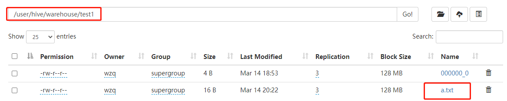

文件已经上传到`hdfs`了，现在打开`hive`，查看test1表：

```bash
hive> select * from test1;
```

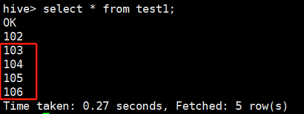

可以看到刚刚的文件也属于这个表了！好神奇！当然这个时候也可以多用户访问`Hive`客户端啦


## 四、访问Hive的几种方式

到此为止我们还没有配置过任何一个端口，没有端口其他主机也连不进来，所以我们需要给hive配置端口，总共有两种方式，一种是元数据服务的方式访问；另一种是使用JDBC访问

### 1、使用元数据服务的方式访问Hive port=9083

既然配置端口，肯定要动一动配置文件了，打开配置文件，在最后添加如下配置：

```xml
<!-- 指定存储元数据要连接的地址 -->
<property> 
    <name>hive.metastore.uris</name> 
    <value>thrift://hadoop102:9083</value> 
</property> 
```

然后启动`metastore`：

```bash
[wzq@hadoop102 hive-3.1.2]$ bin/hive --service metastore
```

> Note：启动窗口后不能再操作！需要打开一个新的shell窗口做别的操作

于是我们克隆一个窗口，启动hive：

```bash
[wzq@hadoop102 hive-3.1.2]$ bin/hive
```

这是第一种访问方式

### 2、使用JDBC方式访问Hive port=10000

在`hive-site.xml`种添加如下配置信息

```xml
<!-- 指定 hiveserver2连接的 host -->             
<property> 
    <name>hive.server2.thrift.bind.host</name> 
    <value>hadoop102</value> 
</property> 

<!-- 指定 hiveserver2连接的端口号 --> 
<property> 
    <name>hive.server2.thrift.port</name> 
    <value>10000</value> 
</property>
```

> 启动这个《元服务》那个也要开启

启动`hiveserver2`：（需等待，时间比较久）

```bash
[wzq@hadoop102 hive-3.1.2]$ bin/hive --service hiveserver2
```

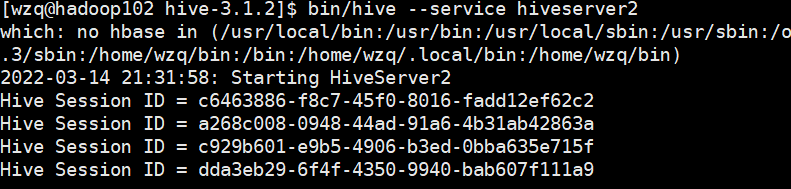

如果这样就启动成功了，但是这个窗口依旧不能关闭，还需要克隆一个窗口出来

启动`beeline`客户端：（需等待，时间比较久）

```bash
[wzq@hadoop102 hive-3.1.2]$ bin/beeline -u jdbc:hive2://hadoop102:10000 -n wzq
```

> 在这里遇到了一个报错：
>
> 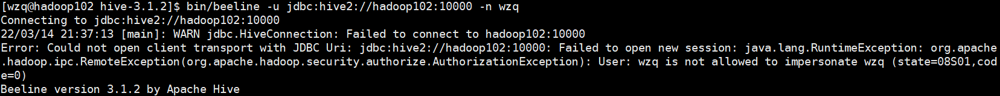
>
> 淦！！这时候需要打开你的`hadoop/etc/hadoop/core-site.xml`往里面加入两行配置：
>
> ```xml
> <property>
>     <name>hadoop.proxyuser.你的用户名.hosts</name>
>     <value>*</value>
> </property>
> <property>
>     <name>hadoop.proxyuser.你的用户名.groups</name>
>     <value>*</value>
> </property>
> ```
>
> 添加完成之后，重启hadoop：
>
> ```bash
> myhadoop.sh stop
> myhadoop.sh start
> ```
>
> 

然后再启动就beeline成功了：

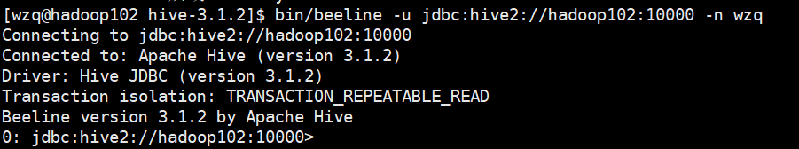

需要注意的是：这个窗口也tm不能关闭！


### 3、封装一个脚本


上面启动hive实在太麻烦了，于是就可以封装一个脚本：

```bash
[wzq@hadoop102 bin]$ pwd
/opt/module/hive-3.1.2/bin
[wzq@hadoop102 bin]$ vim hiveservices.sh
```

然后把下面的内容沾到该文件种：

```bash
#!/bin/bash 
HIVE_LOG_DIR=$HIVE_HOME/logs 
if [ ! -d $HIVE_LOG_DIR ] 
then 
    mkdir -p $HIVE_LOG_DIR 
fi 
#检查进程是否运行正常，参数 1为进程名，参数 2为进程端口 
function check_process()
{ 
    pid=$(ps -ef 2>/dev/null | grep -v grep | grep -i $1 | awk '{print $2}') 
    ppid=$(netstat -nltp 2>/dev/null | grep $2 | awk '{print $7}' | cut -d '/' -f 1) 
    echo $pid 
    [[ "$pid" =~ "$ppid" ]] && [ "$ppid" ] && return 0 || return 1 
} 
 
function hive_start() 
{ 
    metapid=$(check_process HiveMetastore 9083) 
    cmd="nohup hive --service metastore >$HIVE_LOG_DIR/metastore.log 2>&1 &" 
    [ -z "$metapid" ] && eval $cmd || echo "Metastroe服务已启动" 
    server2pid=$(check_process HiveServer2 10000) 
    cmd="nohup hive --service hiveserver2 >$HIVE_LOG_DIR/hiveServer2.log 2>&1 &" 
    [ -z "$server2pid" ] && eval $cmd || echo "HiveServer2服务已启动" 
} 
 
function hive_stop() 
{ 
    metapid=$(check_process HiveMetastore 9083) 
    [ "$metapid" ] && kill $metapid || echo "Metastore服务未启动" 
    server2pid=$(check_process HiveServer2 10000) 
    [ "$server2pid" ] && kill $server2pid || echo "HiveServer2服务未启动" 
} 
 
case $1 in 
"start") 
    hive_start 
    ;; 
"stop") 
    hive_stop 
    ;; 
"restart") 
    hive_stop 
    sleep 2 
    hive_start 
    ;; 
"status") 
    check_process HiveMetastore 9083 >/dev/null && echo "Metastore服务运行正常" || echo "Metastore服务运行异常" 
    check_process HiveServer2 10000 >/dev/null && echo "HiveServer2服务运行正常" || echo "HiveServer2服务运行异常" 
    ;; 
*) 
    echo Invalid Args! 
    echo 'Usage: '$(basename $0)' start|stop|restart|status' 
    ;; 
esac
```

使其具有可执行权限：

```bash
[wzq@hadoop102 bin]$ chmod +x hiveservices.sh
```


启动一下（启动之前需要启动hadoop），这个命令需要等待一会儿，当然读者也可以监控日志`/tmp/wzq/hive.log`查看启动情况：

```bash
[wzq@hadoop102 bin]$ hiveservices.sh start
```

这次就不是前台进程了，他不会显示任何内容，可以通过`status`查看有没有启动成功：

```bash
[wzq@hadoop102 bin]$ hiveservices.sh status
Metastore服务运行正常
HiveServer2服务运行正常
```

这样就成功了！


## 五、Hive常用交互命令

我们可以键入以下命令查看Hive都有什么命令：

```bash
[wzq@hadoop102 wzq]$ hive -help
```

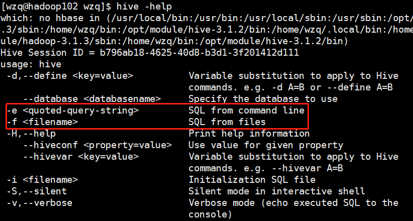

主要使用这两个命令：

### 1、-e不进入hive窗口执行sql

之前我们执行sql的时候进入了hive，使用`-e`参数可以不进入hive窗口，直接执行，比如：

```bash
[wzq@hadoop102 wzq]$ hive -e "select * from test1;"
```

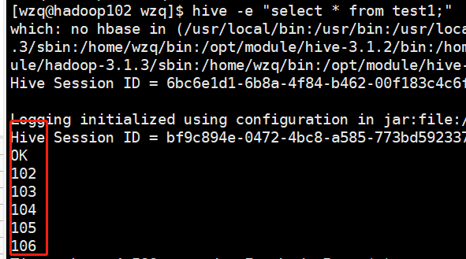


### 2、-f执行脚本中的sql

当然也可以写一个文件，把我们需要执行的sql都放在文件里面去：

```bash
[wzq@hadoop102 wzq]$ cd $HIVE_HOME
[wzq@hadoop102 hive-3.1.2]$ mkdir datas
[wzq@hadoop102 hive-3.1.2]$ cd datas/
[wzq@hadoop102 datas]$ vim test.sql
# 按下i插入：
select * from test1;
select count(id) from test1;
# 执行
[wzq@hadoop102 datas]$ hive -f test.sql
```

这时候hive会执行文件中的sql：

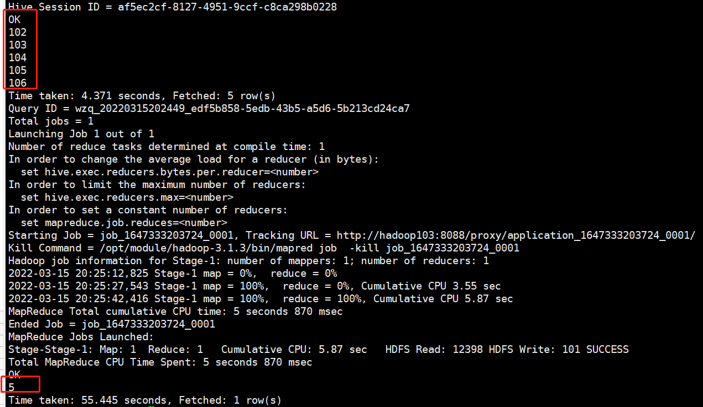

## 六、Hive常见属性配置

### 1、参数配置方式

配置参数有三种方式：

- 在用户自定义的`hive-site.xml`中配置
- 在启动Hive窗口的时候，在命令行添加`-hiveconf param=value`的形式。**仅对本次Hive窗口有效**
- 在hive窗口内使用`SET param=value;`的形式配置。**仅对本次Hive窗口有效**

这三种配置的优先级从上往下依次强烈！


知道了Hive是如何配置信息的，那Hive都有哪些配置？这些配置可以到`$HIVE_HOME\conf\hive-default.xml.template`文件中查看

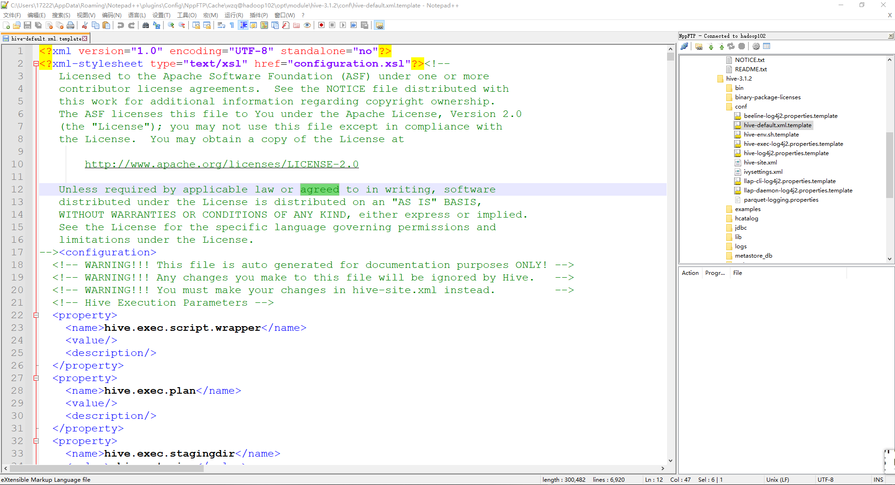


### 2、配置运行日志信息

我们的日志默认存放在`\tmp\wzq\hive.log`，期望可以存储在`hive`安装包下，所以我们可以到`$HIVE_HOME\conf\`下，去更改：

```bash
[wzq@hadoop102 conf]$ pwd
/opt/module/hive-3.1.2/conf
[wzq@hadoop102 conf]$ mv hive-log4j2.properties.template hive-log4j2.properties
```

修改这个属性为想要存储log的位置


当再次启动Hive窗口，hive.log已经换地方了

### 3、hive窗口打印库和表头

期望在hive客户端能为我们显示当前在使用哪个库，查询表之后都有哪些字段，所以我们可以去：`hive-site.xml`中添加两个属性：

```xml
<property> 
    <name>hive.cli.print.header</name> 
    <value>true</value> 
</property> 

<property> 
    <name>hive.cli.print.current.db</name> 
    <value>true</value> 
</property> 
```

再次启动Hive：

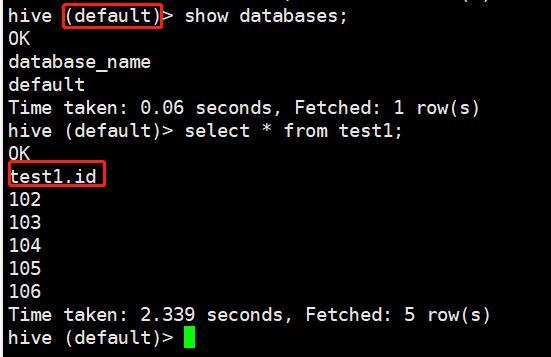


## 七、参考资料

- 尚硅谷Hive学习视频
- [Apache Hive官网](https://hive.apache.org/)


