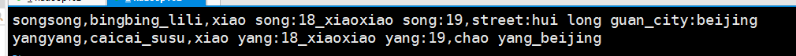
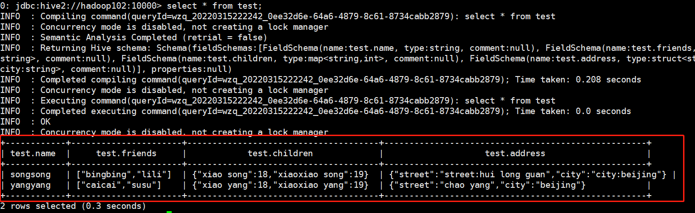

> Hive有自己的数据类型，这些数据类型非常重要，但是学过一点点SQL或者JAVA、C 、Python的应该都很好上手，因为Hive的数据类型与他们都很相似。


## 一、基本数据类型

| Hive数据类型 | Java数据类型 | 长度                                               | 例子          |
| ------------ | ------------ | -------------------------------------------------- | ------------- |
| tinyint      | byte         | 1byte有符号整数                                    | 20            |
| smalint      | short        | 2byte有符号整数                                    | 20            |
| int          | int          | 4byte有符号整数                                    | 20            |
| bigint       | long         | 8byte有符号整数                                    | 20            |
| boolean      | boolean      | 布尔类型，true或false                              | true，false   |
| float        | float        | 单精度浮点数                                       | 3.1415926     |
| double       | double       | 双精度浮点数                                       | 3.1415926     |
| string       | string       | 字符串，可以指定单字符集，可以使用单引号或者双引号 | 'Hello world' |
| timestamp    |              | 时间类型                                           |               |
| binary       |              | 字节数组                                           |               |


## 二、集合数据类型

| 数据类型 | 描述                                                         | 语法示例                            |
| -------- | ------------------------------------------------------------ | ----------------------------------- |
| struct   | 类似C语言的Struce，Java中的JavaBean，都可以通过”点“符号访问元素内容 | `strcut(street:string,city:string)` |
| map      | Map是一组键-值对元组集合，使用数组表示法可以访问数据         | `map<string,int>`                   |
| array    | array是一组具有相同类型和名称的变量集合，这些变量称为数组的元素，每个数组元素都有一个编号，编号从0开始 | `array<string>`                     |

**案例实操：**

假设某表有一行，先使用`JSON`格式来表示其数据结构：

```json
{ 
    "name": "songsong", 
    "friends": ["bingbing" , "lili"] , //列表 Array,  
    "children": {                      //键值 Map, 
        "xiao song": 18 , 
        "xiaoxiao song": 19 
    } 
    "address": {                       //结构 Struct, 
        "street": "hui long guan", 
        "city": "beijing" 
    } 
}
```

如果我们想存储到文件里面，就要思考这一行数据是如何`分割`的了，这里使用`,`分割每个字段；对于一个集合里面的键和值使用`:`分割；使用`_`分割集合类型中的每个值，于是我们可以得到一行数据：

```
songsong,bingbing_lili,xiao song:18_xiaoxiao song:19,street:hui long guan_city:beijing
```


再加一行数据，把它存在一个文件里：

```bash
[wzq@hadoop102 datas]$ vim test.txt
```

在该文件插入以下数据




接下来启动hive客户端，创建一张表，这里我使用`beeline`的方式去启动客户端：

```bash
[wzq@hadoop102 datas]$ beeline -u jdbc:hive2://hadoop102:10000 -n wzq
```


启动完成之后，创建一张表格：

```bash
create table test( 
    name string, 
    friends array<string>,
    children map<string, int>, 
    address struct<street:string, city:string> 
) 
row format delimited fields terminated by ',' 
collection items terminated by '_' 
map keys terminated by ':' 
lines terminated by '\n';
```

> 创建表下面的四行是定义分隔符：
>
> - `row format delimited fields terminated by ','`：每个列之间用`,`分割
> - `collection items terminated by '_'`：集合之间的元素用`_`分割
> - `map keys terminated by ':'`：键值对之间用`:`分割
> - `lines terminated by '\n'`：每一行数据按`\n`分割，这是默认的

把刚刚创建的文件上传到`hdfs`：

```bash
[wzq@hadoop102 datas]$ hadoop fs -put test.txt /user/hive/warehouse/test
```

在`beeline`里面`select`一下：

```bash
jdbc:hive2://hadoop102:10000> select * from test;
```

查询成功：




如果想访问集合：

```sql
# 访问Array某个元素
select friends[1] from test;
# 访问Map
select children['xiao song'] from test;
# 访问struce
select address.city from test;
```

## 三、类型转化


### 1、隐式类型转换

- 任何整数类型都可以隐式地转换为一个范围更广的类型，如 TINYINT可以转换成INT，INT可以转换成 BIGINT
- 所有整数类型、FLOAT和 STRING类型都可以隐式地转换成 DOUBLE
- TINYINT、SMALLINT、INT都可以转换为 FLOAT
- BOOLEAN类型不可以转换为任何其它的类型

### 2、cast强制类型转换

例如可以使用：`cast('1' as int)`把字符串`'1'`转换为整数`1`，转换类型失败则会返回`null`


## 四、参考资料

- 尚硅谷Hive学习视频
- [Apache Hive官网](https://hive.apache.org/)

