> 这篇Blog将开始Hive的核心部分：HQL，为了简化学习成本，所以它设计的非常像SQL。HQL分为：DDL数据定义和DML数据操作，DDL就是创建库、创建表这些；DML就比较重要了，操作数据。本篇Blog学习DDL，其中建表语句比较重要。

首先开启`Hadoop`服务，然后开启`Hive`服务：

```bash
[wzq@hadoop102 hive-3.1.2]$ myhadoop.sh start
[wzq@hadoop102 hive-3.1.2]$ hiveservices.sh start
[wzq@hadoop102 hive-3.1.2]$ hive
```


## 一、库相关的HQL

### 1、创建数据库

以下是创建数据库的标准代码，其中带有`[]`的是可选项：

```sql
create database [if not exists] database_name
[comment database_comment]	# 数据库的注释
[location hdfs_path]		# 指定数据库存在hdfs哪个位置
[with dbproperties (property_name=property_value,...)];	# 可以加一些属性信息，比如creatTime=2022-3-16
```

案例：

**创建一个数据库，数据库在HDFS上默认存储的位置是：`/user/hive/warehouse/*.db`：**

```bash
hive (default)> create database db_hive;
```

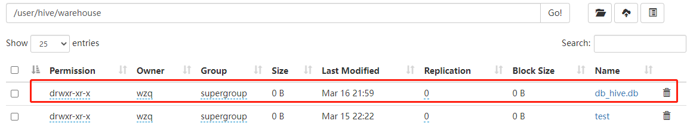


**避免要创建的数据库已经存在错误，增加`if not exists`判断：**

```bash
hive (default)> create database if not exists db_hive;
OK
Time taken: 0.049 seconds
```

显示`OK`，因为已经有这个库了，所以实际上没有创建数据库：

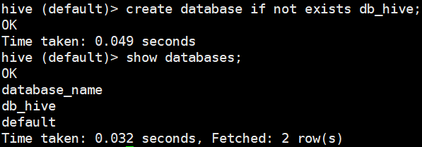


**创建一个数据库，指定数据库在HDFS上存放的位置：**

```bash
hive (default)> create database db_hive2 location '/db_hive2.db';
```

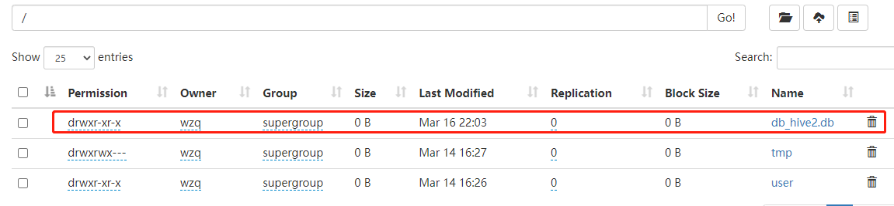


### 2、查询数据库

**显示数据库：**

```bash
# 显示数据库
hive (default)> show databases;

# 过滤显示查询的数据库
hive (default)> show databases like "db_hive*";
```


**查看数据库详情：**

```bash
# 查询信息
hive (default)> desc database db_hive;

# 查询详细信息
hive (default)> desc database extended db_hive;
```

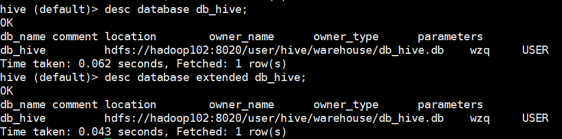


**切换数据库：**

```bash
hive (default)> use db_hive;
```


### 3、修改数据库

可以使用`alter database`命令修改某个数据库的`dbproperties`设置键值对属性值：

```bash
hive (default)> alter database db_hive set dbproperties('createTime'='2022-3-16');
```


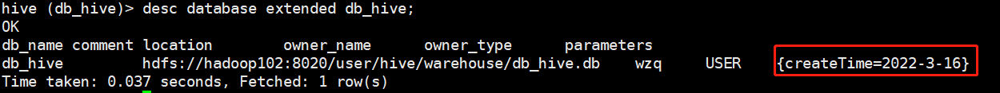


### 4、删除数据库

```bash
# 删除空数据库
hive> drop database db_hive2;

# 在删除之前使用if exists查看是否存在
hive> drop database if exists db_hive2;

# 如果数据库不为空，可以使用 cascade 命令强制删除
hive> drop database db_hive cascade;
```


## 二、表相关的HQL

### 1、创建表 :star:

建表语法，其中带有`[]`是可选选项：

```sql
create [external] table [if not exists] table_name
[(col_name data_type [comment col_comment],...)]	# 表里的每个字段，每个字段可以加注释
[comment table_comment]		# 表的注释
[partitioned by (col_name data_type [comment col_comment],...)]		# 分区表，后面的blog解释
[clustered by (col_name,col_name,..)
[sorted by (col_name [ASC|DESC],...)] INTO num_buckets buckets]		# 分桶表，后面的blog解释
[row format row_format]		# 行的格式，比如每个字段中间使用 , 分割
[stored as file_format]		# 存放在hdfs的文件格式，默认.txt
[loaction hdfs_path]		# 指定表的存放位置
[tblproperties (property_name=property_value,...)]	# 表额外的属性
[as select_statement]		# 后面的blog解释
```


**其中`row format`很重要，它指定一行数据以什么分割，以下是常用的分隔符语句**

- `row format delimited fields terminated by ','`：每个列之间用`,`分割
- `collection items terminated by '_'`：集合之间的元素用`_`分割
- `map keys terminated by ':'`：键值对之间用`:`分割
- `lines terminated by '\n'`：每一行数据按`\n`分割，这是默认的


#### 1.1 内部表（管理表）

> 刚刚第一行有个`external`没有解释，这个字段的意思是是否创建该表为`外部表`，`hive`有两种表的形式：
>
> - 内部表：又叫管理表，指的是删表的时候，Hive也会删除在hdfs上的数据
>
> - 外部表：删表的时候只删除元数据，不删除hdfs上的真实数据

**创建表：**

```bash
hive (db_hive)> create table if not exists student(
              > id int,name string
              > )
              > row format delimited fields terminated by ',';
```

把下面的数据上传至`hdfs`的`/user/hive/warehouse/db_hive.db/student`下：

```
1001,ss1 
1002,ss2 
1003,ss3 
1004,ss4 
1005,ss5 
1006,ss6  
```

```bash
# 上传
[wzq@hadoop102 datas]$ hadoop fs -put student.txt /user/hive/warehouse/db_hive.db/student
```


**根据查询结果创建表：**

```bash
hive (db_hive)> create table if not exists student2 as select id,name from student;
```

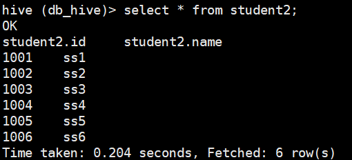

**根据已经存在的表结构创建表：**

```bash
hive (db_hive)> create table if not exists student3 like student;
```

这时候这个表是没有任何数据的


**查询表的详细信息：**

```bash
hive (db_hive)> desc formatted student2;
```

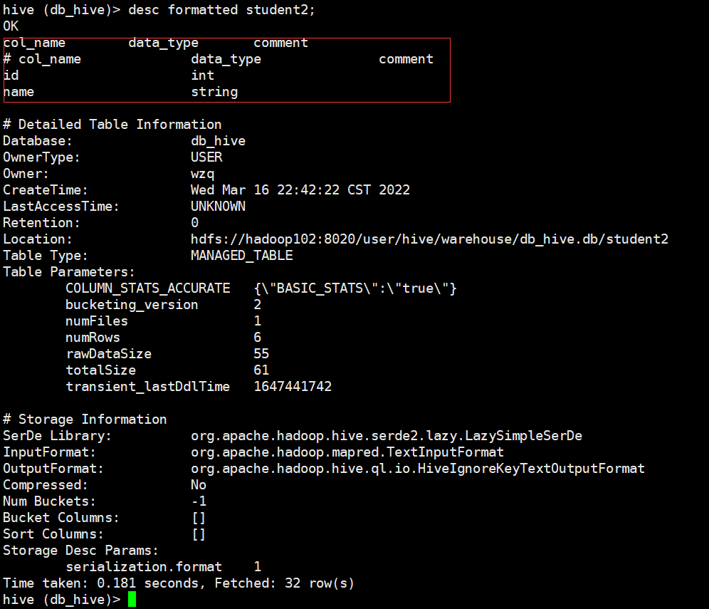

#### 1.2 外部表

外部表：删除表的时候，只会删除元数据，不会删除`hdfs`上的内容，请看下面的案例

```bash
hive (db_hive)> create external table if not exists student4(
              > id int,name string)
              > row format delimited fields terminated by ',';
```

然后把刚刚准备的数据上传到这个目录：

```bash
[wzq@hadoop102 datas]$ hadoop fs -put student.txt /user/hive/warehouse/db_hive.db/student4
```

这时候已经有数据在里面了：

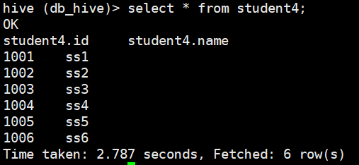

这时候如果删除它：

```bash
hive (db_hive)> drop table student4;
```


打开`hdfs`页面，发现数据还在：

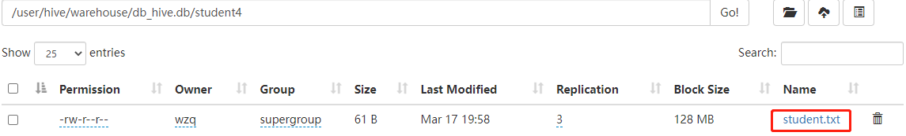


#### 1.3 管理表与外部表互相转换

**修改student2为外部表：**

```bash
hive (db_hive)> alter table student2 set tblproperties('EXTERNAL'='TRUE');
```

**修改student2为内部表：**

```bash
hive (db_hive)> alter table student2 set tblproperties('EXTERNAL'='FALSE');
```

**查看表的类型：**

```bash
hive (db_hive)> desc formatted student2;
```

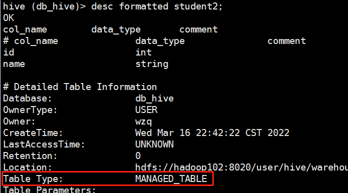


### 2、修改表

#### 2.1 重命名表

```bash
hive (db_hive)> alter table student rename to student1;
```

在HDFS里面，也会随着表名的改变而改变：

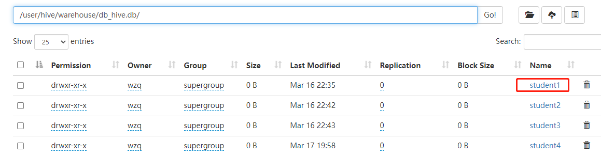

#### 2.2 增加/修改/替换列信息

分别对应三个关键字：`add|change|replace`

这一部分并不是多么重要，只贴出一个格式，具体例子不展开：

**更新列**

```sql
alter table table_name change [column] col_old_name col_new_name column_type [comment col_comment] 
```

**增加和替换列**

```sql
alter table table_name add|replace columns (col_name data_type [comment col_comment],...)
```


### 3、 删除表

```bash
hive (default)> drop table student1;
```

## 三、参考资料

- 尚硅谷Hive学习视频
- [Apache Hive官网](https://hive.apache.org/)
