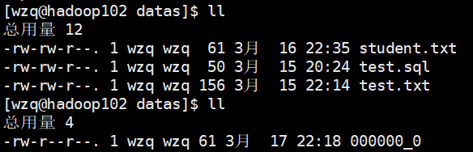
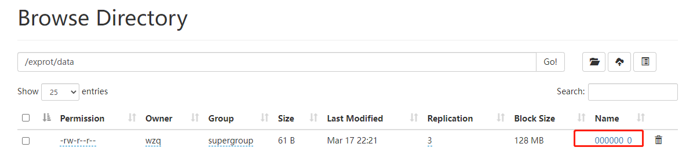
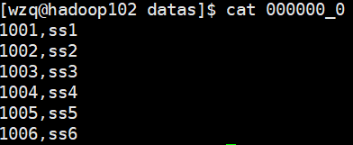
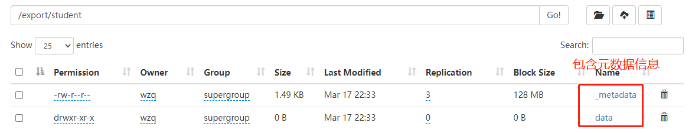
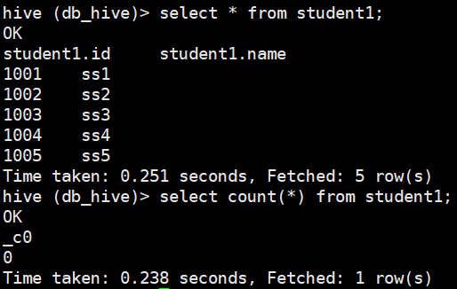
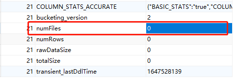
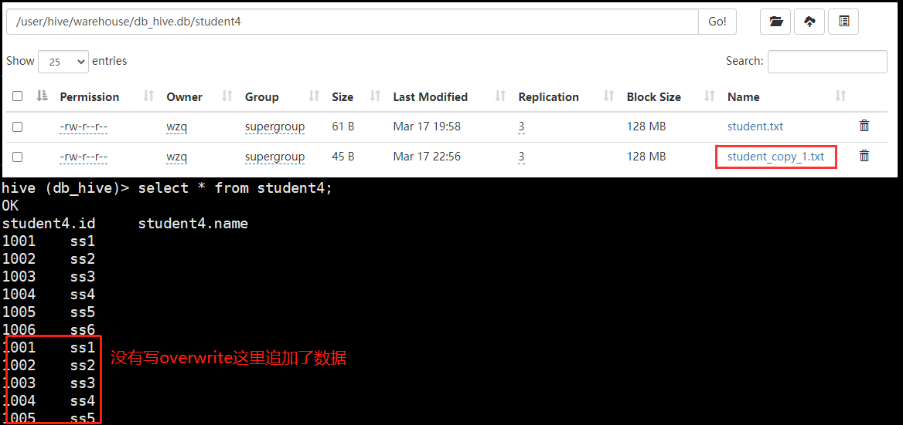
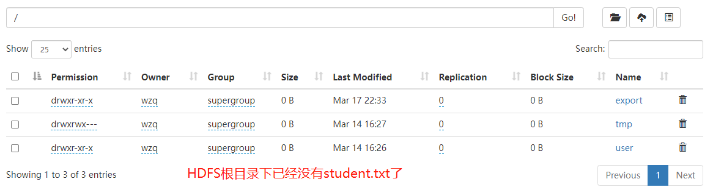
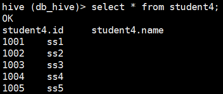

首先开启`Hadoop`服务，然后开启`Hive`服务：

```bash
[wzq@hadoop102 hive-3.1.2]$ myhadoop.sh start
[wzq@hadoop102 hive-3.1.2]$ hiveservices.sh start
[wzq@hadoop102 hive-3.1.2]$ hive
hive (default)> create database if not exists db_hive;
hive (default)> use db_hive;
hive (db_hive)> show tables;
hive (db_hive)> select * from student1;
OK
student1.id	student1.name
1001	ss1 
1002	ss2 
1003	ss3 
1004	ss4 
1005	ss5 
1006	ss6  
Time taken: 3.236 seconds, Fetched: 6 row(s)
```


## 一、数据导出

### 1、Insert导出

**将查询结果导出到本地（加local关键字）：**

```bash
hive (db_hive)> insert overwrite local directory
              > '/opt/module/hive-3.1.2/datas/'
              > select * from student1;
```

从下面的结果可以看到加了`overwrite`关键字，原来这个文件夹的所有内容都被覆盖了




**不加local关键字将查询结果导出到HDFS上：**

```bash
hive (db_hive)> insert overwrite directory '/exprot/data/'
              > select * from student;
```




**当然也可以指定格式，格式化表中数据到本地或HDFS：**

```bash
hive (db_hive)> insert overwrite local directory
              > '/opt/module/hive-3.1.2/datas'
              > row format delimited fields terminated by ','
              > select * from student1;
```



### 2、Hadoop命令导出到本地

这个命令之前在`Hadoop`的`HDFS`命令行操作已经用了很多次了，就不再展开叙述

```bash
hive (db_hive)> dfs -get /exprot/data/ /opt/module/hive-3.1.2/datas
```


### 3、Hive Shell命令导出

之前在[Hive 常用交互命令](http://localhost:4000/2022/03/12/hive-an-zhuang-bu-shu-bing-ti-huan-derby-wei-mysql/#toc-heading-8)中也写到过通过使用`hive -e command line`通过这样执行命令，也不再展开叙述

```bash
[wzq@hadoop102 datas]$ hive -e "select * from db_hive.student1" > 000000_0
```


### 4、Export导出到HDFS上

`Export`对应第二章节数据导入的`Import`，通常用于两个Hadoop平台集群之间Hive表的迁移，因为使用`Export`的时候会把元数据也进行打包：

```bash
hive (db_hive)> export table student1
              > to '/export/student';
```



### 5、Sqoop导出

`Sqoop`是一个工具，这个后期有专门的`blog`学习该工具怎么使用，这里不再赘述

### 6、Truncate清除表中数据

使用`Truncate`关键字会删除表内所有的数据，但会保留表的结构。**只适用于管理表（内部表），不适用于外部表**

```bash
hive (db_hive)> truncate table student1;
```


## 二、数据导入

### 1、Load向表中装载数据:star:

这个就很重要了，在以后的操作中会经常使用`Load`

> 在之前的blog中我们使用`HDFS`的命令行去上传文件，但是这会有个问题，`HQL`的一些函数不会正常工作，比如：
>
> 表里面有5条数据，但是使用`select count(*) from student1`结果只显示了`0`条记录：
>
> 
>
> Hive会在元数据存储的数据库中建立一个表，每个Hive表对应在Mysql中都有一个记录，该记录又有自己的外键关联，我们看一下student1表的外键关联：
>
> 
>
> 可以看到这块，我们在HDFS中明明有一个文件，在这里却显示没有，说明了直接执行Hadoop的put命令，并不会修改Hive的表，所以count(*)的时候自然也不会觉察到有文件在了。所以我们使用`Load`装载数据。

`Load`基本语法（其中带有`[]`是可选项）：

```bash
hive > load data [local] inpath '数据的path' [overwrite] 
	 > into table 表名 [partition (partcoll=val1,...)];
```

- `local`：如果加该字段表示从本地加载数据到表，不加就表示从HDFS加载数据到表（执行的是剪切工作）
- `overwrite`：是否覆盖表中数据
- `inpath '数据的path'`：这一块可以写绝对路径也可以写相对路径，本人觉得写绝对路径比较好，因为如果在hive的窗口工作时间长了，自己也不知道是在哪里进的hive了。
- `partition`：分区表，后面的blog会专门讨论

我们创建一张表：

```bash
hive (db_hive)> create table student4 like student1;
```

该表现在拥有`student1`表的所有数据

**加载本地文件到该表：**

```bash
hive (db_hive)> load data local inpath '/opt/module/hive-3.1.2/datas/student.txt'
              > into table student4;
```



**加载HDFS文件到该表：**

```bash
hive (db_hive)> load data inpath '/student.txt'
              > into table student4;
```



Note：如果加载HDFS文件到表，执行的是**剪切操作**


**加载数据并覆盖表中已有数据：**

```bash
hive (db_hive)> load data local inpath '/opt/module/hive-3.1.2/datas/student.txt'
              > overwrite into table student4;
```



表中数据已被覆盖

### 2、Insert通过查询语句向表插入输入:star:


**创建一张表：**

```bash
hive (db_hive)> create table student5(
              > id int,name string)
              > row format delimited fields terminated by ',';
```

**基本模式向表中插入数据：**（和sql很相似）

```bash
hive (db_hive)> insert into student5 values(1,'wzq'),(2,'wtt');
```

**根据单张表的查询结果插入：**

- `insert into`：追加数据
- `insert overwrite`：覆盖表中数据

```bash
hive (db_hive)> insert overwrite table student5
              > select id,name from student1;
```


### 3、As Select 查询语句中创建表并加载数据

根据查询结果创建一张表，比如：

```bash
hive (db_hive)> create table if not exists student6
			  > as select id,name from student1;
```


### 4、Location指定加载数据路径

创建表的时候可以指定`location`指定hdfs路径导入数据，这里最好创建**外部表**：

```bash
hive (db_hive)> create external table if not exists student6(
              > id int,name string)
              > row format delimited fields terminated by ','
              > location '/export/student/data';
```

### 5、Import数据到指定表

刚刚提到了`Export`导出数据到HDFS，它与Import一起使用，用于两个Hadoop集群之间Hive表的搬家：

```bash
hive (db_hive)> import table student7   
			  > from '/user/hive/warehouse/export/student'; 
```


## 三、参考资料

- 尚硅谷Hive学习视频
- [Apache Hive官网](https://hive.apache.org/)

