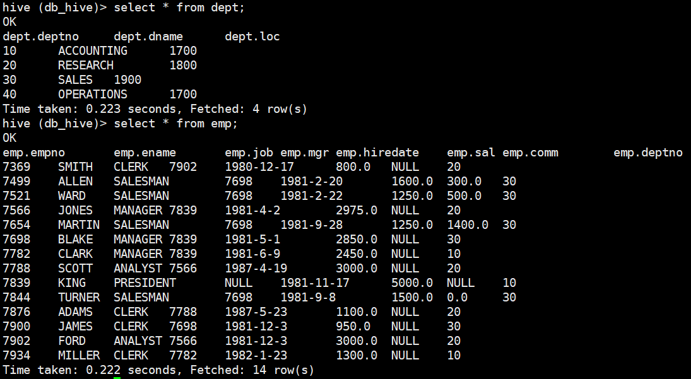
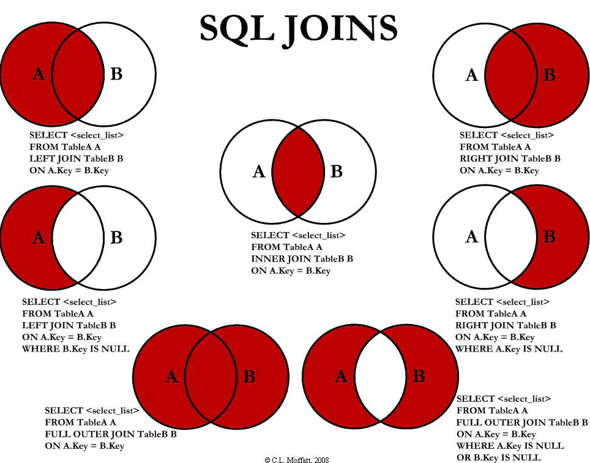
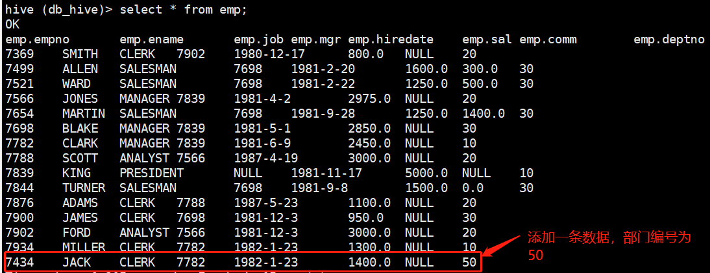

在开始本blog之前，首先应该启动Hadoop和Hive：

```bash
[wzq@hadoop102 hive-3.1.2]$ myhadoop.sh start
[wzq@hadoop102 hive-3.1.2]$ hiveservices.sh start
[wzq@hadoop102 hive-3.1.2]$ hive
hive (default)> create database if not exists db_hive;
hive (default)> use db_hive;
```


## 一、准备数据

编辑两个文本：`dept.txt`和`emp.txt`

dept.txt：

```
10,ACCOUNTING,1700
20,RESEARCH,1800
30,SALES,1900
40,OPERATIONS,1700
```

emp.txt：

```bash
7369,SMITH,CLERK,7902,1980-12-17,800.00,,20
7499,ALLEN,SALESMAN,7698,1981-2-20,1600.00,300.00,30
7521,WARD,SALESMAN,7698,1981-2-22,1250.00,500.00,30
7566,JONES,MANAGER,7839,1981-4-2,2975.00,,20
7654,MARTIN,SALESMAN,7698,1981-9-28,1250.00,1400.00,30
7698,BLAKE,MANAGER,7839,1981-5-1,2850.00,,30
7782,CLARK,MANAGER,7839,1981-6-9,2450.00,,10
7788,SCOTT,ANALYST,7566,1987-4-19,3000.00,,20
7839,KING,PRESIDENT,,1981-11-17,5000.00,,10
7844,TURNER,SALESMAN,7698,1981-9-8,1500.00,0.00,30
7876,ADAMS,CLERK,7788,1987-5-23,1100.00,,20
7900,JAMES,CLERK,7698,1981-12-3,950.00,,30
7902,FORD,ANALYST,7566,1981-12-3,3000.00,,20
7934,MILLER,CLERK,7782,1982-1-23,1300.00,,10
```

在Hive中创建两个表：

```bash
hive (db_hive)> create table dept(
              > deptno int,
              > dname string,
              > loc int)
              > row format delimited fields terminated by ',';
hive (db_hive)> create table emp(
              > empno int,
              > ename string,
              > job string,
              > mgr int,
              > hiredate string,
              > sal double,
              > comm double,
              > deptno int)
              > row format delimited fields terminated by ',';  
```

使用load装载数据到两个表：

```bash
hive (db_hive)> load data local inpath '/opt/module/hive-3.1.2/datas/dept.txt'
              > into table dept;
hive (db_hive)> load data local inpath '/opt/module/hive-3.1.2/datas/emp.txt'
              > into table emp;
```



## 二、DML查询

查询的语法：

```sql
select [all | distinct] 
	字段1,字段2,....
from 表名
[where where的条件]
[group by 某个字段]
[order by 某个字段]
[cluster by 某个字段
	| [distribute by 某个字段] [sort by 某个字段]
]
[limit number]
```

和`SQL`很像，也具有SQL的一些特点：

- 对大小写不敏感
- 可以写在一行或多行
- 关键字不能被缩写也不能分行
- 各子句一般分行写

### 1、基本查询

#### 1.1 全表或指定列查询

```sql
# 全表查询
select * from emp;

# 指定的列
select ename,sal from emp;
```

#### 1.2 列别名

可以在某个字段后加：`as 别名`起一个别名，当然`as`可以省略，比如：

```sql
select ename as name from emp;
# 等价于
select ename name from emp;
```

#### 1.3 算术运算符

| 运算符 | 描述           |
| ------ | -------------- |
| A+B    | A和B相加       |
| A-B    | A减去B         |
| A*B    | A乘B           |
| A/B    | A除B           |
| A%B    | A对B取余       |
| A&B    | A和B按位取与   |
| A\|B   | A和B按位取或   |
| A^B    | A和B按位取异或 |
| ~A     | A按位取反      |


比如我们可以使用`A+B` 给每个员工的薪水上浮1000：

```sql
select 
    ename as name,
    sal+1000 as sal
from emp;
```


#### 1.4 常用函数

```sql
# 求总共有多少条记录（count）
select count(*) from emp;
# 求工资最大值（max）
select max(sal) from emp;
# 求工资最小值（min）
select min(sal) from emp;
# 求工资的总和（sum）
select sum(sal) from emp;
# 求工资的平均（avg）
select avg(sal) from emp;
```


#### 1.5 Limit语句

使用`limit`可以限制返回的行数，比如返回前5行：

```sql
select ename,sal from emp limit 5;
```

#### 1.6 比较运算符

| 操作符                     | 支持的数据类型 | 描述                                                         |
| -------------------------- | -------------- | ------------------------------------------------------------ |
| A=B                        | 基本数据类型   | 如果 A 等于 B 则返回 TRUE，反之返回 FALSE                    |
| A<=>B                      | 基本数据类型   | 如果 A 和 B 都为 NULL，则返回 TRUE，如果一边为 NULL， 返回 False |
| A<>B, A!=B                 | 基本数据类型   | A 或者 B 为 NULL 则返回 NULL；如果 A 不等于 B，则返回 TRUE，反之返回 FALSE |
| A<B                        | 基本数据类型   | A 或者 B 为 NULL，则返回 NULL；如果 A 小于 B，则返回 TRUE，反之返回 FALSE |
| A<=B                       | 基本数据类型   | A 或者 B 为 NULL，则返回 NULL；如果 A 小于等于 B，则返 回 TRUE，反之返回 FALSE |
| A>B                        | 基本数据类型   | A 或者 B 为 NULL，则返回 NULL；如果 A 大于 B，则返回 TRUE，反之返回 FALSE |
| A>=B                       | 基本数据类型   | A 或者 B 为 NULL，则返回 NULL；如果 A 大于等于 B，则返 回 TRUE，反之返回 FALSE |
| A  [NOT]  BETWEEN  B AND C | 基本数据类型   | 如果 A，B 或者 C 任一为 NULL，则结果为 NULL。如果 A 的 值大于等于 B 而且小于或等于 C，则结果为 TRUE，反之为 FALSE。 如果使用 NOT 关键字则可达到相反的效果。 |
| A IS NULL                  | 所有数据类型   | 如果 A 等于 NULL，则返回 TRUE，反之返回 FALSE                |
| A IS NOT NULL              | 所有数据类型   | 如果 A 不等于 NULL，则返回 TRUE，反之返回 FALSE              |
| IN(数值 1,  数值 2)        | 所有数据类型   | 使用 IN 运算显示列表中的值                                   |
| A [NOT] LIKE B             | STRING 类型    | B 是一个 SQL 下的简单正则表达式，也叫通配符模式，如 果 A 与其匹配的话，则返回 TRUE；反之返回 FALSE。B 的表达式 说明如下：‘x%’表示 A 必须以字母‘x’开头，‘%x’表示 A 必须以字母’x’结尾，而‘%x%’表示 A 包含有字母’x’,可以 位于开头，结尾或者字符串中间。如果使用 NOT 关键字则可达到 相反的效果。 |
| A RLIKE B, A REGEXP B      | STRING 类型    | B  是基于 java 的正则表达式，如果 A 与其匹配，则返回TRUE；反之返回 FALSE。匹配使用的是 JDK 中的正则表达式接口实现的，因为正则也依据其中的规则。例如，正则表达式必须和 |

#### 1.7 逻辑运算符（and/or/not）

| 操作符 | 含义   |
| ------ | ------ |
| AND    | 逻辑并 |
| OR     | 逻辑或 |
| NOT    | 逻辑否 |

#### 1.8 where语句

使用`where`语句可以配合上面的比较和逻辑运算符，进行过滤，比如：

```sql
# 查出工资等于5000的员工
select * from emp where sal = 5000;
# 查询工资在500到1000的员工
select * from emp where sal between 500 and 1000;
select * from emp where sal >= 500 and sal <= 1000;
# 查询comm字段为空的员工
select * from emp where comm is null;
# 查询工资是1500或5000的员工信息
select * from emp where sal in (1500,5000);
select * from emp where sal = 1500 or sal = 5000;
# 查询工资大于1000，部门是30
select * from emp where sal > 1000 and deptno=30;
# 查询工资大于1000，或者部门是30
select * from emp where sal > 1000 or deptno = 30;
# 查询除了20部门和30部门意外的员工信息
select * from emp where deptno not in (30,20);
```


#### 1.9 Like和RLike

使用`Like`字段选择类似的值，有两个特殊的字符：

- `_`代表一个字符
- `%`代表0个或多个字符

demo：

```sql
# 查找名字以A开头的员工信息
select ename from emp where ename like 'A%';
# 查找名字第二个是A的员工信息
select ename from emp where ename like '_A%';
# 查找名字中包含A的员工信息
select ename from emp where ename like '%A%';
```


使用`RLike`后面可以跟正则表达式，demo：

```sql
# 查找名字中包含A的员工信息
select ename from emp where ename rlike '[A]'
```


### 2、分组查询

#### 2.1 Group By语句

`group by`语句会按照一个或多个字段结果进行分组，然后对每个组执行聚合操作

```sql
# 计算每个emp表每个部门的平均工资
select deptno,avg(sal) from emp group by deptno;
# 计算每个部门中每个岗位的最高薪水
select deptno,max(sal) from emp group by deptno;
```


#### 2.2 Having语句

`Having`与`Where`的不同：

- where后面不能写分组函数，而Having后面可以使用分组函数
- having只用于group by分组统计语句

```sql
# 求emp表每个部门平均薪资大于2000的部门
select 
    deptno,avg(sal) as avg_sal
from emp
group by deptno
having avg_sal > 2000;
```


### 3、Join语句

`Join`语句分为以下七种：



> 在演示之前，为了有效的区分，在emp表中添加了一条数据：
>
> 


下面是演示：**根据员工表和部门表中部门编号相等，查询员工编号、员工姓名、部门编号和部门名称**

```sql
# 等值join，内连接：两个表都有的
select
    e.empno,
    e.ename,
    d.deptno,
    d.dname
from emp e
join dept d
on e.deptno = d.deptno;

# 左外连接：左表数据全都要
select
    e.empno,
    e.ename,
    e.deptno,
    d.dname
from emp e
left join dept d
on e.deptno = d.deptno;

# 右外连接：右表数据全都要
select
    e.empno,
    e.ename,
    d.deptno,
    d.dname
from emp e
right join dept d
on e.deptno = d.deptno;

# 满外连接：所有的数据都有
select
    e.empno,
    e.ename,
    nvl(d.deptno,e.deptno),
    d.dname
from emp e
full join dept d
on e.deptno = d.deptno;

# 左连接：左表独有数据
select
    e.empno,
    e.ename,
    nvl(d.deptno,e.deptno),
    d.dname
from emp e
left join dept d
on e.deptno = d.deptno
where d.deptno is null;

# 右连接：右表独有数据
select
    e.empno,
    e.ename,
    nvl(d.deptno,e.deptno),
    d.dname
from emp e
right join dept d
on e.deptno = d.deptno
where e.deptno is null;

# 笛卡尔积：两个表所有的组合
select empnp,dname from emp,dept;
```


### 4、排序 order by

#### 4.1 全局排序

- `asc`：默认，升序
- `desc`：降序

```sql
# 按工资升序
select ename,sal from emp order by sal;
# 按工资降序
select ename,sal from emp order by sal desc;
```


#### 4.2 按照别名排序

```sql
# 按照员工薪水的2倍排序
select ename,sal*2 twosal from emp order by twosal;
```


#### 4.3 多个列排序

```sql
# 按照部门和工资升序排序
select ename,deptno,sal from emp order by deptno,sal;
```


#### 4.4 每个Reduce内部排序 Sort by

对于大规模的数据集`order by`的效率非常低，在很多情况下，并不需要全局排序，这时候就可以使用`sort by`，它为每个`reducer`产生一个排序文件，每个`reducer`内部排序，对全局结果来说不是排序

**设置reducer个数**

```bash
hive (db_hive)> set mapreduce.job.reduces=3;
```


**根据部门编号降序查看员工信息：**

```sql
select * from emp sort by deptno desc;
```


## 参考资料

- 尚硅谷Hive学习视频
- [Apache Hive官网](https://hive.apache.org/)
- https://cwiki.apache.org/confluence/display/Hive/LanguageManual+Select
