在开始本blog之前，首先应该启动Hadoop和Hive：

```bash
[wzq@hadoop102 hive-3.1.2]$ myhadoop.sh start
[wzq@hadoop102 hive-3.1.2]$ hiveservices.sh start
[wzq@hadoop102 hive-3.1.2]$ hive
hive (default)> create database if not exists db_hive;
hive (default)> use db_hive;
```

## 一、分区表:star:


分区表实际上就是把一个表在HDFS上的文件建立独立的文件夹，每个文件夹对应表的一个分区；相当于把一个大数据集分割成了许多小数据集，这样做可以把数据管理的很有条理。并且在使用`where`查询并且指定分区的时候，查询效率也会增加很多。


创建分区表的语法：

```sql
create table 表(
	字段名 数据类型,...
)
partitioned by (字段 数据类型)
row format delimited fields terminated by ',';
```


### 1、基本操作

**准备数据：**

```bash
[wzq@hadoop102 datas]$ vim dept1.txt
10,ACCOUNTING,1700
20,RESEARCH,1800
[wzq@hadoop102 datas]$ vim dept2.txt
30,SALES,1900
40,OPERATIONS,1700
[wzq@hadoop102 datas]$ vim dept3.txt
50,TEST,2000
60,DEV,1900	
```

**创建一个分区表：**期望以日期的形式进行分区

```sql
create table dept_par(
    deptno int,dname string,loc int
)
partitioned by (day string)
row format delimited fields terminated by ',';
```

**使用load上传数据：**注意，上传数据的时候一定要指定分区：

```bash
hive (db_hive)> load data local inpath '/opt/module/datas/dept1.txt' into table dept_par
              > partition(day='2022-3-19');
hive (db_hive)> load data local inpath '/opt/module/datas/dept2.txt' into table dept_par
              > partition(day='2022-3-20');
hive (db_hive)> load data local inpath '/opt/module/datas/dept3.txt' into table dept_par
              > partition(day='2022-3-21');              
```

这时候查看`hdfs`上的数据：

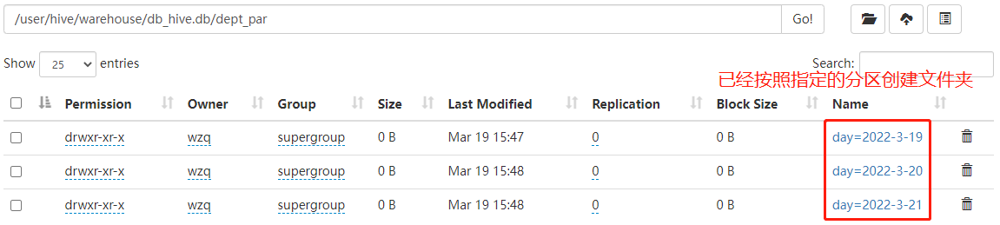


也可以使用`select`查询一下这个表：

```sql
select * from dept_par;
```

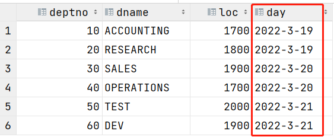

可以看到啊，我们指定的`partition`字段也出现在了查询结果里面，所以我们也可以直接指定分区查询数据：

```sql
select * from dept_par where day = '2022-3-19';
```

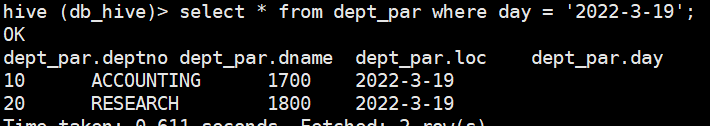


### 2、增加分区

增加单个分区：

```sql
alter table dept_par add partition(day='2022-3-22');
```

增加多个分区：（注意两个partition中间是空格）

```sql
alter table dept_par add partition(day='2022-3-23') partition(day='2022-3-24');
```


### 3、删除分区

删除单个分区：

```sql
alter table dept_par drop partition(day='2022-3-22');
```

删除多个分区：（注意两个partition中间是逗号）

```sql
alter table dept_par drop partition(day='2022-3-23'),partition(day='2022-3-24');
```


### 4、查看分区表信息

查看分区表有多少分区：

```bash
hive (db_hive)> show partitions dept_par;
```

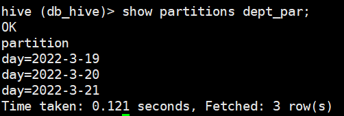

查看分区表结构：

```bash
hive (db_hive)> desc formatted dept_par;
```

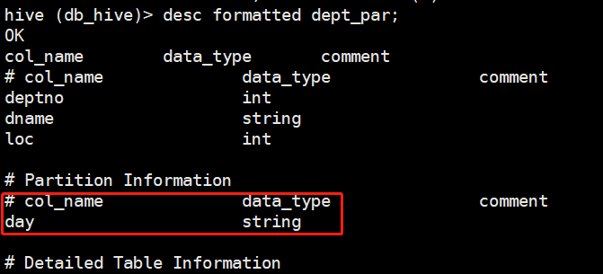


### 5、二级分区

二级分区也就是说，我们可以在一个文件夹下再弄好多个文件夹，做法很简单，只需要在建表的时候`partitioned by()`多加一个字段就好了


**创建一个二级分区表：**

```sql
create table dept_par2(
    deptno int,dname string,loc int
)
partitioned by(day string,hour string)
row format delimited fields terminated by ',';
```


**加载数据到二级分区：**

```sql
load data local inpath '/opt/module/datas/dept1.txt' into table dept_par2
partition(day='2022-3-19',hour='16');
load data local inpath '/opt/module/datas/dept2.txt' into table dept_par2
partition(day='2022-3-19',hour='17');
load data local inpath '/opt/module/datas/dept3.txt' into table dept_par2
partition(day='2022-3-19',hour='18');
```

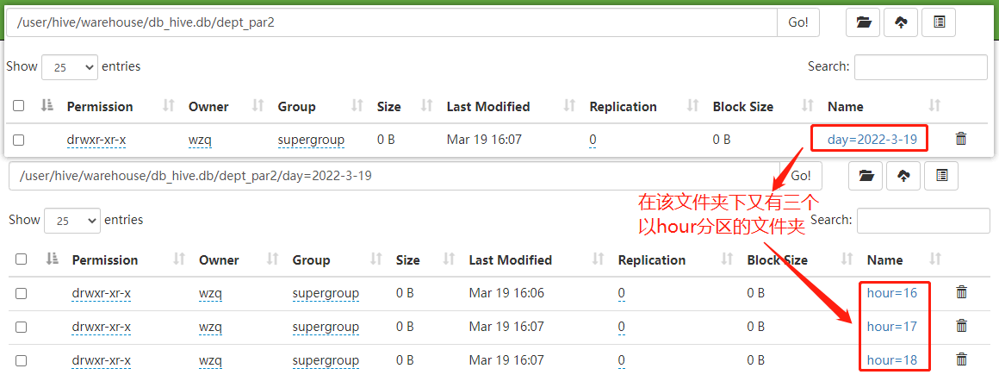

查询一下该表：

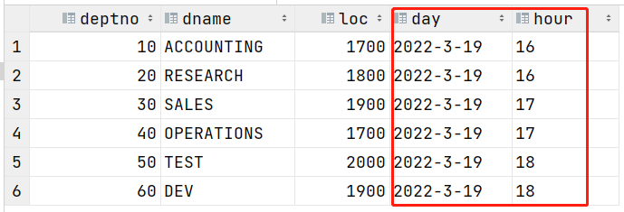

可以发现这两个字段也被添加了表里面


> 那按照在partitioned by后面添加字段的方式，是不是也可以创建三级分区呢？
>
> 答案是可以的，理论上创建多少级分区都是可以的，读者可以自己尝试一下，这里就不贴出代码了！


### 6、加载数据到分区表的方法

#### 方式一：上传数据后修复

我们直接使用`hdfs`的命令行在`dept_par`表的存放目录创建一个文件夹，然后在这个文件夹上put一些数据：

```bash
[wzq@hadoop102 datas]$ hadoop fs -mkdir -p /user/hive/warehouse/db_hive.db/dept_par/day=2022-3-22
[wzq@hadoop102 datas]$ hadoop fs -put dept1.txt /user/hive/warehouse/db_hive.db/dept_par/day=2022-3-22
```

这时候在`hdfs`上是有数据的，我们使用`select`查看一下：

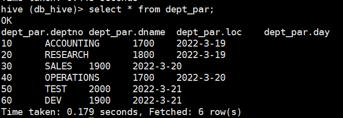

没有我们自己上传的数据，这时候如果想让分区表和我们上传的数据取得关联，可以使用这个命令：

```bash
hive (db_hive)> msck repair table dept_par
```

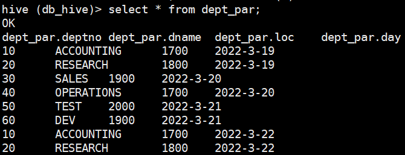

这时候已经填上了

#### 方式二：上传数据后添加分区

当然我们也可以使用`alter`语句添加：

```sql
alter table dept_par add partition(day='2022-3-19');
```


### 7、动态分区:star:

动态分区，我们不用手动指定`partition`字段，数据库会根据我们分区字段的值将数据插入到对应的分区中

关于动态分区有几个参数：

| Configuration property                     | Default  | Note                                                         |
| :----------------------------------------- | :------- | :----------------------------------------------------------- |
| `hive.exec.dynamic.partition`              | `true`   | Needs to be set to `true` to enable dynamic partition inserts |
| `hive.exec.dynamic.partition.mode`         | `strict` | In `strict` mode, the user must specify at least one static partition in case the user accidentally overwrites all partitions, in `nonstrict` mode all partitions are allowed to be dynamic |
| `hive.exec.max.dynamic.partitions.pernode` | 100      | Maximum number of dynamic partitions allowed to be created in each mapper/reducer node |
| `hive.exec.max.dynamic.partitions`         | 1000     | Maximum number of dynamic partitions allowed to be created in total |
| `hive.exec.max.created.files`              | 100000   | Maximum number of HDFS files created by all mappers/reducers in a MapReduce job |
| `hive.error.on.empty.partition`            | `false`  | Whether to throw an exception if dynamic partition insert generates empty results |

如果要开启动态分区，我们需要做的就是设置`hive.exec.dynamic.partition.mode=nonstrict`，即设置动态分区为**不严格模式**，其他参数可以不用管

**设置为非严格模式：**

```bash
hive (db_hive)> set hive.exec.dynamic.partition.mode=nonstrict;
```


操作一下，在之前的blog中，有个`dept`表，我们按照`dept`表的第一个字段`deptno`作为分区字段实验一下动态分区：

```sql
create table dept_par_by_deptno(
    dname string,loc int
)
partitioned by (deptno int)
row format delimited fields terminated by ',';
```

向该表插入数据：

```sql
insert into table dept_par_by_deptno partition(deptno)
select dname,loc,deptno from dept;
```

> **Note：分区字段必须写在select的最后一个！！！**

在`hive 3.x`版本以后使用`insert`向分区表插入数据可以不加`partition(deptno)`，所以上面的sql可以写为：

```sql
insert into table dept_par_by_deptno
select dname,loc,deptnp from dept;
```

效果：

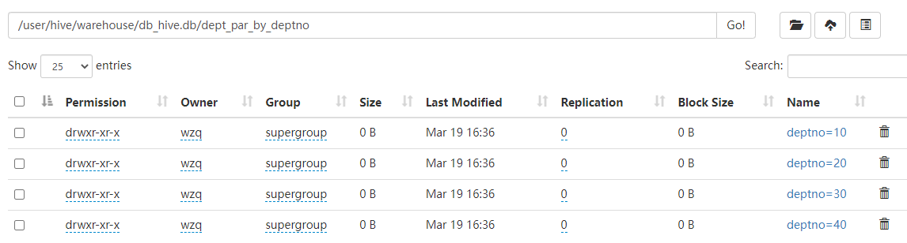


## 二、分桶表

分区针对的是数据的存储路径，分桶针对的是数据文件，它在处理一组数据的时候，可以按照我们指定的`桶数`，利用哈希为我们相应桶数的文件

### 1、基本操作

**准备数据：**

```bash
[wzq@hadoop102 datas]$ vim student.txt
1001,ss1
1002,ss2
1003,ss3
1004,ss4
1005,ss5
1006,ss6
1007,ss7
1008,ss8
1009,ss9
1010,ss10
1011,ss11
1012,ss12
1013,ss13
1014,ss14
1015,ss15
1016,ss16
```


**创建一张分桶表：**

```sql
create table stu_buck(
    id int, name string
)
clustered by(id)
into 4 buckets
row format delimited fields terminated by ',';
```

**查看表结构：**

```bash
hive (db_hive)> desc formatted stu_buck;
```

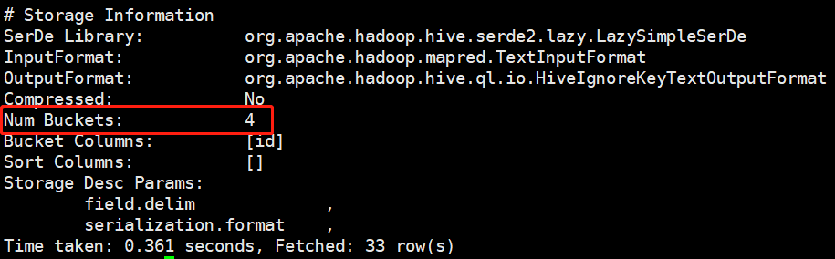


**使用load导入数据：**

```sql
load data local inpath '/opt/module/datas/student.txt' into table stu_buck;
```

> 注意！这里如果Yarn把MR任务交给Hadoop102，那么就会顺利执行，但是如果分配给了其他主机的时候，就会报错了，因为其他主机没有local的student.txt文件
>
> 有两个方法解决报错：
>
> - 把student.txt文件上传到hdfs，使用load不加local，直接从hdfs导入数据
> - 把student.txt分发到其他hadoop主机

这时候就可以看见4个桶了：

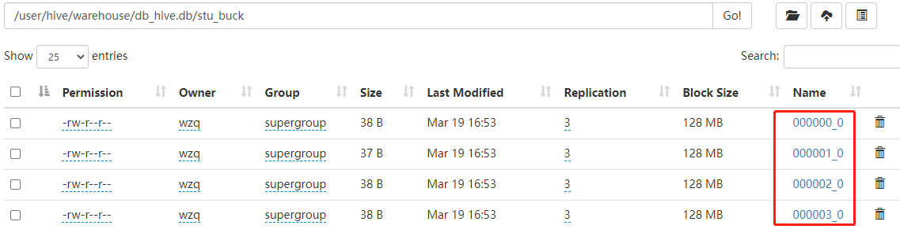

这四个文件是按照`id`字段去哈希分配来的：

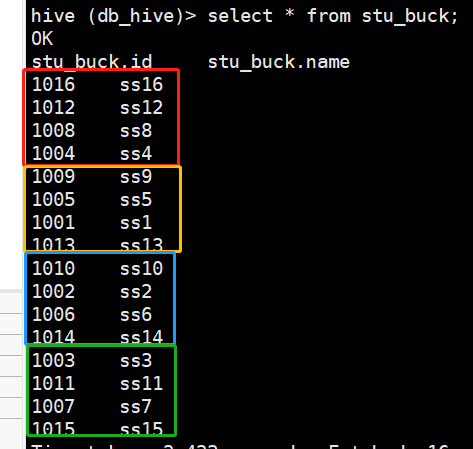

### 2、抽样查询

对于一个非常大的数据集，有时候希望得到的是一个具有代表性的数据集，而不是全部数据，于是Hive可以通过对表抽样来满足这个需求：

格式：

```sql
tablesample(bucket x out of y on 字段)
```

`x<y`，例子：

```sql
select * from stu_buck tablesample(bucket 1 out of 4 on id);
```

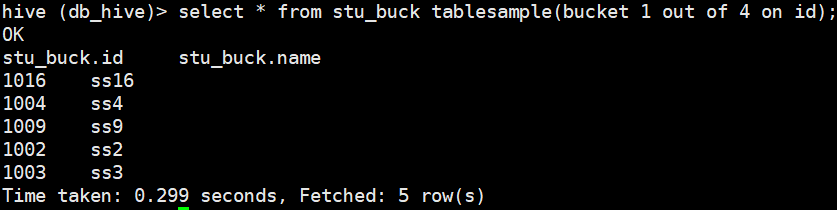

## 参考资料

- 尚硅谷Hive学习视频
- [Apache Hive官网](https://hive.apache.org/)
- https://cwiki.apache.org/confluence/display/Hive/LanguageManual+Select
