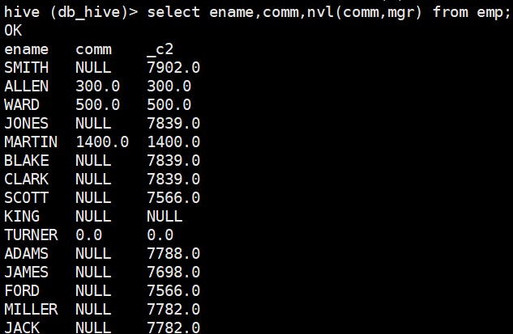
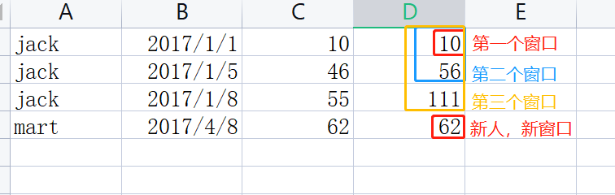
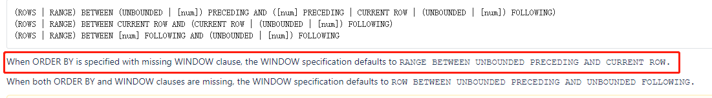
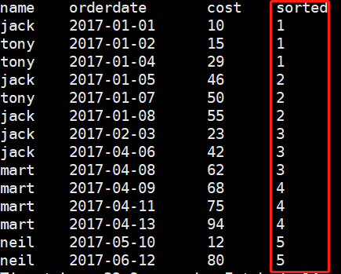
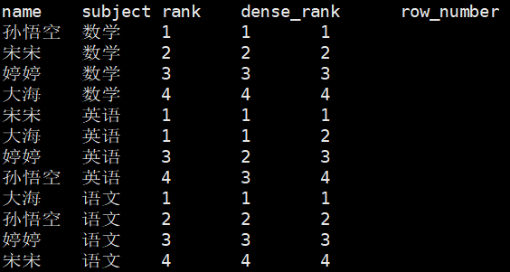
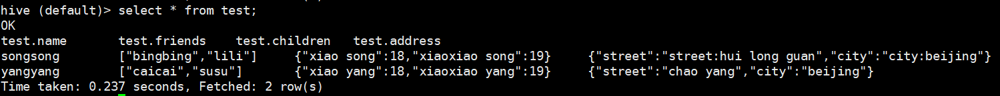

在开始本blog之前，首先应该启动Hadoop和Hive：

```bash
[wzq@hadoop102 hive-3.1.2]$ myhadoop.sh start
[wzq@hadoop102 hive-3.1.2]$ hiveservices.sh start
[wzq@hadoop102 hive-3.1.2]$ hive
hive (default)> create database if not exists db_hive;
hive (default)> use db_hive;
```


## 一、系统内置函数


**查看系统自带函数：**`hive 3.x`有289个内置函数

```bash
hive (db_hive)> show functions;
```

**可以通过`desc function 函数`可以查看函数的用法：**

```bash
hive (db_hive)> desc function upper;
OK
tab_name
upper(str) - Returns str with all characters changed to uppercase
Time taken: 0.037 seconds, Fetched: 1 row(s)
```

**详细显示函数用法：**

```bash
hive (db_hive)> desc function extended upper;
OK
tab_name
upper(str) - Returns str with all characters changed to uppercase
Synonyms: ucase
Example:
  > SELECT upper('Facebook') FROM src LIMIT 1;
  'FACEBOOK'
Function class:org.apache.hadoop.hive.ql.udf.generic.GenericUDFUpper
Function type:BUILTIN
Time taken: 0.028 seconds, Fetched: 7 row(s)
```


`Hive`提供的内置函数有三类：

| 类型 | 描述     |
| ---- | -------- |
| UDF  | 一进一出 |
| UDAF | 多进一出 |
| UDTF | 一进多出 |

> 这里的`一、多`指的是数据的行数


## 二、常用内置函数

### 0、函数总结

下表列出来本blog用到的Hive内置函数，以及怎么使用，后面的小章节有更具体的例子去演示

| 函数                                       | 描述                                                         | 例子                                                        |
| ------------------------------------------ | ------------------------------------------------------------ | ----------------------------------------------------------- |
| `nvl(value,default_value)`                 | 为空字段复制                                                 | nvl(value,default_value)，如果value=null，返回default_value |
| `case when then else end`                  | 类似`if else`判断，传入一个case，当值为case的时候赋值，否则赋其他值 | case 字段 when '男' then 1 else 0 end                       |
| `concat(str1,str2,...)`                    | 拼接传给concat的字符串，可以传递多个参数                     | concat('a','-','b') => a-b                                  |
| `concat_ws(sep,[string or array(string)])` | 第一个参数为分隔符，后面可以传递多个string或者一个string数组，返回拼接好的字符串 | concat_ws('-',array('a','b')) => a-b                        |
| `collect_set(col)`                         | 传递一个列，去重汇总产生Array                                | collect_set('男','女','男') => 男,女                        |
| `collect_list(col)`                        | 传递一个列，不去重汇总产生Array                              | collect_list('男','女','男') => 男,女,男                    |
| `explode(a)`                               | 炸裂函数，把列中复杂的Array或Map拆成多行                     | explode(array('a','b')) => a,b                              |
| `lateral view`                             | 侧写表，和explode一起使用                                    |                                                             |
| `split(str,regex)`                         | 以字符或正则表达式regex，分割str                             | split('a-b-c','-') => a,b,c                                 |
| `substring(str,pso[,len])`                 | 截取字符串                                                   | substring('abc',0,2) => ab                                  |

> Note：还有一些关于日期、数值等其他的函数放在第5章后面以表格的形式呈现！

### 1、nvl 空字段赋值

在之前的blog有一张员工表，使用nvl查询comm字段，如果comm字段为空，则使用mgr字段代替：

```sql
select ename,comm,nvl(comm,mgr) from emp;
```




### 2、case when then else end

准备数据，建立表并导入数据：

```bash
[wzq@hadoop102 datas]$ vim emp_sex.txt
悟空	A	男
大海	A	男
宋宋	B	男
凤姐	A	女
婷姐	B	女
婷婷	B	女
...
# 在hive中建表并load
hive (db_hive)> create table emp_sex( name string,
              > dept_id string, sex string)
              > row format delimited fields terminated by "\t";
hive (db_hive)> load data local inpath '/opt/module/datas/emp_sex.txt' into table emp_sex;              
```


**需求：**求出不同部门男女各多少人，结果如下所示：

| dept_id | 男   | 女   |
| ------- | ---- | ---- |
| A       | 2    | 1    |
| B       | 1    | 2    |

首先肯定是要`group by`分组的，然后只要

```sql
select
    dept_id,
    sum(case sex when '男' then 1 else 0 end) male,
    sum(Case sex when '女' then 1 else 0 end) female
from emp_sex
group by dept_id;
```


### 3、行转列

上面表格的`concat、concat_ws、collect_set、collect_list`都属于行转列函数，下面看一个例子：

准备数据，建立表并导入数据：

```bash
[wzq@hadoop102 datas]$ vim person_info.txt
孙悟空	白羊座	A
大海	射手座	A
宋宋	白羊座	B
猪八戒	白羊座	A
凤姐	射手座	A
苍老师	白羊座	B
...
# 创建表装载数据
hive (db_hive)> create table person_info( name string, constellation string, blood_type string)
              > row format delimited fields terminated by "\t";
hive (db_hive)> load data local inpath '/opt/module/datas/person_info.txt' into table person_info;           
```


**需求：**把星座和血腥一样的人归类到一起

| 星座和血型 | 人            |
| ---------- | ------------- |
| 射手座,A   | 大海-凤姐     |
| 白羊座,A   | 孙悟空-猪八戒 |
| 白羊座,B   | 宋宋-苍老师   |

 

这个需求首先要将星座和血型组合在一起，然后根据组合的字段进行分组，分组完成再拼接有多少人属于这两个星座

拼接星座和人：

```sql
select
    name,
    concat_ws(',',constellation,blood_type) str
from person_info;
```

嵌套：

```sql
select
    t1.str,
    concat_ws('-',collect_list(t1.name))
from 
(
    select
        name,
        concat_ws(',',constellation,blood_type) str
    from person_info;
) t1
group by t1.str;
```

### 4、列转行

准备数据，建表导入数据：

```bash
[wzq@hadoop102 datas]$ vim movie_info.txt;
《疑犯追踪》	悬疑,动作,科幻,剧情
《Lie to me》	悬疑,警匪,动作,心理,剧情
《战狼 2》	战争,动作,灾难
...
hive (db_hive)> create table movie_info(
              > movie string,category string)
              > row format delimited fields terminated by '\t';
hive (db_hive)> load data local inpath '/opt/module/datas/movie_info.txt' into table movie_info;             
```

**需求：**将电影分类中的数组数据展开，结果如下：

```
《疑犯追踪》	悬疑
《疑犯追踪》	动作
《疑犯追踪》	科幻
《疑犯追踪》	剧情
《Lie to me》	悬疑
《Lie to me》	警匪
《Lie to me》	动作
《Lie to me》	心理
《Lie to me》	剧情
《战狼 2》	战争
《战狼 2》	动作
《战狼 2》	灾难
```

这个需求首先要做的就是生成category字段拆分成行的侧写表，随后拿出这些数据就好了：

```sql
select
    movie,
    category_name
from movie_info
lateral view explode(split(category,',')) movie_info_tmp as category_name;
```


### 5、窗口函数（开窗函数）:star:

这个部分的内容很重要！**绝对是利器！**

开窗函数的关键字是`over()`，意思就是开一个窗口呗，这个数据窗口大小可能会随着行的变化而变化，

`over`开窗函数有操作行的语句：

```
current row: 当前行
n preceding: 往前n行数据
n following: 往后n行数据
unbounded: 起点
	unbounded preceding: 表示从前面的起点
	unbounded following: 表示到后面的终点
lag(col,n,default_val): 往前第n行数据
lead(col,n,default_val): 往后第n行数据
ntile(n): 把有序窗口的行分发到指定数据的组中，各个组有编号，编号从1开始，
          对于每一行ntile返回此行所属组的编号，n必须为int类型
```


看着挺头疼的，先不要管上面的文件，通过例子看一下这个函数怎么用吧：准备数据，创建表并写入数据：

```bash
[wzq@hadoop102 datas]$ vim business.txt
jack,2017-01-01,10
tony,2017-01-02,15
jack,2017-02-03,23
tony,2017-01-04,29
jack,2017-01-05,46
jack,2017-04-06,42
tony,2017-01-07,50
jack,2017-01-08,55
mart,2017-04-08,62
mart,2017-04-09,68
neil,2017-05-10,12
mart,2017-04-11,75
neil,2017-06-12,80
mart,2017-04-13,94
...
hive (db_hive)> create table business(
              > name string,orderdate string,cost int)
              > row format delimited fields terminated by ',';
hive (db_hive)> load data local inpath '/opt/module/datas/business.txt' into table business;              
```


这一部分共有五个需求：

- 查询在 2017 年 4 月份购买过的顾客及总人数
- 查询顾客的购买明细及月购买总额
- 上述的场景, 将每个顾客的 cost 按照日期进行累加
- 查询每个顾客上次的购买时间
- 查询前 20%时间的订单信息


接下来逐个击破：

#### 5.1 查询在 2017 年 4 月份购买过的顾客及总人数

这个需求上来我想到的是查询到所有在`2017-04`买过东西的人

```sql
select
    name
from business
where substring(orderdate,0,7)='2017-04'
group by name;
```

把这些人查出来，再加个`count(*)`，数一下这些人在`2017-04`买了几次东西：

```sql
select
    name,
    count(*)
from business;    
where substring(orderdate,0,7)='2017-04'
group by name;
```

但是这时候得到的结果是：

```
jack	1
mart	4
```

我们期望第二列是总人数，而不是每个人都买了几次，所以可以在count(*)后面加个**窗口函数**

这个窗口里面不用加任何的内容，表示计算共有多少人买：

```sql
select
    name,
    count(*) over()
from  business
where substring(orderdate,0,7)='2017-04'
group by name;
```

这样就得到了我们想要的数据：

```
jack	2
mart	2
```


#### 5.2 查询顾客的购买明细及月购买总额

月购买总额，需要按月分组，然后计算所有用户这一个月总共花费了多少钱


这里我们可以用开窗函数计算每个月的总额，首先是一个`sum(cost)`表示计算所有cost的花费，但是我们要把`所有`给界定一个范围，开个窗户，这个窗户用`over()`开，在`over()`里面指定按照月份分区，那么`sum()`就不计算所有了，而是计算这个窗口里面所有的值

```sql
select
    name,
    orderdate,
    cost,
    sum(cost) over(partition by month(orderdate))
from business;
```

结果：

```
jack	2017-01-01	10	205
jack	2017-01-08	55	205
tony	2017-01-07	50	205
jack	2017-01-05	46	205
tony	2017-01-04	29	205
tony	2017-01-02	15	205
jack	2017-02-03	23	23
mart	2017-04-13	94	341
jack	2017-04-06	42	341
mart	2017-04-11	75	341
mart	2017-04-09	68	341
mart	2017-04-08	62	341
neil	2017-05-10	12	12
neil	2017-06-12	80	80
```


> 当然这个需求也可以加大难度：计算顾客的购买明细及**每个顾客**的月购买总额
>
> 其实也不难，只需要在over窗口再界定一次窗口大小就好了：
>
> ```sql
> select
>     name,
>     orderdate,
>     cost,
>     sum(cost) over(partition by month(orderdate),name)
> from business;
> ```
>
> 结果：
>
> ```
> jack	2017-01-08	55	111
> jack	2017-01-05	46	111
> jack	2017-01-01	10	111
> tony	2017-01-07	50	94
> tony	2017-01-04	29	94
> tony	2017-01-02	15	94
> jack	2017-02-03	23	23
> jack	2017-04-06	42	42
> mart	2017-04-11	75	299
> mart	2017-04-13	94	299
> mart	2017-04-09	68	299
> mart	2017-04-08	62	299
> neil	2017-05-10	12	12
> neil	2017-06-12	80	80
> ```


#### 5.3 将每个顾客的 cost 按照日期进行累加

因为要计算每个顾客，所以需要在窗口函数中根据name分区

然后就是**按照日期进行累计了**，啥意思？就比如说：

```sql
jack	2017-01-01	10	10	# 看最后一个字段，第一次是本身的值
jack	2017-01-05	46	56  # 46+10
jack	2017-01-08	55	111 # 111+46+10
mart	2017-04-08	62	62  # 不同的人，自己的值
```


那咋开个窗户呢？咋界定范围呢？



如上图所示，需要根据日期进行排序，窗口从第一个日期一直到当前日期，所以SQL就写起来了：

```sql
select 
    name,
    orderdate,
    cost,
    sum(cost) over(partition by name order by orderdate rows between unbounded preceding and current row)
from business;
```

> 其中加了个`order by orderdate`表示窗口按照orderdate排序
>
> `rows between unbounded preceding and current row`表示从起点到当前行
>
> 下图是官网的截图，意思是：如果有order by指定了排序，那么默认从第一行加到当前行，于是：`rows between unbounded ...`可以不加
>
> 
>
> 所以上面的sql可以简写：
>
> ```sql
> select
>     name,
>     orderdate,
>     cost,
>     sum(cost) over(partition by name order by orderdate)
> from business;   
> ```

结果：

```
jack	2017-01-01	10	10
jack	2017-01-05	46	56
jack	2017-01-08	55	111
jack	2017-02-03	23	134
jack	2017-04-06	42	176
mart	2017-04-08	62	62
mart	2017-04-09	68	130
mart	2017-04-11	75	205
mart	2017-04-13	94	299
neil	2017-05-10	12	12
neil	2017-06-12	80	92
tony	2017-01-02	15	15
tony	2017-01-04	29	44
tony	2017-01-07	50	94
```


我们可以再**卷**一点，利用窗口做一些其他事情：

```sql
# 当前行和前一行相加
select
    name,
    orderdate,
    cost,
    sum(cost) over(partition by name order by orderdate rows between 1 preceding and current row)
from business;

# 当前行和前边一行以及后边一行相加
select
    name,
    orderdate,
    cost,
    sum(cost) over(partition by name order by orderdate rows between 1 preceding and 1 following)
from business;    

# 当前行和后面所有行
select
    name,
    orderdate,
    cost,
    sum(cost) over(partition by name order by orderdate rows between current row and unbounded following)
from business;    
```


#### 5.4 查看顾客上次购买的时间

这次就需要使用到`lag()`函数了，这个函数放在`over`开窗前面，里面有三个参数：

`lag(col,n,default_val)`：col代表传递哪一列，n代表往前第n行，default_val代表默认值

```sql
select
    name,
    orderdate,
    cost,
    lag(orderdate,1,orderdate) over(partition by name order by orderdate)
from business;
```

有往前多少行，就有往后多少行的聚合函数：`lead`，他的三个参数和`lag`的三个参数意思一致，不同的是它代表往后的行数

```sql
# 查看顾客下次购买的时间
select
    name,
    orderdate,
    cost,
    lead(orderdate,1,orderdate) over(partition by name order by orderdate)
from business;    
```


#### 5.5 查询前20%时间的订单信息

需要使用到`ntile(n)`：把有序窗口的行分发到指定数据的组中，各个组有编号，编号从1开始，对于每一行ntile返回此行所属组的编号，n必须为int类型

如果我们想查前20%，只需要设置`ntile(5)`就可以了

先把前20%的都标记出来：

```sql
select
    name,
    orderdate,
    cost,
    ntile(5) over(order by orderdate) sorted
from business;
```

可以看到多了一个`sorted`字段，从1到5，



这帮我们划分了五份只需要再挑选出这个字段都为1的部分就可以了：

```sql
select 
    *
from
(
    select
        name,orderdate,cost,
        ntile(5) over(order by orderdate) sorted
    from business
) t1
where t1.sorted = 1;
```


### 6、Rank()函数

排序函数后面要加上开窗函数，有三种RANK：

| 函数           | 描述                         | 例子                |
| -------------- | ---------------------------- | ------------------- |
| `rank()`       | 排序相同时会重复，总数不会变 | 例如：1，1，3       |
| `dense_rank()` | 排序相同时会重复，总数减少   | 例如：1，1，2       |
| `row_number()` | 会根据顺序计算               | 例如：1，2，3，4，5 |


看一个例子，首先造数据，创建表并导入：

```bash
[wzq@hadoop102 datas]$ vim score.txt
孙悟空	语文	87
孙悟空	数学	95
孙悟空	英语	68
大海	语文	94
大海	数学	56
大海	英语	84
宋宋	语文	64
宋宋	数学	86
宋宋	英语	84
婷婷	语文	65
婷婷	数学	85
婷婷	英语	78
...
hive (db_hive)> create table score(
              > name string,subject string,score int)
              > row format delimited fields terminated by '\t';
hive (db_hive)> load data local inpath '/opt/module/datas/score.txt' into table score;
```


**需求：**按照学科分组，分别使用三种函数对成绩进行降序排序

```sql
select
    name,
    subject,
    rank() over(partition by subject order by score desc) rank,
    dense_rank() over(partition by subject order by score desc) dense_rank,
    row_number() over(partition by subject order by score desc) row_number
from score;
```

结果如下：




### 7、常用日期函数

下表总结了常用的日期函数，在表下是对应的练习

| 函数                  | 描述                           |
| --------------------- | ------------------------------ |
| `unix_timestamp()`    | 返回当前或指定时间的时间戳     |
| `from_unixtime()`     | 将时间戳转为日期格式           |
| `current_date()`      | 当前日期                       |
| `current_timestamp()` | 当前日期加时间                 |
| `to_date()`           | 抽取日期部分                   |
| `year()`              | 获取年                         |
| `month()`             | 获取月                         |
| `day()`               | 获取日                         |
| `hour()`              | 获取时                         |
| `minute()`            | 获取分                         |
| `second()`            | 获取秒                         |
| `weekofyear()`        | 当前时间是一年中的第几周       |
| `dayofmonth()`        | 当前时间是一个月中的第几天     |
| `months_between()`    | 两个日期见的月份，前面减后面   |
| `add_months()`        | 日期加减月                     |
| `datediff()`          | 两个日期相差的天数，前面减后面 |
| `date_add()`          | 日期加天数                     |
| `date_sub()`          | 日期减天数                     |
| `last_day()`          | 日期的当月的最后一天           |
| `date_format()`       | 格式化日期                     |

练习：

```sql
# unix_timestamp 返回当前或指定时间的时间戳
select unix_timestamp();
select unix_timestamp("2022-3-21",'yyyy-MM-dd');

# from_unixtime 将时间戳转为日期格式
select from_unixtime(1647850480);

# current_date 当前日期
select current_date;

# current_timestamp 当前的日期加时间
select current_timestamp;

# to_date 抽取日期部分
select to_date('2022-3-21 16:17:18');

# year 获取年
select year('2022-3-21 16:17:18');

# month 获取月
select month('2022-3-21 16:17:18');

# day 获取日
select day('2022-3-21 16:17:18');

# hour 获取时
select hour('2022-3-21 16:17:18');

# minute 获取分
select minute('2022-3-21 16:17:18');

# second 获取秒
select seconde('2022-3-21 16:17:18');

# weekofyear 当前时间是一年中的第几周
select weekofyear('2022-3-21 16:17:18');

# dayofmonth 当前时间是一个月中的第几天
select dayofmonth('2022-3-21 16:17:18');

# months_between 两个日期间的相差几个月
select month_between('2022-3-21','2021-5-15');

# add_months 日期加减月
select add_months('2022-3-21',-3);

# datediff 两个日期间相差的天数
select datediff('2022-3-21','2021-5-15');

# date_add 日期加天数
select date_add('2022-3-21',10);

# date_sub 日期减天数
select date_sub('2022-3-21',-10);

# last_day 日期的当月的最后一天
select last_day('2022-3-35'); # 没有写错，hive会正确处理

# date_format 格式化日期
select date_format('2022-3-21 16:17:18','yyyy/MM/dd HH:mm:ss');
```


### 8、常用取整函数

下表列出了常用的取整函数：

| 函数      | 描述     |
| --------- | -------- |
| `round()` | 四舍五入 |
| `ceil()`  | 向上取整 |
| `floor()` | 向下取整 |

练习：

```sql
# round 四舍五入
select round(3.14);
select round(3.54);

# ceil 向上取整
select ceil(3.14);
select ceil(3.94);

# floor 向下取整
select floor(3.14);
select floor(3.54);
```


### 9、常用字符串操作函数

下表列出了常用的字符串操作函数

| 函数               | 描述                                         |
| ------------------ | -------------------------------------------- |
| `upper()`          | 转大写                                       |
| `lower()`          | 转小写                                       |
| `length()`         | 字符串长度                                   |
| `trim()`           | 前后去空格                                   |
| `lpad()`           | 向左补齐，到指定长度                         |
| `rpad()`           | 向右补齐，到指定长度                         |
| `regexp_replace()` | 使用正则表达式匹配目标字符串，匹配成功后替换 |

练习：

```sql
# upper 转大写
select upper('wzqWTT');

# lower 转小写
select lower('wzqWTT');

# length 长度
select length('wzqwtt');

# trim 前后去空格
select trim('  wzq wtt  ');

# lpad 向左补齐，到指定长度
select lpad('wzq',6,'a');

# rpad 向右补齐，到指定长度
select rpad('wzq',6,'a');

# regexp_replace 匹配字符串后替换
select regexp_replace('2022/3/21','/','-');
```


### 10、集合操作

集合操作常用函数：

| 函数               | 描述                        |
| ------------------ | --------------------------- |
| `size()`           | 集合中元素的个数            |
| `map_keys()`       | 返回map中的key              |
| `map_values()`     | 返回map中的value            |
| `array_contains()` | 判断array中是否包含某个元素 |
| `sort_array()`     | 将array中的元素排序         |

[在之前的`hive数据类型`](http://wzqwtt.club/2022/03/15/hive-shu-ju-lei-xing/)中建立了一张有集合类型的表，拿来用一下：



```sql
# size 集合中的元素的个数
select size(friends) from test;

# map_keys 返回map中的key
select map_keys(children) from test;

# map_values 返回map中的values
select map_values(children) from test;

# array_contains 判断array中是否包含某个元素
select array_contains(friends,'bingbing') from test;

# sort_array 将array中的元素排序
select sort_array(friends) from test;
```


## 参考资料

- 尚硅谷Hive学习视频
- [Apache Hive官网](https://hive.apache.org/)
- https://cwiki.apache.org/confluence/display/Hive/LanguageManual+Select

