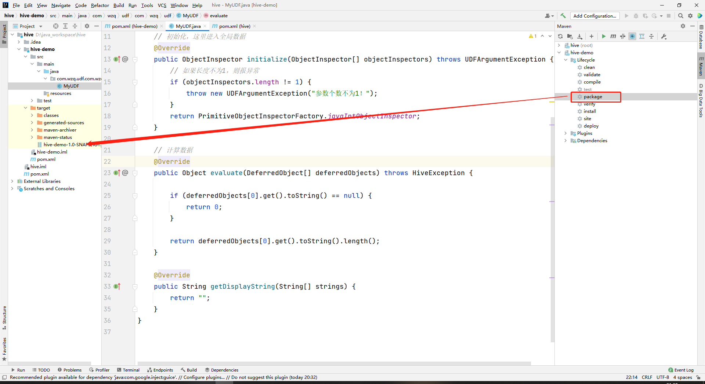

> Hive中自带的有一些函数，但是这些函数有限，不能满足用户的需求，于是Hive允许用户自定义函数


用户自定义函数分为以下三类：

- `UDF(User Defined Function)`：一进一出
- `UDAF(User Defined Aggregation Function)`：用户自定义聚集函数，多进一出，这个过时了！本blog不涉及
- `UDTF(User Defined Table-Generating Function)`：一进多出，比如`lateral view explode`


## 一、自定义函数的步骤

自定义函数有几个步骤，遵循这个步骤就可以实现自定义了：

- 继承Hive提供的类

  - `org.apache.hadoop.hive.ql.udf.generic.GenericUDF`
  - `org.apache.hadoop.hive.ql.udf.generic.GenericUDTF`

- 实现类中的抽象方法，实现完成打jar包并上传到`hive`安装目录下的`lib`目录

- 在hive的命令窗口创建函数：

  ```bash
  # 添加jar包
  add jar 自定义jar包的路径;
  
  # 创建Function，temporary表示添加临时的function
  create [temporary] function [if not exists] 函数名称 "自定义函数的全类名";
  
  # 删除函数
  drop [temporary] function [if exists] 函数名称;
  ```

- 然后就可以执行了


## 二、自定义UDF函数

`UDF`是一进多出，**需求：**可以实现一个计算给定字符串长度的函数，例如：

```bash
hive (default)> select my_len('abc');
4
```

下面开始实现

### 1、创建一个Maven工程

打开idea创建一个Maven工程，打开`pom.xml`，添加以下依赖：

```xml
<dependencies>
    <dependency>
        <groupId>org.apache.hive</groupId>
        <artifactId>hive-exec</artifactId>
        <version>3.1.2</version>
    </dependency>
</dependencies>
```


### 2、创建一个类

创建一个类`MyUDF`，在这个类继承`GenericUDF`，实现它三个方法，这三个方法分别是：

```java
// 初始化方法，这里需要处理全局输入，一般在这里做数据的校验，如果校验不通过就抛出异常
public ObjectInspector initialize(ObjectInspector[] objectInspectors)
    
// 处理数据方法，在这个方法中处理数据
public Object evaluate(DeferredObject[] deferredObjects)

// 这个方法返回一个""就好了，一般用于流程，在后续blog会说到
public String getDisplayString(String[] strings)
```


三个方法都已经知道是什么了，接下来写代码吧！

```java
package com.wzq.udf.com.wzq.udf;

import org.apache.hadoop.hive.ql.exec.UDFArgumentException;
import org.apache.hadoop.hive.ql.metadata.HiveException;
import org.apache.hadoop.hive.ql.udf.generic.GenericUDF;
import org.apache.hadoop.hive.serde2.objectinspector.ObjectInspector;
import org.apache.hadoop.hive.serde2.objectinspector.primitive.PrimitiveObjectInspectorFactory;

public class MyUDF extends GenericUDF {

    // 初始化，这里进入全局数据
    @Override
    public ObjectInspector initialize(ObjectInspector[] objectInspectors) throws UDFArgumentException {
        // 如果长度不为1，则报异常
        if (objectInspectors.length != 1) {
            throw new UDFArgumentException("参数个数不为1！");
        }    
        return PrimitiveObjectInspectorFactory.javaIntObjectInspector;
    }

    // 计算数据
    @Override
    public Object evaluate(DeferredObject[] deferredObjects) throws HiveException {
		// 如果为null，就返回0
        if (deferredObjects[0].get().toString() == null) {
            return 0;
        }

        return deferredObjects[0].get().toString().length();
    }

    @Override
    public String getDisplayString(String[] strings) {
        return "";
    }
}
```

写完以后直接使用`maven`打成jar包，然后上传到hive安装目录的`lib`目录下面：



### 3、添加jar包

在hive窗口中输入添加jar包：

```bash
hive (default)> add jar /opt/module/hive-3.1.2/hive-demo-1.0-SNAPSHOT.jar
```

### 4、创建临时函数关联jar包

```bash
hive (default)> create temporary function my_len as "com.wzq.udf.com.wzq.udf.MyUDF";
```


这样就ok了，测试一下这个函数：

```sql
hive (default)> select my_len("abc");
3
```


## 三、自定义UDTF函数

`UDTF`是一进多出，现在搞两个例子


需求就是给一个字符串，然后再给一个分割符，按照分割符将字符串拆分

首先创建`Maven`工程，导入上面的依赖，然后创建一个函数，这次需要继承`GenericUDTF`类


需要实现这个类的两个方法：但是建议加上`初始化`方法，在初始化方法中可以做输入数据的校验，如果不合格可以直接抛出异常，也可以指定返回数据的列名和列的数据类型

```java
// 初始化方法
public StructObjectInspector initialize(StructObjectInspector argOIs)

// 这个方法最重要，处理输入的数据
public void process(Object[] objects)

// 收尾方法，可以不写
public void close()
```


实现这三个方法就好了：

```java
package com.wzq.udf;

import org.apache.hadoop.hive.ql.exec.UDFArgumentException;
import org.apache.hadoop.hive.ql.metadata.HiveException;
import org.apache.hadoop.hive.ql.udf.generic.GenericUDTF;
import org.apache.hadoop.hive.serde2.objectinspector.ObjectInspector;
import org.apache.hadoop.hive.serde2.objectinspector.ObjectInspectorFactory;
import org.apache.hadoop.hive.serde2.objectinspector.StructObjectInspector;
import org.apache.hadoop.hive.serde2.objectinspector.primitive.PrimitiveObjectInspectorFactory;

import java.lang.reflect.Array;
import java.util.ArrayList;
import java.util.List;

/**
 * 将一个任意分割符的字符串切割成独立的单词
 * 比如：
 * 输入：a,b,c
 * 输出：
 * a
 * b
 * c
 */
public class MyUDTF extends GenericUDTF {

    ArrayList<String> out = new ArrayList<>();

    // 初始化
    @Override
    public StructObjectInspector initialize(StructObjectInspector argOIs) throws UDFArgumentException {

        // 列的别名
        List<String> fieldNames = new ArrayList<>();
        fieldNames.add("word");

        // 输出的数据类型
        List<ObjectInspector> fieldOIs = new ArrayList<>();
        fieldOIs.add(PrimitiveObjectInspectorFactory.javaStringObjectInspector);

        return ObjectInspectorFactory.getStandardStructObjectInspector(fieldNames, fieldOIs);
    }

    // 处理输入数据
    @Override
    public void process(Object[] objects) throws HiveException {

        // 取出数据
        String words = objects[0].toString();
        String reg = objects[1].toString();

        String[] splits = words.split(reg);

        for (String s : splits) {
            // 防止重复数
            out.clear();

            // 添加到ArrayList
            out.add(s);

            // 添加到forward
            forward(out);
        }

    }

    // 收尾方法
    @Override
    public void close() throws HiveException {

    }
}
```

然后就是打jar包啦，上传到hive安装目录的lib目录，接着添加jar，创建临时函数：

```bash
hive (default)> add jar /opt/module/hive-3.1.2/lib/hive-demo-1.0-SNAPSHOT.jar;

hive (default)> create temporary function mysplit as  "com.wzq.udf.MyUDTF";
```

测试：

```bash
hive (default)> select mysplit("a-b-c","-");
OK
word
a
b
c
Time taken: 4.011 seconds, Fetched: 3 row(s)
```


## 参考资料

- 尚硅谷Hive学习视频
- [Apache Hive官网](https://hive.apache.org/)
- https://cwiki.apache.org/confluence/display/Hive/LanguageManual+Select
- https://cwiki.apache.org/confluence/display/Hive/HivePlugins

