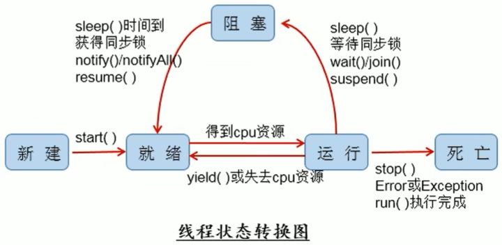

本节所有code都可以在[JUCCode](./JUCCode)中找到

# 一、基本概念

- **程序（Program）：** 是为完成特定任务、用某种语言编写的一组指令的集合。即指一段静态的代码，静态对象。

- **进程（Process）：** 程序的一次执行过程，或是正在运行的一个程序。是一个动态的过程：由他自身产生、存在和消亡的过程（生命周期）。**进程作为资源分配的单位，** 系统在运行时会为每个进程分配不同的内存区域。

- **线程（Thread）：** 进程可以进一步细化为线程，是一个程序内部的一条执行路径。
  
  - 若一个进程同一时间并行执行多个线程，就是支持多线程的
  
  - 线程作为调度的执行的单位，每个线程用于独立的运行栈和程序计数器，线程切换的开销小
  
  - 一个进程中的多个线程共享相同的内存单元/内存地址空间，他们从同一堆中分配对象，可以访问相同的变量和对象。这就使得线程间通信更简便、高效。但多个线程操作共享的系统资源可能就会带来安全的隐患。

在Java中，线程共有以下几种状态（在Thread.State中）：

```java
public enum State {
    NEW,         // 新建
    RUNNABLE,    // 准备就绪
    BLOCKED,     // 阻塞 
    WAITING,     // 随时等待
    TIMED_WAITING, // 过时不候
    TERMINATED;  // 终止
}
```

下图很清晰的展示了线程的几种状态之间的关系：



# 二、线程的创建

## 1、继承Thread类方式

第一种方式创建线程分为以下几步：

- 新建一个类，继承Thread类

- 重写Thread类中的`run()`方法，此线程执行的所有操作都在run方法中

- 创建该类的对象，调用此类的`start()`方法去执行

案例演示：创建一个线程，遍历100以内的所有偶数：

```java
package com.wzq.base;

// 1、创建一个类继承于Thread类的子类
class MyThread extends Thread {

    // 2、重写Thread类中的run()方法
    @Override
    public void run() {
        for (int i = 0; i < 100; i++) {
            if (i % 2 == 0) {
                System.out.println(Thread.currentThread().getName() + ": 偶数" + i);
            }
        }
    }
}

public class ThreadTest {
    public static void main(String[] args) {
        // 3、创建Thread类的子类的对象
        MyThread t1 = new MyThread();

        // 4、通过此对象去调用start()方法: 1、启动当前线程；2、调用当前线程的run方法
        t1.start();

        // 如下操作仍然在main方法（主线程）中执行
        for (int i = 0; i < 100; i++) {
            if (i % 2 != 0) {
                System.out.println(Thread.currentThread().getName() + ": 奇数" + i);
            }
        }
    }
}
```

当然如果觉得新建一个类比较麻烦，也可以使用匿名内部类的方式创建线程：

```java
public class ThreadTest {
    public static void main(String[] args) {
        // 3、创建Thread类的子类的对象
        MyThread t1 = new MyThread();
        // 4、通过此对象去调用start()方法: 1、启动当前线程；2、调用当前线程的run方法
        t1.start();

        // 匿名子类的方式创建线程
        new Thread() {
            @Override
            public void run() {
                for (int i = 0; i < 100; i++) {
                    if (i % 2 == 0) {
                        System.out.println(Thread.currentThread().getName() + ": 偶数" + i);
                    }
                }
            }
        }.start();

        // 如下操作仍然在main方法（主线程）中执行
        for (int i = 0; i < 100; i++) {
            if (i % 2 != 0) {
                System.out.println(Thread.currentThread().getName() + ": 奇数" + i);
            }
        }
    }
}
```

## 2、实现Runnable接口方式

这种方式创建线程分为以下几步：

- 创建一个实现了Runnable接口的类

- 实现类去实现Runnable接口中的run方法

- 创建实现类对象

- 将此对象作为参数传递到Thread类的构造器，创建Thread类对象

- 通过Thread类对象调用start方法

```java
package com.wzq.base;

// 1、创建一个实现了Runnable接口的类
class Thread05 implements Runnable {

    // 2、实现类去实现Runnable中的抽象方法：run()
    @Override
    public void run() {
        for (int i = 0; i < 100; i++) {
            if (i % 2 == 0) {
                System.out.println(Thread.currentThread().getName() + ": 偶数 " + i);
            }
        }
    }
}

public class ThreadCreate2 {

    public static void main(String[] args) {
        // 3、创建实现类的对象
        Thread05 thread05 = new Thread05();
        // 4、将此对象作为参数传递到Thread类的构造器，创建Thread类的对象
        Thread t1 = new Thread(thread05);
        t1.setName("线程1");  // 设置线程名字
        // 5、通过Thread类的对象调用start()
        t1.start();

        Thread t2 = new Thread(thread05);
        t2.setName("线程2");
        t2.start();
    }

}
```

匿名内部类的方式：

```java
// 匿名内部类的方式
new Thread(new Runnable() {
    @Override
    public void run() {
        for (int i = 0; i < 100; i++) {
            if (i % 2 == 0) {
                System.out.println(Thread.currentThread().getName() + ": 偶数 " + i);
            }
        }
    }
}, "线程3").start();).start();
```

# 三、Thread类常用方法

本节中的测试代码可以在[JUCCode ThreadMethodTest](./JUCCode/src/main/java/com/wzq/base/ThreadMethodTest.java)文件中找到

- `start()`：启动当前线程，运行当前线程的run方法

- `run()`：重写此方法，需要执行的代码放在这个方法里面

- `currentThread()`：静态方法，会返回当前线程对象

- `getName()`：获取当前线程的Name

- `setName()`：设置当前线程的Name

- `yield()`：当前线程释放CPU执行权

- `join()`：会抛异常，在线程A调用线程B的join，线程A会进入阻塞状态，直到线程B执行完毕，线程A才结束阻塞

- `stop()`：强制结束当前线程，已过时，不建议使用

- `sleep()`：会抛异常，让当前线程睡眠，需要传递一个参数代表时间，单位是毫秒。在睡眠期间线程阻塞

- `isAlive()`：判断当前线程是否存活

 

# 四、线程的同步

本节代码可以在[JUCCode ThreadWindowTest1.java](./JUCCode/src/main/java/com/wzq/base/ThreadWindowTest1.java)中找到

在本节开始之前，先做一个小案例：有三个窗口卖票，总票数为100张

那我们创建三个线程当作三个窗口呗，还是很好写的：

```java

package com.wzq.base;

class Window1 implements Runnable {

    private int ticket = 100;

    @Override
    public void run() {
        while (true) {
            if (ticket > 0) {
                // 线程睡眠100毫秒，模拟线程安全问题
                try {
                    Thread.sleep(100);
                } catch (InterruptedException e) {
                    e.printStackTrace();
                }

                System.out.println(Thread.currentThread().getName() + "卖票，票号为" + ticket);
                ticket--;
            } else {
                System.out.println("暂无余票！");
                break;
            }
        }
    }
}

public class ThreadWindowTest1 {

    public static void main(String[] args) {
        Window1 window = new Window1();
        Thread t1 = new Thread(window, "窗口1");
        Thread t2 = new Thread(window, "窗口2");
        Thread t3 = new Thread(window, "窗口3");

        t1.start();
        t2.start();
        t3.start();
    }

}
```

但是这样做会出现卖错票、重票的问题，即线程安全问题：


这种问题出现的原因是：当其中一个线程操作ticket变量的时候，其他线程也参与了进来也开始操作车票了，因为这个ticket变量是共享变量，因此出现了线程安全问题


解决线程安全问题的手段是：**线程的同步机制**，即当某线程操作共享变量的时候，其他线程不可以进行操作


## 1、方法一：同步代码块

这种方法就是在run方法中，把所有线程使用的共享变量都用`synchronized`包裹起来：

```java
synchronized (同步监视器) {
    // 需要被同步的代码
}
```

需要注意的是：

- 操作共享数据的代码，就是需要被同步的代码 --> 不能包含多了，也不能包含代码少了

- 共享数据：多个线程共同操作的变量。比如：上述卖票案例的ticket变量就是共享数据

- 同步监视器，俗称：锁。任何一个类的对象，都可以充当锁。但是**多个线程必须共有一把锁！**

- 在实现Runnable接口创建多线程的方式中，可以考虑使用`this`充当监视器（锁）

- 在继承Thread类创建多线程的方式中，要慎用`this`充当监视器（锁），可以考虑使用当前类充当（`Window.class`）


有了方法论的指导，就可以写代码了，使用基于Runnable的方式：

```java
package com.wzq.base;

class Window1 implements Runnable {

    private int ticket = 100;
    Object obj = new Object();  // 锁

    @Override
    public void run() {
        while (true) {
            // 同步代码块
            // 同样，这把锁可以是当前对象，即this
            // synchronized (this) {}
            synchronized (obj) {
                if (ticket > 0) {
                    // 线程睡眠100毫秒，模拟线程安全问题
                    try {
                        Thread.sleep(100);
                    } catch (InterruptedException e) {
                        e.printStackTrace();
                    }

                    System.out.println(Thread.currentThread().getName() + "卖票，票号为" + ticket);
                    ticket--;
                } else {
                    System.out.println("暂无余票！");
                    break;
                }
            }
        }
    }
}

public class ThreadWindowTest1 {

    public static void main(String[] args) {
        Window1 window = new Window1();
        Thread t1 = new Thread(window, "窗口1");
        Thread t2 = new Thread(window, "窗口2");
        Thread t3 = new Thread(window, "窗口3");

        t1.start();
        t2.start();
        t3.start();
    }

}
```

基于继承Thread类的方式：

```java
package com.wzq.base;

class Window extends Thread {

    private static int ticket = 100;

    private static Object obj = new Object();

    @Override
    public void run() {
        while (true) {
            // synchronized (obj) {
            synchronized (Window.class) {
                if (ticket > 0) {
                    try {
                        Thread.sleep(100);
                    } catch (InterruptedException e) {
                        e.printStackTrace();
                    }
                    System.out.println(Thread.currentThread().getName() + "卖票，票号为: " + ticket);
                    ticket--;
                } else {
                    System.out.println("已无多余的票");
                    break;
                }
            }
        }
    }

    // 构造方法：用于给线程起名字
    public Window(String name) {
        super(name);
    }

}

public class ThreadWindowTest {

    public static void main(String[] args) {
        Window w1 = new Window("窗口1");
        Window w2 = new Window("窗口2");
        Window w3 = new Window("窗口3");

        w1.start();
        w2.start();
        w3.start();
    }

}
```


## 2、方法二：同步方法

如果操作共享数据的代码完整的声明在一个方法中，不妨将此方法声明为同步的

需要注意的是：

- 同步方法仍然涉及到同步监视器（锁），只是不需要我们显示的声明

- 非静态的同步方法，同步监视器是：`this`

- 静态的同步方法，同步监视器是：当前类本身


使用基于Runnable的方法：

```java
package com.wzq.base;

class Window2 implements Runnable {

    private int ticket = 100;

    @Override
    public void run() {
        while (true) {
            if (ticket <= 0) {
                System.out.println("暂无余票！");
                break;
            }
            show();
        }
    }

    // 此刻同步监视器为this
    private synchronized void show() {
        if (ticket > 0) {
            try {
                Thread.sleep(100);
            } catch (InterruptedException e) {
                e.printStackTrace();
            }

            System.out.println(Thread.currentThread().getName() + "卖票，票号为：" + ticket);
            ticket--;
        }
    }
}

public class ThreadWindowTest2 {

    public static void main(String[] args) {
        Window2 w2 = new Window2();

        Thread t1 = new Thread(w2, "窗口1");
        Thread t2 = new Thread(w2, "窗口2");
        Thread t3 = new Thread(w2, "窗口3");

        t1.start();
        t2.start();
        t3.start();
    }

}
```


使用基于继承Thread的方式：

```java
package com.wzq.base;

class Window3 extends Thread {

    private static int ticket = 100;

    @Override
    public void run() {
        while (true) {
            if (ticket <= 0) {
                System.out.println("暂无余票！");
                break;
            }
            show();
        }
    }

    // 同步方法，此刻同步监视器为 当前类对象 Window3.class
    private static synchronized void show() {
        if (ticket > 0) {
            try {
                Thread.sleep(100);
            } catch (InterruptedException e) {
                e.printStackTrace();
            }
            System.out.println(Thread.currentThread().getName() + "卖票，票号：" + ticket);
            ticket--;
        }
    }

    // 构造方法，传递线程name
    public Window3(String name) {
        super(name);
    }

}

public class ThreadWindowTest3 {
    public static void main(String[] args) {
        Window3 t1 = new Window3("窗口1");
        Window3 t2 = new Window3("窗口2");
        Window3 t3 = new Window3("窗口3");

        t1.start();
        t2.start();
        t3.start();
    }
}


```


# 参考资料

- [尚硅谷Java Thread类基础](https://www.bilibili.com/video/BV1Kb411W75N?p=413)
