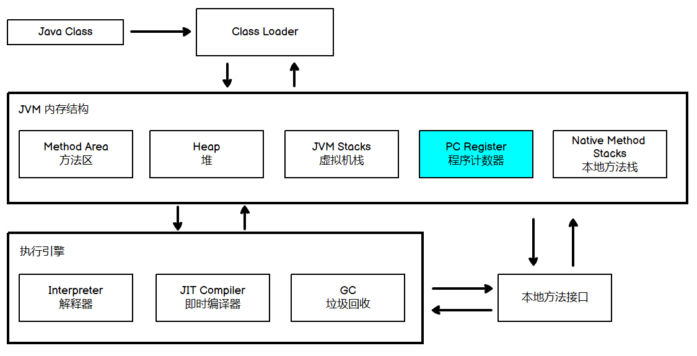
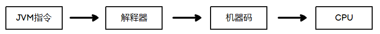
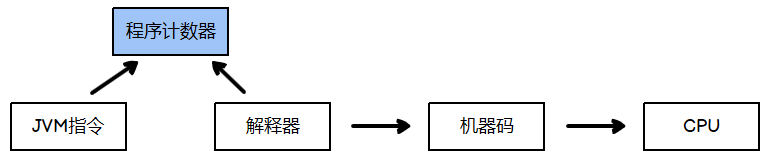

本Blog开始学习JVM的内存结构中的**程序计数器**，对应JVM整体架构的这个部分：




程序计数器（Program Counter Register）他就是一块较小的内存空间，那他有什么作用呢？

现在先提前超纲一下，写好的Java源代码会经过`Javac`进行编译形成字节码文件，这些个字节码里面存储的会有JVM指令，但是计算机还不认识JVM指令，所以需要送到解释器翻译为机器码最后再交给CPU执行，整个过程如下图所示：





举个例子，如下面的code所示，左侧代表JVM指令，最开头的数字是指令地址；右侧注释部分代表Java code：

```
0: getstatic			// PrintStream out = System.out;
3: astore_1				// --
4: aload_1				// out.println(1);
5: iconst_1				// --
6: invokevirtual		// --
9: aload_1				// out.println(2);
```

一条一条指令的执行吗，执行到`getstatic`就送给解释器翻译成机器码，最后再发送给CPU执行以此类推。


但我们都知道我们的电脑不可能只运行一个程序（线程），在执行的时候，CPU会为每个程序都划分时间片，即每个线程都会被分配一个时间段（片）

那么CPU就会接受不同程序的机器码，那么CPU咋知道你这个程序执行到哪里了呢？

这时候程序计数器就出场了（并非物理机上的计数器），它**记录了每个程序即将要执行的指令地址，即下一条指令的地址**，这样就知道执行到什么地方了

所以JVM指令不能直接发给解释器，解释器应该从程序计数器中取指令地址：



还是拿上面的例子：

```
0: getstatic			// PrintStream out = System.out;
3: astore_1				// --
4: aload_1				// out.println(1);
5: iconst_1				// --
6: invokevirtual		// --
9: aload_1				// out.println(2);
```

当程序执行3号指令的时候，CPU时间片用完了，那么程序计数器就存储`4`地址，当下一次再执行这个线程的时候再到程序计数器中读指令。


这就是程序计数器的作用了，同时每个线程都应该有属于自己的程序计数器，不共享。


# 参考资料

- [B站黑马程序员JVM教程](https://www.bilibili.com/video/BV1yE411Z7AP)