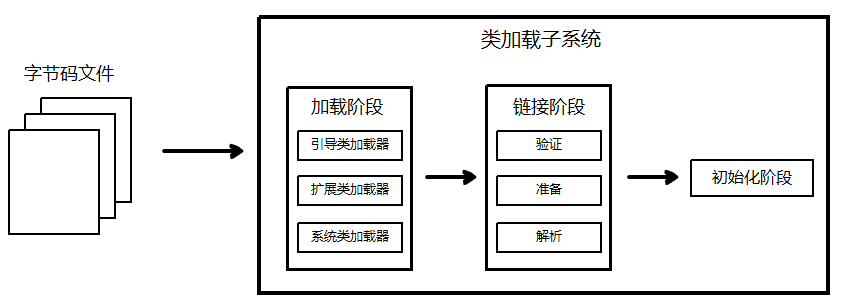

JVM的输入是`.class`字节码文件，字节码文件进入JVM的第一件事情就是经过：**类加载子系统Class Loader**，它有以下几点作用：

- 负责从文件或者网络传输中加载Class文件，要求class文件在文件开头有特定的文件标识（比如`CAFEBABE`）
- Class Loader只负责class文件的加载，至于它是否可以运行，则由执行引擎Execution Engine决定
- 加载的类信息存放于一块称为方法区的内存空间。除了类的信息外，方法区中还会存放运行时常量池信息，可能还包括字符串字面量和数字常量

类加载子系统包括以下三个步骤：

ok！下面逐一学习**加载、链接、初始化**这三个阶段

# 一、加载 Loading

# 二、

# 参考资料

- [B站尚硅谷康师傅JVM教程](https://www.bilibili.com/video/BV1PJ411n7xZ)