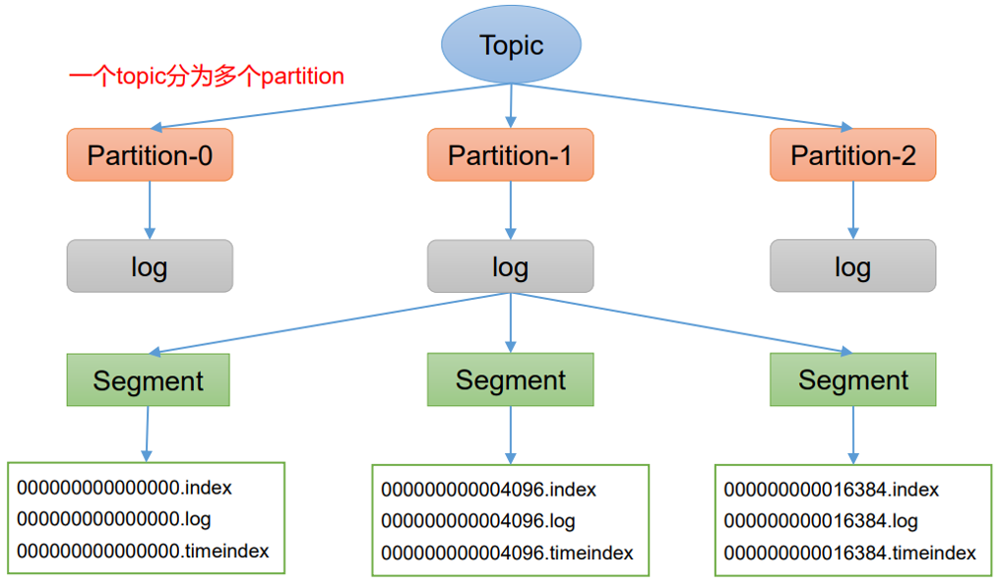
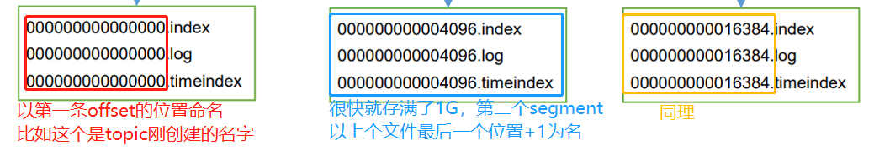
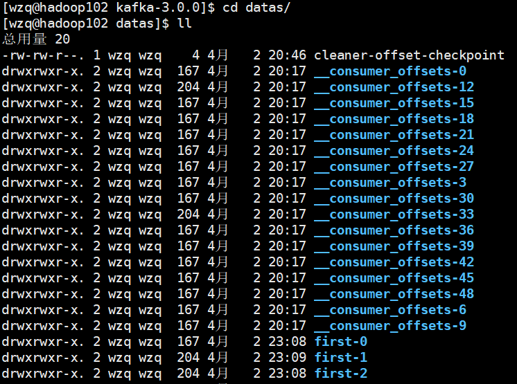
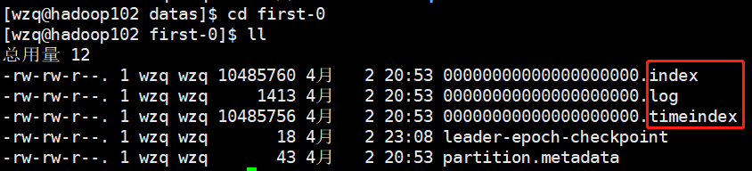
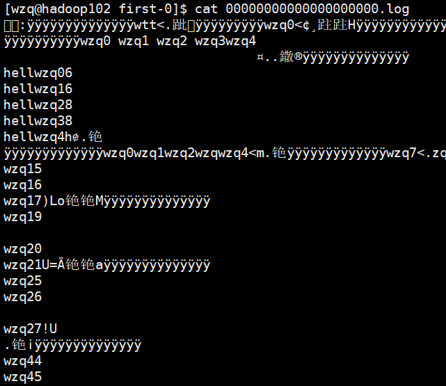
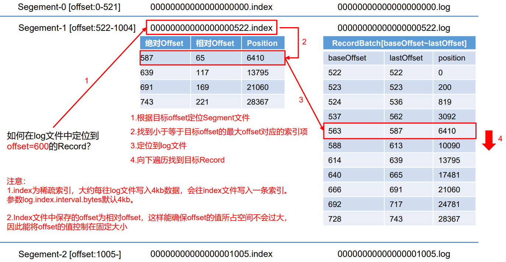
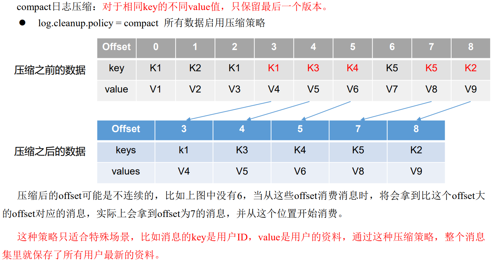
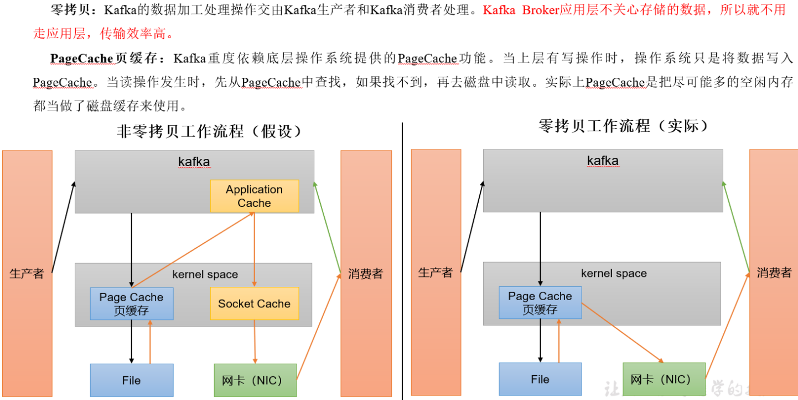

## 一、文件的存储与清理

需要知道的是，Kafka在生产环境中并不作为分析、存储数据的平台，他的作用是`数据传输`，为了提高数据传输的可靠性，`Kafka`也会往磁盘存储一些文件，下面来看一下kafka的文件存储与清理策略

### 1、文件存储机制

#### 1.1 文件存储结构

kafka Broker将数据存储到一个一个的`topic`，但是`topic`仅仅是逻辑上的概念；`topic`将数据分散到每个`partition`分区上存储，这个`partition`才是真正存储数据的地方，如下图所示：



一个`topic`分为多个`partition`，每个`partition`对应一个`log`，这里的log又是逻辑上的概念并不存储什么别的东西；每个log下面又有好多的`segment`，`segment`才是真正存储数据的地方，一个`segment`存储`1G`数据，多了的话，直接分给下一个`segment`，这个`segment`下面又分为几个文件：

- `.log`：日志文件，数据真正存储在了这里
- `.index`：偏移量索引文件，为了快速定位某个数据，kafka设置了索引
- `.timeindex`：时间戳索引文件，是根据这个文件执行文件清理的

从上图可以看到每个文件的命名都有很多0，这是啥意思呢：



#### 1.2 查看文件

ok，现在来直观的感受一下文件的存储，之前[安装部署kafka](http://wzqwtt.club/2022/04/01/kafka-fen-bu-shi-an-zhuang-bu-shu/)的时候，我把存储kafka信息的目录换到了kafka安装目录的`datas`文件夹下，打开这个文件：



这里存储了好多`topic`，每个文件的命名规则是：**topic名称+分区序号**，现在打开`first-0`看一下：



现在只有三个文件，因为我们没有往这里面存储太多的数据，还没有到达1G的标准，所以并不会继续创建这样的文件


现在打开`.log`文件看一下：



发现都是乱码，为了进行网络传输所以kafka对数据进行了序列化，所以我们看到的都是乱码格式的文件

不过不要担心，`Kafka`为我们提供了看这种序列化文件的命令：

```bash
[wzq@hadoop102 first-0]$ kafka-run-class.sh kafka.tools.DumpLogSegments --files ./00000000000000000000.log

baseOffset: 23 lastOffset: 23 count: 1 baseSequence: -1 lastSequence: -1 producerId: -1 producerEpoch: -1 partitionLeaderEpoch: 4 isTransactional: false isControl: false position: 953 CreateTime: 1648878661403 size: 72 magic: 2 compresscodec: none crc: 748653820 isvalid: true
baseOffset: 24 lastOffset: 26 count: 3 baseSequence: -1 lastSequence: -1 producerId: -1 producerEpoch: -1 partitionLeaderEpoch: 4 isTransactional: false isControl: false position: 1025 CreateTime: 1648878661435 size: 97 magic: 2 compresscodec: none crc: 1634437006 isvalid: true
baseOffset: 27 lastOffset: 29 count: 3 baseSequence: -1 lastSequence: -1 producerId: -1 producerEpoch: -1 partitionLeaderEpoch: 4 isTransactional: false isControl: false position: 1122 CreateTime: 1648878661453 size: 97 magic: 2 compresscodec: none crc: 692875180 isvalid: true
baseOffset: 30 lastOffset: 32 count: 3 baseSequence: -1 lastSequence: -1 producerId: -1 producerEpoch: -1 partitionLeaderEpoch: 4 isTransactional: false isControl: false position: 1219 CreateTime: 1648878661473 size: 97 magic: 2 compresscodec: none crc: 1037226575 isvalid: true
baseOffset: 33 lastOffset: 35 count: 3 baseSequence: -1 lastSequence: -1 producerId: -1 producerEpoch: -1 partitionLeaderEpoch: 4 isTransactional: false isControl: false position: 1316 CreateTime: 1648878661537 size: 97 magic: 2 compresscodec: none crc: 4164225620 isvalid: true
```

上面这些信息需要关注的是`baseOffset`、`lastOffset`和`positition`字段，下一小节将会解释


再看看`.index`文件：

```bash
[wzq@hadoop102 first-0]$ kafka-run-class.sh kafka.tools.DumpLogSegments --files ./00000000000000000000.index 
Dumping ./00000000000000000000.index
offset: 0 position: 0
```

#### 1.3 index文件和log文件详解

如下图所示：



`.index`文件存储了两个字段：`相对OffSet`和`Postition`，前面那个绝对Offset是没有的

那么：**如何在log文件中定位到offset=600的Record？**

第一步首先会对比文件名字，每个文件的名字都是以当前文件内第一个Offset的值命名的，所以可以很快的定位到某个Segment

第二步就是查看这个Segment，为了减轻存储压力，kafka使用相对Offset，相对Offset加上当前文件名就是这条offset的值，找到小于等于目标offset的最大offset对应的postition

第三步就是根据这个postition去该Segment找对应的位置的信息了，最后就取到数据了


#### 1.4 配置参数

| 参数                     | 描述                                                         |
| ------------------------ | ------------------------------------------------------------ |
| log.segment.bytes        | Kafka 中 log 日志是分成一块块存储的，此配置是指 log 日志划分 成块的大小，默认值 1G。 |
| log.index.interval.bytes | 默认 4kb，kafka 里面每当写入了 4kb 大小的日志（.log），然后就 往 index 文件里面记录一个索引。 稀疏索引。 |

 可以设置对应的参数调节Segment的大小

### 2、文件清理策略

Kafka中默认的日志保存时间是`7天`，可以通过下面的这些参数调整保存时间：

- `log.retention.hours`：最低优先级小时，默认7天
- `log.retention.minutes`：以分钟设置日志保存时间
- `log.retention.ms`：以毫秒设置日志保存时间，最高优先级，如果设置这个前面两个失效
- `log.retention.check.interval.ms`：负责设置检查周期，默认5分钟，每5分钟检查一次

如果一旦超过日志保存时间，那么就有两种策略去清楚日志文件，分别是`delete`和`compact`，通过`log.cleanup.policy`设置

#### 2.1 delete日志删除

这个是基于时间的，默认打开，以segment中所有记录中最大时间戳作为该文件时间戳，如果超过这个时间就删掉


#### 2.2 compact日志压缩





## 二、kafka如何做到高效读写数据？

- `Kafka`本身是基于分布式集群的，采用分区技术，并行度高

- 读数据采用稀疏索引，可以快速定位要消费的数据

- 顺序写磁盘，也就是说只追加，不修改或删除，只追加就快多了

- 页缓存+零拷贝

  


## 参考资料

- [B站尚硅谷Kafka学习视频](https://www.bilibili.com/video/BV1vr4y1677k)
- [Apache Kafka官网](https://kafka.apache.org/)

