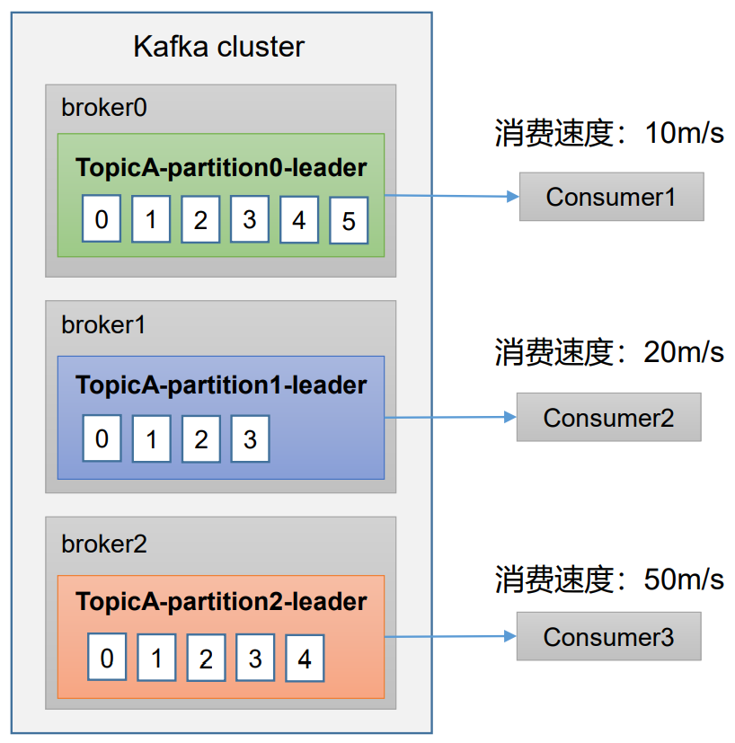
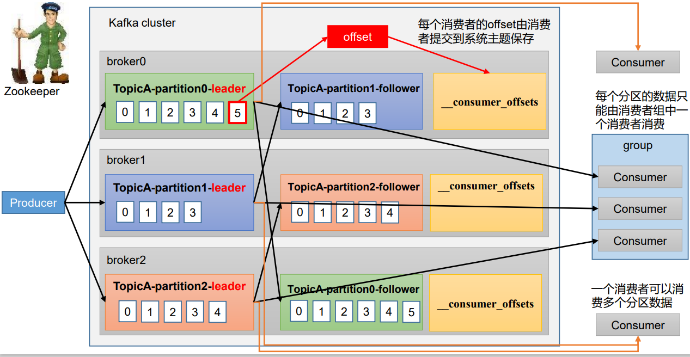
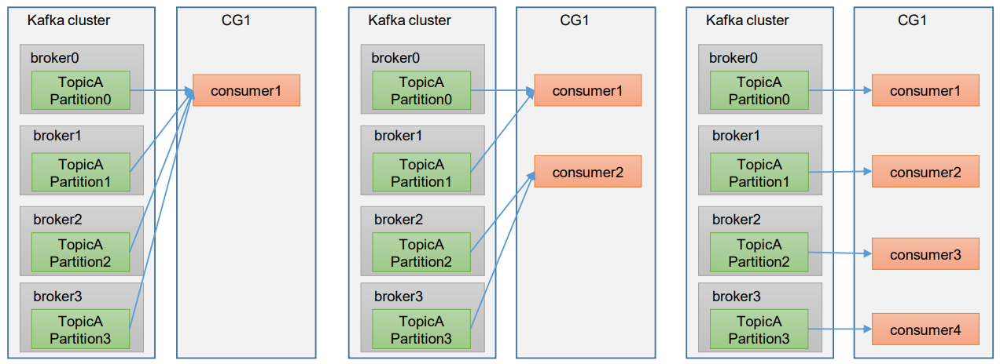
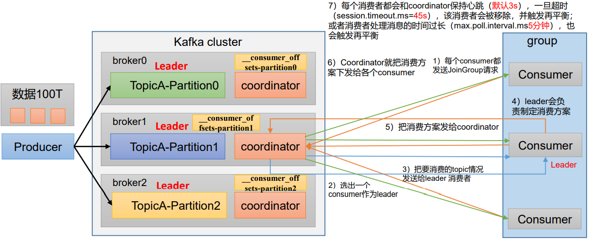
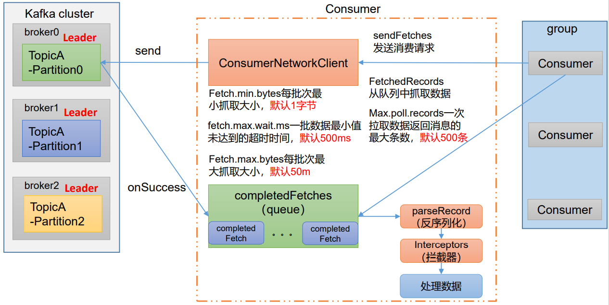

## 一、消费方式

消费总共有两种方式，一种是`pull`（拉），另外一种是`push`（推）：

- `pull`：消费的主体主动从数据中心拉取数据，对应Kafka，就是消费者Consumer主动从Broker中拉取数据
- `push`：数据中心主动推送数据到消费的主题，就是说Broker主动推送数据给Consumer

`Kafka`采取的是`pull`的方式，如下图所示：

每个消费者的消费速度不一样，如果采用`push`的方式，Broker决定发送速率的话，很难做到适应各个消费者的消费速率，例如：Broker推送的速度是`50m/s`，但有两个Consumer消费的速度达不到`50m/s`就会受不了来不及处理消息，严重的话数据就会丢失。

所以`Kafka`采取`pull`的方式，Consumer主动拉取Broker中的数据；但是pull的不足之处就是，如果Kafka没有数据的时候，消费者就会陷入死循环，一直返回空数据。

## 二、Kafka消费者工作流程

### 1、消费者总体工作流程

如上图所示，Producer生产数据之后发送到Broker的每个分区，每个分区的Leader再把数据同步给该分区的副本中，每个Consumer可以消费任意一个分区的Leader中的数据，但是一个消费者组中的每个消费者只可以消费一个分区。

当Consumer宕机的时候，为了记住当前消费到了哪个offset，Kafka有自己的一个内置Topic记录——`__consumer_offsets`，在Kafka0.9版本之前这个步骤是交给Zookeeper做的，在Kafka0.9之后就是这个主题做这个任务了，这是为了减少Kafka和Zookeeper之间的通信。

### 2、消费者组原理

#### 2.1 消费者组

消费者组Consumer Group（CG）：由多个consumer组成。

- 形成一个消费者组的条件是：所有消费者的Group id相同
- 消费者组内每个消费者负责消费不同分区的数据，一个分区只能由一个组内消费者消费
- 消费者组之间互不影响，所有的消费者都属于一个消费者组，比如说单个的一个消费者他也是一个消费者组，group id由系统决定了

如上图所示：

第一张图因为一个消费者组只有一个consumer，所以这个consumer就必须要消费所有分区的数据

第二张图一个消费者组有两个consumer，所以两个consumer各自消费两个分区

第三张图一个消费者组有四个consumer，所以每个consumer各自消费一个分区

还有一些例子，如下图所示：

#### 2.2 消费者组初始化流程

消费者组要决定哪个消费者去消费哪个分区的数据，下图为消费者组初始化的一个流程：

- 每个Broker都会有一个`coordinator`，他的作用是辅助实现消费者组的初始化的分区的分配，coordinator节点选择就等于group id的hashcode值 % 50，这个50是__consumer_offsets的分区数量，是默认的。
- 在开始的时候消费者组的每个Consumer都会给coordinator发送JoinGroup一个请求
- 这个coordinator就会选出一个consumer作为leader，并把要消费的topic情况发送给leader消费者
- 作为leader节点，他会制定一个消费方案（即哪个消费者消费哪个分区的数据），然后把消费方案发送给coordinator
- Coordinator就把消费方案下发给每个consumer，这样就是消费者组的一个初始化流程

> 每个消费者都会和coordinator保持一个心跳（默认3s），一旦超时（session.timeout.ms=45s），该消费者就会被移除，并触发再平衡机制；或者当消费者处理消息的时间过长（max.poll.interval.ms=5分钟）也会触发再平衡，再去制定消费方案

#### 2.3 消费者组详细消费流程

- Consumer采取的pull拉取的方式，首先会初始化一个`ConsumerNetworkClient`，这个是消费者网络连接客户端
- 消费者组的消费者想要拉取数据首先给`ConsumerNetworkClient`发送一个`sendFetches`请求
- 收到请求之后，`ConsumerNetworkClient`就向broker发送请求了（send）
- send有一个回调方法`onSuccess`，如果成功就把数据放入`completedFetches`队列
- Consumer在这个队列拉取数据，首先经过反序列化、然后拦截器最后就可以处理数据了

### 3、重要参数

| 参数名称                                 | 描述                                                         |
| ---------------------------------------- | ------------------------------------------------------------ |
| `bootstrap.servers`                      | 向Kafka集群建立初始连接用到的host/port列表                   |
| `key.deserializer`和`value.deserializer` | 指定接受消息的key和value的反序列化类型，需要写全类名         |
| `group.id`                               | 标记消费者所属消费者组                                       |
| `enable.auto.commit`                     | 默认值为true，消费者会自动周期性的向服务器提交偏移量         |
| `auto.commite.interval.ms`               | 如果设置为true，则该值定义了消费者偏移量向Kafka提交的频率，默认5s |
| `auto.offset.reset`                      | 当Kafka中没有初始偏移量或当前偏移量在服务器中不存在的时候使用这个参数<ul><li>`earliest`：自动重置偏移量到最早的偏移量</li><li>`latest`：默认，自动重置偏移量为最新的偏移量</li><li>`none`：如果消费组原来的偏移量不存在，则向消费者抛异常</li><li>`anything`：向消费者抛异常</li></ul> |
| `offsets.topic.num.partitions`           | __consumer_offsets的分区数，默认50个分区                     |
| `heartbeat.interval.ms`                  | 消费者和coordinator之间的心跳时间，默认3s，该条目必须小于`session.timeout.ms`参数，也不应该高于`session.timeout.ms`的1/3 |
| `session.timeout.ms`                     | 消费者和coordinator之间连接超时时间，默认45s，超过该值消费者就会被移除，消费组执行再平衡 |
| `max.poll.interval.ms`                   | 消费者处理消息的最大时长，默认5分钟，超过该值，该消费者被移除，消费者组执行再平衡 |
| `fetch.min.bytes`                        | 默认1个字节，消费者获取服务器端一批消息最小的字节数          |
| `fetch.max.wait.ms`                      | 默认500ms，如果没有从服务器端获取到一批数据的最小字节数，该时间到仍然会返回数据 |
| `fetch.max.bytes`                        | 默认52428800(50m)，获取服务器端一批消息最大的字节数          |
| `max.poll.records`                       | 一次poll拉取数据返回消息的最大条数，默认是500条              |

## 参考资料

- [B站尚硅谷Kafka学习视频](https://www.bilibili.com/video/BV1vr4y1677k)
- [Apache Kafka官网](https://kafka.apache.org/)

