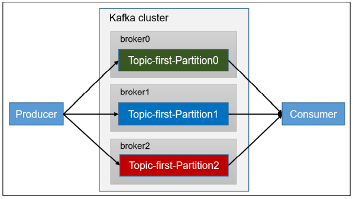
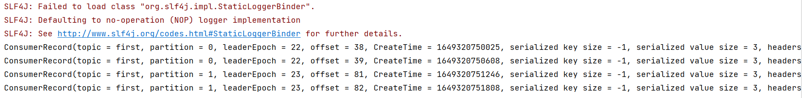
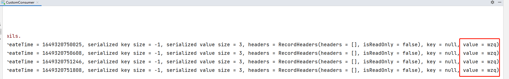
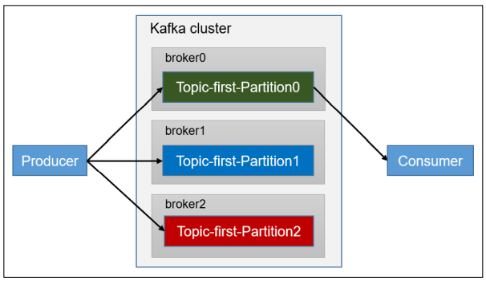
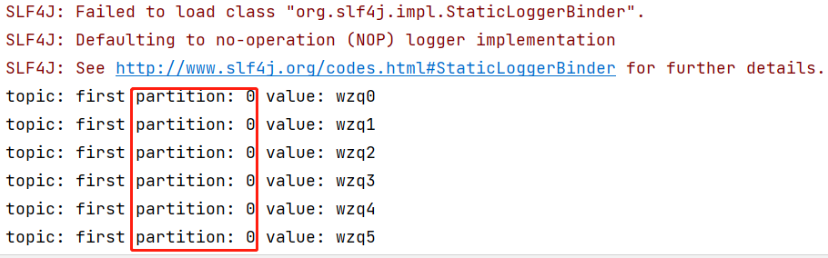
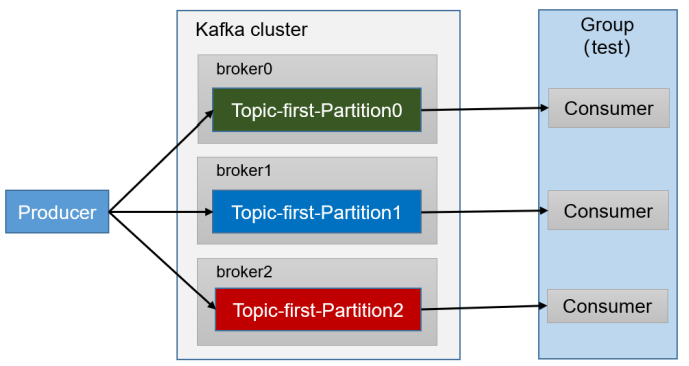
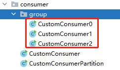
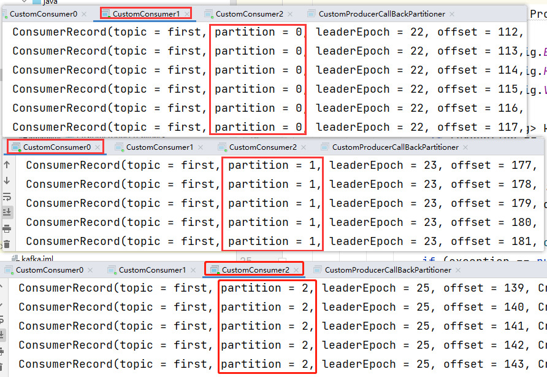

在开始之前，应该确保zookeeper和kafka是打开的：

```bash
[wzq@hadoop102 ~]$ zk.sh start
[wzq@hadoop102 ~]$ kf.sh start
[wzq@hadoop102 kafka-3.0.0]$ jpsall
=============== hadoop102 ===============
3672 QuorumPeerMain
5432 Jps
4059 Kafka
=============== hadoop103 ===============
4306 Jps
3912 Kafka
3531 QuorumPeerMain
=============== hadoop104 ===============
4313 Jps
3933 Kafka
3551 QuorumPeerMain
```

学习生产者API操作请访问：http://wzqwtt.club/2022/04/01/kafka-yi-bu-yu-tong-bu-yi-ji-fen-qu-api-cao-zuo/


打开idea，新建一个maven工程，导入依赖：

```xml
<dependencies>
    <dependency>
        <groupId>org.apache.kafka</groupId>
        <artifactId>kafka-clients</artifactId>
        <version>3.0.0</version>
    </dependency>
</dependencies>
```


## 一、独立消费者（订阅主题）

### 1、需求分析



如上图所示，只有一个消费者，消费`topic`的所有分区

### 2、实现

步骤：

- 编写连接kafka的配置信息
  - `BOOTSTRAP_SERVERS_CONFIG`：要连接的kafka的主机
  - 指定反序列化类型，需要是全类名
  - `GROUP_ID_CONFIG`：就算只有一个Consumer也需要指定GROUP_ID
- 创建一个消费者，需要把配置信息传进去
- 订阅主题，订阅主题时传入要订阅的主题的集合
- 消费数据，需要指定多久消费一次数据

代码如下：

```java
package com.wzq.kafka.consumer;

import org.apache.kafka.clients.consumer.ConsumerConfig;
import org.apache.kafka.clients.consumer.ConsumerRecord;
import org.apache.kafka.clients.consumer.ConsumerRecords;
import org.apache.kafka.clients.consumer.KafkaConsumer;
import org.apache.kafka.common.serialization.StringDeserializer;

import java.time.Duration;
import java.util.ArrayList;
import java.util.Properties;

public class CustomConsumer {

    public static void main(String[] args) {
        // 0、配置信息
        Properties properties = new Properties();

        // 要连接的kafka主机
        properties.put(ConsumerConfig.BOOTSTRAP_SERVERS_CONFIG, "hadoop102:9092,hadoop103:9092");
        // 反序列化类型
        properties.put(ConsumerConfig.KEY_DESERIALIZER_CLASS_CONFIG, StringDeserializer.class.getName());
        properties.put(ConsumerConfig.VALUE_DESERIALIZER_CLASS_CONFIG, StringDeserializer.class.getName());

        // 消费者组id
        properties.put(ConsumerConfig.GROUP_ID_CONFIG, "test");

        // 1、创建消费者对象
        KafkaConsumer<String, String> kafkaConsumer = new KafkaConsumer<>(properties);

        // 2、订阅主题
        ArrayList<String> topics = new ArrayList<>();
        topics.add("first");
        kafkaConsumer.subscribe(topics);

        // 3、消费数据
        while (true) {
            ConsumerRecords<String, String> consumerRecords = kafkaConsumer.poll(Duration.ofSeconds(1));
            // 循环输出数据
            for (ConsumerRecord<String, String> consumerRecord : consumerRecords) {
                System.out.println(consumerRecord);
            }
        }
    }

}
```


### 3、测试

运行这个程序，然后用命令行工具发送数据：

```bash
[wzq@hadoop102 kafka-3.0.0]$ bin/kafka-console-producer.sh --bootstrap-server hadoop102:9092 --topic first
>wzq
>wzq
>wzq
>wzq
```

已经消费到数据了：






也可以使用以前写的生产者发送数据，进行发送

## 二、独立消费者（订阅分区）

### 1、需求分析



单个消费者消费某个主题的某个分区的数据

### 2、实现

还是上面的步骤，不过不一样的是：在第三步订阅主题调用`assign`方法，传递一个`TopicPartition`的集合，在集合的每个元素指定主题和分区：

```java
package com.wzq.kafka.consumer;

import org.apache.kafka.clients.consumer.ConsumerConfig;
import org.apache.kafka.clients.consumer.ConsumerRecord;
import org.apache.kafka.clients.consumer.ConsumerRecords;
import org.apache.kafka.clients.consumer.KafkaConsumer;
import org.apache.kafka.common.TopicPartition;
import org.apache.kafka.common.serialization.StringDeserializer;

import java.time.Duration;
import java.util.ArrayList;
import java.util.Collection;
import java.util.Properties;

public class CustomConsumerPartition {

    public static void main(String[] args) {
        // 0、配置信息
        Properties properties = new Properties();
        properties.put(ConsumerConfig.BOOTSTRAP_SERVERS_CONFIG, "hadoop102:9092,hadoop103:9092");
        properties.put(ConsumerConfig.KEY_DESERIALIZER_CLASS_CONFIG, StringDeserializer.class.getName());
        properties.put(ConsumerConfig.VALUE_DESERIALIZER_CLASS_CONFIG, StringDeserializer.class.getName());

        properties.put(ConsumerConfig.GROUP_ID_CONFIG, "test");

        // 1、创建一个消费者对象
        KafkaConsumer<String, String> kafkaConsumer = new KafkaConsumer<>(properties);

        // 2、订阅主题的分区
        ArrayList<TopicPartition> topicPartitions = new ArrayList<>();
        // 指定消费first主题0号分区的数据
        topicPartitions.add(new TopicPartition("first", 0));
        kafkaConsumer.assign(topicPartitions);

        // 3、消费数据
        while (true) {
            ConsumerRecords<String, String> consumerRecords = kafkaConsumer.poll(Duration.ofSeconds(1));
            for (ConsumerRecord<String, String> consumerRecord : consumerRecords) {
                System.out.println("topic: " + consumerRecord.topic() + " partition: " + consumerRecord.partition() + " value: " + consumerRecord.value());
            }
        }
    }

}
```

### 3、测试

运行该方法，调用之前生产者指定分区的代码，这里就会有输出：




## 三、消费者组

需求如下：



其实这个最简单，只需要复制第一个订阅主题的代码就好了，有几个分区复制几份，只需要每个都指定相同的`gropu id`就好了


把订阅主题的代码复制三份出来，甚至不需要修改：




ok，然后运行之前写的生产者随机发送分区内容的代码，三个消费者会输出对应分区的数据：




## 参考资料

- [B站尚硅谷Kafka学习视频](https://www.bilibili.com/video/BV1vr4y1677k)
- [Apache Kafka官网](https://kafka.apache.org/)

