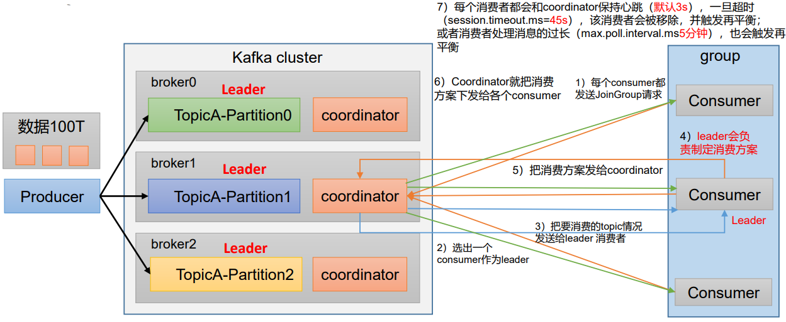
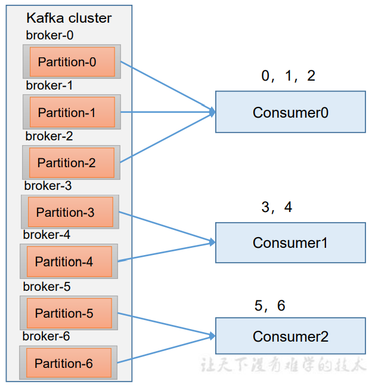
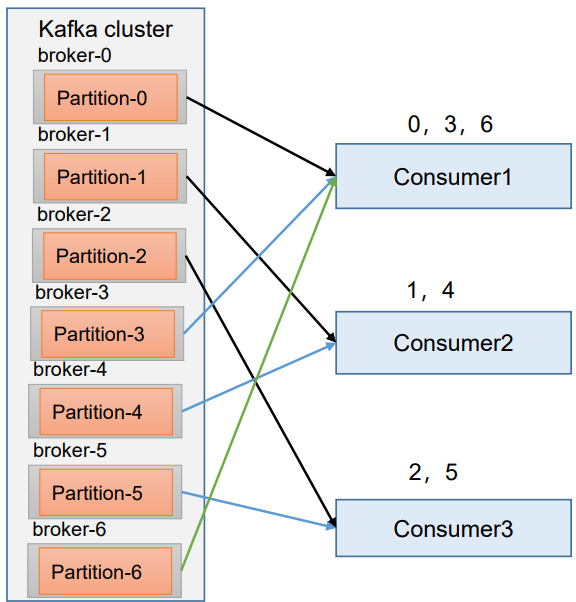

## 一、Consumer为什么需要分区分配机制

在开始之前，再来回顾一下Consumer消费者组的的分区分配流程



如上图所示，分区分配初始化流程如下：

- 每个Broker都会生成一个coordinator，这个东西是用于辅助Consumer分区分配的
- 当消费者组和Broker建立通信，第一步要做的是：消费者组的每个消费者都会向coordinator发送一个JoinGroup请求
- 当coordinator接受到每个消费者发来的请求后，选择第一个到达coordinator的请求所属消费者作为消费者组的Leader
- coordinator把消费者组想要消费的topic情况发送给Leader
- 这个Leader会制定一个**消费方案**，并把消费方案发给coordinator
- coordinator把消费方案发给消费者组的各个消费者中，就开始消费了
- 每个消费者都会和coordinator保持心跳（默认3s一次），如果一旦超过45s（参数：session.timeout.ms=45s），就会认为这个consumer挂掉了，这个消费者会被移除并触发再平衡。还有一种情况就是消费者处理消息的时间过长（参数：max.poll.interval.ms = 5分钟），也会触发再平衡


问题的关键是：这个消费方案是怎么制定的？到底哪个Consumer消费哪个Partition的数据？

ok，Kafka给我们内置了四种主流的分区分配策略：`Range`、`RoundRobin`、`Sticky`、`CooperativeSticky`，可以通过配置参数`partition.assignment.strategy`修改分区的分配策略，它默认的策略是：`Range + CooperativeSticky`，Kafka可以同时使用多个分区分配策略


## 二、Range

如下图所示，Range的分区策略是这样的：



Range是对**一个topic**而言的，首先对同一个topic里面的分区按照序号进行排序，并对消费者按照字母顺序进行排序

假设现在有7个分区，3个消费者，排序后的分区是：0，1，2，3，4，5，6；消费者排序完之后是：C0、C1、C2


Range策略通过`partitions数/consumer数`来决定每个消费者应该消费几个分区。如果除不尽，那么前面几个消费者就会多消费1个分区

例如：7 / 3 = 2余1，也就是说：每个消费者都消费两个分区，但是余的那个1会由消费者字母序排名第一的消费者C0承担，也就是说：C0消费0，1，2号分区；C1消费3，4号分区，C2消费5，6号分区。

> 当只有几个Topic的时候，Range分配的还挺好的，但问题的关键是：如果现在有成千上万个Topic由这个消费者组进行消费，并且每次都可能除不尽，余下来的那些分区就必须由字母序靠前的几个消费者承担，如果很多Topic，那么前面的消费者就要承担更多的消费任务。这就造成了**数据倾斜**


再平衡就是：当其中一台Consumer宕机了，Kafka为了防止数据丢失，在45秒以内会先将数据发送给其他消费者，在45s之后就会再次触发Range分区分配策略，再给每个Consumer分配几个分区


## 三、RoundRobin

RoundRobin针对集群中所有的Topic



RoundRobin的策略是把所有的partition和所有的consumer都列出来，然后按照hashcode进行排序，最后通过轮询算法来分配partition给各个消费者。

例如上图：0给C1，1给C2，2给C3，然后3给C1，4给C2，5给C3，最后一个6给C1；这样就完成了一个分配


这种方式是经常使用的，如果要在Java配置这个参数，可以这样写：

```java
properties.put(ConsumerConfig.PARTITION_ASSIGNMENT_STRATEGY_CONFIG,"org.apache.kafka.clients.consumer.RoundRobinAssignor");
```


## 四、Sticky

粘性分区，是Kafka在0.11.x版本开始引入的，这种策略Kafka会尽量均匀的把分区安排在消费者上面

比如0，1，2，3，4，5，6，7分区；C0，C1，C2消费者

C0分三个，C1和C2各两个，至于分配的是哪个分区？不知道，是完全随机的，这个就是Sticky策略


在Java中配置这个参数：

```java
properties.put(ConsumerConfig.PARTITION_ASSIGNMENT_STRATEGY_CONFIG,"org.apache.kafka.clients.consumer.StickyAssignor");
```


如果要配置多个策略：

```java
ArrayList<String> starteys = new ArrayList<>();
starteys.add("org.apache.kafka.clients.consumer.StickyAssignor");
starteys.add("org.apache.kafka.clients.consumer.RoundRobinAssignor");
properties.put(ConsumerConfig.PARTITION_ASSIGNMENT_STRATEGY_CONFIG, starteys);
```


## 参考资料

- [B站尚硅谷Kafka学习视频](https://www.bilibili.com/video/BV1vr4y1677k)
- [Apache Kafka官网](https://kafka.apache.org/)

