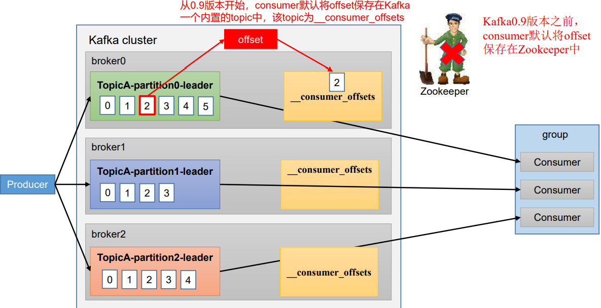
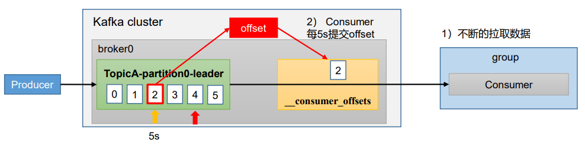
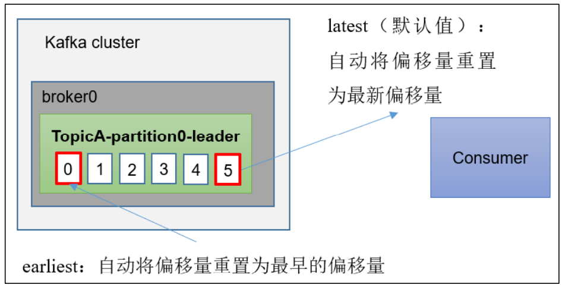
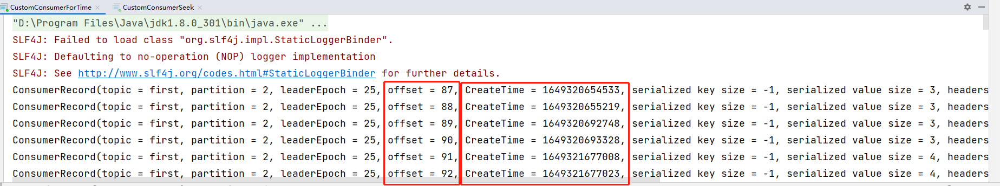

## 一、offset默认存储位置



如上图所示，当消费者开始消费数据的时候，就会开始产生`Offset`，Offset的作用就是记录消费者消费数据到了哪里

在kafka 0.9版本之前offset的存储在`Zookeeper`中，在0.9版本之后就存储到了kafka系统内容的主题：`__consumer_offsets`里面

因为每次消费数据的时候消费者都要记录一次offset，如果要提交到zookeeper，那就避免不了要和zookeeper频繁通信，如果数据量过大，就造成了网络压力。所以在0.9版本后就存储到了自身的主题里面。


在主题`__consumer_offsets`里采用`key`和`value`的方式存储数据。key是：`group.id+topic+分区号`，value就是当前offset的值。每隔一段时间，kafka内部就对这个topic进行一次合并，也就是保留每个`group.id+topic+分区号`的最新数据，现在来看一下这里保存的数据。


想要查看`__consumer_offsets`主题，需要添加一个配置，因为Kafka默认不让看这里的数据，我们需要在`config/consumer.properties`中添加配置：`exclude.internal.topics=false`

```bash
[wzq@hadoop102 kafka-3.0.0]$ vim config/consumer.properties
# 添加
exclude.internal.topics=false
```

将配置信息分发到Hadoop103和104：

```bash
[wzq@hadoop102 kafka-3.0.0]$ xsync config/consumer.properties 
```


重新创建一个主题，观察这个主题的offset：

```bash
[wzq@hadoop102 kafka-3.0.0]$ bin/kafka-topics.sh --bootstrap-server hadoop102:9092 --create --topic second --partitions 2 --replication-factor 2
```


启动生产者生产数据：

```bash
[wzq@hadoop102 kafka-3.0.0]$ bin/kafka-console-producer.sh --topic second --bootstrap-server hadoop102:9092
```


启动消费者消费数据，为了更好的查看数据存储位置，制定一个分区：

```bash
[wzq@hadoop103 kafka-3.0.0]$ bin/kafka-console-consumer.sh --bootstrap-server hadoop102:9092 --topic second --group test
```

现在在生产者里面发送一些数据，消费者就可以收到了，查看`__consumer_offsets`这个主题：

```bash
[wzq@hadoop104 kafka-3.0.0]$ bin/kafka-console-consumer.sh --bootstrap-server hadoop102:9092 --topic __consumer_offsets --consumer.config config/consumer.properties --formatter "kafka.coordinator.group.GroupMetadataManager\$OffsetsMessageFormatter" --from-beginning
```

摘取两条：

```bash
[test,second,0]::OffsetAndMetadata(offset=3, leaderEpoch=Optional[0], metadata=, commitTimestamp=1649337081311, expireTimestamp=None)
[test,second,1]::OffsetAndMetadata(offset=1, leaderEpoch=Optional[0], metadata=, commitTimestamp=1649337081311, expireTimestamp=None)
```

这个就是`__consumer_offsets`里面存储的主题数据了，因为消费者会一直拉取数据，所以打开的这个查看`__consumer_offsets`的这个窗口会一直产生数据

## 二、 自动提交offset

Kafka默认自动提交offset，也就是说我们不需要设置什么就是自动提交的，如下图所示，每隔5秒钟就会提交一次数据



自动提交offset的参数：

- `enable.auto.commit`：是否开启自动提交offset，默认为true，改为false就是手动提交了
- `auto.commit.interval.ms`：自动提交offset的间隔时间，默认是5s


我们可以使用Java来设置：

```java
// 设置自动提交
properties.put(ConsumerConfig.ENABLE_AUTO_COMMIT_CONFIG, true);
// 设置自动提交间隔1秒钟
properties.put(ConsumerConfig.AUTO_COMMIT_INTERVAL_MS_CONFIG, 1000);
```


## 三、手动提交offset


自动提交`offset`很便利，但是他是基于时间提交的，开发人员难以把握offset的提交时机。因此Kafka还提供了手动提交Offset的API

手动提交Offset的分发有两个：

- `commitSync`（同步提交）：表示数据消费完成之后再提交Offset，然后必须等待Offset提交完毕，再去消费下一批数据
- `commitAsync`（异步提交）：发送完提交offset请求后，就开始消费下一组数据了，这种用的比较多


同步提交：

```java
package com.wzq.kafka.consumer;

import org.apache.kafka.clients.consumer.ConsumerConfig;
import org.apache.kafka.clients.consumer.ConsumerRecord;
import org.apache.kafka.clients.consumer.ConsumerRecords;
import org.apache.kafka.clients.consumer.KafkaConsumer;
import org.apache.kafka.common.serialization.StringDeserializer;

import java.time.Duration;
import java.util.ArrayList;
import java.util.Properties;

public class CustomConsumerByHandSync {

    public static void main(String[] args) {
        // 0、配置信息
        Properties properties = new Properties();

        // 要连接的kafka主机
        properties.put(ConsumerConfig.BOOTSTRAP_SERVERS_CONFIG, "hadoop102:9092,hadoop103:9092");
        // 反序列化类型
        properties.put(ConsumerConfig.KEY_DESERIALIZER_CLASS_CONFIG, StringDeserializer.class.getName());
        properties.put(ConsumerConfig.VALUE_DESERIALIZER_CLASS_CONFIG, StringDeserializer.class.getName());

        // 消费者组id
        properties.put(ConsumerConfig.GROUP_ID_CONFIG, "test");

        // 设置自动提交为false
        properties.put(ConsumerConfig.ENABLE_AUTO_COMMIT_CONFIG, false);

        // 1、创建消费者对象
        KafkaConsumer<String, String> kafkaConsumer = new KafkaConsumer<>(properties);

        // 2、订阅主题
        ArrayList<String> topics = new ArrayList<>();
        topics.add("first");
        kafkaConsumer.subscribe(topics);

        // 3、消费数据
        while (true) {
            ConsumerRecords<String, String> consumerRecords = kafkaConsumer.poll(Duration.ofSeconds(1));
            // 循环输出数据
            for (ConsumerRecord<String, String> consumerRecord : consumerRecords) {
                System.out.println(consumerRecord);
            }
            // 同步提交Offset
            kafkaConsumer.commitSync();
        }
    }

}
```

异步提交：

```java
package com.wzq.kafka.consumer;

import org.apache.kafka.clients.consumer.ConsumerConfig;
import org.apache.kafka.clients.consumer.ConsumerRecord;
import org.apache.kafka.clients.consumer.ConsumerRecords;
import org.apache.kafka.clients.consumer.KafkaConsumer;
import org.apache.kafka.common.serialization.StringDeserializer;

import java.time.Duration;
import java.util.ArrayList;
import java.util.Properties;

public class CustomConsumerByHandAsync {

    public static void main(String[] args) {
        // 0、配置信息
        Properties properties = new Properties();

        // 要连接的kafka主机
        properties.put(ConsumerConfig.BOOTSTRAP_SERVERS_CONFIG, "hadoop102:9092,hadoop103:9092");
        // 反序列化类型
        properties.put(ConsumerConfig.KEY_DESERIALIZER_CLASS_CONFIG, StringDeserializer.class.getName());
        properties.put(ConsumerConfig.VALUE_DESERIALIZER_CLASS_CONFIG, StringDeserializer.class.getName());

        // 消费者组id
        properties.put(ConsumerConfig.GROUP_ID_CONFIG, "test");

        // 设置自动提交为false
        properties.put(ConsumerConfig.ENABLE_AUTO_COMMIT_CONFIG, false);

        // 1、创建消费者对象
        KafkaConsumer<String, String> kafkaConsumer = new KafkaConsumer<>(properties);

        // 2、订阅主题
        ArrayList<String> topics = new ArrayList<>();
        topics.add("first");
        kafkaConsumer.subscribe(topics);

        // 3、消费数据
        while (true) {
            ConsumerRecords<String, String> consumerRecords = kafkaConsumer.poll(Duration.ofSeconds(1));
            // 循环输出数据
            for (ConsumerRecord<String, String> consumerRecord : consumerRecords) {
                System.out.println(consumerRecord);
            }
            // 异步提交
            kafkaConsumer.commitAsync();
        }
    }

}
```


## 四、指定Offset消费

Kafka中有一个参数决定消费者从哪里开始消费数据：`auto.offset.reset`，他有几个可选值：

- `earliest`：自动将偏移量重置为最早的偏移量，从最早生产数据的时候消费，等同于命令行的`--from-begining`
- `latest（默认值）`：从最新的位置开始消费
- `none`：如果未找到消费者组先前的偏移量，则向消费者抛出异常




当然也可以指定任意Offset位置进行消费：

```java
package com.wzq.kafka.consumer;

import org.apache.kafka.clients.consumer.ConsumerConfig;
import org.apache.kafka.clients.consumer.ConsumerRecord;
import org.apache.kafka.clients.consumer.ConsumerRecords;
import org.apache.kafka.clients.consumer.KafkaConsumer;
import org.apache.kafka.common.TopicPartition;
import org.apache.kafka.common.serialization.StringDeserializer;

import java.time.Duration;
import java.util.ArrayList;
import java.util.HashSet;
import java.util.Properties;
import java.util.Set;

public class CustomConsumerSeek {

    public static void main(String[] args) {
        // 0、配置
        Properties properties = new Properties();
        // 连接、反序列化与指定组ID
        properties.put(ConsumerConfig.BOOTSTRAP_SERVERS_CONFIG, "hadoop102:9092,hadoop103:9092");
        properties.put(ConsumerConfig.KEY_DESERIALIZER_CLASS_CONFIG, StringDeserializer.class.getName());
        properties.put(ConsumerConfig.VALUE_DESERIALIZER_CLASS_CONFIG, StringDeserializer.class.getName());
        properties.put(ConsumerConfig.GROUP_ID_CONFIG, "test1");

        // 1、构建Kafka消费者对象
        KafkaConsumer<String, String> kafkaConsumer = new KafkaConsumer<>(properties);

        // 2、订阅一个主题
        ArrayList<String> topics = new ArrayList<>();
        topics.add("first");
        kafkaConsumer.subscribe(topics);

        // 3、指定开始消费的offset位置

        // 获取topic所有的分区
        Set<TopicPartition> assignment = new HashSet<>();

        while (assignment.size() == 0) {
            kafkaConsumer.poll(Duration.ofSeconds(1));
            //获取消费者分区分配信息，有了分区才可以消费
            assignment = kafkaConsumer.assignment();
        }

        // 需要传递一个分区，一个位移
        for (TopicPartition topicPartition : assignment) {
            // 从指定位置开始消费，需要传递一个分区和位移
            kafkaConsumer.seek(topicPartition, 600);
        }

        // 4、消费
        while (true) {
            ConsumerRecords<String, String> consumerRecords = kafkaConsumer.poll(Duration.ofSeconds(1));
            for (ConsumerRecord<String, String> consumerRecord : consumerRecords) {
                System.out.println(consumerRecord);
            }
        }
    }
}
```


## 五、指定时间消费

总是会有各种奇奇怪怪的需求，如果要消费前一天的数据，该怎么办？

Kafka并没有提供获取前一天数据的API，但是提供了offset转时间的API，可以根据这个来做：

```java
package com.wzq.kafka.consumer;

import org.apache.kafka.clients.consumer.*;
import org.apache.kafka.common.TopicPartition;
import org.apache.kafka.common.serialization.StringDeserializer;

import java.time.Duration;
import java.util.*;

public class CustomConsumerForTime {

    public static void main(String[] args) {
        // 0、配置信息
        Properties properties = new Properties();

        // 要连接的kafka主机
        properties.put(ConsumerConfig.BOOTSTRAP_SERVERS_CONFIG, "hadoop102:9092,hadoop103:9092");
        // 反序列化类型
        properties.put(ConsumerConfig.KEY_DESERIALIZER_CLASS_CONFIG, StringDeserializer.class.getName());
        properties.put(ConsumerConfig.VALUE_DESERIALIZER_CLASS_CONFIG, StringDeserializer.class.getName());

        // 消费者组id
        properties.put(ConsumerConfig.GROUP_ID_CONFIG, "test2");

        // 1、创建消费者对象
        KafkaConsumer<String, String> kafkaConsumer = new KafkaConsumer<>(properties);

        // 2、订阅主题
        ArrayList<String> topics = new ArrayList<>();
        topics.add("first");
        kafkaConsumer.subscribe(topics);

        // 3、转化时间为offset
        Set<TopicPartition> assignment = new HashSet<>();
        while (assignment.size() == 0) {
            kafkaConsumer.poll(Duration.ofSeconds(1));
            // 获取消费者分区分配信息
            assignment = kafkaConsumer.assignment();
        }

        // 使用一个Map存储分区offset对应的时间
        HashMap<TopicPartition, Long> topicPartitionLongHashMap = new HashMap<>();
        for (TopicPartition topicPartition : assignment) {
            topicPartitionLongHashMap.put(topicPartition, System.currentTimeMillis() - 1 * 24 * 3600 * 1000);
        }
        // 获取从1天前开始消费的每个分区的offset
        Map<TopicPartition, OffsetAndTimestamp> offsets = kafkaConsumer.offsetsForTimes(topicPartitionLongHashMap);

        // 遍历每个分区，对每个分区设置时间对应的位移
        for (TopicPartition topicPartition : assignment) {
            OffsetAndTimestamp offsetAndTimestamp = offsets.get(topicPartition);
            if (offsetAndTimestamp != null) {
                kafkaConsumer.seek(topicPartition, offsetAndTimestamp.offset());
            }
        }

        // 4、消费数据
        while (true) {
            ConsumerRecords<String, String> consumerRecords = kafkaConsumer.poll(Duration.ofSeconds(1));
            // 循环输出数据
            for (ConsumerRecord<String, String> consumerRecord : consumerRecords) {
                System.out.println(consumerRecord);
            }
        }
    }

}
```





## 参考资料

- [B站尚硅谷Kafka学习视频](https://www.bilibili.com/video/BV1vr4y1677k)
- [Apache Kafka官网](https://kafka.apache.org/)

