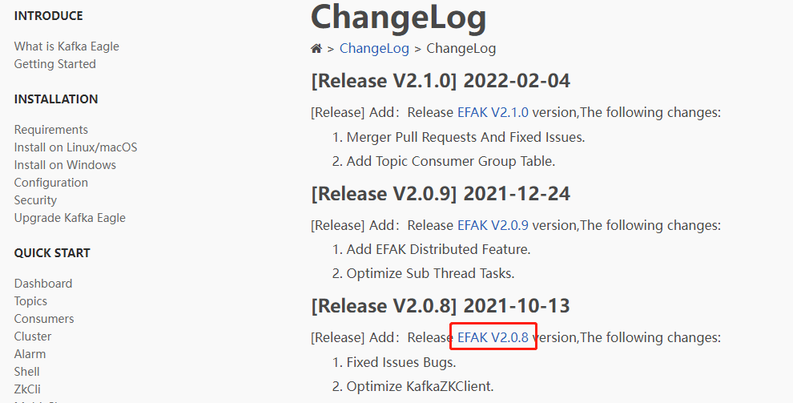
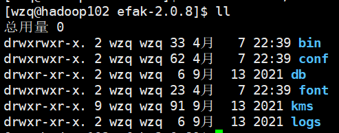
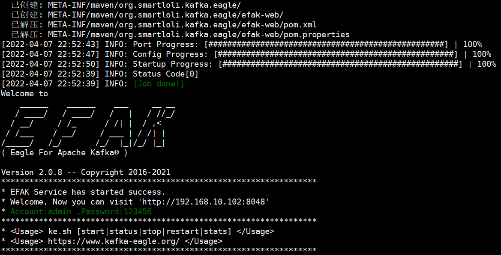
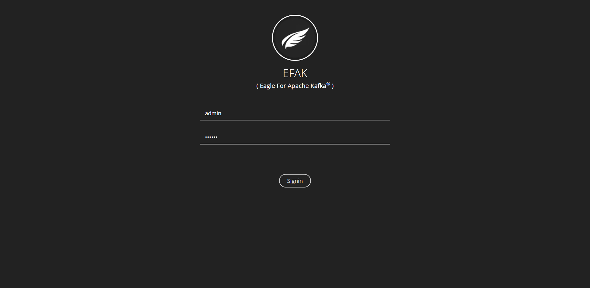
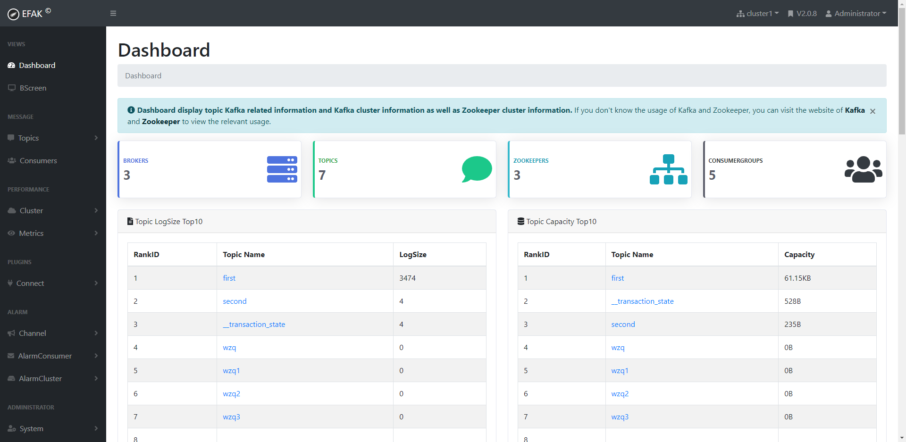
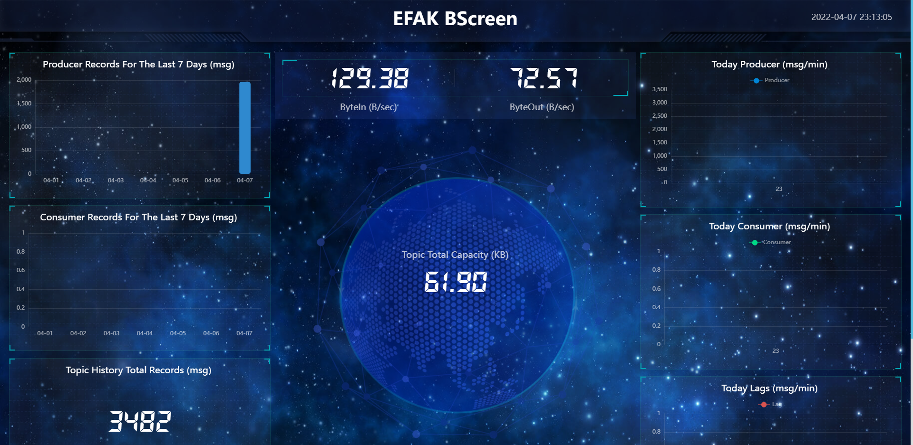

> Kafka-Eagle是一款用于监控和管理Kafka的完全开源系统，本blog将安装这个东西

## 一、安装MySQL

在之前学习Hive的时候，将Hive的derby数据库替换为了MySQL数据库，安装MySQL的步骤在本blog略过，读者如果没有安装MySQL，[请点击这串字进行安装](http://wzqwtt.club/2022/03/12/hive-an-zhuang-bu-shu-bing-ti-huan-derby-wei-mysql/)。


## 二、Kafka环境准备

第一步关闭kafka集群：

```bash
[wzq@hadoop102 kafka-3.0.0]$ kf.sh stop
[wzq@hadoop102 kafka-3.0.0]$ jpsall
=============== hadoop102 ===============
3672 QuorumPeerMain
11119 Jps
=============== hadoop103 ===============
8292 Jps
3531 QuorumPeerMain
=============== hadoop104 ===============
8314 Jps
3551 QuorumPeerMain
```

等待Kafka集群关闭之后，修改一些参数：

```bash
[wzq@hadoop102 kafka-3.0.0]$ vim bin/kafka-server-start.sh
```

修改对应的这里，拿下面的这个替换掉原来的：

```bash
if [ "x$KAFKA_HEAP_OPTS" = "x" ]; then
#    export KAFKA_HEAP_OPTS="-Xmx1G -Xms1G"
    export KAFKA_HEAP_OPTS="-server -Xms2G -Xmx2G -XX:PermSize=128m -XX:+UseG1GC -XX:MaxGCPauseMillis=200 -XX:ParallelGCThreads=8 -XX:ConcGCThreads=5 -XX:InitiatingHeapOccupancyPercent=70"
    export JMX_PORT="9999"
fi
```

修改完成进行分发：

```bash
[wzq@hadoop102 kafka-3.0.0]$ xsync bin/kafka-server-start.sh
```

启动Kafka集群：

```bash
[wzq@hadoop102 kafka-3.0.0]$ kf.sh start
============启动 hadoop102 Kafka============
============启动 hadoop103 Kafka============
============启动 hadoop104 Kafka============
[wzq@hadoop102 kafka-3.0.0]$ jpsall
=============== hadoop102 ===============
3672 QuorumPeerMain
11720 Jps
11644 Kafka
=============== hadoop103 ===============
8745 Kafka
3531 QuorumPeerMain
8845 Jps
=============== hadoop104 ===============
8866 Jps
3551 QuorumPeerMain
8767 Kafka
```


## 三、安装Kafka-Eagle

Kafka-Eagle官网：https://www.kafka-eagle.org/

首先去官网下载它的安装包：http://www.kafka-eagle.org/articles/docs/changelog/changelog.html



点击这里直接下载，下载完成后上传到`/opt/software/`下：

```bash
[wzq@hadoop102 software]$ ll | grep kafka-eagle
-rw-r--r--. 1 wzq wzq  81074069 2月   9 15:23 kafka-eagle-bin-2.0.8.tar.gz
```

然后解压这个目录：

```bash
[wzq@hadoop102 software]$ tar -zxvf kafka-eagle-bin-2.0.8.tar.gz
[wzq@hadoop102 software]$ cd kafka-eagle-bin-2.0.8/
[wzq@hadoop102 kafka-eagle-bin-2.0.8]$ ll
总用量 79164
-rw-rw-r--. 1 wzq wzq 81062577 10月 13 00:00 efak-web-2.0.8-bin.tar.gz
```

解压之后发现里面还有个tar.gz包，然后解压这个压缩包到`/opt/module`：

```bash
[wzq@hadoop102 kafka-eagle-bin-2.0.8]$ tar -zxvf efak-web-2.0.8-bin.tar.gz -C /opt/module/
```

进入到`/opt/module/`修改它的名称：

```bash
[wzq@hadoop102 module]$ cd /opt/module/
[wzq@hadoop102 module]$ mv efak-web-2.0.8/ efak-2.0.8
```

进入这个目录：



然后修改kafka-eagle的配置信息

```bash
[wzq@hadoop102 efak-2.0.8]$ vim conf/system-config.properties
```

将里面的内容全删除，替换为下面的这个文件的内容：

```properties
######################################
# multi zookeeper & kafka cluster list
# Settings prefixed with 'kafka.eagle.' will be deprecated, use 'efak.' instead
######################################
efak.zk.cluster.alias=cluster1
cluster1.zk.list=hadoop102:2181,hadoop103:2181,hadoop104:2181/kafka

######################################
# zookeeper enable acl
######################################
cluster1.zk.acl.enable=false
cluster1.zk.acl.schema=digest
cluster1.zk.acl.username=test
cluster1.zk.acl.password=test123

######################################
# broker size online list
######################################
cluster1.efak.broker.size=20

######################################
# zk client thread limit
######################################
kafka.zk.limit.size=32

######################################
# EFAK webui port
######################################
efak.webui.port=8048

######################################
# kafka jmx acl and ssl authenticate
######################################
cluster1.efak.jmx.acl=false
cluster1.efak.jmx.user=keadmin
cluster1.efak.jmx.password=keadmin123
cluster1.efak.jmx.ssl=false
cluster1.efak.jmx.truststore.location=/data/ssl/certificates/kafka.truststore
cluster1.efak.jmx.truststore.password=ke123456

######################################
# kafka offset storage
######################################
cluster1.efak.offset.storage=kafka
cluster2.efak.offset.storage=zk

######################################
# kafka jmx uri
######################################
cluster1.efak.jmx.uri=service:jmx:rmi:///jndi/rmi://%s/jmxrmi

######################################
# kafka metrics, 15 days by default
######################################
efak.metrics.charts=true
efak.metrics.retain=15

######################################
# kafka sql topic records max
######################################
efak.sql.topic.records.max=5000
efak.sql.topic.preview.records.max=10

######################################
# delete kafka topic token
######################################
efak.topic.token=keadmin

######################################
# kafka sasl authenticate
######################################
cluster1.efak.sasl.enable=false
cluster1.efak.sasl.protocol=SASL_PLAINTEXT
cluster1.efak.sasl.mechanism=SCRAM-SHA-256
cluster1.efak.sasl.jaas.config=org.apache.kafka.common.security.scram.ScramLoginModule required username="kafka" password="kafka-eagle";
cluster1.efak.sasl.client.id=
cluster1.efak.blacklist.topics=
cluster1.efak.sasl.cgroup.enable=false
cluster1.efak.sasl.cgroup.topics=
cluster2.efak.sasl.enable=false
cluster2.efak.sasl.protocol=SASL_PLAINTEXT
cluster2.efak.sasl.mechanism=PLAIN
cluster2.efak.sasl.jaas.config=org.apache.kafka.common.security.plain.PlainLoginModule required username="kafka" password="kafka-eagle";
######################################
# multi zookeeper & kafka cluster list
# Settings prefixed with 'kafka.eagle.' will be deprecated, use 'efak.' instead
######################################
efak.zk.cluster.alias=cluster1
cluster1.zk.list=hadoop102:2181,hadoop103:2181,hadoop104:2181/kafka

######################################
# zookeeper enable acl
######################################
cluster1.zk.acl.enable=false
cluster1.zk.acl.schema=digest
cluster1.zk.acl.username=test
cluster1.zk.acl.password=test123

######################################
# broker size online list
######################################
cluster1.efak.broker.size=20

######################################
# zk client thread limit
######################################
kafka.zk.limit.size=32

######################################
# EFAK webui port
######################################
efak.webui.port=8048

######################################
# kafka jmx acl and ssl authenticate
######################################
cluster1.efak.jmx.acl=false
cluster1.efak.jmx.user=keadmin
cluster1.efak.jmx.password=keadmin123
cluster1.efak.jmx.ssl=false
cluster1.efak.jmx.truststore.location=/data/ssl/certificates/kafka.truststore
cluster1.efak.jmx.truststore.password=ke123456

######################################
# kafka offset storage
######################################
cluster1.efak.offset.storage=kafka

######################################
# kafka jmx uri
######################################
cluster1.efak.jmx.uri=service:jmx:rmi:///jndi/rmi://%s/jmxrmi

######################################
# kafka metrics, 15 days by default
######################################
efak.metrics.charts=true
efak.metrics.retain=15

######################################
# kafka sql topic records max
######################################
efak.sql.topic.records.max=5000
efak.sql.topic.preview.records.max=10

######################################
# delete kafka topic token
######################################
efak.topic.token=keadmin

######################################
# kafka sasl authenticate
######################################
cluster1.efak.sasl.enable=false
cluster1.efak.sasl.protocol=SASL_PLAINTEXT
cluster1.efak.sasl.mechanism=SCRAM-SHA-256
cluster1.efak.sasl.jaas.config=org.apache.kafka.common.security.scram.ScramLoginModule required username="kafka" password="kafka-eagle";
cluster1.efak.sasl.client.id=
cluster1.efak.blacklist.topics=
cluster1.efak.sasl.cgroup.enable=false
cluster1.efak.sasl.cgroup.topics=
cluster2.efak.sasl.enable=false
cluster2.efak.sasl.protocol=SASL_PLAINTEXT
cluster2.efak.sasl.mechanism=PLAIN
cluster2.efak.sasl.jaas.config=org.apache.kafka.common.security.plain.PlainLoginModule required username="kafka" password="kafka-eagle";
cluster2.efak.sasl.client.id=
cluster2.efak.blacklist.topics=
cluster2.efak.sasl.cgroup.enable=false
cluster2.efak.sasl.cgroup.topics=

######################################
# kafka ssl authenticate
######################################
cluster3.efak.ssl.enable=false
cluster3.efak.ssl.protocol=SSL
cluster3.efak.ssl.truststore.location=
cluster3.efak.ssl.truststore.password=
cluster3.efak.ssl.keystore.location=
cluster3.efak.ssl.keystore.password=
cluster3.efak.ssl.key.password=
cluster3.efak.ssl.endpoint.identification.algorithm=https
cluster3.efak.blacklist.topics=
cluster3.efak.ssl.cgroup.enable=false
cluster3.efak.ssl.cgroup.topics=

######################################
# kafka sqlite jdbc driver address
######################################
efak.driver=com.mysql.jdbc.Driver
efak.url=jdbc:mysql://hadoop102:3306/ke?useUnicode=true&characterEncoding=UTF-8&zeroDateTimeBehavior=convertToNull
efak.username=root
efak.password=root

######################################
# kafka mysql jdbc driver address
######################################
#efak.driver=com.mysql.cj.jdbc.Driver
#efak.url=jdbc:mysql://127.0.0.1:3306/ke?useUnicode=true&characterEncoding=UTF-8&zeroDateTimeBehavior=convertToNull
#efak.username=root
#efak.password=123456
```

配置kafka-eagle的环境变量：

```bash
[wzq@hadoop102 efak-2.0.8]$ sudo vim /etc/profile.d/my_env.sh
```

添加以下内容：

```bash
# kafkaEFAK
export KE_HOME=/opt/module/efak-2.0.8
export PATH=$PATH:$KE_HOME/bin
```

然后source一下：

```bash
[wzq@hadoop102 efak-2.0.8]$ source /etc/profile
```


然后就可以启动kafka-eagle了：

```bash
[wzq@hadoop102 efak-2.0.8]$ bin/ke.sh start
```



这样就启动完毕了，然后可以打开浏览器，输入：`hadoop102:8048`访问kafka-eagle：



初始登录账号密码是：admin，123456





在这个可视化页面里面可以看到各种kafka信息，还有大屏显示，以后创建topic也可以直接使用可视化的方式进行创建。

## 参考资料

- [B站尚硅谷Kafka学习视频](https://www.bilibili.com/video/BV1vr4y1677k)
- [Apache Kafka官网](https://kafka.apache.org/)
- [Kafka-Eaggle官网](https://www.kafka-eagle.org/)

