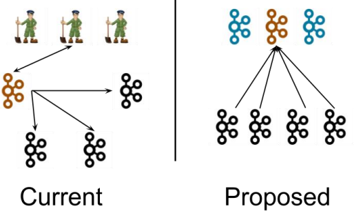

## 一、什么是Kraft模式



如上图所示，左侧的图片是Kafka现有架构，元数据存储在zookeeper中，运行时动态选举controller，由Controller进行Kafka集群管理。右图是Kraft模式（目前仍在实验性阶段），不再依赖zookeeper集群，而是用三台controller节点代替zookeeper，元数据保存在zookeeper中，由controller直接进行kafka集群管理。

这样做是由很多好处的：

- Kafka不再依赖外部框架，就能独立运行
- controller管理集群，不再需要从zookeeper中先读取数据，集群性能会提高
- 由于不依赖zookeeper，集群扩展时不再受到zookeeper读写能力限制
- controller不再动态选举，而是由配置文件规定。这样就可以有针对性地加强controller节点地配置，而不是像以前一样对随机controller节点地高负载束手无策


## 二、Kafka-Kraft集群部署

在开始集群先关掉kafka：

```bash
[wzq@hadoop102 ~]$ kf.sh stop
[wzq@hadoop102 ~]$ zk.sh stop
[wzq@hadoop102 ~]$ jpsall
=============== hadoop102 ===============
5395 Jps
=============== hadoop103 ===============
5484 Jps
=============== hadoop104 ===============
5515 Jps
```


新解压一份kafka：

```bash
[wzq@hadoop102 ~]$ cd /opt/software/
[wzq@hadoop102 software]$ ll | grep kafka
-rw-r--r--. 1 wzq wzq  86486610 3月  31 19:11 kafka_2.12-3.0.0.tgz
drwxrwxr-x. 2 wzq wzq        39 10月 13 00:00 kafka-eagle-bin-2.0.8
-rw-r--r--. 1 wzq wzq  81074069 2月   9 15:23 kafka-eagle-bin-2.0.8.tar.gz
[wzq@hadoop102 software]$ tar -zxvf kafka_2.12-3.0.0.tgz -C /opt/module/
```

为新解压的kafka更名：

```bash
[wzq@hadoop102 software]$ cd /opt/module/
[wzq@hadoop102 module]$ ll | grep kafka
drwxr-xr-x.  7 wzq wzq  105 9月   9 2021 kafka_2.12-3.0.0
drwxr-xr-x.  9 wzq wzq  196 4月   2 23:06 kafka-3.0.0
[wzq@hadoop102 module]$ mv kafka_2.12-3.0.0/ kafka-kraft
```

进入到这个目录，然后修改kraft对应的配置文件：

```bash
[wzq@hadoop102 kafka-kraft]$ vim config/kraft/server.properties
```

修改以下内容：

```properties
# node.id全局位唯一，这里配置hadoop102为2，hadoop103为3，hadoop104为4
node.id=2

# 配置controller选举，把三台主机都写上，注意前面的234对应node.id
controller.quorum.voters=2@hadoop102:9093,3@hadoop103:9093,4@hadoop104:9093

# 对外暴露的端口号，这里修改localhost为当前主机名
advertised.listeners=PLAINTEXT://hadoop102:9092

# 修改日志存储位置
log.dirs=/opt/module/kafka-kraft/data
```

分发：

```bash
[wzq@hadoop102 module]$ xsync kafka-kraft/
```

分发完毕之后，到hadoop103和104修改配置的node.id和对外暴露的地址：

```bash
[wzq@hadoop103 ~]$ cd /opt/module/kafka-kraft/
[wzq@hadoop103 kafka-kraft]$ vim config/kraft/server.properties
# 在Hadoop103修改这个
node.id=3
advertised.listeners=PLAINTEXT://hadoop103:9092

# 同理在Hadoop104也修改一下
[wzq@hadoop104 ~]$ cd /opt/module/kafka-kraft/
[wzq@hadoop104 kafka-kraft]$ vim config/kraft/server.properties
node.id=4
advertised.listeners=PLAINTEXT://hadoop104:9092
```


改完之后就可以启动集群了，回到Hadoop102主机，首先进行初始化

先生产一个UUID，存储目录的唯一id：

```bash
[wzq@hadoop102 kafka-kraft]$ bin/kafka-storage.sh random-uuid
zECZhe_CRP2bEYnCYX6O_w
```

用该UUID格式化kafka存储目录，在三台节点上都要初始化一下：

```bash
[wzq@hadoop102 kafka-kraft]$ bin/kafka-storage.sh format -t zECZhe_CRP2bEYnCYX6O_w -c /opt/module/kafka-kraft/config/kraft/server.properties
[wzq@hadoop103 kafka-kraft]$ bin/kafka-storage.sh format -t zECZhe_CRP2bEYnCYX6O_w -c /opt/module/kafka-kraft/config/kraft/server.properties
[wzq@hadoop104 kafka-kraft]$ bin/kafka-storage.sh format -t zECZhe_CRP2bEYnCYX6O_w -c /opt/module/kafka-kraft/config/kraft/server.properties
```

然后就可以启动kafka了：

```bash
[wzq@hadoop102 kafka-kraft]$ bin/kafka-server-start.sh -daemon config/kraft/server.properties
[wzq@hadoop103 kafka-kraft]$ bin/kafka-server-start.sh -daemon config/kraft/server.properties
[wzq@hadoop104 kafka-kraft]$ bin/kafka-server-start.sh -daemon config/kraft/server.properties
```

停止Kafka：

```bash
[wzq@hadoop102 kafka-kraft]$ bin/kafka-server-stop.sh
[wzq@hadoop103 kafka-kraft]$ bin/kafka-server-stop.sh
[wzq@hadoop104 kafka-kraft]$ bin/kafka-server-stop.sh
```


ok，这样就算部署成功啦

## 三、编写kafka-kraft启停脚本

为了方便同意启动停止kafka-kraft，可以编写一个脚本：

来到家目录，新建一个shell脚本：

```bash
[wzq@hadoop102 bin]$ pwd
/home/wzq/bin
[wzq@hadoop102 bin]$ vim kf2.sh
```

填入以下内容：

```bash
#! /bin/bash

case $1 in
"start"){
	for i in hadoop102 hadoop103 hadoop104
	do
		echo "---------启动 $i Kafka-Kraft---------"
		ssh $i "/opt/module/kafka-kraft/bin/kafka-server-start.sh -daemon /opt/module/kafka-kraft/config/kraft/server.properties"
	done
};;
"stop"){
        for i in hadoop102 hadoop103 hadoop104
        do
                echo "---------停止 $i Kafka-Kraft---------"
                ssh $i "/opt/module/kafka-kraft/bin/kafka-server-stop.sh"
        done
};;
esac
```

使该文件具有可执行权限：

```bash
[wzq@hadoop102 bin]$ chmod +x kf2.sh
```


测试一下：

```bash
# 启动
[wzq@hadoop102 bin]$ kf2.sh start
---------启动 hadoop102 Kafka-Kraft---------
---------启动 hadoop103 Kafka-Kraft---------
---------启动 hadoop104 Kafka-Kraft---------
[wzq@hadoop102 bin]$ jpsall
=============== hadoop102 ===============
7321 Kafka
7401 Jps
=============== hadoop103 ===============
7079 Jps
7003 Kafka
=============== hadoop104 ===============
7108 Jps
7032 Kafka

# 停止，停止的过程有点慢，稍微等一下再看j
[wzq@hadoop102 bin]$ kf2.sh stop
---------停止 hadoop102 Kafka-Kraft---------
---------停止 hadoop103 Kafka-Kraft---------
---------停止 hadoop104 Kafka-Kraft---------
[wzq@hadoop102 bin]$ jpsall
=============== hadoop102 ===============
7494 Jps
=============== hadoop103 ===============
7173 Jps
=============== hadoop104 ===============
7201 Jps
```


## 参考资料

- [B站尚硅谷Kafka学习视频](https://www.bilibili.com/video/BV1vr4y1677k)
- [Apache Kafka官网](https://kafka.apache.org/)

