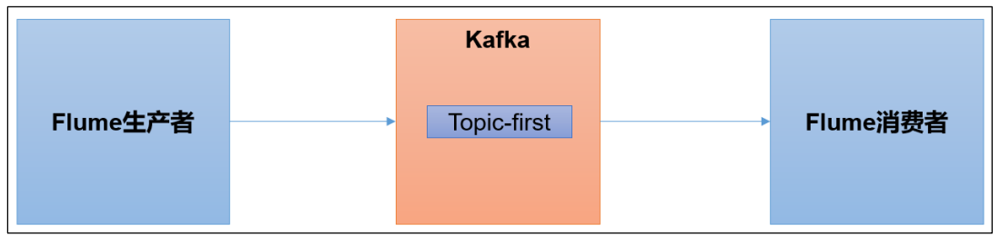
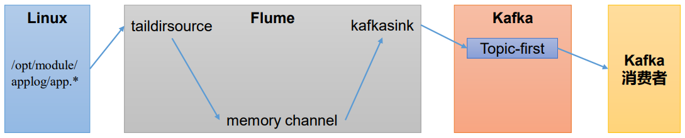
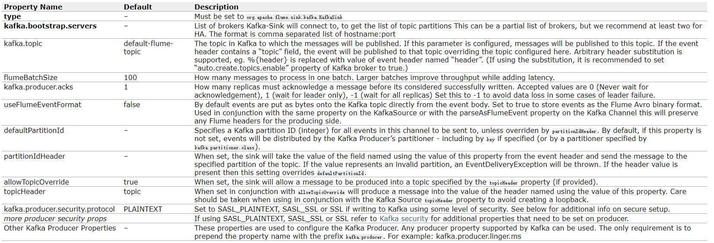
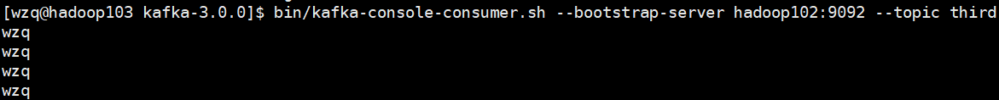
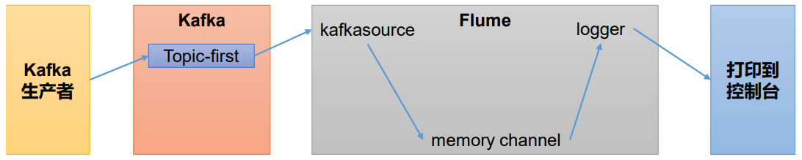
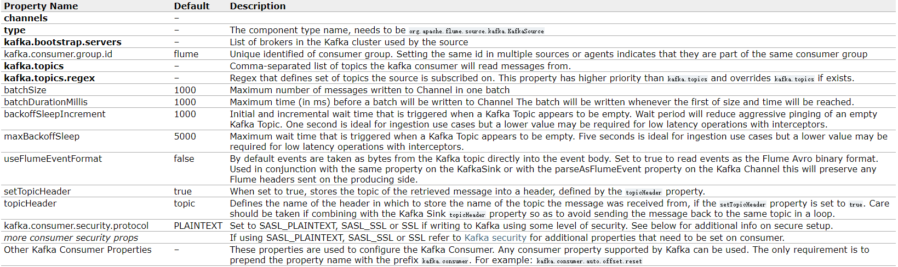
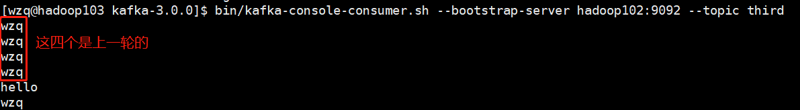
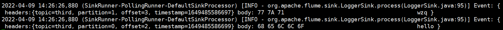

> Kafka作为一个消息队列框架，可以与很多框架集成，本blog将介绍Kafka和Flume的集成

如下图所示：Flume可以作为kafka的生产者，也可以作为消费者




在开始之前，应该确保服务器有Kafka和Flume，如果没有可以访问下面的连接安装部署Kafka和Flume：

- [Flume安装部署](http://wzqwtt.club/2022/03/25/flume-an-zhuang-bu-shu-yi-ji-ru-men-an-li/)
- [Kafka分布式安装部署](http://wzqwtt.club/2022/04/01/kafka-fen-bu-shi-an-zhuang-bu-shu/)


## 一、Kafka sink

### 1、需求分析

**需求：**Flume作为生产者，将生产的数据输入到kafka的某个主题，kafka的消费者也能消费到主题里的数据，如下图所示：



需要在hadoop102编写的Flume conf配置文件，source是tailSource，使用memory channel，sink使用kafka sink，为了测试数据是否存储到了topic，再启动一个kafka消费者消费这个topic的数据，指定存储数据的topic是：`third`


首先启动zookeeper和kafka，并创建一个third主题指定分区和副本数都是3个：

```bash
[wzq@hadoop102 ~]$ zk.sh start
[wzq@hadoop102 ~]$ kf.sh start
[wzq@hadoop102 kafka-3.0.0]$ jpsall
=============== hadoop102 ===============
5449 Jps
3307 QuorumPeerMain
3679 Kafka
=============== hadoop103 ===============
3360 Jps
3002 Kafka
2622 QuorumPeerMain
=============== hadoop104 ===============
2624 QuorumPeerMain
2999 Kafka
3327 Jps
[wzq@hadoop102 ~]$ cd /opt/module/kafka-3.0.0/
[wzq@hadoop102 kafka-3.0.0]$ bin/kafka-topics.sh --bootstrap-server hadoop102:9092 --create --topic third --partitions 3 --replication-factor 3
Created topic third.
[wzq@hadoop102 kafka-3.0.0]$ bin/kafka-topics.sh --bootstrap-server hadoop102:9092 --describe --topic third
Topic: third	TopicId: BB9Fk7U_Qb-NJOQB3UhE-Q	PartitionCount: 3	ReplicationFactor: 3	Configs: segment.bytes=1073741824
	Topic: third	Partition: 0	Leader: 0	Replicas: 0,2,1	Isr: 0,2,1
	Topic: third	Partition: 1	Leader: 2	Replicas: 2,1,0	Isr: 2,1,0
	Topic: third	Partition: 2	Leader: 1	Replicas: 1,0,2	Isr: 1,0,2
```


### 2、编写Flume配置文件

进入到flume的安装目录，在此目录的job目录下创建一个文件：`file_to_kafka.conf`：

```bash
[wzq@hadoop102 flume-1.9.0]$ cd /opt/module/flume-1.9.0/
[wzq@hadoop102 flume-1.9.0]$ touch job/file_to_kafka.conf
```

编写该文件，首先就是Agent与各个组件的命名：

```properties
# Agent
a1.sources = r1
a1.channels = c1
a1.sinks = k1
```

然后是source，使用的是`tailDir Source`，监控一个文件，可以实现断点续传等功能，监控的是`/opt/module/datas/applog/app.*`这个目录下所有app开头的文件，后缀名无所谓：

```properties
# tailDir Source
a1.sources.r1.type = TAILDIR
a1.sources.r1.filegroups = f1
a1.sources.r1.filegroups.f1 = /opt/module/datas/applog/app.*
a1.sources.r1.positionFile = /opt/module/flume-1.9.0/tail_dir.json
```

使用的是`memory channel`：

```properties
# memory channel
a1.channels.c1.type = memory
a1.channels.c1.capacity = 1000
a1.channels.c1.transactionCapacity = 100
```

然后是kafka sink，打开官网看一看：



必须配置的是黑色字体，`type`必须写一个全类名，`kafka.bootstrap.servers`写的是要连接的kafka集群，`kafka.topic`指的是要连接哪个topic，`flumeBatchSize`表示一个批次有多少数据，`kafka.producer.acks`这个是Broker向Producer的应答等级，这里设置为1，表示Leader收到数据后应答，`linger.ms`表示隔多久发一次数据：

```properties
# kafka sinks
a1.sinks.k1.type = org.apache.flume.sink.kafka.KafkaSink
a1.sinks.k1.kafka.bootstrap.servers = hadoop102:9092,hadoop103:9092,hadoop104:9092
a1.sinks.k1.kafka.topic = third
a1.sinks.k1.kafka.flumeBatchSize = 20
a1.sinks.k1.kafka.producer.acks = 1
a1.sinks.k1.kafka.producer.linger.ms = 1
```


最后绑定：

```properties
# bind
a1.sources.r1.channels = c1
a1.sinks.k1.channel = c1
```


### 3、测试

首先在hadoop103开启一个消费者，消费third主题的数据：

```bash
[wzq@hadoop103 ~]$ cd /opt/module/kafka-3.0.0/ 
[wzq@hadoop103 kafka-3.0.0]$ bin/kafka-console-consumer.sh --bootstrap-server hadoop102:9092 --topic third
```

只要有数据生产，消费者就可以消费到数据，打印到控制台


然后在hadoop102启动Flume的这个配置文件：

```bash
[wzq@hadoop102 flume-1.9.0]$ bin/flume-ng agent -n a1 -c conf/ -f job/file_to_kafka.conf
```

复制一个hadoop102窗口，在要监控的文件夹里面创建一个文件并且追加一些数据：

```bash
[wzq@hadoop102 module]$ cd /opt/module/datas/applog/
[wzq@hadoop102 applog]$ touch app.log
[wzq@hadoop102 applog]$ echo wzq >> app.log
[wzq@hadoop102 applog]$ echo wzq >> app.log
[wzq@hadoop102 applog]$ echo wzq >> app.log
[wzq@hadoop102 applog]$ echo wzq >> app.log
```


消费者已经成功消费到数据了：




## 二、Kafka source

### 1、需求分析

这次将集成kafka作为生产者生产数据然后作为Flume的source，把数据输出到控制台：




需要在hadoop102上编写Flume conf配置文件，使用kafka source、memory channel和logger sink

### 2、编写Flume配置文件


首先在hadoop102上创建conf文件：

```bash
[wzq@hadoop102 flume-1.9.0]$ touch job/kafka_to_file.conf
```

写这个文件的第一部分，命名Agent：

```properties
# Agent
a1.sources = r1
a1.channels = c1
a1.sinks = k1
```


然后是Kafka Source，打开官网看一下：



必须配置的是黑色的字体，其中`kafka.topics.regex`是指定topic的一个正则表达式，它和`kafka.topics`只需要配置一个就好了：

```properties
# kafka source
a1.sources.r1.type = org.apache.flume.source.kafka.KafkaSource
a1.sources.r1.kafka.bootstrap.servers = hadoop102:9092,hadoop103:9092,hadoop104:9092
a1.sources.r1.kafka.topics = third
a1.sources.r1.kafka.consumer.group.id = custom.g.id
a1.sources.r1.batchSize = 50
a1.sources.r1.batchDurationMillis = 200
```


然后是memory channel、logger sink和绑定：

```properties
# memory channel
a1.channels.c1.type = memory
a1.channels.c1.capacity = 1000
a1.channels.c1.transactionCapacity = 100

# logger sink
a1.sinks.k1.type = logger

# bind 
a1.sources.r1.channels = c1
a1.sinks.k1.channel = c1
```


### 3、测试

写完这个文件了，开始测试，首先在hadoop102启动这个flume：

```bash
[wzq@hadoop102 flume-1.9.0]$ bin/flume-ng agent -c conf/ -n a1 -f job/kafka_to_file.conf -Dflume.root.logger=INFO,console
```

这个窗口不要关，去hadoop104启动一个生产者，生产主题third的数据，然后发送几个数据：

```bash
[wzq@hadoop104 kafka-3.0.0]$ bin/kafka-console-producer.sh --bootstrap-server hadoop102:9092 --topic third
>hello
>wzq
```


这时候在hadoop103的消费者消费到了数据，在hadoop102上的flume也拿到了数据：

消费者消费到数据：



Flume拿到数据：




## 参考资料

- [B站尚硅谷Kafka学习视频](https://www.bilibili.com/video/BV1vr4y1677k)
- [Apache Kafka官网](https://kafka.apache.org/)
- [Apache Flume官网](https://flume.apache.org/)
