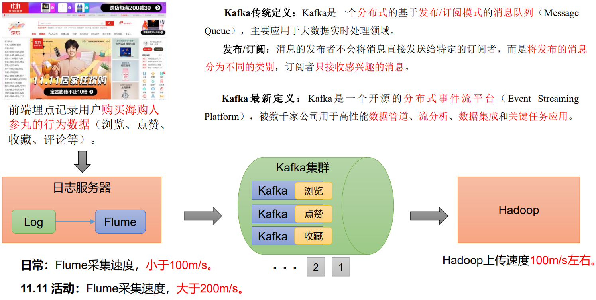
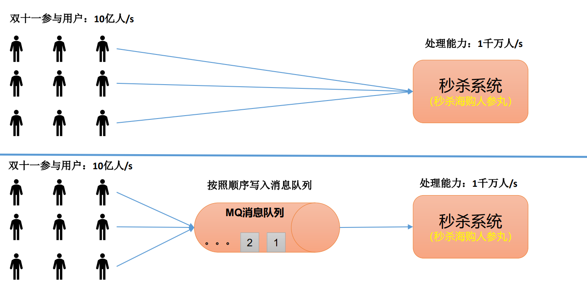
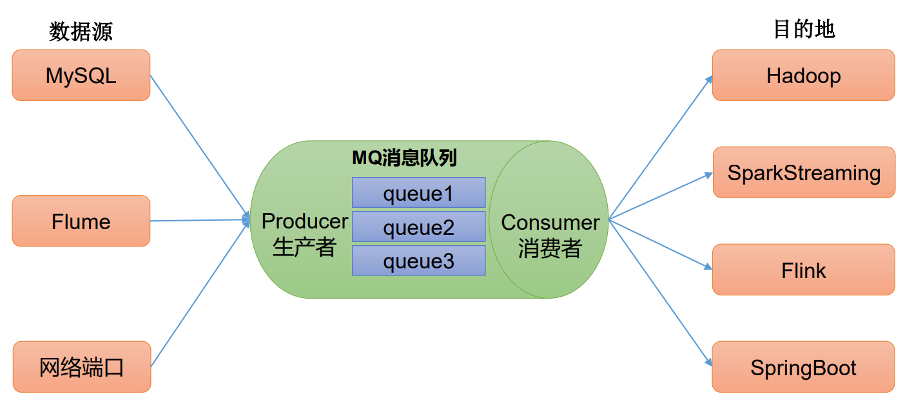
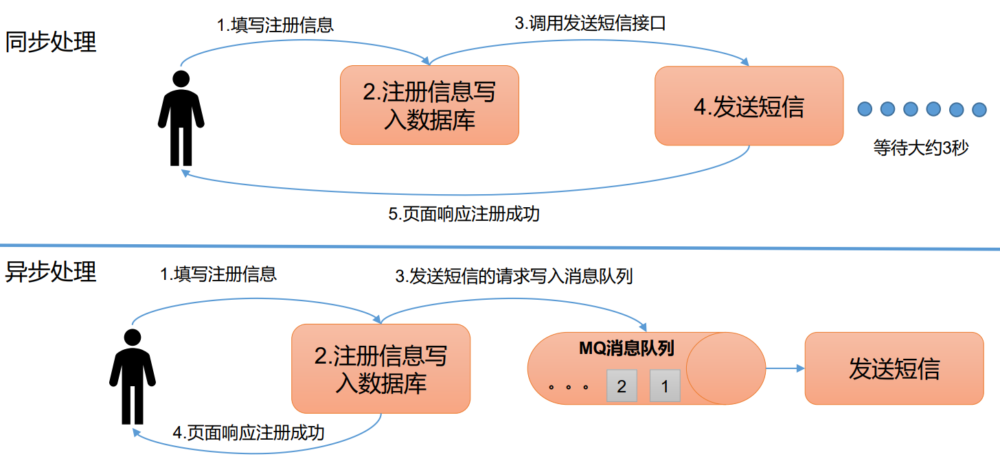
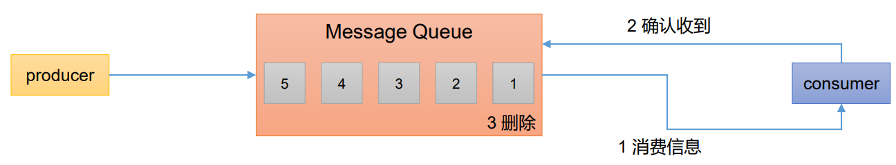
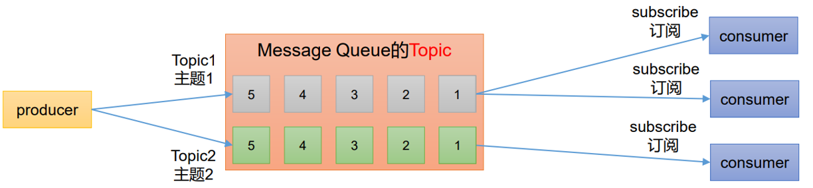

## 一、Kafka是什么？

如下图所示，现在的各大电商平台都会在前端埋点，记录用户的浏览、点赞、收藏、评论等信息，然后对这些客户精准的投放广告，所以这些信息都要存储起来，日常的存储都是使用Flume进行采集，然后输出到Hadoop的HDFS，Flume的在日常的采集速度小于100兆每秒，Hadoop的上传速度在100兆每秒左右。

但是现在各大电商平台推出的都有大型购物节，比如双十一、618等，那时候这些个数据量可是非常大啊，两百兆每秒，Hadoop表示我hold不住啊，所以消息中间件`Kafka`就诞生了

`Kafka`处于Flume和Hadoop中间的一个位置，它负责缓冲这些数据，也可以将这些数据分而治之，如下图所示：

`Kafka`的传统定义是：是一个分布式的基于`发布/订阅模式`的`消息队列（Message Queue）`，主要应用于大数据实时处理领域

`发布/订阅`：消息的发布者不会将消息直接发送给特定的订阅者，而是**将发布的消息分为不同的类别**，订阅者只去拿感兴趣的消息

`Kafka`不满足于只作为一个消息中间件，它励志要成为顶流，所以官网给它最新的定义是：一个开源的分布式事件流平台（`Event Streaming Platform`），然后还要被数千家公司用作数据管道、流分析、数据集成和关键人物应用。

## 二、Kafka消息队列

Kafka是一种消息队列，比较常见的消息队列框架有：`Kafka`、`ActiveMQ`、`RabbitMQ`、`RocketMQ`等等

在大数据场景下主要采用`Kafka`作为消息队列，在JavaEE开发中主要采用`ActivateMQ`、`RabbitMQ`等消息队列产品

### 1、消息队列应用场景

#### 1.1 缓冲/消峰

如下图所示，电商网站都有秒杀服务这个板块，特别是当双十一等一系列购物节的时候会有很多人参与秒杀

假设秒杀服务的处理能力是每秒1千万人，但是参与的用户远远大于这个人数，那么这个秒杀服务就崩溃掉了

所以消息队列就派上用场了，碰到这么多人参与秒杀，kafka可以按顺序将用户的请求写入消息队列，然后一条一条的交给秒杀系统，这样服务就不容易崩溃

#### 1.2 解耦

消息队列还有一个应用场景就是`解耦`，我们可能有很多的数据源，能处理这些数据的平台有非常多，可以为每队数据源与目的地建立专门的连接编写相关的代码，但是这实在太麻烦了，于是`kafka`就派上用场了，它允许用户独立的扩展或修改两边的处理过程，只要确保遵守相同的接口约束

#### 1.3 异步通信

假设有个用户在一个网站注册，注册的时候需要把注册信息传给数据库然后再调用发送短信接口发送短信，如果这时候有很多用户同时过来注册，那麻烦了，这个页面响应的时间就会特别长

所以消息队列允许我们在注册的时候将数据写入数据库，然后创建一个消息队列专门处理发送短信业务

### 2、消息队列的两种模式

#### 2.1 点对点模式

生产者（`producer`）生产数据放入消息队列，消费者（`consumer`）拿取数据然后确认收到再从消息队列中删除消息

#### 2.2 发布/订阅模式

这个模式的消息队列中可以有多个`Topic`，然后一个Topic可以绑定多个消费者，每个消费者相互独立都可以消费数据，消费者在消费完数据后并没有立即删除消息

## 三、Kafka的基础架构

如上图所示，这就是kafka的基础架构：

- `Producer`：消息生产者，就是向Kafka的每个`broker`（kafka集群中每个kafka主机的名字）发送消息的客户端
- `Consumer`：消费消费者，它会主动拉取`Kafka broker`的消息
- `Consumer Group`：消费者组，由多个consumer组成。消费者组内每个消费者负责消费不同分区的数据，一个分区只能由一个组内消费者消费；消费者组之间互不影响。所有消费者都属于某个消费者组，即消费者组是逻辑上的一个订阅者
- `Broker`：一台Kafka服务器就是一个broker，一个集群由多个broker组成，一个broker可以容纳多个topic
- `Topic`：一个话题的队列
- `Partition`：一个非常大的topic可以分布到多个broker，一个topic可以分为多个partition，每个partition是一个有序的队列
- `Replica`：副本，一个topic的每个分区都可以有若干个副本，一个Leader和若干个Follower
- `Leader`：每个分区都会产生多个副本，消费者会首先副本名为Leader的分区队列
- `Follower`：每个分区副本的从，实时从Leader同步数据保持数据同步。当Leader所在服务器发生故障，Follower自动上位成为新的Leader

## 参考资料

- [B站尚硅谷Kafka学习视频](https://www.bilibili.com/video/BV1vr4y1677k)
- [Apache Kafka官网](https://kafka.apache.org/)

