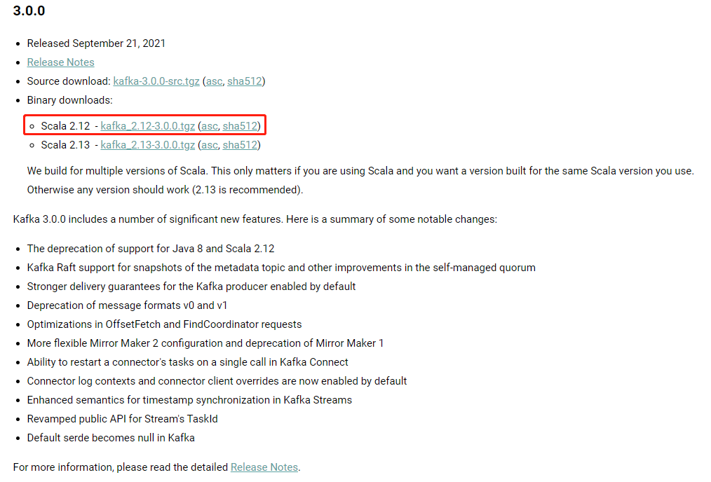
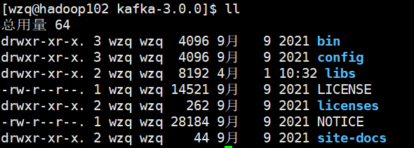
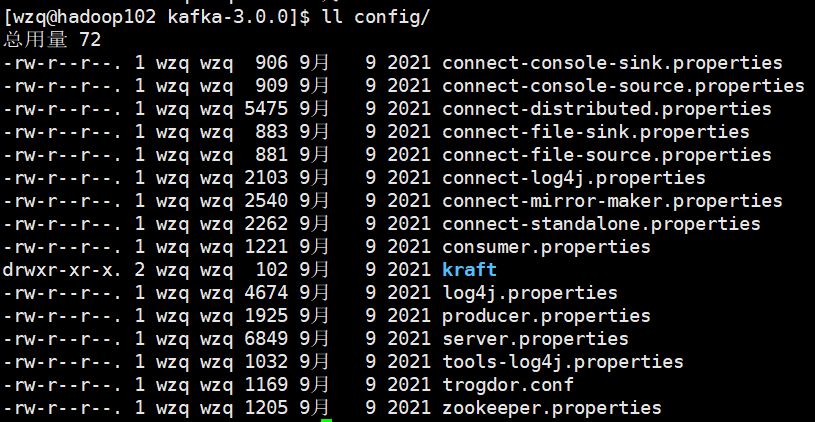
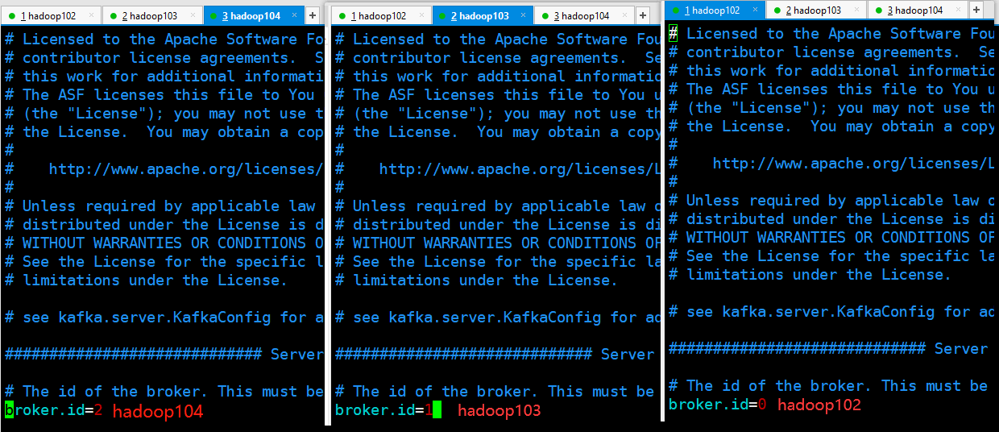
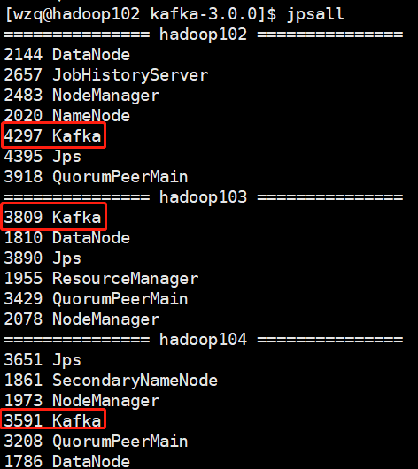
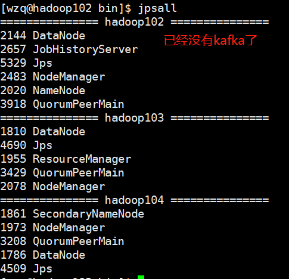

虽说`Kafka`目前正在慢慢抛弃`Zookeeper`，但是即将安装的`Kafka 3.0.0`还是依赖于`Zookeeper`的

这篇blog将会在三台hadoop主机上安装`Kafka`，所以在本blog之前应该确保你的虚拟机有`Hadoop`和`Zookeeper`环境：

- [1、搭建模板虚拟机](https://blog.csdn.net/lesileqin/article/details/115396712)
- [2、克隆虚拟机](https://blog.csdn.net/lesileqin/article/details/115397591)
- [3、安装Java、Hadoop以及集群分发](https://blog.csdn.net/lesileqin/article/details/115398618)
- [4、配置Hadoop集群](https://blog.csdn.net/lesileqin/article/details/115402954)
- [5、配置历史服务器、日志聚集](https://blog.csdn.net/lesileqin/article/details/115420664)
- [6、编写集群统一启动停止脚本以及查看所有服务器Java进程脚本](https://blog.csdn.net/lesileqin/article/details/115426329)
- [7、Zookeeper分布式环境安装](http://localhost:4000/2022/03/11/zookeeper-ben-di-yu-fen-bu-shi-an-zhuang/)


## 一、Kafka集群部署规划

如下表所示，我们要在三台主机都安装zookeeper和kafka

| hadoop102         | hadoop103         | hadoop104         |
| ----------------- | ----------------- | ----------------- |
| zookeeper, myid=2 | zookeeper, myid=3 | zookeeper, myid=4 |
| kafka, broker=0   | kafka, broker=1   | kafka, broker=2   |

zookeeper在每个主机都有对应的myid，在102、103、104分别设置为2、3、4（这个在安装zookeeper已经配过了）

kafka在每个主机都有对应的`broker id`，在102、103、104分别设置为0、1、2


## 二、安装Kafka

### 1、下载kafka安装包

下载安装包最好去`Kafka`官网：https://kafka.apache.org/downloads



如上图所示，我们下载`scala 2.12`版本的`kafka`，因为kafka的生产者和消费者是使用Java写的，但是中间的broker是用scala写的，我们下载上如图所示`kafka_2.12-3.0.0.tgz`


下载之后上传到`hadoop102`的`/opt/software/`目录下：

```bash
[wzq@hadoop102 software]$ ll | grep kafka
-rw-r--r--. 1 wzq wzq  86486610 3月  31 19:11 kafka_2.12-3.0.0.tgz
```

然后将他解压到`/opt/module/`下：

```bash
[wzq@hadoop102 software]$ tar -zxvf kafka_2.12-3.0.0.tgz -C /opt/module/
# 给这个文件夹改个名字
[wzq@hadoop102 module]$ cd /opt/module/
[wzq@hadoop102 module]$ mv kafka_2.12-3.0.0/ kafka-3.0.0/
```


### 2、kafka目录解读

打开解压后的目录看一下：



如上图所示，共有以下这些文件夹：

- `bin`：这里存放了一些操作kafka的命令，比如`kafka-server-start.sh`（启动kafka服务），`kafka-server-stop.sh`（停止kafka服务）等等
- `config`：配置文件目录，在这个目录存放了一些配置文件
- `libs`：存放了kafka依赖的第三方jar包
- `LICENSE`、`liccenses`、`NOTICE`、`site-docs`：这四个目录或文件的意义不大，主要放了一些开源协议和使用文档

### 3、修改配置文件

配置文件存储在kafka的`config/`目录下：



我们比较关心的是`server.properties`的以下几个属性：

```properties
# 每个主机的broker.id需要在所有的集群保持唯一
broker.id=0
# 存储kafka信息的目录，需要将它修改到kafka的安装目录下
log.dirs=/tmp/kafka-logs
# zookeeper主机的连接地址
zookeeper.connect=localhost:2181
```

把以上三个属性改为以下配置：

```properties
broker.id=0
log.dirs=/opt/module/kafka-3.0.0/datas
zookeeper.connect=hadoop102:2181,hadoop103:2181,hadoop104:2181/kafka
```

### 4、分发安装包并配置broker

修改为以上配置，可以对这个安装包进行分发：

```bash
[wzq@hadoop102 module]$ xsync kafka-3.0.0/
```

然后打开hadoop103和hadoop104，分别更改`config/server.properties`这个文件的`broker.id`为1和2



> 这个红字不在文件里面，是我用截图工具自己打的！切记不要添加在配置文件！

### 5、配置环境变量

然后我们增加kafka的环境变量：

```bash
[wzq@hadoop102 kafka-3.0.0]$ sudo vim /etc/profile.d/my_env.sh
```

然后添加以下内容：

```bash
# KAFKA_HOME
export KAFKA_HOME=/opt/module/kafka-3.0.0
export PATH=$PATH:$KAFKA_HOME/bin
```

然后将这个东西分发到其他两台主机：

```bash
[wzq@hadoop102 kafka-3.0.0]$ sudo /home/wzq/bin/xsync /etc/profile.d/my_env.sh
```

然后在三台主机挨个source环境变量：

```bash
[wzq@hadoop102 ~]$ source /etc/profile
[wzq@hadoop103 ~]$ source /etc/profile
[wzq@hadoop104 ~]$ source /etc/profile
```

### 6、启动Kafka

启动Kafka集群首先要启动`zookeeper`，直接使用原来写的`zookeeper`启停脚本启动三个`zookeeper`：

```bash
[wzq@hadoop102 ~]$ zk.sh start
=============== zookeeper hadoop102 启动 ===============
ZooKeeper JMX enabled by default
Using config: /opt/module/zookeeper-3.5.7/bin/../conf/zoo.cfg
Starting zookeeper ... STARTED
=============== zookeeper hadoop103 启动 ===============
ZooKeeper JMX enabled by default
Using config: /opt/module/zookeeper-3.5.7/bin/../conf/zoo.cfg
Starting zookeeper ... STARTED
=============== zookeeper hadoop104 启动 ===============
ZooKeeper JMX enabled by default
Using config: /opt/module/zookeeper-3.5.7/bin/../conf/zoo.cfg
Starting zookeeper ... STARTED
```

然后开启kafka需要在三台hadoop主机分别启动：

```bash
[wzq@hadoop102 kafka-3.0.0]$ bin/kafka-server-start.sh -daemon config/server.properties
[wzq@hadoop103 kafka-3.0.0]$ bin/kafka-server-start.sh -daemon config/server.properties
[wzq@hadoop104 kafka-3.0.0]$ bin/kafka-server-start.sh -daemon config/server.properties
```

可以使用`jpsall`看一下所有主机kafka的启动情况：




## 三、编写kafka启停脚本

但是我们一台一台的启动kafka实在太麻烦了，所以我们可以写一个启停脚本，首先在家目录的bin目录下创建它：

```bash
[wzq@hadoop102 kafka-3.0.0]$ cd
[wzq@hadoop102 ~]$ vim bin/kf.sh
```

写入以下内容，比较简单就不解释了：

```bash
#! /bin/bash

case $1 in
"start"){
	for i in hadoop102 hadoop103 hadoop104
	do
		echo "============启动 $i Kafka============"
		ssh $i "/opt/module/kafka-3.0.0/bin/kafka-server-start.sh -daemon /opt/module/kafka-3.0.0/config/server.properties"
	done
};;
"stop"){
        for i in hadoop102 hadoop103 hadoop104
        do
                echo "============停止 $i Kafka============"
                ssh $i "/opt/module/kafka-3.0.0/bin/kafka-server-stop.sh -daemon /opt/module/kafka-3.0.0/config/server.properties"
        done
};;
esac
```


然后给这个脚本权限，并把它分发到另外的主机

```bash
[wzq@hadoop102 ~]$ chmod 777 bin/kf.sh 
[wzq@hadoop102 ~]$ xsync bin/kf.sh
```


刚刚已经启动kafka了，现在可以试着使用这个脚本停止kafka：

```bash
[wzq@hadoop102 bin]$ kf.sh stop
============停止 hadoop102 Kafka============
============停止 hadoop103 Kafka============
============停止 hadoop104 Kafka============
```

然后看一下JPS：



已经全部关闭kafka

> **切记！当停止Kafka集群时候，一定要等kafka进程全部关闭（当JPS已经没有kafka的时候）才可以关闭zookeeper，否则kafka将无法正常关闭。**因为zookeeper集群当中记录着kafka集群相关信息，zookeeper集群一旦先停止，kafka集群就没办法获取停止进程的信息，只能手动杀死kafka进程了。


## 参考资料

- [B站尚硅谷Kafka学习视频](https://www.bilibili.com/video/BV1vr4y1677k)
- [Apache Kafka官网](https://kafka.apache.org/)

