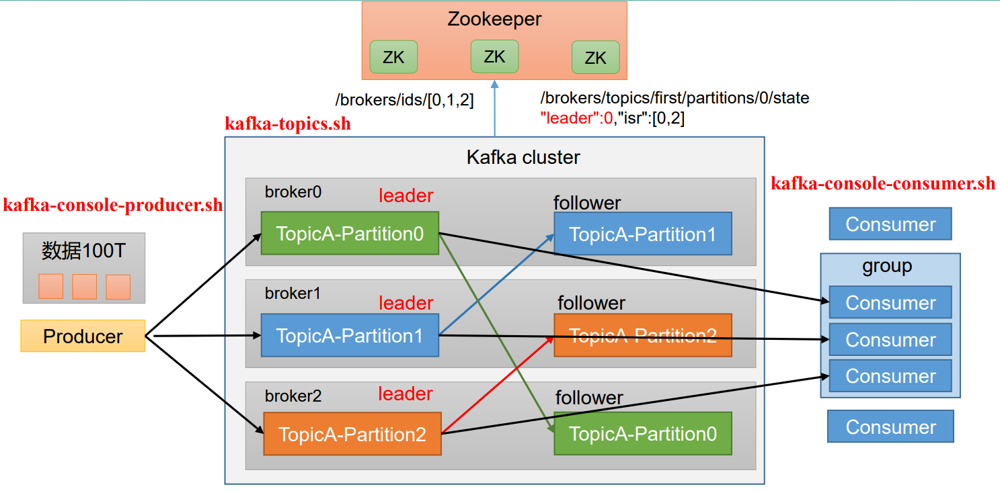

如下图所示，kafka的基础模块包括生产者、主题和消费者



可以从命令行来操作这三个组件，这三个组件的命令都存储在kafka安装目录的bin目录下：

- `kafka-console-producer.sh`：操作生产者
- `kafka-topics.sh`：操作主题
- `kafka-console-consumer.sh`：操作消费者


在开始本blog内容之前应确保zookeeper和kafka都已经开启，如果没有开启可以：

```bash
[wzq@hadoop102 ~]$ zk.sh start
[wzq@hadoop102 ~]$ kf.sh start
```

## 一、Topics主题命令行操作

进入kafka安装目录输入`bin/kafka-topics.sh`可以显示这个shell都支持什么样的操作：

```bash
[wzq@hadoop102 ~]$ cd /opt/module/kafka-3.0.0/
[wzq@hadoop102 kafka-3.0.0]$ bin/kafka-topics.sh
```

输入上面的这个命令打印了好多可以进行的操作，这里我列举几个比较常用的命令：

| 参数                                                | 描述                               |
| --------------------------------------------------- | ---------------------------------- |
| `--bootstrap-server <String:server toconnect to>`   | 连接的Kafka Broker主机名称和端口号 |
| `--topic <String:topic>`                            | 操作的topic名称                    |
| `--create`                                          | 创建主题                           |
| `--delete`                                          | 删除主题                           |
| `--alter`                                           | 修改主题                           |
| `--list`                                            | 查看所有主题                       |
| `--describe`                                        | 查看某主题详细描述                 |
| `--partitions <Integet: # of partitions>`           | 设置分区数                         |
| `--replication-factor<Integer: replication factor>` | 设置分区副本                       |
| `--config <String: name=value>`                     | 更新系统默认的配置                 |

演示一下：

### 1、查看当前服务器中有多少topic

```bash
[wzq@hadoop102 kafka-3.0.0]$ bin/kafka-topics.sh --bootstrap-server hadoop102:9092 --list
```

打印了一个空行，因为现在还没有创建任何topic


### 2、创建一个topic

创建的这个topic名字是：first，所以：

```bash
[wzq@hadoop102 kafka-3.0.0]$ bin/kafka-topics.sh --bootstrap-server hadoop102:9092 --create --partitions 1 --replication-factor 3 --topic first
```

其中：

- `--topic first`：创建的topic名字是first
- `--partitions 1`：表示这个topic只有一个分区
- `--replication-factor 3`：表示这个topic的副本数是3

可以使用`--list`查看有没有topic：

```bash
[wzq@hadoop102 kafka-3.0.0]$ bin/kafka-topics.sh --bootstrap-server hadoop102:9092 --list
first
```


### 3、查看主题详情信息

查看主题详情信息需要加个`--describe`：

```bash
[wzq@hadoop102 kafka-3.0.0]$ bin/kafka-topics.sh --bootstrap-server hadoop102:9092 --describe --topic first
Topic: first	TopicId: _hu9O-a4QCirHexkHp1AUg	PartitionCount: 1	ReplicationFactor: 3	Configs: segment.bytes=1073741824
	Topic: first	Partition: 0	Leader: 2	Replicas: 2,0,1	Isr: 2,0,1
```

这里会显示Leader在broker 0这台主机，副本在三台主机都有等信息


### 4、修改分区数

通过使用`--alter`可以增加分区数（**注意：只能增加不能减少**）

```bash
[wzq@hadoop102 kafka-3.0.0]$ bin/kafka-topics.sh --bootstrap-server hadoop102:9092 --alter --topic first --partitions 3
[wzq@hadoop102 kafka-3.0.0]$ bin/kafka-topics.sh --bootstrap-server hadoop102:9092 --describe --topic first
Topic: first	TopicId: _hu9O-a4QCirHexkHp1AUg	PartitionCount: 3	ReplicationFactor: 3	Configs: segment.bytes=1073741824
	Topic: first	Partition: 0	Leader: 2	Replicas: 2,0,1	Isr: 2,0,1
	Topic: first	Partition: 1	Leader: 0	Replicas: 0,1,2	Isr: 0,1,2
	Topic: first	Partition: 2	Leader: 1	Replicas: 1,2,0	Isr: 1,2,0
```

通过查看详情信息发现分区已经变为三个了


### 5、删除topic

就使用`--delete`就可以了，再创建一个second主题然后删除这个second：

```bash
[wzq@hadoop102 kafka-3.0.0]$ bin/kafka-topics.sh --bootstrap-server hadoop102:9092 --create --partitions 1 --replication-factor 3 --topic second
Created topic second.
[wzq@hadoop102 kafka-3.0.0]$ bin/kafka-topics.sh --bootstrap-server hadoop102:9092 --list
first
second
[wzq@hadoop102 kafka-3.0.0]$ bin/kafka-topics.sh --bootstrap-server hadoop102:9092 --delete --topic second
[wzq@hadoop102 kafka-3.0.0]$ bin/kafka-topics.sh --bootstrap-server hadoop102:9092 --list
first
```

## 二、Producer生产者命令行操作

操作生产者主要使用`bin/kafka-console-producer.sh`，直接输入这个命令会弹出一系列help信息，比较主要的有：

| 参数                                               | 描述                               |
| -------------------------------------------------- | ---------------------------------- |
| `--bootstrap-server <String: server toconnect to>` | 连接的Kafka Broker主机名称和端口号 |
| `--topic <String: topic>`                          | 操作的topic名称                    |

作为生产者，在输入对应的topic名称之后，会出现一个前台应用，在这里输入一些信息可以存储到topic，并且被消费者拿到：

```bash
[wzq@hadoop102 kafka-3.0.0]$ bin/kafka-console-producer.sh --bootstrap-server hadoop102:9092 --topic first
>hellp^Ho
>wzq
>wzq
>wtt
```

`>`后面跟的内容都是发送的数据，需要打开消费者才能看到

## 三、Consumer消费者命令行操作

操作消费者需要使用`bin/kafka-console-consumer.sh`，在输入这个命令后会显示help信息，下表列出了重要的：

| 参数                                               | 描述                               |
| -------------------------------------------------- | ---------------------------------- |
| `--bootstrap-server <String: server toconnect to>` | 连接的Kafka Broker主机名称和端口号 |
| `--topic <String: topic>`                          | 操作的topic名称                    |
| `--from-beginning`                                 | 从头开始消费                       |
| `--group <String: consumer group id>`              | 指定消费者组名称                   |

复制一个窗口，消费first主题中的数据：

```bash
[wzq@hadoop102 kafka-3.0.0]$ bin/kafka-console-consumer.sh --bootstrap-server hadoop102:9092 --topic first
```

输入这个命令后需要搭配生产者一起使用，在生产者那边输入信息，这里就可以接收到


当然也可以加入`--from-beginning`查看所有的数据：

```bash
[wzq@hadoop102 kafka-3.0.0]$ bin/kafka-console-consumer.sh --bootstrap-server hadoop102:9092 --topic first --from-beginning
wzq
wzq
wzq
hello
wzq
wtt
```


## 参考资料

- [B站尚硅谷Kafka学习视频](https://www.bilibili.com/video/BV1vr4y1677k)
- [Apache Kafka官网](https://kafka.apache.org/)

