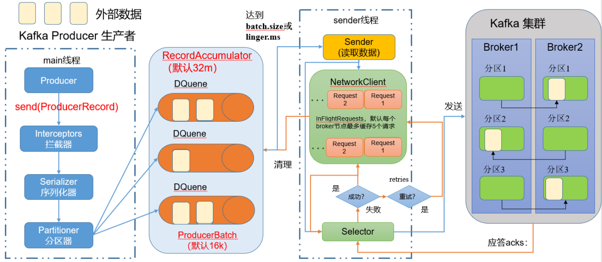
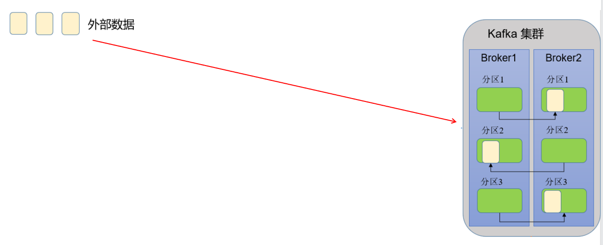
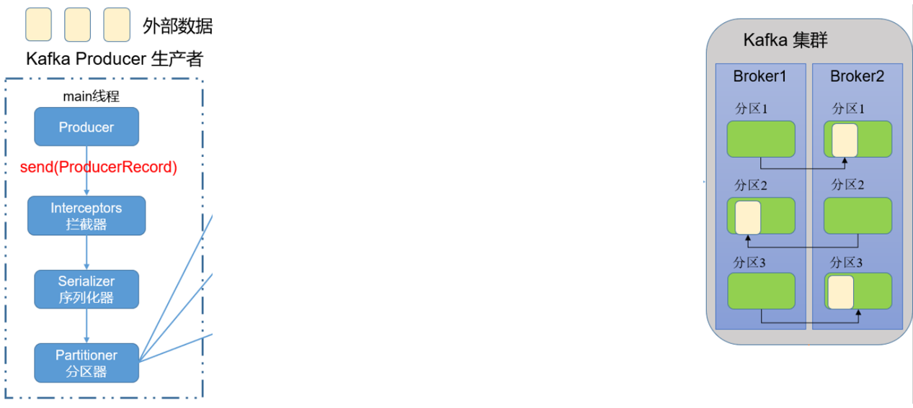
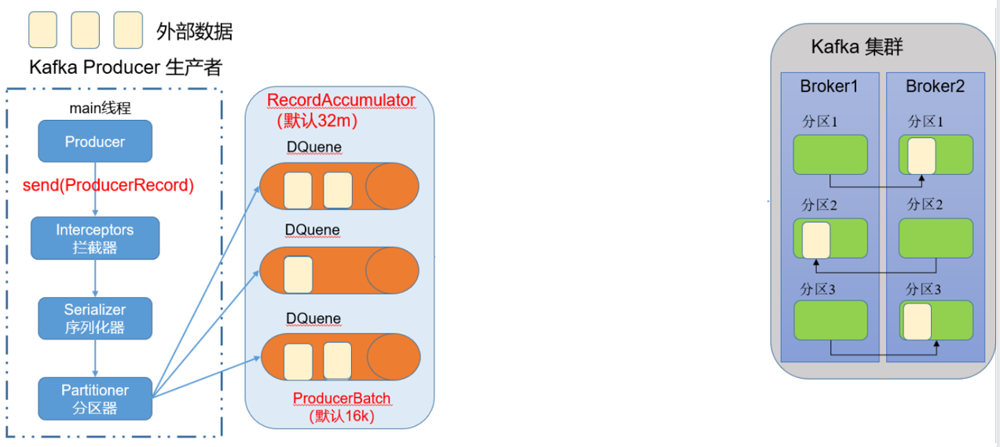

开局一张图，这个图片就是Kafka的生产者发送数据流程，看着还蛮复杂的，不怕不怕，一步一步来

## 一、生产者的工作是什么？

生产者的工作实际上就是把一些外部数据传送到Kafka集群里面，如下图所示：

在发送的这些数据的时候会经历一些事情，分别是：

- main线程
- RecordAccumulator
- sender线程
- kafka集群收到之后确认

经历的过程还是蛮多的，现在我们逐一击破

## 二、main线程

向发送数据到集群，`Kafka Producer`首先会开启一个`main`线程，如下图所示：

在`main`线程中，会经历一下步骤：

- 从`Producer`开始，它通过`send()`方法将数据发送给`Interceptors`拦截器
- `Interceptors`拦截器可以将送来的数据进行加工或者过滤，但是这一步一般不用，因为可以在上游更简单的`Flume`进行过滤或者加工
- 经过`Interceptors`之后`Serializer`序列化器，之所以要进行序列化是因为最后要传到集群的各个主机，凡是经过网络传输的数据都需要进行序列化。这里的序列化是kafka自己的序列化，没有使用Java自带的序列化，因为Java的序列化太重了，当面临大数据的时候序列化会使数据变的更大，成为网络传输的负担
- 之后就交给分区器`Partitioner`了，分区器会根据数据，按照某种规则输出到`RecordAccumlator`

## 三、RecordAccumulator

`RecordAccumulator`使一个数据缓冲区，这里有多个队列

上游main线程中的`Partitioner`分区器将数据分给不同的`DQueue`（双端队列），队列储存的信息称为`ProducerBatch`，默认一个批次16k，而整个`RecordAccumulator`默认是32M

## 四、sender线程

在缓冲区有数据之后，就开启了sender线程

这个`sender`线程首先会根据`batch.size`和`linger.ms`读取数据：

- `batch.size`：只有数据累计到batch.size之后，sender才会发送数据，默认是16k
- `linger.ms`：如果上游数据迟迟没有到达batch.size，sender将会等待linger.ms设置的时间后发送数据。单位是ms毫秒，默认是0ms，表示没有延迟，立即发送数据

在sender线程中，将会有一个`NetworkClient`，这里也是存储了缓冲的数据

sender在达到`batch.size`和`linger.ms`的要求之后就要通过`Selector`发送数据了，当数据发送到kafka集群时候，kafka集群如果收到信息，就会进行应答`acks`，应答分为三个指标：

- `0`：生成者发送过来的数据，不需要等数据到每个主机就应答
- `1`：Leader收到数据后应答
- `-1(all)`：Leader和所有Follower收到数据后应答

如果`Selector`收到应答数据就删除`NetworkCline`和`RecordAccmulator`的数据

如果`Selector`没有收到应答数据则代表发送失败，这时候就会进入重试，直到发送成功为止

## 五、重要参数列表

这里整理了Producer的重要参数：

| 参数名称                                | 描述                                                         |
| --------------------------------------- | ------------------------------------------------------------ |
| `bootstrap.servers`                     | 生产者连接集群所需要的broker地址清单。例如：hadoop102:9092,hadoop103:9092,hadoop104:9092，可以设置1个或者多个，中间使用逗号隔开。这里不需要指定所有的broker地址，生产者可以根据给定的broker地址里查找到其他broker信息 |
| `key.serializer`和`value.serializer`    | 指定发送消息的key和value的序列化类型，需要写全类名           |
| `buffer.memory`                         | RecordAccmulator缓冲区总大小，默认32M                        |
| `batch.size`                            | 缓冲区一批数据最大值，默认16K，适当增加该值可以提高吞吐量，但如果该值太大，数据传输将会延迟 |
| `linger.ms`                             | 如果数据迟迟未到达batch.size，sender等待linger.ms之后就会发送数据，单位ms，默认0ms，表示没有延迟。生产环境建议设置该值在5~100ms之间 |
| `acks`                                  | 应答信息，有0、1、-1(all)三个值，上面已经写过了              |
| `max.in.flight.requests.per.connection` | 允许最多没有返回ack的次数，默认是5，开启幂等性后要保证该值是1-5的数字 |
| `retries`                               | 当消息发送出现错误，系统会重发retries次消息，直到重发成功或者到达retries次，该值默认是int最大值。如果设置了重试，还想保证消息的有序性，需要设置`MAX_IN_FLIGHT_REQUESTS_PER_CONNECTION=1` |
| `retry.backoff.ms`                      | 两次重试之间的时间间隔，默认100ms                            |
| `enable.idempotence`                    | 是否开启幂等性，默认为true                                   |
| `compression.type`                      | 生产者发送的素有数据的压缩方式，默认是none，不压缩。支持的压缩类型有：none、gzip、snappy、lz4和zstd |

## 参考资料

- [B站尚硅谷Kafka学习视频](https://www.bilibili.com/video/BV1vr4y1677k)
- [Apache Kafka官网](https://kafka.apache.org/)

