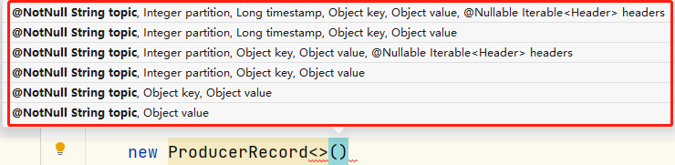
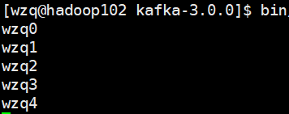
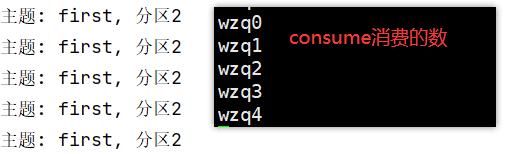
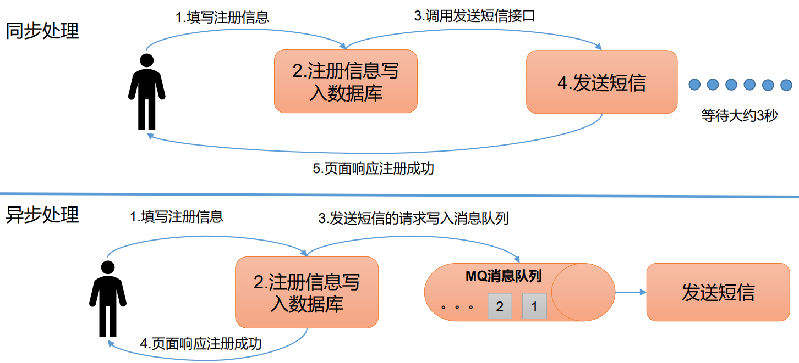
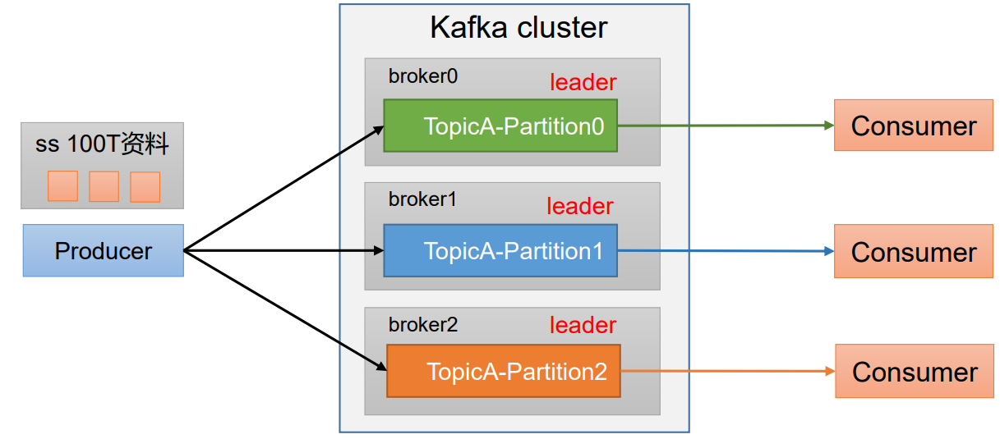
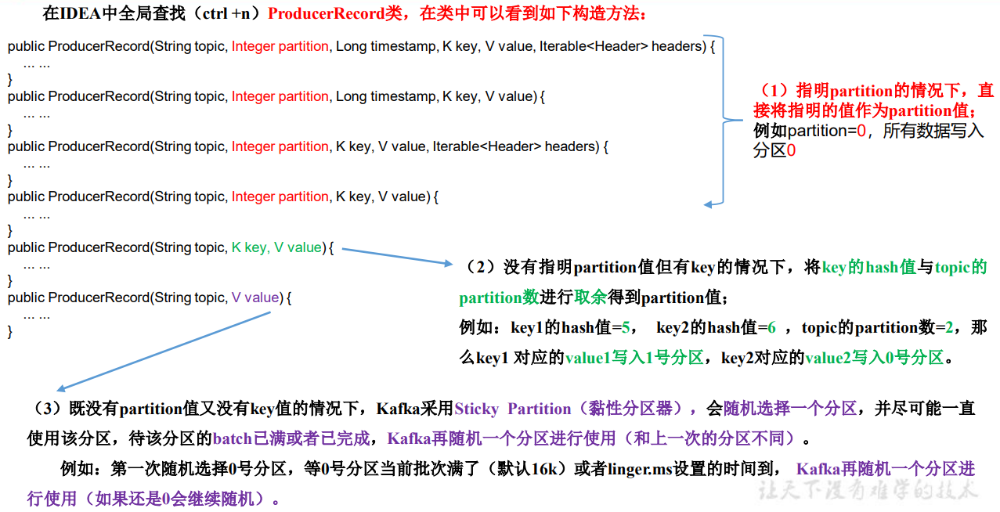
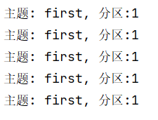
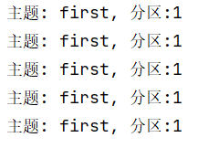
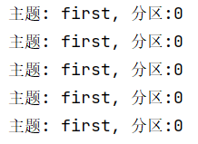

> 本blog将学习Kafka的异步与同步发送消息，使用kafka分区以及实现自定义分区

## 一、异步发送消息API

**需要说明的是：这里的发送消息指的是从main线程发送到`RecordAccumulator`**

### 1、普通异步发送

#### 1.1 需求分析

**需求：这里使用Java产生五个值然后发送到名字为`first`的`topic`，然后消费者被消费掉**

首先在虚拟机创建这个topic：

```bash
[wzq@hadoop102 kafka-3.0.0]$ bin/kafka-topics.sh --bootstrap-server hadoop102:9092 --create --partitions 3 --replication-factor 3 --topic first

# 查看这个topic的详细信息
[wzq@hadoop102 kafka-3.0.0]$ bin/kafka-topics.sh --bootstrap-server hadoop102:9092 --describe --topic first
Topic: first	TopicId: _hu9O-a4QCirHexkHp1AUg	PartitionCount: 3	ReplicationFactor: 3	Configs: segment.bytes=1073741824
	Topic: first	Partition: 0	Leader: 2	Replicas: 2,0,1	Isr: 2,0,1
	Topic: first	Partition: 1	Leader: 0	Replicas: 0,1,2	Isr: 0,1,2
	Topic: first	Partition: 2	Leader: 1	Replicas: 1,2,0	Isr: 1,2,0
```


其实写一个这个还挺简单的，分为以下几步：

- 创建生产者对象
- 发送数据
- 关闭资源

有了步骤就开始写Java代码吧


#### 1.2 写代码

首先打开idea创建一个maven工程，导入kafka依赖：

```xml
<dependencies>
    <dependency>
        <groupId>org.apache.kafka</groupId>
        <artifactId>kafka-clients</artifactId>
        <version>3.0.0</version>
    </dependency>
</dependencies>
```

然后创建一个包，专门存储Producer的代码：`com.wzq.kafka.producer`

在这个包下创建一个类：`CustomProducer`，在这个类中写一个main方法，在main方法里面开始搞起

**第一步：创建生产者对象KafkaProducer**

写这个代码第一步就是创建一个生产者对象`KafkaProducer`，这个生产者对象要求我们指定发送消息的K-V键值对类型，以及一些属性的配置：

- K-V键值对类型：在上一篇blog中发送的hello消息，是K-V中的V，默认的K是空，所以可以将这两个都设置为`String`
- 属性配置：这个我们需要专门new一个`Properties`，去配置相关的配置，这里主要配置以下几个
  - `bootstrap_server`：进行连接的主机，可以调用kafka提供的`ProducerConfig.BOOTSTRAP_SERVERS_CONFIG`这个常量来代替写字符串，当然写字符串也可以
  - `K与V的序列化类型`：需要配置序列化的类型，这里需要配置全类名

```java
// 0、增加一些配置信息
Properties properties = new Properties();
// 连接的主机，使用了ProducerConfig提供的常量，写下面注释的这一行也可以
//properties.put("bootstrap.servers","hadoop102:9092,hadoop103:9092");
properties.put(ProducerConfig.BOOTSTRAP_SERVERS_CONFIG, "hadoop102:9092,hadoop103:9092");

// 配置key,value序列化类型，这里的StringSerializer.class.getName() 相当于全类名，等同于下面注释的这一行
//properties.put(ProducerConfig.KEY_SERIALIZER_CLASS_CONFIG,"org.apache.kafka.common.serialization.StringSerializer");
properties.put(ProducerConfig.KEY_SERIALIZER_CLASS_CONFIG, StringSerializer.class.getName());
properties.put(ProducerConfig.VALUE_SERIALIZER_CLASS_CONFIG, StringSerializer.class.getName());

// 1、创建生产者对象
KafkaProducer<String, String> kafkaProducer = new KafkaProducer<>(properties);
```

> 注意：这里配置连接的时候仅指定了两个主机，因为kafka会自动寻找所有的broker，所以不需要指定所有的kafka主机，另外我写的是hadoop102:9092，是因为我在本地windows的hosts文件做了IP与名称的映射，如果没有做映射这里应该写虚拟机IP:9092

**第二步：调用send方法发送信息**

这个就比较简单了，直接用`kafkaProducer`调用send方法就可以了，send方法有两个重载：（返回值先不看）

```java
// 只需要传递一个ProducerRecord<K,V>的参数
Future<RecordMetadata> send(ProducerRecord<K, V> record);
// 还有一个Callback参数，这个参数会在第二小节介绍
Future<RecordMetadata> send(ProducerRecord<K, V> record, Callback callback);
```

关注到两个方法都需要传递一个`ProducerRecord<K,V>()`这样的参数，这个对象的K,V与刚刚创建的`kafkaProducer`传递的K-V一致，可以不用写，主要是在小括号里面需要写对应的`topic`，分区，时间戳，key和Value这类的，这都是作为一个消息传递到某个topic的某个分区的：




在这个部分，简简单单的做个循环传递几个值就好了：

```java
// 2、发送数据
for (int i = 0; i < 5; i++) {
    // 这里的send传递了个最贱的ProducerRecord参数，主题为first，value为wzq + i
    kafkaProducer.send(new ProducerRecord<>("first","wzq" + i));
}
```

**第三步：关闭资源**

调用完之后就需要释放资源：

```java
// 3、释放资源
kafkaProducer.close();
```

至此一个简单的生产者就写完了

**所有代码：**

```java
package com.wzq.kafka.producer;

import org.apache.kafka.clients.producer.KafkaProducer;
import org.apache.kafka.clients.producer.ProducerConfig;
import org.apache.kafka.clients.producer.ProducerRecord;
import org.apache.kafka.clients.producer.RecordMetadata;
import org.apache.kafka.common.serialization.StringSerializer;

import java.util.Properties;
import java.util.concurrent.Future;

public class CustomProducer {

    public static void main(String[] args) {
        // 0、增加一些配置信息
        Properties properties = new Properties();
        // 连接的主机，使用了ProducerConfig提供的常量，写下面注释的这一行也可以
        //properties.put("bootstrap.servers","hadoop102:9092,hadoop103:9092");
        properties.put(ProducerConfig.BOOTSTRAP_SERVERS_CONFIG, "hadoop102:9092,hadoop103:9092");

        // 配置key,value序列化类型，这里的StringSerializer.class.getName() 相当于全类名，等同于下面注释的这一行
        //properties.put(ProducerConfig.KEY_SERIALIZER_CLASS_CONFIG,"org.apache.kafka.common.serialization.StringSerializer");
        properties.put(ProducerConfig.KEY_SERIALIZER_CLASS_CONFIG, StringSerializer.class.getName());
        properties.put(ProducerConfig.VALUE_SERIALIZER_CLASS_CONFIG, StringSerializer.class.getName());

        // 1、创建生产者对象
        KafkaProducer<String, String> kafkaProducer = new KafkaProducer<>(properties);

        // 2、发送数据
        for (int i = 0; i < 5; i++) {
            // 这里的send传递了个最贱的ProducerRecord参数，主题为first，value为wzq + i
            kafkaProducer.send(new ProducerRecord<>("first", "wzq" + i));
        }

        // 3、释放资源
        kafkaProducer.close();
    }

}
```


#### 1.3 测试

在虚拟机上开启消费者：

```bash
[wzq@hadoop102 kafka-3.0.0]$ bin/kafka-console-consumer.sh --bootstrap-server hadoop102:9092 --topic first
```

然后在idea上启动刚刚写的程序，就会看到控制台成功输出了发送出去的信息




### 2、带有回调函数的异步发送

带有回调函数的异步方法，实际上就是发送成功之后kafka集群给我们反馈一些信息，还记得刚刚的`send`方法的第二个重载吗？我们只需要再加一个`callback`参数就可以成功回调了

这个`Callback`是一个对象，我们需要在里面new出来，然后重写他的`onCompletion`方法，这个方法携带了每个消息发送出去得到的反馈，该方法有两个参数：

- `RecordMetadata metadata`：元数据，存储了服务器已确认的记录的元数据
- `Exception exception`：异常，如果发送异常可以用这个打印异常信息

所以，使用带有回调函数的异步发送消息功能，只需要替换上一节发送信息的部分就可以了


复制一份刚刚写的代码出来，更改发送数据这一块：

```java
// 2、发送数据
for (int i = 0; i < 5; i++) {
    // 这里的send传递了个最简单的ProducerRecord参数，主题为first，value为wzq + i
    kafkaProducer.send(new ProducerRecord<>("first", "wzq" + i), new Callback() {
        @Override
        public void onCompletion(RecordMetadata metadata, Exception exception) {
            if (exception == null) {
                // 如果没有发生异常就打印一些信息，信息都存储在metadata里面
                System.out.println("主题: "+metadata.topic() + ", 分区" + metadata.partition());
            } else {
                // 如果有异常就打印异常信息
                exception.printStackTrace();
            }
        }
    });
}
```


启动这个类，会有回调信息：




## 二、同步发送消息API


这里是时候要解释一下什么是同步什么是异步了，如下图所示：



假设这里有一个业务：是用户在某个网站注册，然后注册成功会发送短信给用户，那么：

- 同步发送消息：用户填写注册信息，注册信息写入数据库之后去调用发送短信接口，然后再响应用户
- 异步发送消息：用户填写注册信息，注册信息写入数据库后没有直接调用发送短信接口，而是直接响应用户，然后把每个用户发送短信的步骤写入了一个消息队列，这个队列再慢慢发送信息给用户

ok，到了kafka生产者这一块，同步发送消息指的是：当一批数据到达队列之后，先将队列的所有数据发送到Topic，下一批数据才会到达，然后继续方法。

而异步指的是：当消息到达队列后，直接发送消息到topic，与此同时另一批数据也正在往队列里面输送


实现同步发送消息很简单，只需要在上面Java操作的基础上加一个`get()`就好了........也就是只替换发送消息的方法：

```java
package com.wzq.kafka.producer;

import org.apache.kafka.clients.producer.*;
import org.apache.kafka.common.serialization.StringSerializer;

import java.util.Properties;
import java.util.concurrent.ExecutionException;

public class CustomProducerCallbackSync {

    public static void main(String[] args) throws ExecutionException, InterruptedException {

        Properties properties = new Properties();
        properties.put(ProducerConfig.BOOTSTRAP_SERVERS_CONFIG, "hadoop102:9092,hadoop103:9092");
        properties.put(ProducerConfig.KEY_SERIALIZER_CLASS_CONFIG, StringSerializer.class.getName());
        properties.put(ProducerConfig.VALUE_SERIALIZER_CLASS_CONFIG, StringSerializer.class.getName());

        KafkaProducer<String, String> kafkaProducer = new KafkaProducer<String, String>(properties);

        for (int i = 0; i < 5; i++) {
            kafkaProducer.send(new ProducerRecord<>("first", "wzq" + i), new Callback() {
                @Override
                public void onCompletion(RecordMetadata metadata, Exception exception) {
                    if (exception == null) {
                        System.out.println("主题:" + metadata.topic() + " ,分区:" + metadata.partition());
                    } else {
                        exception.printStackTrace();
                    }
                }
            }).get();	// 看这里！
        }

        kafkaProducer.close();

    }
}
```


## 三、分区

### 1、分区的好处

- 分区便于合理使用存储资源，每个Partition在一个Broker上存储，可以把海量的数据按照分区切割成一块一块数据存储在多台Broker上。合理控制分区的任务，可以实现负载均衡的效果。
- 提高并行度，生产者可以以分区为单位发送数据；消费者可以以分区为单位进行消费数据




### 2、生产者发送消息的分区策略

如果我们不自定义分区器，kafka按照默认的分区器（`DefaultPatitioner`）帮助我们分区，默认的分区器有三个规则：


上面的注释写的很清楚，还记得写第一个案例调用send方法需要传递一个`ProducerRecord`参数吗？这个对象有很多重载的构造方法，`DefaultPatitioner`就是按照这个参数进行分区的：



 来体验一下：

#### 2.1 指定分区

还是上面写的代码，这里我就不全粘贴出来了，只改传递参数的那一段，最好保留`callback`，方便我们查看每条信息都发送到了那个分区

这一part直接指定一个分区，就是在`ProducerRecord`里面放一个partition字段（整数）就可以了：

```java
for (int i = 0; i < 5; i++) {
    // ProducerRecord里面的参数 依次代表：主题、1号分区、key和value
    kafkaProducer.send(new ProducerRecord<>("first", 1, "", "wzq" + i), new Callback() {
        @Override
        public void onCompletion(RecordMetadata metadata, Exception exception) {
            if (exception == null) {
                System.out.println("主题: " + metadata.topic() + ", 分区:" + metadata.partition());
            } else {
                exception.printStackTrace();
            }
        }
    });
}
```

更改完成运行这段代码，然后消息都发给了分区1：



#### 2.2 不指定分区，按照key的Hash值分区

在没有指定分区的情况下，按照key的hash值与topic的partition数进行取余得到partition值

那还是只改`ProducerRecord`的值喽：

```java
for (int i = 0; i < 5; i++) {
    // ProducerRecord里面的参数 依次代表：主题、key和value
    kafkaProducer.send(new ProducerRecord<>("first", "a", "wzq" + i), new Callback() {
        @Override
        public void onCompletion(RecordMetadata metadata, Exception exception) {
            if (exception == null) {
                System.out.println("主题: " + metadata.topic() + ", 分区:" + metadata.partition());
            } else {
                exception.printStackTrace();
            }
        }
    });
}
```

当指定`key='a'`：



当指定`key='f'`：



当指定`key="hello"`：


#### 2.3 没有key没有指定分区，黏性分区

在没有指定key和分区的时候，`Kafka`采取黏性分区（Stick Partition），随机选择一个分区，并尽可能一直使用该分区，直到该分区的batch已满或者到达了设置的`linger.ms`，Kafka就再随机一个分区进行使用（和上一次的分区不同）


ok，这次我们循环50次，每次循环都睡一会儿，看一下分区情况：

```java
for (int i = 0; i < 50; i++) {
    // ProducerRecord里面的参数 依次代表：主题、1号分区、key和value
    kafkaProducer.send(new ProducerRecord<>("first", "wzq" + i), new Callback() {
        @Override
        public void onCompletion(RecordMetadata metadata, Exception exception) {
            if (exception == null) {
                System.out.println("主题: " + metadata.topic() + ", 分区:" + metadata.partition());
            } else {
                exception.printStackTrace();
            }
        }
    });
    // 每次睡一会儿
    Thread.sleep(2);
}
```


部分结果：

```
主题: first, 分区:0
主题: first, 分区:0
主题: first, 分区:2
主题: first, 分区:2
主题: first, 分区:0
主题: first, 分区:1
主题: first, 分区:0
主题: first, 分区:2
主题: first, 分区:2
主题: first, 分区:1
主题: first, 分区:1
主题: first, 分区:1
```

### 3、自定义分区

`Kafka`运行用户自定义分区，只需要创建一个类，实现`Partitioner`接口的几个方法就可以了


定义这个类，实现几个方法：

```java
package com.wzq.kafka.producer;

import org.apache.kafka.clients.producer.Partitioner;
import org.apache.kafka.common.Cluster;

import java.util.Map;

public class MyPartitioner implements Partitioner {
    /**
     * 返回信息对应的分区
     *
     * @param topic      主题
     * @param key        消息的key
     * @param keyBytes   消息的key序列化后的字节数组
     * @param value      消息的value
     * @param valueBytes 消息的value序列化后的字节数组
     * @param cluster    集群元数据可以查看分区信息
     * @return 返回信息对应的分区
     */
    @Override
    public int partition(String topic, Object key, byte[] keyBytes, Object value, byte[] valueBytes, Cluster cluster) {
        // 根据内容进行分区，如果分区内容包含wzq就分到1区，不包含则分到2区
        String msgValue = value.toString();
        int partition;
        if (msgValue.contains("wzq")) {
            partition = 1;
        } else {
            partition = 2;
        }
        return partition;
    }

    // 关闭资源
    @Override
    public void close() {

    }

    // 配置方法，暂时不管
    @Override
    public void configure(Map<String, ?> configs) {

    }
}
```

使用这个分区只需要在生产者的配置信息中添加这个类的全类名映射就可以了


```java
package com.wzq.kafka.producer;

import org.apache.kafka.clients.producer.*;
import org.apache.kafka.common.serialization.StringSerializer;

import java.util.Properties;

public class CustomProducerCallbackPartitions {

    public static void main(String[] args) throws InterruptedException {
        Properties properties = new Properties();
        properties.put(ProducerConfig.BOOTSTRAP_SERVERS_CONFIG, "hadoop102:9092,hadoop103:9092");
        properties.put(ProducerConfig.KEY_SERIALIZER_CLASS_CONFIG, StringSerializer.class.getName());
        properties.put(ProducerConfig.VALUE_SERIALIZER_CLASS_CONFIG, StringSerializer.class.getName());
        // 添加自定义分区的配置，也可以写全类名
//        properties.put(ProducerConfig.PARTITIONER_CLASS_CONFIG,"com.wzq.kafka.producer.MyPartitioner");
        properties.put(ProducerConfig.PARTITIONER_CLASS_CONFIG, MyPartitioner.class.getName());

        KafkaProducer<String, String> kafkaProducer = new KafkaProducer<>(properties);

        for (int i = 0; i < 50; i++) {
            String value = i % 2 == 0 ? "wzq" : "wtt";
            kafkaProducer.send(new ProducerRecord<>("first", value + i), new Callback() {
                @Override
                public void onCompletion(RecordMetadata metadata, Exception exception) {
                    if (exception == null) {
                        System.out.println("主题: " + metadata.topic() + ", 分区:" + metadata.partition());
                    } else {
                        exception.printStackTrace();
                    }
                }
            });
            Thread.sleep(5);
        }

        kafkaProducer.close();
    }
}
```


## 参考资料

- [B站尚硅谷Kafka学习视频](https://www.bilibili.com/video/BV1vr4y1677k)
- [Apache Kafka官网](https://kafka.apache.org/)

