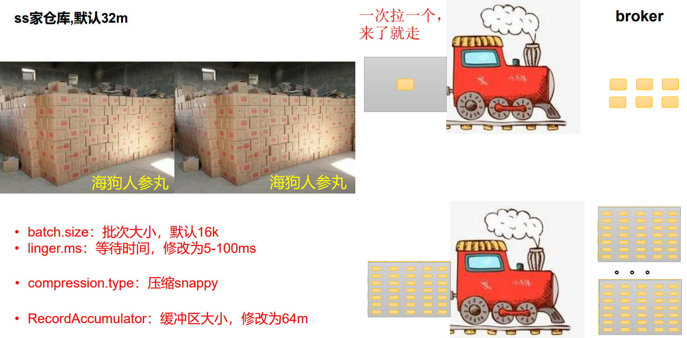
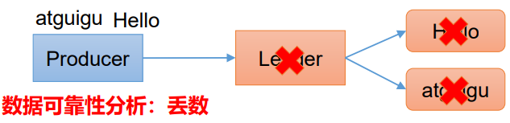
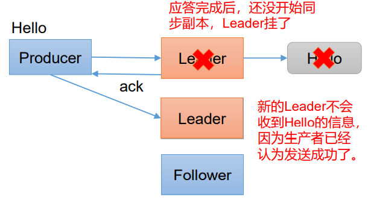
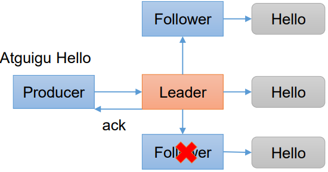
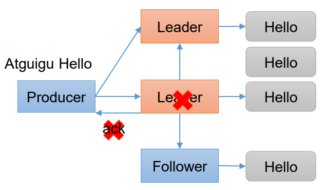
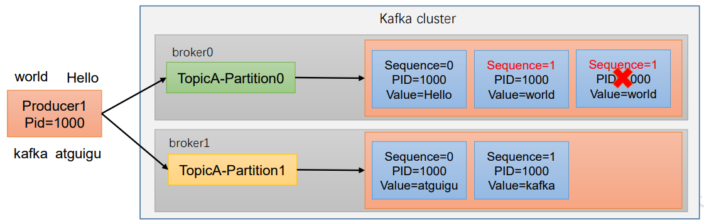
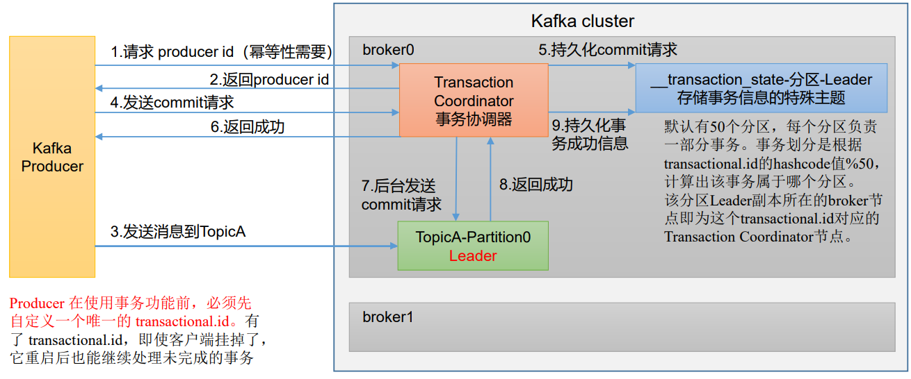
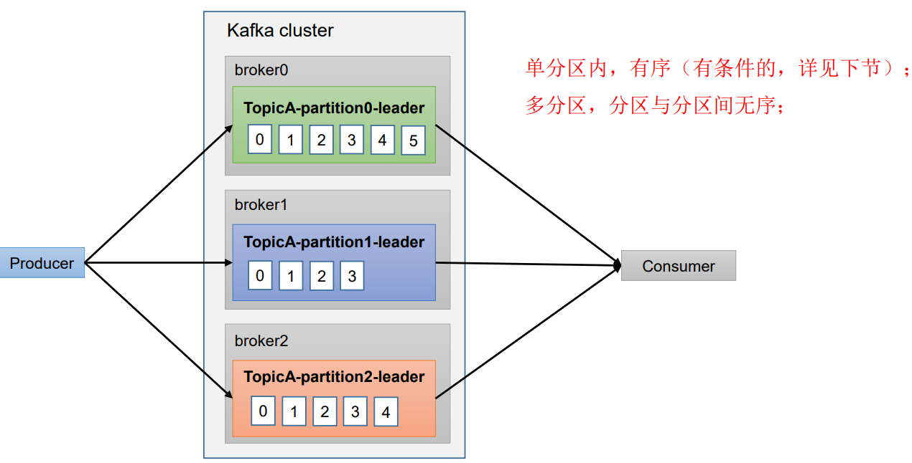
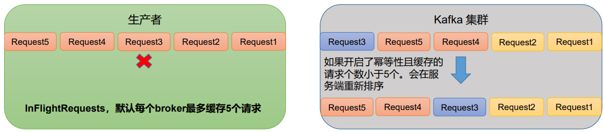

> 本blog介绍了几种生产者在实际开发中的生产经验，包括：如何提高吞吐量、保证数据可靠性、数据去重、数据有序和乱序


## 一、如何提高吞吐量

假设大海老师家有个仓库，放了很多海狗人参丸，生产者扮演的角色就是如下图所示的小火车，在[前几篇blog](http://wzqwtt.club/2022/04/01/kafka-sheng-chan-zhe-xiao-xi-fa-song-yuan-li/)中有介绍小火车的两个参数：`batch_size`和`linger.ms`，等待linger.ms或者达到batch_size容量后直接拉走数据，其中`linger.ms`的默认值是0ms，也就是说来一条数据就拉走一条，这样的效率是很低的




为了提高效率，可以从以下几个参数入手：

- `batch_size`：批次大小，默认是16k，建议设置为32k
- `linger.ms`：“火车”等待的时间，默认是0ms，生产环境中建议设置为5-100ms
- `compression.type`：压缩格式，可以将数据压缩之后再传输，有snappy、gzip、lz4和zstd这几种格式，一般使用`snappy`
- `RecordAccumulator`：缓冲区大小，默认32m，建议修改为64m


有了这几个参数之后就可以在写代码时候进行配置了，配置在`Properties`属性中：

```java
// 批次大小，默认16k
properties.put(ProducerConfig.BATCH_SIZE_CONFIG, 16384);
// 等待时间，默认0
properties.put(ProducerConfig.LINGER_MS_CONFIG, 3);
// 压缩格式，有gzip、snappy、lz4和zstd这几种格式
properties.put(ProducerConfig.COMPRESSION_TYPE_CONFIG, "snappy");
// 缓冲区大小，默认32m
properties.put(ProducerConfig.BUFFER_MEMORY_CONFIG, 33554432);
```


## 二、数据可靠

在[之前学习生产者工作原理](http://wzqwtt.club/2022/04/01/kafka-sheng-chan-zhe-xiao-xi-fa-song-yuan-li/)的时候，发送数据到kafka集群并落盘之后会返回应答消息`acks`（默认为-1），`acks`有三个级别，分别是：

- `acks=0`：生产者发送过来数据，不需要等待数据落盘，就回应

  

  但是这种情况容易丢失数据，比如当leader挂了之后，就不能保证里面有数据了

- `acks=1`：生产者发送过来数据，Leader收到数据落盘之后应答

  

  这样做也有丢数的情况，比如Leader收到数据之后应答了信息，但是还没来得及把数据同步到Follower就挂了，之后产生新的Leader就没有拿到数据了

- `acks=-1或all`：生产者发送过来数据，Leader和ISR队列里面的所有节点都收齐数据之后应答

  

  毫无疑问，这个等级的应答信息是最能保证数据可靠的，但是这里会有问题

> `acks=-1或all`存在的问题：Leader收到数据，所有Follower都开始同步数据，但有一个Follower发生了故障迟迟不能和Leader通信，那Leader就一直等着Follower应答才回复吗？
>
> 其实Leader维护了一个动态的`ISR`队列，这个队列指的是：一直和Leader保持同步的Leader+Follower集合，如果Follower长时间没向Leader发送通信请求或同步数据，则该Follower就被踢出ISR队列，这个”长时间“阈值由`relica.lag.time.max.ms`参数决定，默认30s，这样就不用等待长期连不上的节点了

> 如果分区副本设置为1，或者ISR队列里应答的最小副本数量是1，其实和ack=1的效果是一样的仍有丢数的风险


为了保证数据可靠性，需满足：**ACK级别为-1 + 分区副本大于等于2 + ISR里应答的最小副本数量大于等于2**


但是当`acks=-1`的时候，还有一个问题



那就是**数据重复问题**，当数据传送到集群，然后Leader已经跟Follower同步过了数据，但是在返回acks的时候挂掉了；那么所有的Follower就会推举新的Leader，Producer没收到acks认为发送失败继续向新的Leader发送数据，这就造成了重复数据，下一章是解决方法


在代码里配置`acks`等级：

```java
// 设置acks等级
properties.put(ProducerConfig.ACKS_CONFIG, "all");
// 数据发送失败后重试的次数，默认是int最大值，直到发送成功为止
properties.put(ProducerConfig.RETRIES_CONFIG, 3);
```


## 三、数据去重

数据重复会造成数据冗余，特别是如果跟”钱“相关的数据重复，就会造成社会层面的矛盾，这个我们应该尽力避免

### 1、数据传递语义

有这么几个数据传递语义：

- `至少一次（At Least Once）`：acks级别-1 + 分区副本大于等于2 + ISR里应答的最小副本数量大于等于2；可以保证数据丢失，但是不能保证数据不重复
- `最多一次（At Most Once）`：ack级别0；可以保证数据不重复，但是不能保证数据不丢失
- `精确一次（Exactly Once）`：要求数据既不能重复也不能丢失，这个需要借助`幂等性`和`事务`

### 2、幂等性

幂等性就是指Producer不论向Broker发送多少次重复数据，Broker端都只会持久化一条，保证了不重复。

**精确一次 = 幂等性 + 至少一次**


Kafka幂等性判断重复数据依据是：`<PID,Partition,SeqNumber>`每条消息在每个分区都只存在一次，PID指Kafka进程号，Partition指某条消息的分区号，SeqNumber是单调递增的

如下图所示，画×的那一个，三个值都和前一个重复了，所以他就会被认定为重复值，就会被丢失



幂等性只能保证在单分区单会话不重复


幂等性通过参数`enable.idempotence`设置，默认为true开启，false则代表关闭

### 3、生产者事务


**开启事务必须开启幂等性**，具体过程如下图所示




在Java里面的事务操作：

```java
package com.wzq.kafka.producer;

import org.apache.kafka.clients.producer.KafkaProducer;
import org.apache.kafka.clients.producer.ProducerConfig;
import org.apache.kafka.clients.producer.ProducerRecord;
import org.apache.kafka.common.serialization.StringSerializer;

import java.util.Properties;

public class CustomProducerTransctions {

    public static void main(String[] args) {

        Properties properties = new Properties();

        properties.put(ProducerConfig.BOOTSTRAP_SERVERS_CONFIG, "hadoop102:9092,hadoop103:9092");
        properties.put(ProducerConfig.KEY_SERIALIZER_CLASS_CONFIG, StringSerializer.class.getName());
        properties.put(ProducerConfig.VALUE_SERIALIZER_CLASS_CONFIG, StringSerializer.class.getName());

        // 使用事务，必须指定一个全局唯一的事务id
        properties.put(ProducerConfig.TRANSACTIONAL_ID_CONFIG, "transction_id_0");

        KafkaProducer<String, String> kafkaProducer = new KafkaProducer<>(properties);

        // 初始化事务
        kafkaProducer.initTransactions();
        // 开启事务
        kafkaProducer.beginTransaction();

        try {
            for (int i = 0; i < 5; i++) {
                kafkaProducer.send(new ProducerRecord<>("first", "wzq" + i));
            }
            // 模拟发送异常
            int c = 1 / 0;
            // 提交事务
            kafkaProducer.commitTransaction();
        } catch (Exception e) {
            // 终止事务
            kafkaProducer.abortTransaction();
            e.printStackTrace();
        } finally {
            kafkaProducer.close();
        }

    }
}
```


因为在里面模拟了异常，所以消费者不会消费到数据

## 四、数据有序



## 五、数据乱序

- kafka在1.x版本之前保证数据单分区有序，条件如下：

  `max.in.flight.requests.per.connection=1`（不需要考虑是否开启幂等性）

- kafka在1.x及以后版本保证数据单分区有序，条件如下：

  - 未开启幂等性

    `max.in.flight.requests.per.connection`需要设置为1

  - 开启幂等性

    `max.in.flight.requests.per.connection`需要设置为小于等于5

如下图所示，kafka集群会一次缓存五条消息，者五条消息的SeqNumber是递增的，如果正在递增数据落盘，一旦发现和前一个落盘消息的SeqNumber差了一个值，就在内存中等待，直到顺序的SeqNumber对应的消息到达才会排序落盘。但是这个必须小于等于5个。




## 参考资料

- [B站尚硅谷Kafka学习视频](https://www.bilibili.com/video/BV1vr4y1677k)
- [Apache Kafka官网](https://kafka.apache.org/)

