## 一、Kafka Broker工作流程

### 1、Zookeeper存储的Kafka信息

`kafka`的一些信息存储在了Zookeeper，比如节点信息、每个topic的leader、ISR队列信息等，可以在zookeeper客户端查看这些信息

可以用一款工具`PreetyZoo`工具在窗口看看信息，这个工具的下载地址在：https://github.com/vran-dev/PrettyZoo/releases

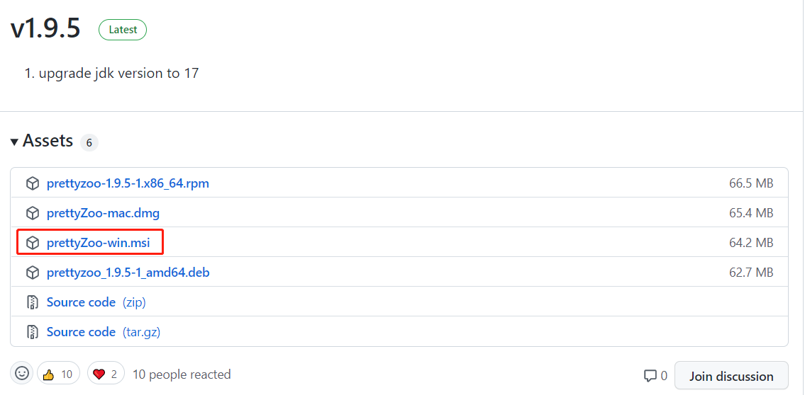

安装好之后，点击`new`，输入ip与端口（2181）就能连接上了

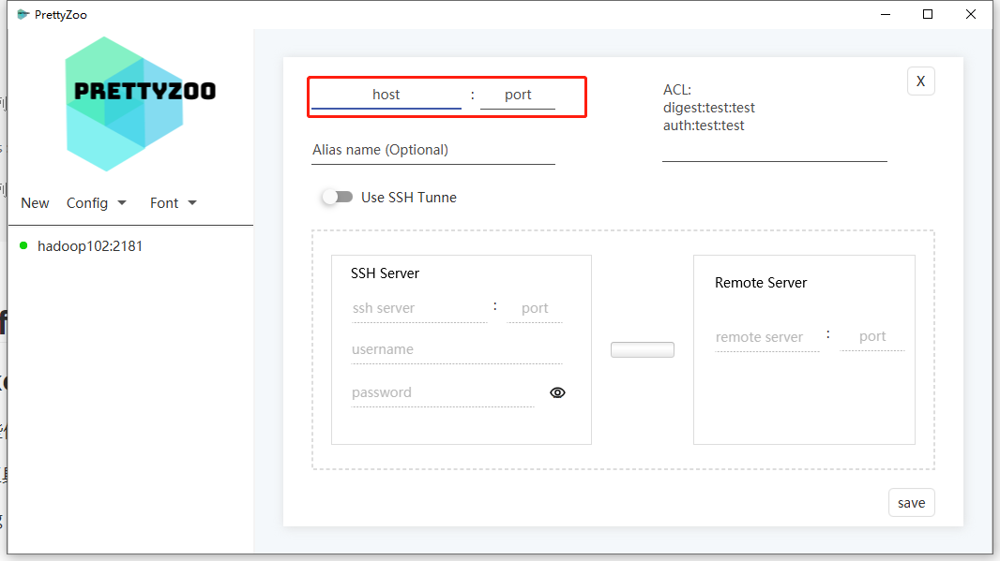

在这个软件可以很清晰的看到，zookeeper都存储了哪些信息，点开对应的kafka，kafka的每台主机存储在：`kafka/brokers/ids`下面：

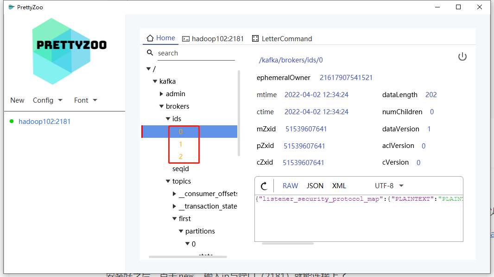

每个topic的分区的信息：

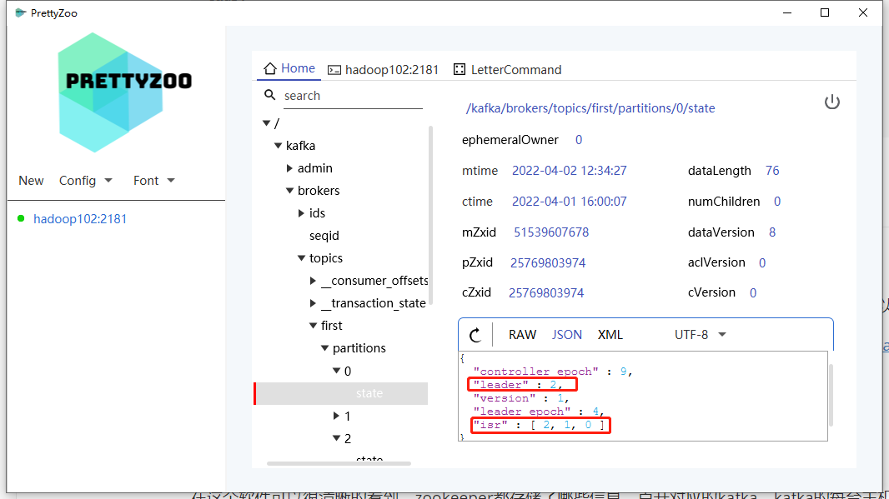

下面这个树状图列出了kafka在zookeeper的树状结构图：

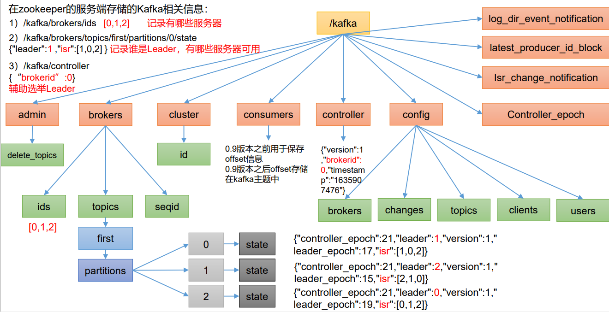

### 2、Kafka Broker总体工作流程

kafka Broker的总体工作流程如下图所示：

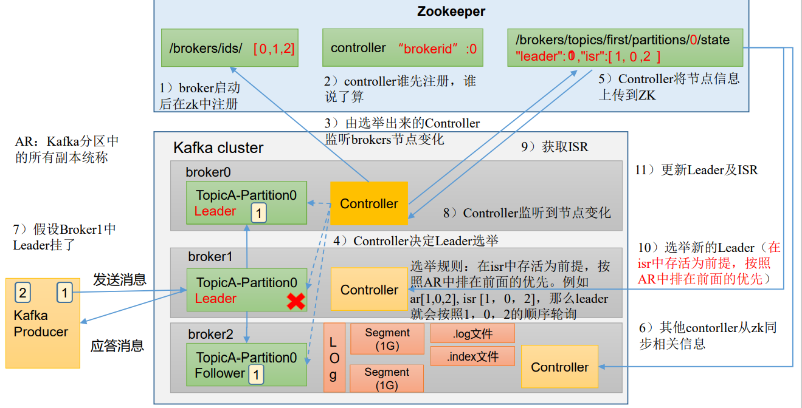

总共有下面这几个步骤：

- 当`kafka`启动之后首先会在zookeeper的`/kafka/broker/ids/`下注册每台kafka主机 [0,1,2]
- 然后zookeeper和kafka都会创建一个`Controller`，这个Controller是谁先注册谁说了算的，目前主导Controller的是0号kafka主机
- 选举出来的Controller会监听brokers节点的变化
- 当创建了一个topic，这个topic又有很多分区，分区就有Leader和Follower
- Controller会决定Leader的选举，数据进入topic的时候Controller会将节点信息上传到zookeeper，就开始选举了
  - 选举规则：在isr中存活为前提，按照AR（Kafka分区中的所有副本统称）中排在前面的有限，例如：ar[1,0,2]，isr[1,0,2]，那么Leader就会按照1，0，2的顺序轮询
- 选举完Leader以后，其他broker的controller会从zookeeper同步相关信息
- 因为一旦Leader挂了，其他controller就能及时发现，然后拉取相关信息选举新的Leader，最后更新Leader及ISR

这个就是Broker的一个工作流程

### 3、Broker重要参数

Broker有以下这些参数

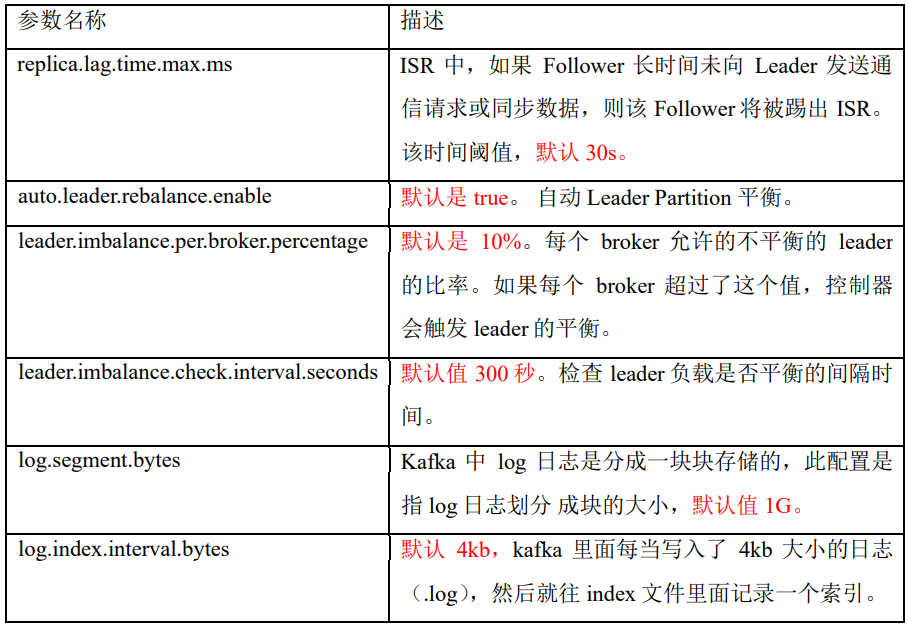

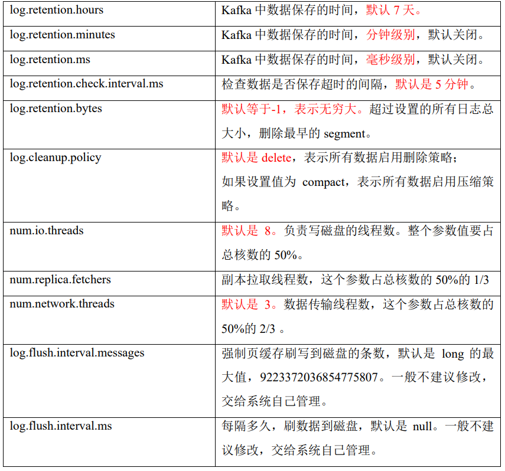

## 二、生产经验——节点服役和退役

在实际开发中，可能会面临新老节点服役退役的一个情况，来模拟一波这样的场景吧！

> PS：:scream:我的电脑已经快hold不住了

### 1、新节点准备

克隆一台hadoop104，打开VMWare直接关机hadoop104这台主机，然后克隆一台hadoop105：

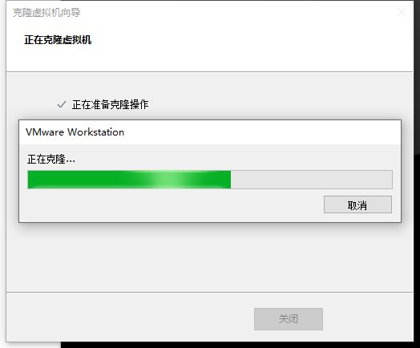


克隆完成之后打开hadoop105，修改里面的hostname和IP，注意hadoop104一定要修改完hostname和ip之后再打开

```bash
# 修改hadoop105的hostname和IP
[root@hadoop104 ~]# whoami
root
[root@hadoop104 ~]# vim /etc/sysconfig/network-scripts/ifcfg-ens33
# 修改IPADDR为：192.168.10.102
[root@hadoop104 ~]# vim /etc/home
hadoop105
[root@hadoop104 ~]# reboot
```

然后开启hadoop104，在xshell连接两台主机

打开hadoop105后的第一件事儿应该是删除kafka安装目录下的`datas/和logs/`文件夹：

```bash
[wzq@hadoop105 ~]$ cd /opt/module/kafka-3.0.0/
[wzq@hadoop105 kafka-3.0.0]$ rm -rf datas/ logs/
```

然后来到`config/server.properties`修改broker id为3：

```bash
[wzq@hadoop105 kafka-3.0.0]$ vim config/server.properties
```

然后重启hadoop102\103\104的zookeeper和kafka：

```bash
[wzq@hadoop102 ~]$ kf.sh stop
============停止 hadoop102 Kafka============
============停止 hadoop103 Kafka============
============停止 hadoop104 Kafka============
No kafka server to stop
# 然后要等待kafka完全关闭再关闭zookeeper
[wzq@hadoop102 ~]$ zk.sh stop
=============== zookeeper hadoop102 停止 ===============
ZooKeeper JMX enabled by default
Using config: /opt/module/zookeeper-3.5.7/bin/../conf/zoo.cfg
Stopping zookeeper ... STOPPED
=============== zookeeper hadoop103 停止 ===============
ZooKeeper JMX enabled by default
Using config: /opt/module/zookeeper-3.5.7/bin/../conf/zoo.cfg
Stopping zookeeper ... STOPPED
=============== zookeeper hadoop104 停止 ===============
ZooKeeper JMX enabled by default
Using config: /opt/module/zookeeper-3.5.7/bin/../conf/zoo.cfg
Stopping zookeeper ... /opt/module/zookeeper-3.5.7/bin/zkServer.sh: 第 213 行:kill: (24311) - 没有那个进程
STOPPED

# 启动zk和kafka
[wzq@hadoop102 ~]$ zk.sh start
=============== zookeeper hadoop102 启动 ===============
ZooKeeper JMX enabled by default
Using config: /opt/module/zookeeper-3.5.7/bin/../conf/zoo.cfg
Starting zookeeper ... STARTED
=============== zookeeper hadoop103 启动 ===============
ZooKeeper JMX enabled by default
Using config: /opt/module/zookeeper-3.5.7/bin/../conf/zoo.cfg
Starting zookeeper ... STARTED
=============== zookeeper hadoop104 启动 ===============
ZooKeeper JMX enabled by default
Using config: /opt/module/zookeeper-3.5.7/bin/../conf/zoo.cfg
Starting zookeeper ... STARTED
[wzq@hadoop102 ~]$ kf.sh start
============启动 hadoop102 Kafka============
============启动 hadoop103 Kafka============
============启动 hadoop104 Kafka============
```

现在就模拟出来了生产环境中的状态


然后将kafka正常启动：

```bash
[wzq@hadoop105 kafka-3.0.0]$ bin/kafka-server-start.sh -daemon config/server.properties
```

打开`zookeeper`，发现他已经注册到broker id了：

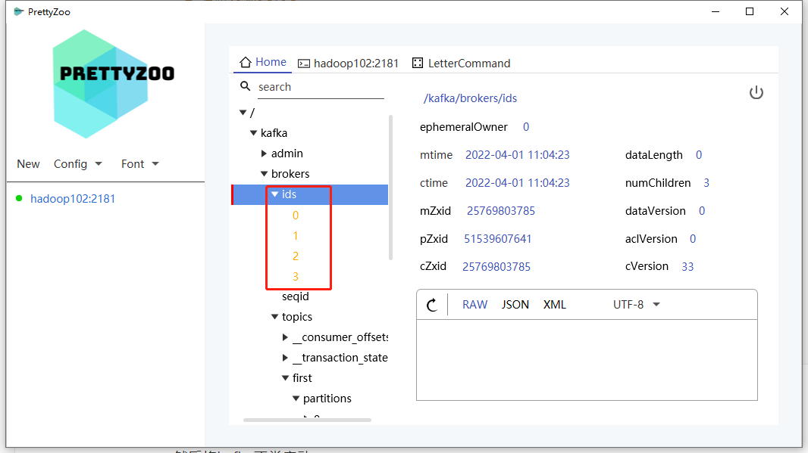


### 2、服役新节点

ok，引入了新的kafka主机hadoop105，对应Broker id = 3，之前创建过一个first主题，看一下他的详细信息：

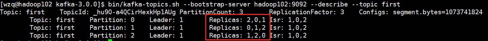

如上图所示，这个主题的副本还是存储在了0、1、2主机，现在想让broker3主机分担一下

#### 2.1 创建一个要均衡的主题

想要均衡first主题，首先需要创建一个json文件，把要均衡的主题写进去，先来创建这个文件：

```bash
[wzq@hadoop102 kafka-3.0.0]$ vim topic-to-move.json
```

然后填入以下json文件：

```json
{
	"topics": [
		{"topic": "first"}
 	],
 	"version": 1
}
```


#### 2.2 生成一个负载均衡计划


使用bin目录下的`kafka-reassign-partition.sh`，指定一个json，还有希望负载均衡的broker主机列表，可以生成一个负载均衡计划：

```bash
[wzq@hadoop102 kafka-3.0.0]$ bin/kafka-reassign-partitions.sh --bootstrap-server hadoop102:9092 --topics-to-move-json-file topic-to-move.json --broker-list "0,1,2,3" --generate
```

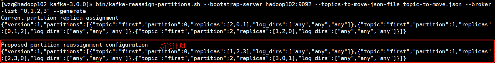

#### 2.3 创建副本存储计划

生成这个计划之后，需要将上图画红色框子的内容专门创建一个文件保存起来：

```bash
[wzq@hadoop102 kafka-3.0.0]$ vim increase-replication-factor.json
```

将上面红色框子的计划写到这个文件中：

```json
{"version":1,"partitions":[{"topic":"first","partition":0,"replicas":[1,2,3],"log_dirs":["any","any","any"]},{"topic":"first","partition":1,"replicas":[2,3,0],"log_dirs":["any","any","any"]},{"topic":"first","partition":2,"replicas":[3,0,1],"log_dirs":["any","any","any"]}]}
```


#### 2.4 执行副本存储计划

万事俱备，执行一下这个计划：

```bash
[wzq@hadoop102 kafka-3.0.0]$ bin/kafka-reassign-partitions.sh --bootstrap-server hadoop102:9092 --reassignment-json-file increase-replication-factor.json --execute
Current partition replica assignment

{"version":1,"partitions":[{"topic":"first","partition":0,"replicas":[2,0,1],"log_dirs":["any","any","any"]},{"topic":"first","partition":1,"replicas":[0,1,2],"log_dirs":["any","any","any"]},{"topic":"first","partition":2,"replicas":[1,2,0],"log_dirs":["any","any","any"]}]}

Save this to use as the --reassignment-json-file option during rollback
Successfully started partition reassignments for first-0,first-1,first-2
```

#### 2.5 验证副本存储计划

ok，然后我们可以验证一波：

```bash
[wzq@hadoop102 kafka-3.0.0]$ bin/kafka-reassign-partitions.sh --bootstrap-server hadoop102:9092 --reassignment-json-file increase-replication-factor.json --verify
Status of partition reassignment:
Reassignment of partition first-0 is complete.
Reassignment of partition first-1 is complete.
Reassignment of partition first-2 is complete.

Clearing broker-level throttles on brokers 0,1,2,3
Clearing topic-level throttles on topic first
```

也可以查看first主题的详细信息，看一下成功没有：

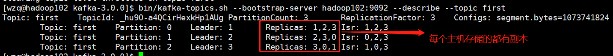

### 3、退役旧节点

这个退役旧节点，跟上面的步骤是一样一样的，只需要将`--broker-list`改为"0,1,2"就好了：

第一个json文件是要负载均衡的主题文件，已经有了，直接创建执行计划，不过broker list改为0，1，2：

```bash
[wzq@hadoop102 kafka-3.0.0]$ bin/kafka-reassign-partitions.sh --bootstrap-server hadoop102:9092 --topics-to-move-json-file topic-to-move.json --broker-list "0,1,2" --generate
Current partition replica assignment
{"version":1,"partitions":[{"topic":"first","partition":0,"replicas":[1,2,3],"log_dirs":["any","any","any"]},{"topic":"first","partition":1,"replicas":[2,3,0],"log_dirs":["any","any","any"]},{"topic":"first","partition":2,"replicas":[3,0,1],"log_dirs":["any","any","any"]}]}

Proposed partition reassignment configuration
{"version":1,"partitions":[{"topic":"first","partition":0,"replicas":[0,1,2],"log_dirs":["any","any","any"]},{"topic":"first","partition":1,"replicas":[1,2,0],"log_dirs":["any","any","any"]},{"topic":"first","partition":2,"replicas":[2,0,1],"log_dirs":["any","any","any"]}]}
```

创建完成这个计划之后，将生成的计划创建一个文件存储进去：

```bash
[wzq@hadoop102 kafka-3.0.0]$ vim increase-replication-factor.json
# 写入：
{"version":1,"partitions":[{"topic":"first","partition":0,"replicas":[0,1,2],"log_dirs":["any","any","any"]},{"topic":"first","partition":1,"replicas":[1,2,0],"log_dirs":["any","any","any"]},{"topic":"first","partition":2,"replicas":[2,0,1],"log_dirs":["any","any","any"]}]}
```


执行该计划：

```bash
[wzq@hadoop102 kafka-3.0.0]$ bin/kafka-reassign-partitions.sh --bootstrap-server hadoop102:9092 --reassignment-json-file increase-replication-factor.json --execute
```

查看该计划是否执行成功：

```bash
[wzq@hadoop102 kafka-3.0.0]$ bin/kafka-reassign-partitions.sh --bootstrap-server hadoop102:9092 --reassignment-json-file increase-replication-factor.json --verify
Status of partition reassignment:
Reassignment of partition first-0 is complete.
Reassignment of partition first-1 is complete.
Reassignment of partition first-2 is complete.

Clearing broker-level throttles on brokers 0,1,2,3
Clearing topic-level throttles on topic first
[wzq@hadoop102 kafka-3.0.0]$ bin/kafka-topics.sh --bootstrap-server hadoop102:9092 --describe --topic first
Topic: first	TopicId: _hu9O-a4QCirHexkHp1AUg	PartitionCount: 3	ReplicationFactor: 3	Configs: segment.bytes=1073741824
	Topic: first	Partition: 0	Leader: 1	Replicas: 0,1,2	Isr: 1,2,0
	Topic: first	Partition: 1	Leader: 2	Replicas: 1,2,0	Isr: 0,2,1
	Topic: first	Partition: 2	Leader: 2	Replicas: 2,0,1	Isr: 1,0,2
```


## 参考资料

- [B站尚硅谷Kafka学习视频](https://www.bilibili.com/video/BV1vr4y1677k)
- [Apache Kafka官网](https://kafka.apache.org/)

