> 本篇blog将学习Broker的副本机制，包括Leader的选举流程，Leader和Follower发生故障怎么处理，以及分区副本匹配，还有三个Broker在开发种的生产经验


## 一、副本基本信息

关于Kafka Broker副本有需要知晓的几个概念：

- Kafka副本作用：提高数据可靠性
- Kafka默认副本1个，生产环境一般配置2个，保证数据可靠性；太多副本会增加磁盘存储空间，增加网络上数据传输，降低效率
- Kafka种副本分为：Leader和Follower，Kafka生产者只会把数据发往Leader，然后Follower找Leader进行同步数据
- Kafka分区种的所有副本统称为AR（Assigned Repllicas）
  - AR = ISR + OSR
  - ISR：表示和Leader保持同步的Follower集合。如果Follower长时间没向Leader发送通信请求或同步数据，则该Follower就被认为死掉了，被踢出ISR。这个时间阈值由`reploca.lag.time.max.ms`参数决定，默认是30s，当Leader发生故障后，就会从AR中拿第一个Broker主机作为新的Leader
  - OSR：表示Follower与Leader副本同步时，延迟过多的副本


## 二、Leader选举流程

下图为Leader选举流程图，这个已经在【[Kafka Broker工作流程以及节点服役和退役](http://wzqwtt.club/2022/04/02/kafka-broker-gong-zuo-liu-cheng-yi-ji-jie-dian-fu-yi-he-tui-yi/)】这篇blog写过了，这一章节做一波实验来直观感受一下Leader的选举流程

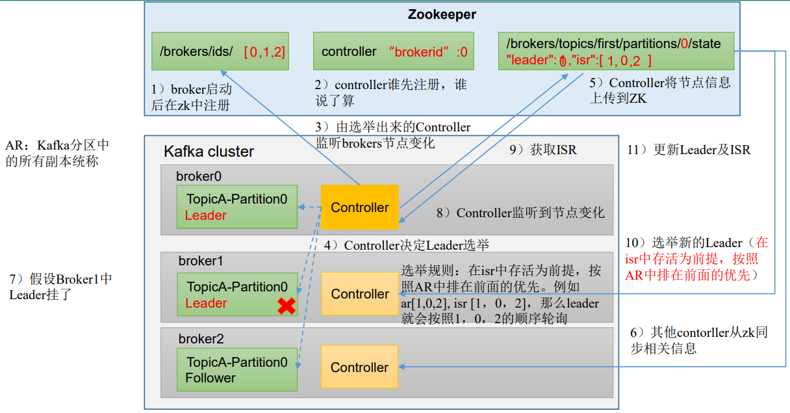

首先开启四台主机的kafka：

```bash
[wzq@hadoop102 kafka-3.0.0]$ zk.sh start
[wzq@hadoop102 kafka-3.0.0]$ kf.sh start
[wzq@hadoop105 kafka-3.0.0]$ bin/kafka-server-start.sh -daemon config/server.properties
```

首先创建一个主题`wzq`，指定这个主题四个分区四个副本

```bash
[wzq@hadoop102 kafka-3.0.0]$ bin/kafka-topics.sh --bootstrap-server hadoop102:9092 --create --topic wzq --partitions 4 --replication-factor 4
```

查看该主题副本和isr分布情况：

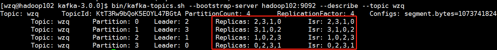

如果这时候停掉`hadoop105 broker=3`的这台主机，那么partition: 1的leader就会被1号主机上位（因为在该分区，副本的顺序是：3，1，0，2）：

```bash
[wzq@hadoop105 kafka-3.0.0]$ bin/kafka-server-stop.sh 
# 这里等待kafka关闭
[wzq@hadoop105 kafka-3.0.0]$ jps
4418 Jps
```

查看：

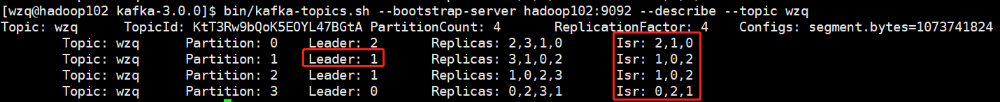


停掉`hadoop103 broker=1`的这台主机，那么partition:1和2就会被0号主机上位：

```bash
[wzq@hadoop103 kafka-3.0.0]$ bin/kafka-server-stop.sh 
[wzq@hadoop103 kafka-3.0.0]$ jps
27697 QuorumPeerMain  # zookeeper进程
29268 Jps
```

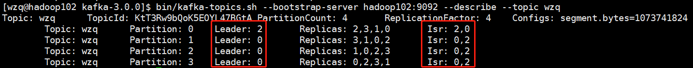


ok，这时候再上线`hadoop105 broker=3`这台主机，每个分区的Leader并不会变化：

```bash
[wzq@hadoop105 kafka-3.0.0]$ bin/kafka-server-start.sh -daemon config/server.properties 
[wzq@hadoop105 kafka-3.0.0]$ jps
4804 Kafka
4821 Jps
```

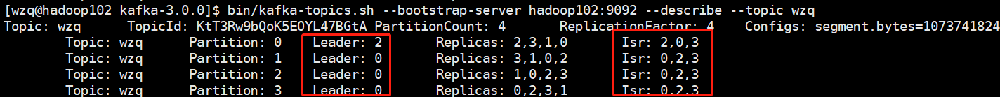

## 三、Leader和Follower故障处理细节

### 1、Follower故障处理

当有数据发送给Broker的时候，所有Follower都会向Leader要数据，这时候如果Follower发生故障怎么办？

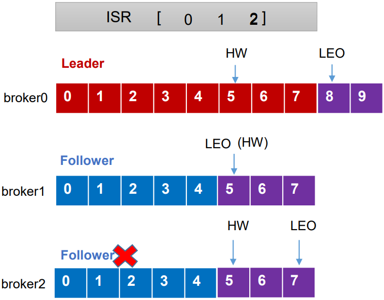

这里要引入两个概念：

- `LEO(Log End Offset)`：每个副本的最后一个offset，LEO其实就是最新的offset+1，offset可以看为每个消息
- `HW(High Watermark)`：所有副本中最小的LEO

当Follower发生故障时：

- Follower发生故障后会被临时踢出ISR
- 这个期间Leader和其他Follower继续同步数据
- 待该Follower恢复后，Follower会读取本地磁盘记录的上次的HW，并将log文件高于HW的部分截取掉，从HW开始向Leader进行同步
- 等待Follower的LEO大于等于该partition的HW，即Follower追上Leader后，就可以重新加入ISR队列了

### 2、Leader故障处理

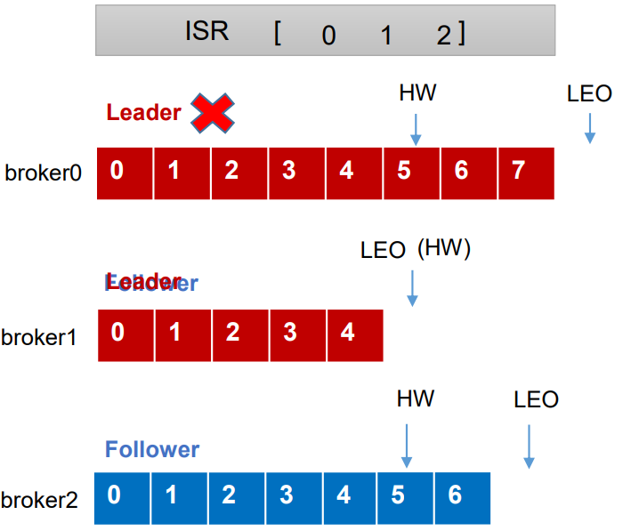

当Leader发生故障时：

- 从ISR中选出一个新的Leader
- 为保证多个副本之间的数据一致性，其余的Follower会先将各自的log文件高于HW的部分截掉，然后从新的Leader同步数据


> **注意：这只能保证副本之间数据的一致性，并不能保证数据不丢失或者不重复！**

## 四、生产经验——手动调整分区副本存储

### 1、分区副本分配机制

如果kafka服务器只有四个节点，如果设置kafka的分区数大于副本数，kafka底层是如何分配存储副本呢？

ok，创建一个topic看一下，设置分区数16个，副本4个：

```bash
[wzq@hadoop102 kafka-3.0.0]$ bin/kafka-topics.sh --bootstrap-server hadoop102:9092 --create --topic wzq1 --partitions 16 --replication-factor 4
```

查看这个topic的详细信息：

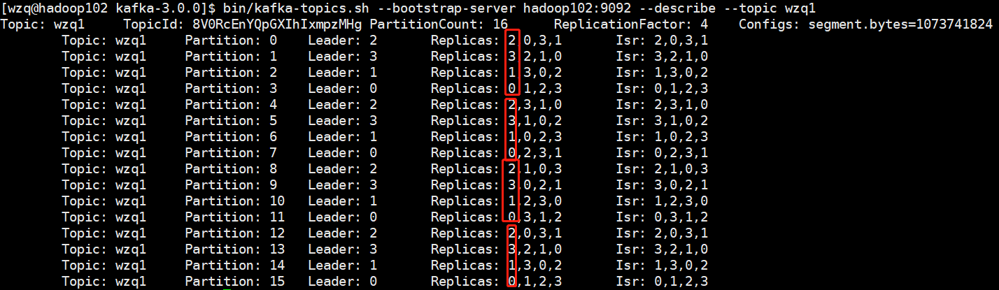

可以发现是这样存储的：

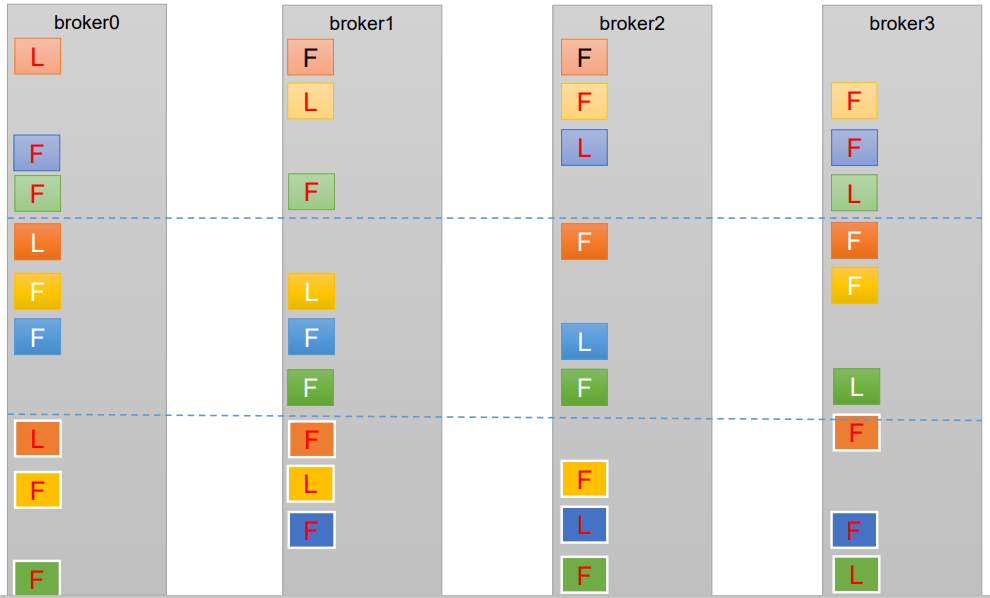

他会按照这个规律存储副本，每N个副本leader轮流做，然后Follower按照0、1、2...N的规则间隔

### 2、手动调整分区存储副本

在生产环境中，每台服务器的配置和性能不一致，但是Kafka只会根据自己的代码规则创建对应的分区副 本，就会导致个别服务器存储压力较大。所有需要手动调整分区副本的存储。

**需求：创建一个新的topic，4个分区，两个副本，名称为wzq2。将 该topic的所有副本都存储到broker0和 broker1两台服务器上。**

期望这样做：

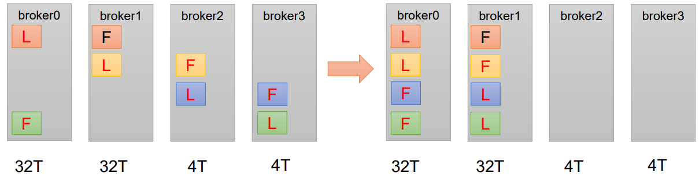

就是把原来的规则打破，把所有Leader存储到broker0和1


创建一个新的topic，指定4个分区，2个副本：

```bash
[wzq@hadoop102 kafka-3.0.0]$ bin/kafka-topics.sh --bootstrap-server hadoop102:9092 --create --topic wzq2 --partitions 4 --replication-factor 2
```

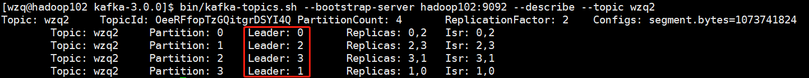

期望把Leader分布在0和1，这时候需要借助存储计划了


编写一个json文件，指定分区在哪里，副本存在哪个地方：

创建一个文件：

```bash
[wzq@hadoop102 kafka-3.0.0]$ vim increase-replication-factor.json
```

粘贴以下内容：

```json
{        
    	"version":1,
        "partitions":[
                {"topic":"wzq2","partition":0,"replicas":[0,1]},
                {"topic":"wzq2","partition":1,"replicas":[0,1]},
                {"topic":"wzq2","partition":2,"replicas":[0,1]},
                {"topic":"wzq2","partition":3,"replicas":[0,1]}
        ]
}
```


执行该存储计划：

```bash
[wzq@hadoop102 kafka-3.0.0]$ bin/kafka-reassign-partitions.sh --bootstrap-server hadoop102:9092 --reassignment-json-file increase-replication-factor.json --execute
```

验证存储计划：

```bash
[wzq@hadoop102 kafka-3.0.0]$ bin/kafka-reassign-partitions.sh --bootstrap-server hadoop102:9092 --reassignment-json-file increase-replication-factor.json --verify
Status of partition reassignment:
Reassignment of partition wzq2-0 is complete.
Reassignment of partition wzq2-1 is complete.
Reassignment of partition wzq2-2 is complete.
Reassignment of partition wzq2-3 is complete.

Clearing broker-level throttles on brokers 0,1,2,3
Clearing topic-level throttles on topic wzq2
```

分配成功：

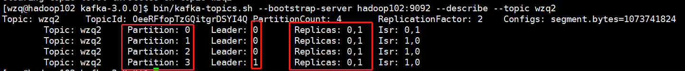


## 五、生产经验——Leader Partition负载平衡:star:

正常情况下，Kafka本身会自动把Leader Partition均匀分散在各个机器上，来保证每台机器的读写吞吐量都是均匀的。但是如果某 些broker宕机，会导致Leader Partition过于集中在其他少部分几台broker上，这会导致少数几台broker的读写请求压力过高，其他宕机的 broker重启之后都是follower partition，读写请求很低，造成集群负载不均衡。

比如这样：

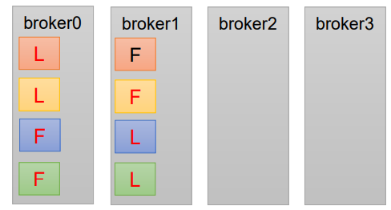

所有的Leader和Follower都分布在了broker0和1，为了防止这种情况有kafka会有下面三个参数帮助我们自动调整：

| 参数名称                                  | 描述                                                         |
| ----------------------------------------- | ------------------------------------------------------------ |
| `auto.leader.rebalance.enable`            | 默认是 true。 自动 Leader Partition 平衡。生产环 境中，leader 重选举的代价比较大，可能会带来 性能影响，建议设置为 false 关闭。 |
| `leader.imbalance.per.broker.percentage`  | 默认是 10%。每个 broker 允许的不平衡的 leader 的比率。如果每个 broker 超过了这个值，控制器 会触发 leader 的平衡。 |
| `leader.imbalance.check.interval.seconds` | 检查 leader 负载是否平衡的间隔 时间。                        |


## 六、生产经验——增加副本因子

当某个主题需要增加副本的时候，我们不能直接使用`alter`来操作，需要根据**指定的存储计划**根据计划执行增加副本


创建一个topic，三个分区，但只有一个副本：

```bash
[wzq@hadoop102 kafka-3.0.0]$ bin/kafka-topics.sh --bootstrap-server hadoop102:9092 --create --topic wzq3 --partitions 3 --replication-factor 1
Created topic wzq3.
[wzq@hadoop102 kafka-3.0.0]$ bin/kafka-topics.sh --bootstrap-server hadoop102:9092 --describe --topic wzq3
Topic: wzq3	TopicId: wDGwDi5CTFS1Qg0toConKw	PartitionCount: 3	ReplicationFactor: 1	Configs: segment.bytes=1073741824
	Topic: wzq3	Partition: 0	Leader: 2	Replicas: 2	Isr: 2
	Topic: wzq3	Partition: 1	Leader: 3	Replicas: 3	Isr: 3
	Topic: wzq3	Partition: 2	Leader: 1	Replicas: 1	Isr: 1
```


使用`alter`修改副本数是会直接失败的，所以我们需要创建一个存储计划：

```bash
[wzq@hadoop102 kafka-3.0.0]$ vim increase-replication-factor.json
```

填入以下内容：

```json
{
        "version":1,
        "partitions":[
                {"topic":"wzq3","partition":0,"replicas":[0,1,2]},
                {"topic":"wzq3","partition":1,"replicas":[0,1,2]},
                {"topic":"wzq3","partition":2,"replicas":[0,1,2]}
        ]
}
```

执行存储计划，并验证：

```bash
[wzq@hadoop102 kafka-3.0.0]$ bin/kafka-reassign-partitions.sh --bootstrap-server hadoop102:9092 --reassignment-json-file increase-replication-factor.json --execute
Current partition replica assignment

{"version":1,"partitions":[{"topic":"wzq3","partition":0,"replicas":[2],"log_dirs":["any"]},{"topic":"wzq3","partition":1,"replicas":[3],"log_dirs":["any"]},{"topic":"wzq3","partition":2,"replicas":[1],"log_dirs":["any"]}]}

Save this to use as the --reassignment-json-file option during rollback
Successfully started partition reassignments for wzq3-0,wzq3-1,wzq3-2
[wzq@hadoop102 kafka-3.0.0]$ bin/kafka-reassign-partitions.sh --bootstrap-server hadoop102:9092 --reassignment-json-file increase-replication-factor.json --verify
Status of partition reassignment:
Reassignment of partition wzq3-0 is complete.
Reassignment of partition wzq3-1 is complete.
Reassignment of partition wzq3-2 is complete.

Clearing broker-level throttles on brokers 0,1,2,3
Clearing topic-level throttles on topic wzq3
[wzq@hadoop102 kafka-3.0.0]$ bin/kafka-topics.sh --bootstrap-server hadoop102:9092 --describe --topic wzq3
Topic: wzq3	TopicId: wDGwDi5CTFS1Qg0toConKw	PartitionCount: 3	ReplicationFactor: 3	Configs: segment.bytes=1073741824
	Topic: wzq3	Partition: 0	Leader: 2	Replicas: 0,1,2	Isr: 2,1,0
	Topic: wzq3	Partition: 1	Leader: 0	Replicas: 0,1,2	Isr: 2,0,1
	Topic: wzq3	Partition: 2	Leader: 1	Replicas: 0,1,2	Isr: 1,2,0
```


## 参考资料

- [B站尚硅谷Kafka学习视频](https://www.bilibili.com/video/BV1vr4y1677k)
- [Apache Kafka官网](https://kafka.apache.org/)

