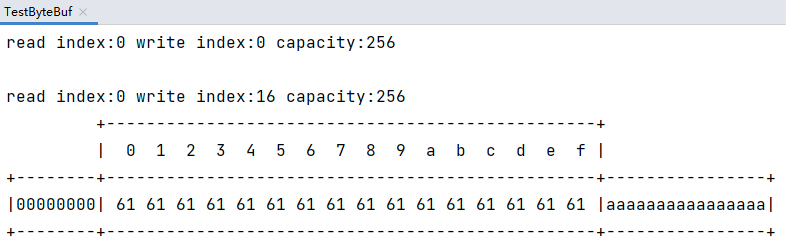
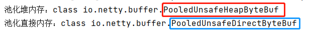
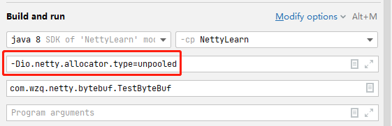
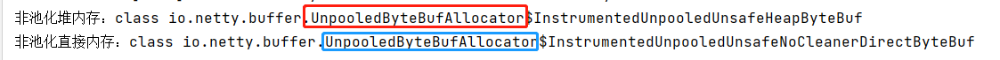
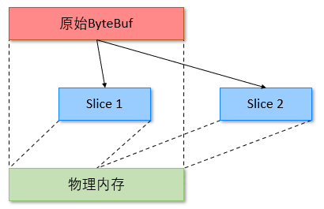
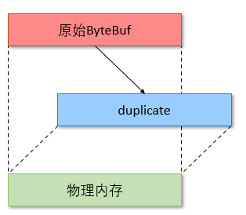

# ByteBuf

本节中所有的代码均可以在[com.wzq.netty.bytebuf](https://github.com/wzqwtt/BigData/tree/master/Netty/NettyLearn/src/main/java/com/wzq/netty/bytebuf)包中找到

# 一、ByteBuf——Netty的数据容器

网络数据的基本单位是**字节**。Java NIO提供了[ByteBuffer](https://github.com/wzqwtt/BigData/blob/master/Netty/NIO%E5%9F%BA%E7%A1%80.md#%E4%BA%8Cbytebuffer)作为它的字节容器；Netty使用ByteBuf做为替代：

- 它可以被用户自定义的缓冲区类型扩展
- 通过内置的复合缓冲区类型实现了透明的零拷贝
- 容量可以按需增长（类似于JDK的StringBuilder）
- 在读和写这两种模式之间切换不需要调用ByteBuffer的flip()方法
- 读和写使用了不同的索引
- 支持方法的链式调用
- 支持引用计数
- 支持池化

在开始之前，我们先引入一个方法，它可以更好的观察ByteBuf的内在结构：

```java
import io.netty.buffer.ByteBuf;
import static io.netty.buffer.ByteBufUtil.appendPrettyHexDump;
import static io.netty.util.internal.StringUtil.NEWLINE;

public class MyByteBufUtil {
    public static void log(ByteBuf buffer) {
        int length = buffer.readableBytes();
        int rows = length / 16 + (length % 15 == 0 ? 0 : 1) + 4;
        StringBuilder buf = new StringBuilder(rows * 80 * 2)
                .append("read index:").append(buffer.readerIndex())
                .append(" write index:").append(buffer.writerIndex())
                .append(" capacity:").append(buffer.capacity())
                .append(NEWLINE);
        appendPrettyHexDump(buf, buffer);
        System.out.println(buf.toString());
    }
}
```


# 二、ByteBuf的创建

```java
ByteBuf buf = ByteBufAllocator.DEFAULT.buffer(10);
MyByteBufUtil.log(buf);
```

上面的代码创建了一个ByteBuf，初始容量为10，输出如下：

```
read index:0 write index:0 capacity:10
```


我们也可以不分配容量，直接填充数据，看看默认的容量是多少：

```java
public class TestByteBuf {
    public static void main(String[] args) {
        // 创建ByteBuf
        ByteBuf buf = ByteBufAllocator.DEFAULT.buffer();
        MyByteBufUtil.log(buf);

        // 填充16个字节的数据
        StringBuilder sb = new StringBuilder();
        for (int i = 0; i < 16; i++) {
            sb.append('a');
        }
        buf.writeBytes(sb.toString().getBytes(StandardCharsets.UTF_8));

        // 打印查看
        MyByteBufUtil.log(buf);
    }
}
```

输出如下，默认容量是`256`个字节：



这样默认创建的ByteBuf是**池化、并且基于直接内存的**，下面来看一下他们直接的区别


## 1、直接内存 VS 堆内存

可以使用下面的代码来创建**池化基于堆**的ByteBuf：

```java
ByteBuf buf = ByteBufAllocator.DEFALUT.heapBuffer(10);
```

也可以使用下面的代码创建**池化基于直接内存**的ByteBuf：

```java
ByteBuf buf = ByteBufAllocator.DEFALUT.directBuffer(10);
// Netty默认创建基于直接内存的ByteBuf，所以上一行代码等价于：
ByteBuf buf1 = ByteBufAllocator.DEFAULT.buffer(10);
```

- 直接内存创建和销毁的代价昂贵，但读写性能高（少一次内存复制），适合配合池化功能一起用
- 直接内存对GC压力校，因为这部分内存不受JVM垃圾回收的管理，但也要注意及时主动释放


## 2、池化 VS 非池化

**池化的最大意义在于可以重用ByteBuf**，优点有：

- 没有池化，则每次都要创建新的ByteBuf实例，这个操作对直接内存代价昂贵，就算是堆内存，也会增加牙里
- 有了池化，则可以重用池中ByteBuf实例，并且采用了与jemalloc类似的内存分配算法提升分配效率
- 高并发时，池化功能更节约内存，减少内存溢出的可能

池化功能是否开启，可以通过下面的系统环境变量来设置：

```
-Dio.netty.allocator.type={unpooled|pooled}
```

- Netty 4.1以后，非Android平台默认启用池化实现，Android平台启用非池化实现
- Netty 4.1之前，池化功能不成熟，默认都是非池化实现

**Windows默认是开启池化功能的**


例子：

- 创建**池化堆内存**与**池化直接内存**：

  ```java
  public static void main(String[] args) {
      // 创建池化堆内存
      ByteBuf heapBuf = ByteBufAllocator.DEFAULT.heapBuffer();
      System.out.println("池化堆内存：" + heapBuf.getClass());
  
      // 创建池化直接内存
      ByteBuf directBuf = ByteBufAllocator.DEFAULT.directBuffer();
      // 直接内存是默认的，等价于：
      // ByteBuf directBuf = ByteBufAllocator.DEFAULT.buffer();
      System.out.println("池化直接内存：" + directBuf.getClass());
  }
  ```

  输出如下：

  

- 创建**非池化堆内存**与**非池化直接内存**：

  开始非池化功能，需要在JVM参数中设置：

  

  还是上面的代码，此时输出：

  


> **Unpooled缓冲区**
>
> 可能某些情况下，你未能获取一个`ByteBufAllocator`的引用。对于这种情况，Netty提供了一个简单的称为`Unpooled`的工具类，**它提供了静态辅助方法来创建未池化的ByteBuf实例。** 下面列出了一些重要的方法：
>
> | 方法                                                         | 描述                                      |
> | ------------------------------------------------------------ | ----------------------------------------- |
> | buffer()<br />buffer(int initialCapacity)<br />buffer(int initialCapacity, int maxCapacity) | 返回一个**未池化的基于堆内存**的ByteBuf   |
> | directBuffer()<br />directBuffer(int initialCapacity)<br />directBuffer(int initialCapacity, int maxCapacity) | 返回一个**未池化的基于直接内存**的ByteBuf |
> | wrappedBuffer()                                              | 返回一个包装了给定数据的ByteBuf           |
> | copiedBuffer()                                               | 返回一个复制了给定数据的ByteBuf           |


# 三、ByteBuf的组成

ByteBuf主要有以下几个组成部分：

- **最大容量与当前容量**
  - 在构造ByteBuf时，可传入两个参数，分别代表初始容量和最大容量，若未传入第二个参数（最大容量），最大容量默认为`Integer.MAX_VALUE`
  - 当ByteBuf容量无法容纳所有数据时，会进行扩容操作，若**超出最大容量**，则会抛出`java.lang.IndexOutOfBoundsException`异常
- 读写操作不同于ByteBuffer只用position进行控制，**ByteBuf分别由读指针和写指针两个指针控制**。进行读写操作时，无须进行模式的切换
  - 读指针前的部分被称为废弃部分，是以及读过的内容
  - 读指针与写指针的空间称为可读部分
  - 写指针与当前容量之间的空间称为可写部分

如下图所示：


# 四、读/写ByteBuf

ByteBuf的读/写有两种类别的操作：

- `get()`和`set()`操作，从给定的索引开始，并且保持索引不变
- `read()`和`write()`操作，从给定的索引开始，并且会根据已经访问过的字节数对索引进行调整


## 1、ByteBuf的写入

下表列出了一些写入ByteBuf的方法：这些放在在Netty类`ByteBuf`中

| 方法签名                                                     | 含义                       | 备注                                                    |
| ------------------------------------------------------------ | -------------------------- | ------------------------------------------------------- |
| writeBoolean(boolean value)                                  | 写入 boolean 值            | **用一字节 01\|00 代表 true\|false**                    |
| writeByte(int value)                                         | 写入 byte 值               |                                                         |
| writeShort(int value)                                        | 写入 short 值              |                                                         |
| writeInt(int value)                                          | 写入 int 值                | Big Endian（大端写入），即 0x250，写入后 00 00 02 50    |
| writeIntLE(int value)                                        | 写入 int 值                | Little Endian（小端写入），即 0x250，写入后 50 02 00 00 |
| writeLong(long value)                                        | 写入 long 值               |                                                         |
| writeChar(int value)                                         | 写入 char 值               |                                                         |
| writeFloat(float value)                                      | 写入 float 值              |                                                         |
| writeDouble(double value)                                    | 写入 double 值             |                                                         |
| writeBytes(ByteBuf src)                                      | 写入 netty 的 ByteBuf      |                                                         |
| writeBytes(byte[] src)                                       | 写入 byte[]                |                                                         |
| writeBytes(ByteBuffer src)                                   | 写入 nio 的 **ByteBuffer** |                                                         |
| int writeCharSequence(CharSequence sequence, Charset charset) | 写入字符串                 | CharSequence为字符串类的父类，第二个参数为对应的字符集  |

> :warning:注意：
>
> - 这些方法未指明返回值的，其返回值都是ByteBuf，意味着可以进行链式调用
> - 网络传输中，写入Int值，习惯使用大端写入


和`write`对应的是`set()`操作：

| 方法                                 | 描述                      |
| ------------------------------------ | ------------------------- |
| setBoolean(int index, boolean value) | 设定给定索引处的Boolean值 |
| setByte(int index, int value)        | 设定给定索引处的字节值    |
| setMedium(int index, int value)      | 设定给定索引处的中等int值 |
| setInt(int index, int value)         | 设定给定索引处的int值     |
| setLong(int index, long value)       | 设定给定索引处的long值    |
| setShort(int index, int value)       | 设定给定索引处的short值   |


使用写入方法的例子，在这个例子中，依次添加了4个字节、两个int值、1个long值，最后到达最大容量，再加入一个字节将会报错！

```java
public class TestByteBufWrite {
    public static void main(String[] args) {
        // 创建ByteBuf，初始容量是16，最大容量是20
        ByteBuf buf = ByteBufAllocator.DEFAULT.buffer(16, 20);
        MyByteBufUtil.log(buf);

        // 向ByteBuf中写入数据
        // 写入一组byte[]数组
        buf.writeBytes(new byte[]{97, 98, 99, 100});    // 4个字节
        MyByteBufUtil.log(buf);

        // 大端写入一个int值
        buf.writeInt(1);    // 4个字节
        MyByteBufUtil.log(buf);

        // 小端写入一个Int值
        buf.writeIntLE(2);    // 4个字节
        MyByteBufUtil.log(buf);

        // 写入一个Long值
        buf.writeLong(3);   // 8个字节
        MyByteBufUtil.log(buf);

        // 已经到达最大容量了，即使再添加一个字节也会报错
        buf.writeByte(1);
    }
}
```

输出如下：

```bash
# 创建一个ByteBuf，初始容量为16
read index:0 write index:0 capacity:16

# 写入4个字节，写入的是97\98\99\100，打印出来对应的16进制表示为：61\62\63\64
read index:0 write index:4 capacity:16
         +-------------------------------------------------+
         |  0  1  2  3  4  5  6  7  8  9  a  b  c  d  e  f |
+--------+-------------------------------------------------+----------------+
|00000000| 61 62 63 64                                     |abcd            |
+--------+-------------------------------------------------+----------------+

# 大端写入一个int值，占用4个字节
read index:0 write index:8 capacity:16
         +-------------------------------------------------+
         |  0  1  2  3  4  5  6  7  8  9  a  b  c  d  e  f |
+--------+-------------------------------------------------+----------------+
|00000000| 61 62 63 64 00 00 00 01                         |abcd....        |
+--------+-------------------------------------------------+----------------+

# 小端写入一个int值，占用4个字节
read index:0 write index:12 capacity:16
         +-------------------------------------------------+
         |  0  1  2  3  4  5  6  7  8  9  a  b  c  d  e  f |
+--------+-------------------------------------------------+----------------+
|00000000| 61 62 63 64 00 00 00 01 02 00 00 00             |abcd........    |
+--------+-------------------------------------------------+----------------+

# 写入一个long值，占用8个字节
read index:0 write index:20 capacity:20
         +-------------------------------------------------+
         |  0  1  2  3  4  5  6  7  8  9  a  b  c  d  e  f |
+--------+-------------------------------------------------+----------------+
|00000000| 61 62 63 64 00 00 00 01 00 00 00 02 00 00 00 00 |abcd............|
|00000010| 00 00 00 03                                     |....            |
+--------+-------------------------------------------------+----------------+

# 此时已经达到最大容量20，再加入一个字节将会报错
Exception in thread "main" java.lang.IndexOutOfBoundsException: writerIndex(20) + minWritableBytes(1) exceeds maxCapacity(20): PooledUnsafeDirectByteBuf(ridx: 0, widx: 20, cap: 20/20)
	at io.netty.buffer.AbstractByteBuf.ensureWritable0(AbstractByteBuf.java:294)
	at io.netty.buffer.AbstractByteBuf.writeByte(AbstractByteBuf.java:984)
	at com.wzq.netty.bytebuf.TestByteBufWrite.main(TestByteBufWrite.java:37)
```


## 2、ByteBuf扩容

再上面的例子中，达到最大容量后，再写入字节将会报错！

如果我们不指定最大容量值，那么系统将会分配最大容量为：`Integer.MAX_VALUE`：

```java
// 默认最大容量为Integer.MAX_VALUE
static final int DEFAULT_MAX_CAPACITY = Integer.MAX_VALUE;
    
// 没有指定最大容量，则按照DEFAULT_MAX_CAPACITY指定
public ByteBuf directBuffer(int initialCapacity) {
    return directBuffer(initialCapacity, DEFAULT_MAX_CAPACITY);
}
```


当我们不指定最大容量时，Netty的ByteBuf有自己的**扩容规则**：

- 如果写入后，**数据大小未超过512字节，则选择下一个16的整数倍进行扩容**
  - 例如写入后大小为12字节，选择16的下一个整数倍：16，扩容后capacity=16字节
- 如果写入后，**数据大小超过512字节，则选择下一个2<sup>n</sup>进行扩容**
  - 例如写入后大小为513字节，则扩容后capacity=2<sup>10</sup>=1024字节（因为2<sup>9</sup>=512）
- 扩容不能超过maxCapacity，否则会抛出`IndexOutOfBoundsException`异常


## 3、ByteBuf的读取

下面列出了一些ByteBuf的读取操作：

| 方法                                                         | 描述                                                         |
| ------------------------------------------------------------ | ------------------------------------------------------------ |
| readBoolean()                                                | 返回当前readerIndex处的Boolean，并将readerIndex增加1         |
| readByte()                                                   | 返回当前readerIndex处的字节，并将readerIndex增加1            |
| readUnsignedByte()                                           | 返回当前readerIndex处的无符号字节值作为short返回，并将readerIndex增加1 |
| readInt()                                                    | 返回当前readerIndex处的int值，并将readerIndex增加4           |
| readUnsignedInt()                                            | 返回当前readerIndex处的无符号的int值，作为long值返回，并将readerIndex增加4 |
| readLong()                                                   | 返回当前readerIndex处的long值，并将readerIndex增加8          |
| readShort()                                                  | 返回当前readerIndex处的Short值，并将readerIndex增加2         |
| readBytes(ByteBuf \| byte[] destination, int dstIndex [,int length]) | 将当前ByteBuf中从当前readerIndex处开始的数据传送到一个目标ByteBuf或者byte[]，从目前的dstIndex开始的位置。本地的readerIndex将被增加已经传输的字节数 |

与之对应的有get操作，这里就不列出来了


如果需要重复读取，可以使用`markReaderIndex`和`resetReaderIndex`：

```java
public class TestByteBufRead {
    public static void main(String[] args) {
        // 创建ByteBuf并写入一些字节
        ByteBuf buf = ByteBufAllocator.DEFAULT.buffer();
        buf.writeBytes(new byte[]{97, 98, 99, 100, 101, 102, 103});

        // 先读取2个数据
        System.out.println((char) buf.readByte());
        System.out.println((char) buf.readByte());

        // 打印查看，此时read index在2
        MyByteBufUtil.log(buf);

        // 标记2为读取的位置
        buf.markReaderIndex();
        // 继续读两个数据
        System.out.println((char) buf.readByte());
        System.out.println((char) buf.readByte());

        // 此时read index在4
        MyByteBufUtil.log(buf);

        // 重复读取，重置readindex标记到2
        buf.resetReaderIndex();
        MyByteBufUtil.log(buf);
    }
}
```

结果如下：

```bash
# 读取数据
a
b
read index:2 write index:7 capacity:256
         +-------------------------------------------------+
         |  0  1  2  3  4  5  6  7  8  9  a  b  c  d  e  f |
+--------+-------------------------------------------------+----------------+
|00000000| 63 64 65 66 67                                  |cdefg           |
+--------+-------------------------------------------------+----------------+

####################################
###### 在此标记了ReaderIndex
# 继续读数据
c
d
read index:4 write index:7 capacity:256
         +-------------------------------------------------+
         |  0  1  2  3  4  5  6  7  8  9  a  b  c  d  e  f |
+--------+-------------------------------------------------+----------------+
|00000000| 65 66 67                                        |efg             |
+--------+-------------------------------------------------+----------------+

# 恢复标记，此时ReaderIndex=2
read index:2 write index:7 capacity:256
         +-------------------------------------------------+
         |  0  1  2  3  4  5  6  7  8  9  a  b  c  d  e  f |
+--------+-------------------------------------------------+----------------+
|00000000| 63 64 65 66 67                                  |cdefg           |
+--------+-------------------------------------------------+----------------+
```


# 五、ByteBuf内存释放

由于Netty中有堆外内存的ByteBuf实现，堆外内存最好是手动来释放，而不是等GC垃圾回收。

- UnpooledHeapByteBuf使用的是JVM内存，只需要等GC回收内存即可
- UnpooledDirectByteBuf使用的就是直接内存了，需要特殊的方法来回收内存
- PooledByteBuf和它的子类使用了池化机制，需要更复杂的规则来回收内存


> 回收内存的源码实现，请关注下面方法的不同实现
>
> `protected abstract void deallocate()`


Netty这里采用了**引用计数法**来控制回收内存，每个ByteBuf都实现了`ReferenceCounted`接口

- 每个ByteBuf对象的**初始计数为1**
- 调用`release`方法计数**减1**，**如果计数为0，ByteBuf内存被回收**
- 调用`retain`方法计数**加1，表示调用者没用完之前，其他handler即使调用了release也不会造成回收**
- 当计数为0时，底层内存会被会后，这时即使ByteBuf对象还在，其各个方法均无法正常使用


那么，谁来负责release呢？

不是这样：

```java
ByteBuf buf = ...;
try {
    ...
} finally {
    buf.release();
}
```

因为pipeline的存在，一般需要将ByteBuf传递给下一个ChannelHandler，如果在finally中release了，就失去了传递性。因此**谁最后拿到ByteBuf谁释放！**

当然，如果这个ChannelHandler内的ByteBuf已经完成了它的使命，那么就不需要再传递了，可以直接释放


# 六、零拷贝

## 1、slice

**slice是零拷贝的体现之一，它对原始ByteBuf进行切片，分成多个ByteBuf，切片后的ByteBuf并没有发生内存复制，还是使用原始的ByteBuf内存，切片的每个ByteBuf维护独立的read，write指针**



slice案例：

```java
public class TestByteBufSlice {
    public static void main(String[] args) {
        // 创建一个ByteBuf，并为其写入一些数据
        ByteBuf buf = ByteBufAllocator.DEFAULT.buffer();
        buf.writeBytes(new byte[]{'a', 'b', 'c', 'd', 'e', 'f', 'g', 'h', 'i', 'j'});
        MyByteBufUtil.log(buf);

        // 在ByteBuf切片的过程中，数据没有发生复制
        // slice方法传入两个参数，第一个参数是索引开始的位置，第二个参数是切片的长度
        ByteBuf bufSlice1 = buf.slice(0, 5);
        ByteBuf bufSlice2 = buf.slice(5, 5);

        System.out.println("bufSlice1:");
        MyByteBufUtil.log(bufSlice1);
        System.out.println("bufSlice2:");
        MyByteBufUtil.log(bufSlice2);

        // 我们可以在bufSlice1上修改一个值，原有的大buf对应的索引也会改变
        bufSlice1.setByte(0, 'z');
        // 打印查看
        System.out.println("buf索引为0的位置发生改变:");
        MyByteBufUtil.log(buf);

        // 如果我们直接释放了buf，那么切片后的两个slice也不能继续正常使用了
        buf.release();

        // 再次尝试修改bufSlice2的数据，将会报错
        bufSlice2.setByte(0, 'y');
    }
}
```

结果：

```bash
# 创建一个ByteBuf，并为其写入一些数据
read index:0 write index:10 capacity:256
         +-------------------------------------------------+
         |  0  1  2  3  4  5  6  7  8  9  a  b  c  d  e  f |
+--------+-------------------------------------------------+----------------+
|00000000| 61 62 63 64 65 66 67 68 69 6a                   |abcdefghij      |
+--------+-------------------------------------------------+----------------+

# 切片后的两个buf
bufSlice1:
read index:0 write index:5 capacity:5
         +-------------------------------------------------+
         |  0  1  2  3  4  5  6  7  8  9  a  b  c  d  e  f |
+--------+-------------------------------------------------+----------------+
|00000000| 61 62 63 64 65                                  |abcde           |
+--------+-------------------------------------------------+----------------+
bufSlice2:
read index:0 write index:5 capacity:5
         +-------------------------------------------------+
         |  0  1  2  3  4  5  6  7  8  9  a  b  c  d  e  f |
+--------+-------------------------------------------------+----------------+
|00000000| 66 67 68 69 6a                                  |fghij           |
+--------+-------------------------------------------------+----------------+

# 当改变切片中的一个数据时，大buf也会改变，这证明了没有发生数据复制
buf索引为0的位置发生改变:
read index:0 write index:10 capacity:256
         +-------------------------------------------------+
         |  0  1  2  3  4  5  6  7  8  9  a  b  c  d  e  f |
+--------+-------------------------------------------------+----------------+
|00000000| 7a 62 63 64 65 66 67 68 69 6a                   |zbcdefghij      |
+--------+-------------------------------------------------+----------------+

# 如果我们直接释放了buf，那么切片后的两个slice也不能继续正常使用了
Exception in thread "main" io.netty.util.IllegalReferenceCountException: refCnt: 0
	at io.netty.buffer.AbstractByteBuf.ensureAccessible(AbstractByteBuf.java:1454)
	at io.netty.buffer.AbstractByteBuf.checkIndex(AbstractByteBuf.java:1383)
	at io.netty.buffer.AbstractByteBuf.checkIndex(AbstractByteBuf.java:1379)
	at io.netty.buffer.AbstractByteBuf.setByte(AbstractByteBuf.java:525)
	at io.netty.buffer.AbstractUnpooledSlicedByteBuf.setByte(AbstractUnpooledSlicedByteBuf.java:257)
	at com.wzq.netty.bytebuf.TestByteBufSlice.main(TestByteBufSlice.java:39)
```


在上面的案例中，我们释放了被切分的ByteBuf，那么切分后的ByteBuf也不能正常使用了，因此，我们在切分之后，习惯对ByteBuf的引用计数+1：

```java
// 两个切片的引用计数+1
bufSlice1.retain();
bufSlice2.retain();

// 使用完成之后，注意手动释放
try {
    // 使用切片ByteBuf
    // .............
} finally {
    bufSlice1.release();
    bufSlice2.release();
}
```


## 2、duplicate

**duplicate是零拷贝的另一体现，就好比截取了原始ByteBuf所有内容，并且没有MAX_CAPACITY的限制，也是与原始ByteBuf使用同一块底层内存，只是读写指针是独立的**




**copy也可以进行复制，但是它会进行深层次的拷贝**

案例：

```java
public class TestByteBufDuplicate {
    public static void main(String[] args) {
        // 新建ByteBuf，然后填充一些内容
        ByteBuf buf = ByteBufAllocator.DEFAULT.buffer();
        buf.writeBytes(new byte[]{'a', 'b', 'c', 'd', 'e', 'f', 'h', 'i', 'j', 'k'});

        // 使用duplicate进行零拷贝
        ByteBuf dupBuf = buf.duplicate();
        dupBuf.retain();    // 引用计数+1
        MyByteBufUtil.log(dupBuf);

        // 对dupBuf进行修改，buf也会改变
        dupBuf.setByte(0, 'z');
        MyByteBufUtil.log(buf);

        // 释放内存
        buf.release();
        dupBuf.release();
    }
}
```


## 4、composite

**Composite可以将多个小的ByteBuf组合成大的ByteBuf**


案例：

```java
public class TestByteBufComposite {
    public static void main(String[] args) {
        // 新建三个ByteBuf，并写入一些内容
        ByteBuf buf1 = ByteBufAllocator.DEFAULT.buffer();
        buf1.writeBytes(new byte[]{1, 2, 3, 4, 5});

        ByteBuf buf2 = ByteBufAllocator.DEFAULT.buffer();
        buf2.writeBytes(new byte[]{6, 7, 8, 9, 10});

        ByteBuf buf3 = ByteBufAllocator.DEFAULT.buffer();
        buf3.writeBytes(new byte[]{11, 12, 13, 14, 15});

        // 合并为一个buf
        CompositeByteBuf buf = ByteBufAllocator.DEFAULT.compositeBuffer();
        buf.addComponents(true, buf1, buf2, buf3);
        MyByteBufUtil.log(buf);

        buf.writeBytes(new byte[]{99, 98, 100, 101});
        MyByteBufUtil.log(buf);

        // 因为composite也是零拷贝，所以修改buf1，buf也会改变
        buf1.setByte(0, 50);
        MyByteBufUtil.log(buf);
    }
}
```

