# ChannelHandler & ChannelPipeline

ChannelHandler用来处理Channel上的各种事件，分为入站、出站两种。所有ChannelHandler被连成一串，就是Pipeline

- 入站处理器通常是`ChannelInboundHandlerAdapter`的子类，主要用来读取客户端数据，写回结果
- 出站处理器通常是`ChannelOutboundHandlerAdapter`的子类，主要对写回结果进行加工

打个比喻，每个Channel是一个产品的加工车间，Pipeline是车间的流水线，ChannelHandler就是流水线的各道工序，而后面要搞的ByteBuf就是原材料，经过很多工序的加工：先经过一道道入站工序，再经过一道道出站工序最终变成产品


接下来我们逐个击破，本节所有的代码均可以在[com.wzq.netty.handler](https://github.com/wzqwtt/BigData/tree/master/Netty/NettyLearn/src/main/java/com/wzq/netty/handler)中找到

# 一、ChannelHandler


## 1、Channel的生命周期

Channel接口定义了一组和ChannelInboundHandler API密切相关的并且功能强大的方法，下表列出了Channel生命周期的四个状态：

| 状态                | 描述                                                         |
| ------------------- | ------------------------------------------------------------ |
| ChannelUnregistered | Channel已经被创建，但还未注册道EventLoop                     |
| ChannelRegistered   | Channel已经被注册到了EventLoop                               |
| ChannelActive       | Channel处于活动状态（已经连接到它的远程节点），现在可以接收和发送数据了 |
| ChannelInactive     | Channel没有连接到远程节点                                    |

Channel的正常生命周期如下图所示。当这些状态发生改变时，将会生成对应的事件。这些事件将会被转发给ChannelPipeline中的ChannelHandler，handler随后对他们做出响应。

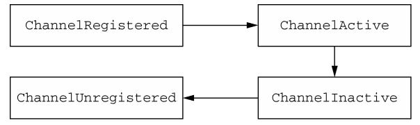


## 2、ChannelHandler的生命周期

下表列出了ChannelHandler接口中定义的生命周期操作，在ChannelHandler被添加到ChannelPipeline中或者被Pipeline中移除时会调用这些操作

| 类型                    | 描述                                              |
| ----------------------- | ------------------------------------------------- |
| handlerAdded            | 当把ChannelHandler添加到ChannelPipeline中时被调用 |
| handlerRemoved          | 当从ChannelPipeline中移除ChannelHandler时被调用   |
| exceptionCaught（弃用） | 当处理过程中在ChannelPipeline中有异常产生时被调用 |

这些方法都接收一个`ChannelHandlerContext`参数：

```java
void handlerAdded(ChannelHandlerContext ctx) throws Exception;
void handlerRemoved(ChannelHandlerContext ctx) throws Exception;
@Deprecated
void exceptionCaught(ChannelHandlerContext ctx, Throwable cause) throws Exception;
```

ChannelHandler有两个重要的接口:

- `ChannelInboundHandler`：处理入站数据以及各种状态的变化
- `ChannelOutboundHandler`：处理出站数据

## 3、ChannelInboundHandler接口

ChannelInboundHandler负责处理入站信息，他也有他的生命周期方法，或者叫做`处理方法`，如果我们想自定义一些handler，这些方法可以选择性重写：

```java
// 当Channel已经注册到它的EventLoop并且能够处理I/O事件时被调用
void channelRegistered(ChannelHandlerContext ctx) throws Exception;

// 当Channel从它的EventLoop注销并且无法处理任务I/O事件时被调用
void channelUnregistered(ChannelHandlerContext ctx) throws Exception;

// 当Channel处于活动状态时被调用；Channel已经连接/绑定并且已经就绪
void channelActive(ChannelHandlerContext ctx) throws Exception;

// 当Channel离开活动状态并且不再连接它的远程节点时被调用
void channelInactive(ChannelHandlerContext ctx) throws Exception;

// 当从Channel读取数据时被调用
void channelRead(ChannelHandlerContext ctx, Object msg) throws Exception;

// 当Channel上的一个读操作完成时被调用
void channelReadComplete(ChannelHandlerContext ctx) throws Exception;

// 当ChannelInboundHandler.fireUserEventTriggered()被调用时被调用
void userEventTriggered(ChannelHandlerContext ctx, Object evt) throws Exception;

/** 
 * 当Channel的可写状态发生改变时被调用。用户可以确保写操作不会完成的太快（以免发生OutOfMemoryError）或者可以在
 * Channel变为再次可写时恢复写入。可以通过调用Channel的isWritable()方法来检测Channel的可写性。与可写性相关的
 * 阈值可以通过Channel.config().setWriteHighWaterMark()和Channel.config().setWriteLowWaterMark()方
 * 法来设置
 */
void channelWritabilityChanged(ChannelHandlerContext ctx) throws Exception;

/**
 * Gets called if a {@link Throwable} was thrown.
 */
@Override
@SuppressWarnings("deprecation")
void exceptionCaught(ChannelHandlerContext ctx, Throwable cause) throws Exception;
```


## 4、ChannelOutboundHandler接口

出站操作和数据将由`ChannelOutboundHandler`处理，它的方法将被Channel、ChannelPipeline以及ChannelHandlerContext调用

下面列出了该接口的一些重要方法：

```java
// 当请求将Channel绑定到本地地址时被调用
void bind(ChannelHandlerContext ctx, SocketAddress localAddress, ChannelPromise promise) throws Exception;

// 当请求将Channel连接到远程节点时被调用
void connect(
    ChannelHandlerContext ctx, SocketAddress remoteAddress,
    SocketAddress localAddress, ChannelPromise promise) throws Exception;

// 当请求将Channel从远程节点断开时被调用
void disconnect(ChannelHandlerContext ctx, ChannelPromise promise) throws Exception;

// 当请求关闭Channel时被调用
void close(ChannelHandlerContext ctx, ChannelPromise promise) throws Exception;

// 当请求将Channel从它的EventLoop注销时被调用
void deregister(ChannelHandlerContext ctx, ChannelPromise promise) throws Exception;

// 当请求通过Channel读取更多的数据时被调用
void read(ChannelHandlerContext ctx) throws Exception;

// 当请求通过Channel将数据写到远程节点时被调用
void write(ChannelHandlerContext ctx, Object msg, ChannelPromise promise) throws Exception;

// 当请求通过Channel将数据写到远程节点时被调用
void flush(ChannelHandlerContext ctx) throws Exception;
```

上面的一些方法都需要`ChannelPromise`或`ChannelFuture`参数，在[上节](Channel和ChannelFuture.md)中已经介绍。


## 5、ChannelHandler适配器

然后时`ChannelHandlerAdapter(适配器)`，请看下图的继承关系：

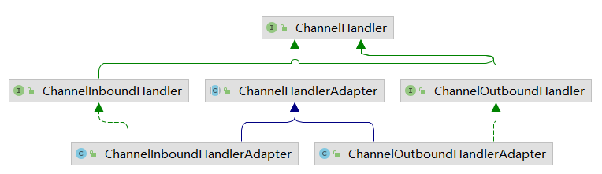

ChannelHandlerAdapter是一个抽象类，其下的ChannelInboundHandlerAdapter和ChannelOutboundHandlerAdapter继承了该适配器，并且实现了Channel入站/出站Handler。**在这两个类中，提供了入站出站Handler的基本实现**


# 二、ChannelPipeline接口

**Pipeline是流水线，Handler是流水线上的各道工序**

每一个新创建的Channel都将会被分配一个新的ChannelPipeline。这个关联是永久性的；Channel既不能附加给另外一个ChannelPipeline，也不能分离当前的。

下图为我们展示了一个Pipeline：

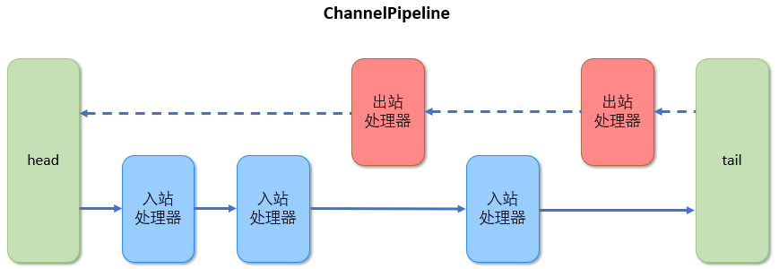

**需要说明的是：虽然有两条线，但上面是一个Pipeline，一个Pipeline有头（head）有尾（tail），中间是处理器。入站处理器从头开始向后走，出站处理器从尾巴开始向前走！**

当然上图也印证了：在ChannelPipeline传播事件中，它会测试ChannelPipeline中的下一个Handler类型是否和事件的运动方向相匹配。如果不匹配，Pipeline将跳过该Handler并前进到下一个，直到它找到和该事件所期望的方向相匹配的位置。

当然，一个Handler也可以同时实现ChannelInboundHandler接口和ChannelOutboundHandler接口


## 1、修改Pipeline

ChannelHandler可以通过添加、删除或替换其他的ChannelHandler来实时地修改ChannlePipeline的布局，下表列出了用于修改Pipeline的方法

| 方法                                               | 描述                                                         |
| -------------------------------------------------- | ------------------------------------------------------------ |
| addFirst<br />addBefore<br />addAfter<br />addLast | 将一个ChannelHandler添加到ChannelPipeline中                  |
| remove                                             | 将一个ChannelHandler从ChannelPipeline中移除                  |
| replace                                            | 将ChannelPipeline中的一个ChannelHandler替换为另一个ChannelHandler |

下面展示一下这些方法怎么使用，使用在[上一节](https://github.com/wzqwtt/BigData/blob/master/Netty/Channel%E5%92%8CChannelFuture.md#2%E5%85%B3%E9%97%AD%E9%97%AE%E9%A2%98)编写好的客户端

先写一个入站handler，这个handler实现一个ChannelRead方法，打印当前是哪个handler处理了这条信息：

```java
@Slf4j
public class InboundHandlerDemo extends ChannelInboundHandlerAdapter {
    @Override
    public void channelRead(ChannelHandlerContext ctx, Object msg) throws Exception {
        log.debug("Handler:{}, 消息:{}", ctx.name(), msg.toString());
        super.channelRead(ctx, msg);
    }
}
```

然后编写我们的服务端，在服务端中演示了怎么添加Handler：

```java
@Slf4j
public class TestPipelineUpdate {
    public static void main(String[] args) {
        EventLoopGroup boss = new NioEventLoopGroup();
        EventLoopGroup worker = new NioEventLoopGroup();

        try {
            new ServerBootstrap()
                    .group(boss, worker)
                    .channel(NioServerSocketChannel.class)
                    .childHandler(new InboundChannelInitializer())
                    .bind(7);

        } catch (Exception e) {
            e.printStackTrace();
            boss.shutdownGracefully();
            worker.shutdownGracefully();
        }
    }

    // 入站处理器添加顺序
    static class InboundChannelInitializer extends ChannelInitializer<NioSocketChannel> {

        @Override
        protected void initChannel(NioSocketChannel ch) throws Exception {
            // 获取pipeline对象
            ChannelPipeline pipeline = ch.pipeline();

            // 在第一个位置添加StringDecoder
            pipeline.addFirst("StringDecoder", new StringDecoder());
            // 在pipeline末尾添加handler2
            pipeline.addLast("handler2", new InboundHandlerDemo());
            // 在handler2之前添加handler1
            pipeline.addBefore("handler2", "handler1", new InboundHandlerDemo());
            // 在handle2之后添加handler3
            pipeline.addAfter("handler2", "handler3", new InboundHandlerDemo());

            // 删除一个handler
            pipeline.remove("handler3");
            // 替换一个handler
            pipeline.replace("handler1", "handlerFirst", new InboundHandlerDemo());
        }
    }
}
```

启动服务端，再启动客户端发送信息，可以看到目前pipeline除了StringDecoder、head、tail之外，只有两个Handler了：handlerFirst与handler2，并且按照正方向打印：

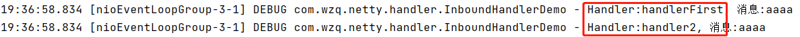


对于出站处理器，是按照从tail到head的方向执行的，再编写一个出站handler：

```java
@Slf4j
public class OutboundHandlerDemo extends ChannelOutboundHandlerAdapter {
    @Override
    public void read(ChannelHandlerContext ctx) throws Exception {
        log.debug("Handler:{}", ctx.name());
        super.read(ctx);
    }
}
```

在服务端里面再写一个关于出站的增删改操作：

```java
// ...
childHandler(new OutboundChannelInitializer())
// ...

// 出战处理器添加顺序
static class OutboundChannelInitializer extends ChannelInitializer<NioSocketChannel> {

    @Override
    protected void initChannel(NioSocketChannel ch) throws Exception {
        // 获取pipeline对象
        ChannelPipeline pipeline = ch.pipeline();

        // 在第一个位置添加StringDecoder
        pipeline.addFirst("StringDecoder", new StringDecoder());
        // 在pipeline末尾添加handler2
        pipeline.addLast("handler2", new OutboundHandlerDemo());
        // 在handler2之前添加handler1
        pipeline.addBefore("handler2", "handler1", new OutboundHandlerDemo());
        // 在handle2之后添加handler3
        pipeline.addAfter("handler2", "handler3", new OutboundHandlerDemo());

        // 删除一个handler
        pipeline.remove("handler3");
        // 替换一个handler
        pipeline.replace("handler1", "handlerFirst", new OutboundHandlerDemo());
    }
}
```

现在pipeline的Handler顺序是：head -> handlerFirst -> handler2 -> tail，由于我们两个handler都是出站Handler，所以从tail方向往head方向开始执行：

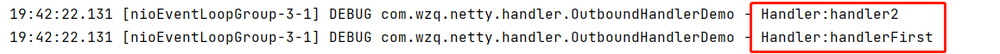


当然，如果入站处理器和出战处理器混合，如下图所示：服务端会首先处理入站处理器，然后再走反方向处理出站处理器


下面的代码将入站和出站操作混在了一起，让我们看看是否达到了一样的效果：

```java
// ...
childHandler(new MixInAndOutChannelInitializer())
// ...

// 入站和出站混合
static class MixInAndOutChannelInitializer extends ChannelInitializer<NioSocketChannel> {

    @Override
    protected void initChannel(NioSocketChannel ch) throws Exception {
        // 获取pipeline
        ChannelPipeline pipeline = ch.pipeline();

        // 第一个添加StringDecoder，用于解码信息
        pipeline.addFirst(new StringDecoder());

        // 第二个、第三个Handler添加入站处理器
        pipeline.addLast("In handler1", new InboundHandlerDemo());
        pipeline.addLast("In handler2", new InboundHandlerDemo());

        // 第四个Handler添加出站处理器
        pipeline.addLast("Out handler3", new OutboundHandlerDemo());

        // 第五个Handler添加入站处理器
        pipeline.addLast("In handler4", new InboundHandlerDemo());

        // 最后一个是出站处理器
        pipeline.addLast("Out handler5", new OutboundHandlerDemo());
    }
}
```

得证：

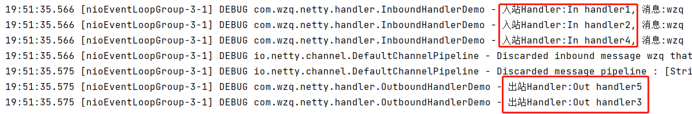

> 除了上面的增删改操作外，还可以通过类型或者名称来访问ChannelHandler的方法：
>
> | 方法    | 描述                                            |
> | ------- | ----------------------------------------------- |
> | get     | 通过类型或者名称返回ChannelHandler              |
> | context | 返回和ChannelHandler绑定的ChannelHandlerContext |
> | names   | 返回ChannelPipeline中所有ChannelHandler的名称   |


## 2、触发事件

ChannelPipeline的API公开了用于调用入站和出站操作的附加方法。下表列出了用于通知ChannelInboundHandler 在 ChannelPipeline 中所发生的事件：

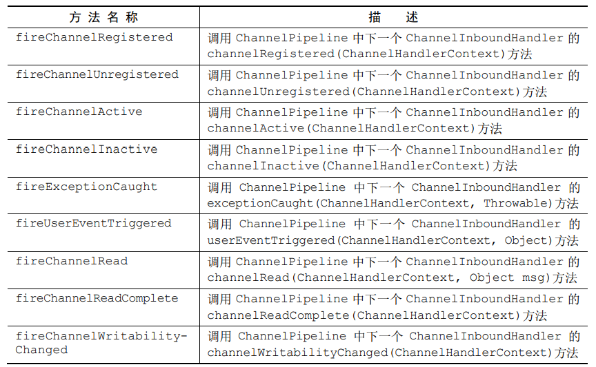

而下表列出了ChannelPipeline的出站操作：

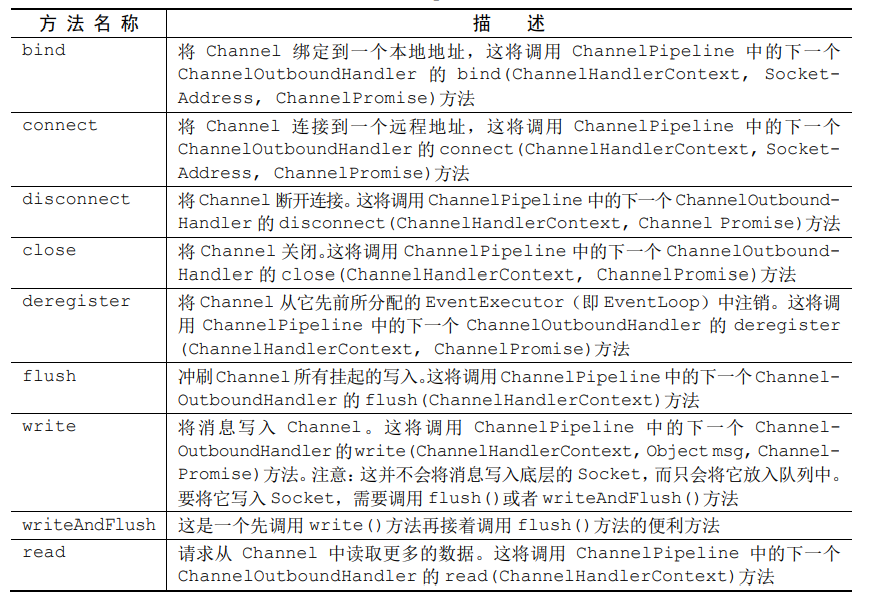


总之：

- ChannelPipeline保存了与Channel相关联的ChannelHandler
- ChannelPipeline可以根据需要，通过添加或者删除ChannelHandler来动态的修改
- ChannelPipeline有着丰富的API被调用，以响应入站和出站事件


# 三、ChannelHandlerContext接口

**ChannelHandler上下文对象，它代表了ChannelHandler与ChannelPipeline之间的关联。即上下文，在context中，可以轻松获取pipeline和handler对象**

下图是他们之间的关系：

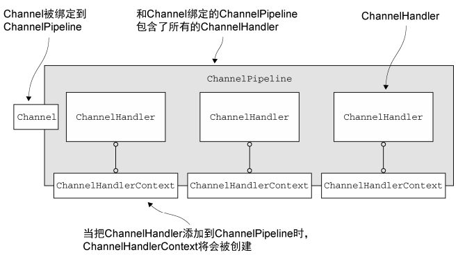


**需要说明的更加重要的一点是：如果调用channel或者pipeline上的方法，它们将沿着整条pipeline传播；而调用在Context中的方法，则只会从当前所关联的Handler开始，并且只会传递给下一个能够处理该事件的Handler**

下图展示了一个事件沿着pipeline流动，事件从一个 ChannelHandler 到下一个 ChannelHandler 的移动是由 ChannelHandlerContext 上的调用完成的：

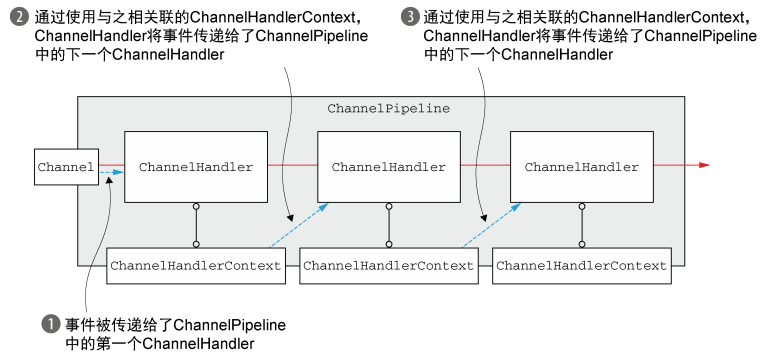

如果我们在Context上调用方法，那么事件只会被传递给下一个Handler：

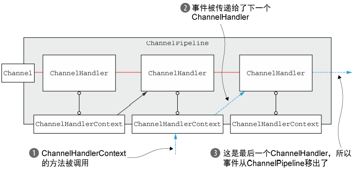


下面列出了一些Context接口中的一些方法：

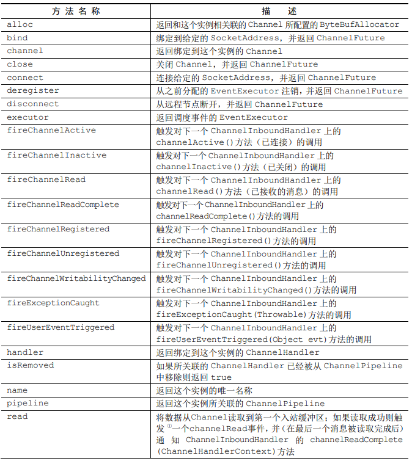

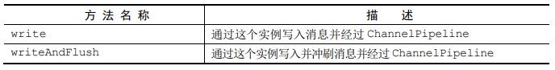

这个比较简单，就不再做演示


# 四、异常处理

Netty提供了几种方式用于处理出入站异常

## 1、处理入站异常

如果在处理入站事件的过程中有异常抛出，那么它将从被触发异常的那一个Handler流经整个Pipeline，要想处理入站异常，那么就需要在入站Handler的实现中重写`exceptionCaught`方法

下面展示了一个简单的示例，其关闭了Channel并打印了异常的栈跟踪信息：

```java
public class InboundExceptionHandler extends ChannelInboundHandlerAdapter {
    @Override
    public void exceptionCaught(ChannelHandlerContext ctx, Throwable cause) throws Exception {
        cause.printStackTrace();
        ctx.close();
    }
}
```

因为异常将会继续按照入站方向流动（就像所有的入站事件一样），所以实现了面前所示逻辑的ChannelInboundHandler通常位于ChannelPipeline的最后。着确保了所有的入站异常都总是会被处理，无论它们可能会发生在ChannelPipeline中的什么位置


如果不实现任何的入站异常处理的逻辑，那么Netty将会记录该异常没有被处理的事实。


## 2、处理出站异常

用于出站操作的正常完成以及异常的选项，都基于异步通知机制。

- **几乎每个出站操作都将返回一个ChannelFuture。** 注册到Future的ChannelFutureListener将在操作完成时被通知该操作是成功了还是出错了
- **几乎所有的出站Handler上的方法都会传入一个Promise实例。** 

这个我们在[上一章节提到过Future和Promise](https://github.com/wzqwtt/BigData/blob/master/Netty/Channel%E5%92%8CChannelFuture.md#%E5%9B%9Bfuture--promise)的用法

案例一：使用ChannelFuture：

```java
public class OutboundExceptionHandler extends ChannelOutboundHandlerAdapter {
    @Override
    public void write(ChannelHandlerContext ctx, Object msg, ChannelPromise promise) throws Exception {
        ChannelFuture future = ctx.channel().writeAndFlush("wzq");
        future.addListener(new ChannelFutureListener() {
            @Override
            public void operationComplete(ChannelFuture future) throws Exception {
                if (!future.isSuccess()) {
                    // 如果没有执行成功就打印报错
                    future.cause().printStackTrace();
                    future.channel().close();
                }
            }
        });
        super.write(ctx, msg, promise);
    }
}
```

案例二：使用ChannelPromise：

```java
public class OutboundExceptionHandler extends ChannelOutboundHandlerAdapter {
    @Override
    public void write(ChannelHandlerContext ctx, Object msg, ChannelPromise promise) throws Exception {
        promise.addListener(new ChannelFutureListener() {
            @Override
            public void operationComplete(ChannelFuture future) throws Exception {
                if (!future.isSuccess()) {
                    // 如果没有执行成功就打印报错
                    future.cause().printStackTrace();
                    future.channel().close();
                }
            }
        });

        super.write(ctx, msg, promise);
    }
}
```