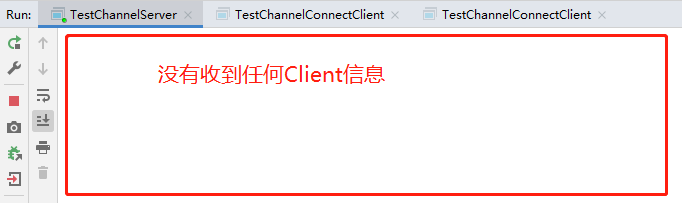
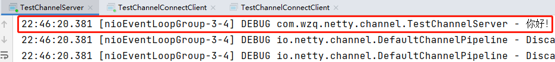
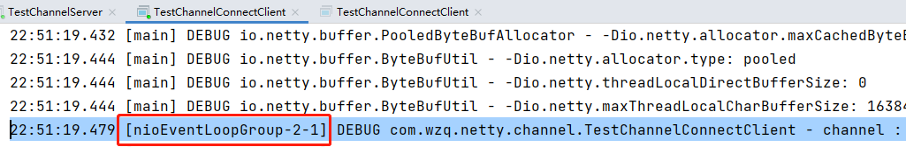
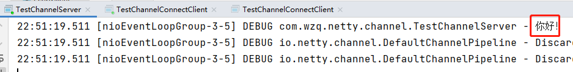
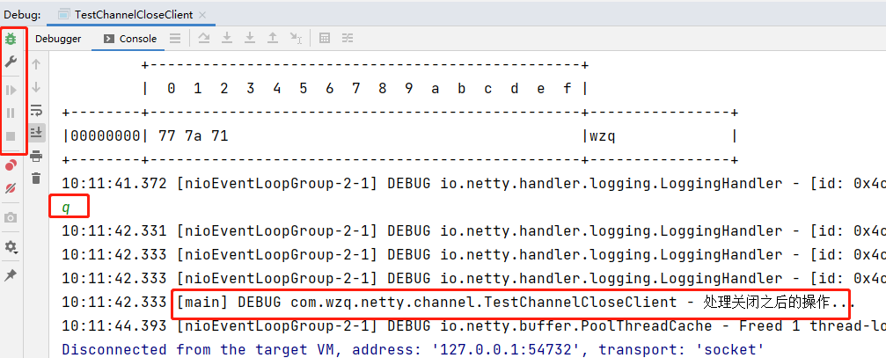
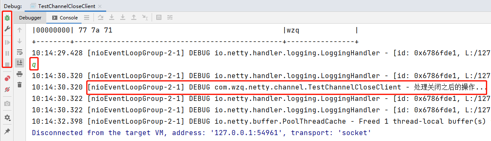
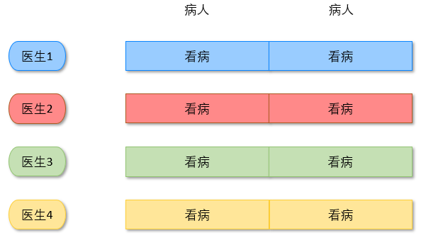
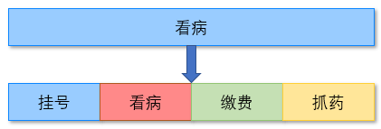
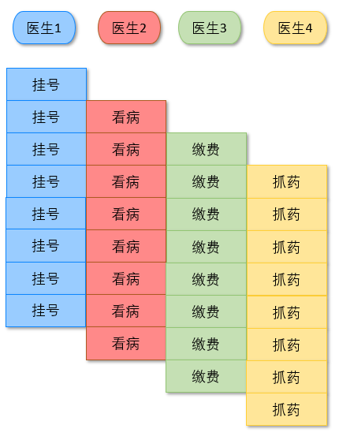

# Channel和ChannelFuture

本节所有的代码都可以在[com.wzq.netty.channel](https://github.com/wzqwtt/BigData/tree/master/Netty/NettyLearn/src/main/java/com/wzq/netty/channel)中找到

# 一、Channel

在Netty中，Channel有下列几个API：

- **close()：** 用来关闭Channel
- **closeFuture()：** 用来处理Channel的关闭
  - **sync方法** 作用是**同步**等待Channel关闭
  - **addListener方法** 作用是**异步**等待Channel关闭
- **pipeline()：** 可以用来添加处理器
- **write()：** 将数据写入缓冲区
- **flush()：** 把缓冲区的数据立马刷新出去
- **writeAndFluse()：** 将数据写入并刷出

ChannelFuture里面封装了一系列同步或异步的方法用来解决Channel的连接、关闭等问题。**可以使用ChannelFuture来获取Channel**

# 二、ChannelFuture

## 1、连接问题

首先，我们来看一个现象，编写我们的服务端与客户端代码

Server：

```java
@Slf4j
public class TestChannelServer {
    public static void main(String[] args) {
        EventLoopGroup boss = new NioEventLoopGroup();
        EventLoopGroup worker = new NioEventLoopGroup();
        try {
            new ServerBootstrap()
                    .group(boss, worker)
                    .channel(NioServerSocketChannel.class)
                    .childHandler(new ChannelInitializer<NioSocketChannel>() {
                        @Override
                        protected void initChannel(NioSocketChannel ch) throws Exception {
                            ch.pipeline().addLast(new StringDecoder());
                            ch.pipeline().addLast(new ChannelInboundHandlerAdapter() {
                                @Override
                                public void channelRead(ChannelHandlerContext ctx, Object msg) throws Exception {
                                    log.debug(msg.toString());
                                    super.channelRead(ctx, msg);
                                }
                            });
                        }
                    }).bind(7);
        } catch (Exception e) {
            e.printStackTrace();
            boss.shutdownGracefully();
            worker.shutdownGracefully();
        }
    }
}
```

Client：

```java
@Slf4j
public class TestChannelConnectClient {
    public static void main(String[] args) {
        NioEventLoopGroup group = new NioEventLoopGroup();
        ChannelFuture channelFuture = new Bootstrap()
                .group(group)
                .channel(NioSocketChannel.class)
                .handler(new ChannelInitializer<NioSocketChannel>() {
                    @Override
                    protected void initChannel(NioSocketChannel ch) throws Exception {
                        ch.pipeline().addLast(new StringEncoder());
                    }
                }).connect("localhost",7);

        Channel channel = channelFuture.channel();
        channel.writeAndFlush("你好！");
    }
}
```

上面的Client端代码是有错误的，最后发送了数据给Server，但是Server并没有收到任何信息（**大概率不会收到！**）



出现这个问题的原因是：**Netty是异步的！Netty的connect连接方法是异步的！connect连接方法没有和writeAndFlush方法在同一线程中执行！可能发送数据的时候，与服务端的连接还没有建立好**

解决这个问题无非有两种思路：阻塞main线程，等待连接操作执行完毕；使用类似Future的接口异步获取结果。Netty为我们提供了解决方法：

### sync同步阻塞

这种方式简单直接，在main线程阻塞，等待连接成功再发送就好了：

```java
// 方法一：使用sync方法同步阻塞，等待连接成功之后继续向下执行
channelFuture.sync();
Channel channel = channelFuture.channel();
log.debug("{}", channel);
channel.writeAndFlush("你好！");
```

上面打印的Channel在main线程，打印信息如下：


Server也收到了信息：




### addListener异步调用

还有一种方法是使用异步调用

```java
// 方法二：使用addListener异步回调
channelFuture.addListener(new ChannelFutureListener() {
    @Override
    public void operationComplete(ChannelFuture future) throws Exception {
        Channel channel = future.channel();
        log.debug("channel : {}", channel);
        channel.writeAndFlush("你好！");
    }
});
```

上面打印的channel在NioEventLoop线程中：



并且，服务端也能收到信息：




## 2、关闭问题

在开始这个问题之前，先来做一个小小的需求：**客户端一直接收用户输入，然后发送给客户端；如果客户端输入'q或quit'，客户端自动关闭。**

还是之前的服务端代码不变，客户端代码如下：

```java
@Slf4j
public class TestChannelCloseClient {
    public static void main(String[] args) throws InterruptedException {
        EventLoopGroup group = new NioEventLoopGroup();
        ChannelFuture channelFuture = new Bootstrap()
                .group(group)
                .channel(NioSocketChannel.class)
                .handler(new ChannelInitializer<NioSocketChannel>() {
                    @Override
                    protected void initChannel(NioSocketChannel ch) throws Exception {
                        ch.pipeline().addLast(new LoggingHandler(LogLevel.DEBUG));
                        ch.pipeline().addLast(new StringEncoder());
                    }
                })
                .connect("localhost", 7);

        // 等待连接成功获取channel
        Channel channel = channelFuture.sync().channel();

        // 新启一个线程接收用户输入
        new Thread(() -> {
            Scanner scanner = new Scanner(System.in);
            while (true) {
                String line = scanner.nextLine();
                if ("q".equals(line) || "quit".equals(line)) {
                    channel.close();
                    break;
                }
                // 给服务端发送数据
                channel.writeAndFlush(line);
            }
        }).start();
    }
}
```

下图为程序调试的结果，可以发现我们发送的`hellor、wzq`信息都能在服务端打印出来，并且使用的`loggingHandler`可以可视化ByteBuf


但是在我们在客户端输入`q or quit`的时候，程序并没有停止！这是因为我们客户端的EventLoopGroup没有被关闭，线程在后台一直运行

那么如何在用户希望退出的时候优雅的关闭客户端呢？有以下两种解决方法：

### sync同步阻塞

使用同步阻塞工具，等待Channel close之后再处理关闭之后的操作：

```java
// 方法一：sync同步阻塞
ChannelFuture closeFuture = channel.closeFuture();  // 获取响应关闭的ChannelFuture对象
closeFuture.sync();
log.debug("处理关闭之后的操作...");
group.shutdownGracefully(); // 优雅的关闭EventLoopGroup
```

再次运行我们的代码，可以发现现在可以正确关闭客户端了，但需要注意的是：处理关闭之后的操作是在main线程执行的




### addListener异步调用

异步回调close操作，将在EventLoop线程中处理关闭之后的操作：

```java
// 方法二：addListener异步回调
ChannelFuture closeFuture = channel.closeFuture();
closeFuture.addListener(new GenericFutureListener<Future<? super Void>>() {
    @Override
    public void operationComplete(Future<? super Void> future) throws Exception {
        log.debug("处理关闭之后的操作...");
        group.shutdownGracefully();
    }
});
```

再次运行我们的代码，可以发现现在可以正确关闭客户端了，但需要注意的是：处理关闭之后的操作是在EventLoop线程执行的




# 三、Netty为什么要异步？

之前我们提到过Netty是完全异步的，那么为什么需要异步呢？

思考下面的场景，4个医生给人看病，每个病人花费20分钟，而且医生看病的过程是以病人为单位的，一个病人看完了，才能看下一个病人。假设病人源源不断地来，可以计算一下4个医生一天工作8小时，处理地病人总数是：`4 * 8 * 3 = 96`。这种方式如下图所示：



但经研究发现，看病可以划分为四个步骤，经拆分之后每个步骤需要5分钟，如下：



因此可以做如下优化，只有一开始，医生2、3、4分别要等待5、10、15分钟才能执行工作，但只要后续病人源源不断地来，他们就能够满负荷工作，并且处理病人地能力提高到了`4 * 8 * 12`效率几乎是原来的四倍。**Netty就是这样的异步操作**



要点：

- 单线程没法异步提高效率，必须配合多线程、多核CPU才能发挥异步的优势
- 异步并没有缩短响应时间，反而有所增加
- 合理进行任务拆分，也是利用异步的关键
- 异步任务有利于提高吞吐量


# 四、Future & Promise

在异步处理时，经常用到这两个接口

首先要说明Netty中的Future与JDK中的Future同名，但是是不同的两个接口，**Netty的Future继承自JDK的Future，而Promise又对Netty Future进行了扩展**

- JDK Future只能同步等待任务结束（或成功、或失败）才能得到结果
- Netty Future可以同步等待任务结束得到结果，也可以异步方式得到结果，但都是要等待任务结束
- Netty Promise不仅有Netty Future的功能，而且脱离了任务独立存在，只作为两个线程间传递结果的容器

下面列出了三个接口的一些重要方法：

| 功能/名称   | JDK Future                     | Netty Future                                                 | Netty Promise |
| ----------- | ------------------------------ | ------------------------------------------------------------ | ------------- |
| cancel      | 取消任务                       | -                                                            | -             |
| isCanceled  | 任务是否取消                   | -                                                            | -             |
| isDone      | 任务是否完成，不能区分成功失败 | -                                                            | -             |
| get         | 获取任务结果，阻塞等待         | -                                                            | -             |
| getNow      | -                              | 获取任务结果，非阻塞，还未产生结果时返回null                 | -             |
| await       | -                              | 等待任务结束，如果任务失败，不会抛异常，而是通过isSuccess判断 | -             |
| sync        | -                              | 等待任务结束，如果任务失败，抛出异常                         | -             |
| isSuccess   | -                              | 判断任务是否成功                                             | -             |
| cause       | -                              | 获取失败信息，非阻塞，如果没有失败，返回null                 | -             |
| addListener | -                              | 添加回调，异步接收结果                                       | -             |
| setSuccess  | -                              | -                                                            | 设置成功结果  |
| setFailure  | -                              | -                                                            | 设置失败结果  |

下面有三个接口对应的案例实现

## 1、JDK Future

```java
@Slf4j
public class TestJdkFuture {

    public static void main(String[] args) throws ExecutionException, InterruptedException {
        // 1、线程池
        ExecutorService service = Executors.newFixedThreadPool(2);
        // 2、提交任务
        Future<Integer> future = service.submit(new Callable<Integer>() {
            @Override
            public Integer call() throws Exception {
                log.debug("执行计算");
                try {
                    TimeUnit.SECONDS.sleep(1);
                } catch (InterruptedException e) {
                    e.printStackTrace();
                }
                return 1;
            }
        });
        // 3、等待获取结果
        log.debug("等待结果");
        while (true) {
            if (future.isDone()) {
                log.debug("结果是：{}", future.get());
                service.shutdown();
                break;
            }
        }
    }
}
```


## 2、Netty Future

```java
@Slf4j
public class TestNettyFuture {

    public static void main(String[] args) throws InterruptedException, ExecutionException {
        // 1、获取Netty的EventLoopGroup，相当于一个线程组
        DefaultEventLoopGroup group = new DefaultEventLoopGroup();

        // 2、获取一个EventLoop，相当于一个线程
        EventLoop eventLoop = group.next();

        // 3、提交任务，此时的future属于 io.netty.util.concurrent;
        Future<Integer> future = eventLoop.submit(new Callable<Integer>() {
            @Override
            public Integer call() throws Exception {
                log.debug("执行计算");
                try {
                    TimeUnit.SECONDS.sleep(1);
                } catch (InterruptedException e) {
                    e.printStackTrace();
                }

                return 1;
            }
        });

        log.debug("等待结果");
        // sync阻塞等待结果
        log.debug("结果是：{}", future.sync().get());
        group.shutdownGracefully();
    }

}
```

也可以，使用addListener方法异步回调

```java
// addListener异步回调
future.addListener(new GenericFutureListener<Future<? super Integer>>() {
    @Override
    public void operationComplete(Future<? super Integer> listenerFuture) throws Exception {
        log.debug("结果是：{}", future.get());
        group.shutdownGracefully();
    }
});
```


## 3、Netty Promise

Promise就是一个**结果容器，**所有线程都可以往promise里面存入计算好的结果

```java
@Slf4j
public class TestNettyPromise {

    public static void main(String[] args) throws InterruptedException, ExecutionException {
        // 1、准备EventLoop对象
        EventLoop eventLoop = new DefaultEventLoopGroup().next();

        // 2、主动创建Promise容器
        DefaultPromise<Integer> promise = new DefaultPromise<>(eventLoop);
        
        new Thread(() -> {
          // 3、任意一个线程执行完毕，计算完毕后向Promise填充结果
            log.debug("执行计算");
            try {
                TimeUnit.SECONDS.sleep(1);
            } catch (InterruptedException e) {
                e.printStackTrace();
            }
            // 往Promise里面填充结果
            promise.setSuccess(1);

//            // 也可以填充异常
//            try {
//                int i = 1 / 0;
//            } catch (Exception e) {
//                promise.setFailure(e);
//            }

        } ).start();


        // 4、接收结果的线程
        log.debug("等待结果");
        log.debug("结果是: {}",promise.sync().get());
    }

}
```
