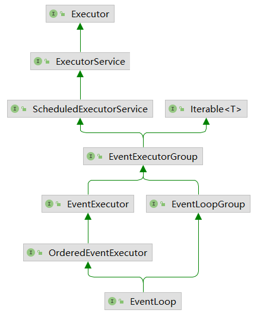
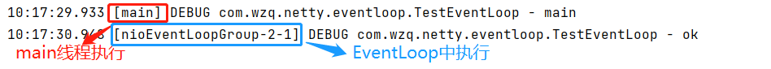
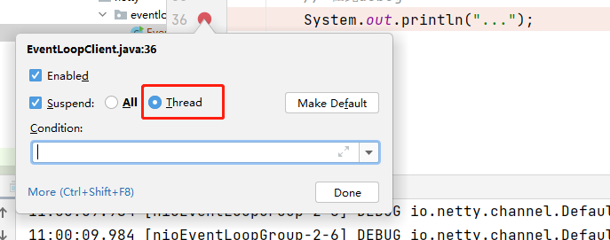
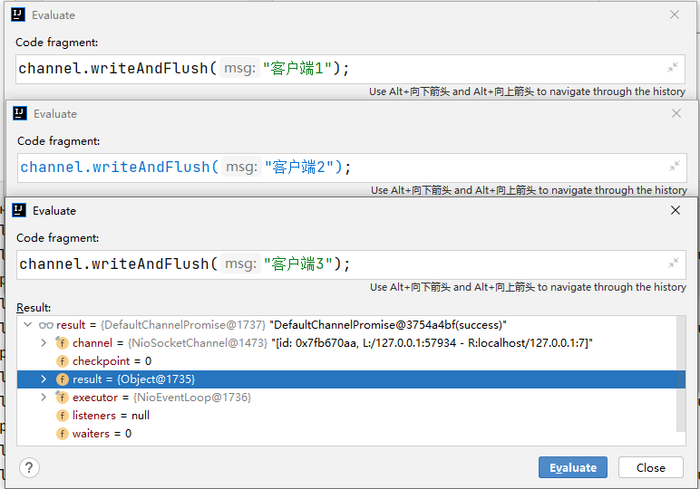
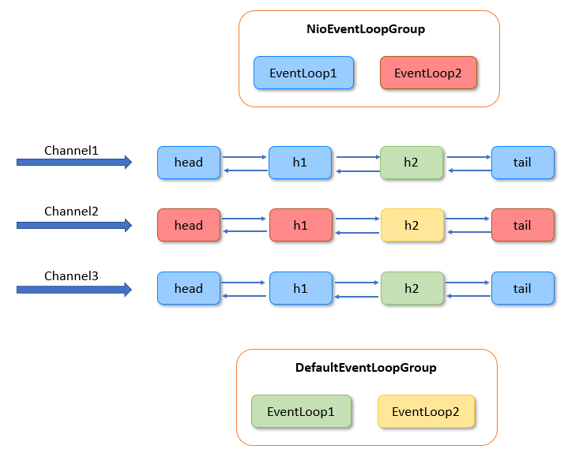

# EventLoop和线程模型

EventLoop与EventLoopGroup是Netty的线程模型，本节所有的代码均可以在[com.wzq.netty.eventloop](https://github.com/wzqwtt/BigData/tree/master/Netty/NettyLearn/src/main/java/com/wzq/netty/eventloop)包下


# 1、EventLoop与EventLoopGroup

**EventLoop本质上是一个单线程执行器（同时维护了一个Selector），里面有run方法处理Channel上源源不断地IO事件**

EventLoop一般称为：**事件循环对象**

它的继承关系比较复杂：

- 一条线是继承自`j.u.c.ScheduledExecutorService`，因此包含了线程池中所有地方法
- 另一条线是继承自Netty自己地`OrderedEventExecutor`
  - 提供了`boolean inEventLoop(Thread thread)`方法判断一个线程是否属于此EventLoop
  - 提供了`parent`方法来看看自己属于哪个EventLoopGroup

继承关系如下图所示：



**EventLoopGroup是一组EventLoop，Channel一般会调用EventLoopGroup地register方法来绑定其中一个EventLoop，后续这个Channel上的IO事件都由此EventLoop来处理（这保证了IO事件处理时地线程安全）**

EventLoopGroup一般称为**事件循环组**

- 继承自Netty自己的`EventExecutorGroup`（上面地图有体现）
  - 实现了Iterable接口提供遍历EventLoop的能力
  - 另有next方法获取集合中下一个EventLoop


EventLoopGroup是一个接口，他有很多的实现类：


其中，有这么几个实现类比较常用：

- **NioEventLoopGroup：**它可以处理非阻塞情况下的IO事件、也可以执行普通任务、定时任务
- **OioEventLoopGroup：**处理阻塞情况下的IO事件，也可以执行普通任务、定时任务
- **DefaultEventLoopGroup：**不可以处理IO事件，但可以执行普通任务、定时任务；我们可以把耗时较长的任务交给它来处理
- **其他一些EventLoopGroup：**对不同的操作系统是有优化的，比如EpollEventLoopGroup是优化了Linux系统下的一些东西

创建一个事件循环组是很简单的：

```java
// 创建事件循环组
EventLoopGroup group = new NioEventLoopGroup();
// 其他EventLoopGroup的实现类也可以这样创建，例如：
EventLoopGroup oioGroup = new OioEventLoopGroup();
EventLoopGroup defaultGroup = new DefaultLoopGroup();
```

需要注意：这些实现类的构造方法可以传递一个`int nThreads`参数，代表该Group有多少个线程，也可以理解为有多少个EventLoop

如果不传递该参数，可以一路跟踪这个构造方法，看一下默认有多少个线程处理：

```java
// 可以看到如果nTreads等于0，那么参数DEFAULT_EVENT_LOOP_THREADS
protected MultithreadEventLoopGroup(int nThreads, Executor executor, Object... args) {
    super(nThreads == 0 ? DEFAULT_EVENT_LOOP_THREADS : nThreads, executor, args);
}

// 继续跟踪DEFAULT_EVENT_LOOP_THREADS
// 可以看到它是一个静态final变量
private static final int DEFAULT_EVENT_LOOP_THREADS;

// 在static方法中初始化DEFAULT_EVENT_LOOP_THREAD
static {
    // 可以看到如果有系统统配首先采取系统配置
    // 如果没有配置，默认等于系统可以处理器的个数 * 2
    // 最后取 1 和 上面两个值的最大值
    DEFAULT_EVENT_LOOP_THREADS = Math.max(1, SystemPropertyUtil.getInt(
        "io.netty.eventLoopThreads", NettyRuntime.availableProcessors() * 2));

    if (logger.isDebugEnabled()) {
        logger.debug("-Dio.netty.eventLoopThreads: {}", DEFAULT_EVENT_LOOP_THREADS);
    }
}
```


# 2、获取下一个事件循环对象

可以通过`EventLoopGroup`来获取`EventLoop`，通过调用`next`方法：

```java
@Slf4j
public class TestEventLoop {

    public static void main(String[] args) {
        // 1、创建Nio事件循环组，并指定使用2个线程
        EventLoopGroup group = new NioEventLoopGroup(2);

        // 2、获取下一个事件循环对象，多打印几个
        System.out.println(group.next());
        System.out.println(group.next());
        System.out.println(group.next());
        System.out.println(group.next());
    }
}
```

**一个EventLoopGroup可以有多个EventLoop**

在上面的案例中，我们只指定了2个线程，如果我们获取下一个事件循环对象，会`依次循环`输出EventLoop，其实就是实现了一个简单的**负载均衡（round-robin）**功能

下面是上面案例输出的结果，可以看到第一个和第三个EventLoop是同一个对象，第二个和第四个是同一个

```java
io.netty.channel.nio.NioEventLoop@6833ce2c
io.netty.channel.nio.NioEventLoop@725bef66
io.netty.channel.nio.NioEventLoop@6833ce2c
io.netty.channel.nio.NioEventLoop@725bef66
```


# 3、执行普通任务

执行普通任务可以这样做：

- 构造事件循环组EventLoopGroup
  - 获取事件循环组的下一个事件循环对象EventLoop
  - 使用`submit`或`execute`执行普通任务，需要传递一个**Runnable对象的实现**

```java
@Slf4j
public class TestEventLoop {

    public static void main(String[] args) {
        // 创建Nio事件循环组，并指定使用2个线程
        EventLoopGroup group = new NioEventLoopGroup(2);

        // 执行普通任务
        group.next().submit(() -> {
            try {
                TimeUnit.SECONDS.sleep(1);
            } catch (InterruptedException e) {
                e.printStackTrace();
            }
            log.debug("ok");    // 在线程内打印
        });
        log.debug("main");  // 在外面打印
    }
}
```

结果如下：




# 4、执行定时任务

EventLoop也可以执行定时任务，和上面的步骤一样，不过需要调用`schedule`方法，代码如下：

```java
@Slf4j
public class TestEventLoop {
    public static void main(String[] args) {
        // 创建Nio事件循环组，并指定使用2个线程
        EventLoopGroup group = new NioEventLoopGroup(2);
        
        // 执行异步定时任务
        group.next().schedule(() -> {
            log.debug("执行定时任务");
        },5,TimeUnit.SECONDS);
    }
}
```

`schedule`方法的作用是：延迟执行任务；需要传递三个参数：

- **Runnable的实现**，实际任务存放在这里
- **long delay：**延迟多少时间单位执行
- **TimeUnit unit：**指定时间单位

上面的代码将会在5秒之后输出一句话，可以看到是在EventLoop中执行的

```java
10:32:55.748 [nioEventLoopGroup-2-1] DEBUG com.wzq.netty.eventloop.TestEventLoop - 执行定时任务
```


除了这种任务之外，还可以执行**周期性任务**，需要调用`scheduleAtFixedRate`方法：

```java
@Slf4j
public class TestEventLoop {
    public static void main(String[] args) {
        // 创建Nio事件循环组，并指定使用2个线程
        EventLoopGroup group = new NioEventLoopGroup(2);

        // 执行异步周期定时任务
        group.next().scheduleAtFixedRate(() -> {
            log.debug("周期性任务");
        }, 0, 1, TimeUnit.SECONDS);

    }
}
```

该方法需要传递四个参数：

- **Runnable的实现：**实际任务
- **long initialDelay：**第一次延迟执行的时间，上面代码传递的参数是0，就是说立马执行，不延迟
- **long period：**周期执行的时间
- **TimeUnit unit：**指定时间单位

输出结果如下所示：

```
10:37:48.622 [nioEventLoopGroup-2-1] DEBUG com.wzq.netty.eventloop.TestEventLoop - 周期性任务
10:37:49.634 [nioEventLoopGroup-2-1] DEBUG com.wzq.netty.eventloop.TestEventLoop - 周期性任务
10:37:50.633 [nioEventLoopGroup-2-1] DEBUG com.wzq.netty.eventloop.TestEventLoop - 周期性任务
10:37:51.625 [nioEventLoopGroup-2-1] DEBUG com.wzq.netty.eventloop.TestEventLoop - 周期性任务
10:37:52.630 [nioEventLoopGroup-2-1] DEBUG com.wzq.netty.eventloop.TestEventLoop - 周期性任务
10:37:53.635 [nioEventLoopGroup-2-1] DEBUG com.wzq.netty.eventloop.TestEventLoop - 周期性任务
```


# 5、处理IO事件

**服务器会用一个EventLoop对象始终处理相同客户端的IO事件，并且一个EventLoop能够多路复用，他可以管理多个客户端**

现在来写一个类似于HelloWorld的Netty服务端与客户端：

Server：

```java
@Slf4j
public class EventLoopServer {
    public static void main(String[] args) {
        // 创建EventLoopGroup
        NioEventLoopGroup group = new NioEventLoopGroup();
        new ServerBootstrap()
                .group(group)
                .channel(NioServerSocketChannel.class)
                .childHandler(new ChannelInitializer<NioSocketChannel>() {
                    @Override
                    protected void initChannel(NioSocketChannel ch) throws Exception {
                        ch.pipeline().addLast(new ChannelInboundHandlerAdapter() {
                            @Override
                            public void channelRead(ChannelHandlerContext ctx, Object msg) throws Exception {
                                ByteBuf buf = (ByteBuf) msg;
                                log.debug(buf.toString(Charset.defaultCharset()));
                                super.channelRead(ctx, msg);
                            }
                        });
                    }
                }).bind(7);
    }
}
```

Client：客户端以debug的模式启动，在debug的时候再发消息给服务端

```java
public class EventLoopClient {

    public static void main(String[] args) throws InterruptedException {
        NioEventLoopGroup group = new NioEventLoopGroup();

        Channel channel = new Bootstrap()
                .group(group)
                .channel(NioSocketChannel.class)
                .handler(new ChannelInitializer<NioSocketChannel>() {
                    @Override
                    protected void initChannel(NioSocketChannel ch) throws Exception {
                        ch.pipeline().addLast(new StringEncoder());
                    }
                })
                .connect(new InetSocketAddress("localhost", 7))
                .sync()
                .channel();

        System.out.println(channel);
        // 在此debug
        System.out.println("...");
    }
}
```

> 需要设置断点为这样：
>
> 


随后首先启动服务端，再以Debug的方式启动三个客户端，使用idea的`Evaluate Expression`发送消息给服务端：



多发几次信息给服务端，**可以发现同一个client始终在同一个EventLoop中执行**：

```
# 在nioEventLoopGroup-2-2中
13:07:59.387 [nioEventLoopGroup-2-2] DEBUG com.wzq.netty.eventloop.EventLoopServer - 客户端1
13:08:01.810 [nioEventLoopGroup-2-2] DEBUG com.wzq.netty.eventloop.EventLoopServer - 客户端1
# 在nioEventLoopGroup-2-3中
13:08:06.680 [nioEventLoopGroup-2-3] DEBUG com.wzq.netty.eventloop.EventLoopServer - 客户端2
13:08:06.952 [nioEventLoopGroup-2-3] DEBUG com.wzq.netty.eventloop.EventLoopServer - 客户端2
# 在nioEventLoopGroup-2-4中
13:08:08.144 [nioEventLoopGroup-2-4] DEBUG com.wzq.netty.eventloop.EventLoopServer - 客户端3
13:08:08.417 [nioEventLoopGroup-2-4] DEBUG com.wzq.netty.eventloop.EventLoopServer - 客户端3
```


# 6、EventLoop分工细化

在前面章节的[Reactor模式](./Reactor模式.md)中，提到过**使用一个EventLoopGroup专门用于处理连接事件（boss），再使用一个EventLoopGroup专门处理读写事件（worker）**

可以在服务端使用这种方式：

```java
NioEventLoopGroup boss = new NioEventLoopGroup();	// 处理连接事件
NioEventLoopGroup worker = new NioEventLoopGroup(); // 处理IO读写事件

new ServerBootstrap()
    // 传入boss和worker
    .group(boss, worker)
```

> :warning:需要注意的是：
>
> - bossGroup永远只会占用一个线程
> - workerGroup可以自己设置，如果不设置就是自己的CPU*2


当然我们还可以进一步划分，如果Channel需要处理的任务“太重”（耗时较长的任务），那么就可以再新建一个独立的EventLoopGroup，交给这个新的EventLoopGroup去“干重活”；这个不需要处理IO事件之后，就可以创建**DefaultEventLoopGroup**


可以这样做：

```java
@Slf4j
public class EventLoopServer {

    public static void main(String[] args) {

        // 创建EventLoopGroup
        EventLoopGroup boss = new NioEventLoopGroup();
        EventLoopGroup worker = new NioEventLoopGroup();
        EventLoopGroup defaultGroup = new DefaultEventLoopGroup();

        new ServerBootstrap()
                .group(boss, worker)
                .channel(NioServerSocketChannel.class)
                .childHandler(new ChannelInitializer<NioSocketChannel>() {
                    @Override
                    protected void initChannel(NioSocketChannel ch) throws Exception {
                        // 这个handler由默认的workerGroup执行，该handler的名字为handler1
                        ch.pipeline().addLast("handler1", new ChannelInboundHandlerAdapter() {
                            @Override
                            public void channelRead(ChannelHandlerContext ctx, Object msg) throws Exception {
                                ByteBuf buf = (ByteBuf) msg;
                                log.debug(buf.toString(Charset.defaultCharset()));
                                // 让消息传递给下一个channel
                                ctx.fireChannelRead(msg);
                            }
                        });
                        // 指定由defaultGroup执行这个handler，该handler的名字为handler2
                        ch.pipeline().addLast(defaultGroup, "handler2", new ChannelInboundHandlerAdapter() {
                            @Override
                            public void channelRead(ChannelHandlerContext ctx, Object msg) throws Exception {
                                ByteBuf buf = (ByteBuf) msg;
                                log.debug(buf.toString(Charset.defaultCharset()));
                            }
                        });
                    }
                }).bind(7);

    }
}
```

测试，可以看到是有两个线程工作的：

```
13:18:47.610 [nioEventLoopGroup-3-1] DEBUG com.wzq.netty.eventloop.EventLoopServer - 客户端1
13:18:47.617 [defaultEventLoopGroup-4-1] DEBUG com.wzq.netty.eventloop.EventLoopServer - 客户端1
```

词不达意，让我们用一张图来描述这个关系：



如上图所示，不同颜色代表使用哪个线程！

- NioEventLoopGroup和DefaultEventLoopGroup各有两个EventLoop
- 当有一个客户端连接的时候，默认的Handler会取第一个NioEventLoop，有指定使用EventLoop的就去DefaultEventLoopGroup中拿

上面所有的handler是链状的，这个到后续blog解释


**那handler是如何做到切换线程的呢？**

最关键的代码在这里：

```java
static void invokeChannelRead(final AbstractChannelHandlerContext next, Object msg) {
    final Object m = next.pipeline.touch(ObjectUtil.checkNotNull(msg, "msg"), next);
    
    // 返回下一个handler的eventloop
    EventExecutor executor = next.executor();
    
    // 下一个handler的事件循环是否与当前的事件循环是同一个线程
    // 如果是，那就直接调用
    if (executor.inEventLoop()) {
        next.invokeChannelRead(m);
    } else {
        // 如果不是，将要执行的代码作为任务提交给下一个事件循环处理（换人）
        executor.execute(new Runnable() {
            @Override
            public void run() {
                next.invokeChannelRead(m);
            }
        });
    }
}
```

即：如果两个handler绑定的是同一个线程，那么就直接调用；否则，把要调用的代码封装为一个任务对象，由下一个handler的线程来调用。
