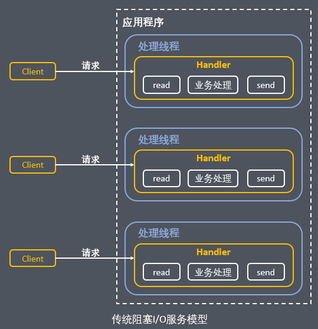
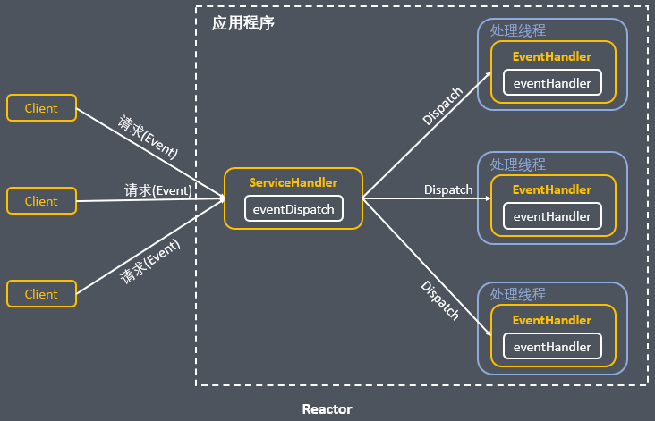
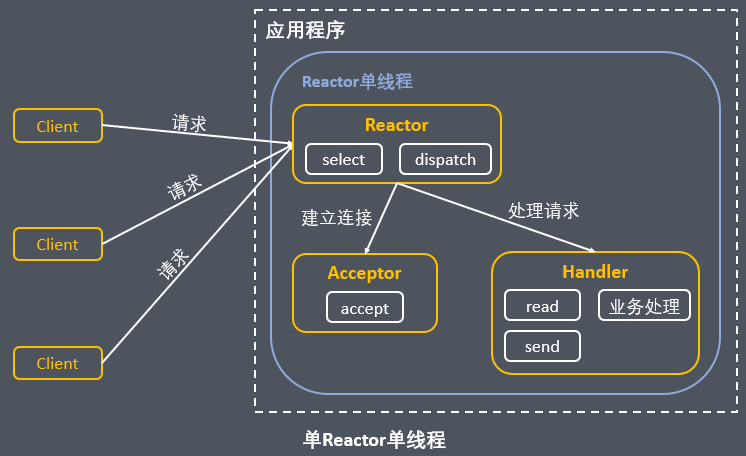
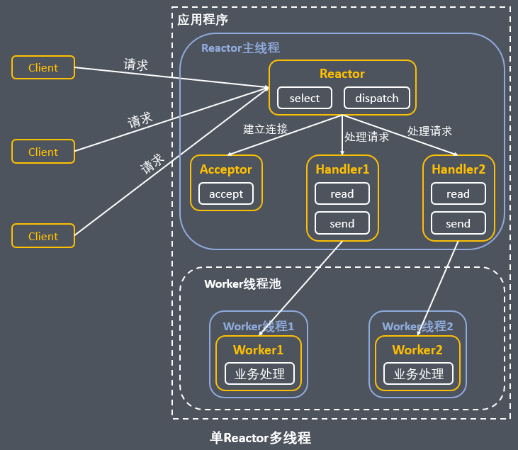
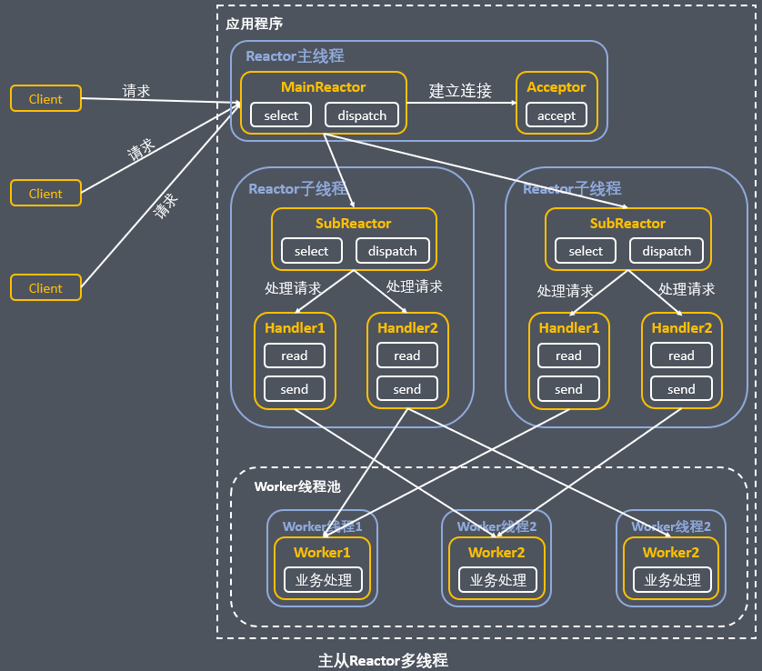

# 1、线程模型基本介绍

- 不同的线程模式，对程序的性能有很大的影响

- 目前存在的线程模型有

- - 传统阻塞I/O服务模型
  - Reactor模式

- 根据Reactor的数量和处理资源池线程的数量不同，有三种典型的实现

- - 单Reactor单线程
  - 单Reactor多线程

- - **主从Reactor多线程**

- Netty主要基于主从Reactor多线程模型做了一定的改进，其中主从Reactor多线程模型有多个Reactor

 

需要事先说明的是，在下图中：黄色框子代表对象、蓝色框子代表线程、白色框子代表方法

# 2、传统阻塞I/O服务模型

 

**该模型的特点：**

- 采用阻塞IO模式获取输入的数据
- 每个连接都需要独立的线程完成数据的输入，业务处理，数据返回

 

**存在的问题：**

- 当并发数很大，就会创建大量的线程，占用很大系统资源
- 连接创建后，如果当前线程暂时没有数据可读，该线程会阻塞在read操作，造成线程资源浪费

 

# 3、Reactor模式

针对传统阻塞I/O服务模型的2个缺点，解决方案：

- **基于I/O复用模型**：多个连接共用一个阻塞对象，应用程序只需要在一个阻塞对象等待，无需阻塞等待所有连接。当某个连接有新的数据可以处理时，操作系统通知应用程序，线程从阻塞状态返回，开始进行业务处理
- **基于线程池复用线程资源**：不必再为每个连接创建线程，将连接完成后的业务处理任务分配给线程进行处理，一个线程可以处理多个连接的业务

 

整体设计理念：

 

**说明：**

- Reactor模式，通过一个或多个输入同时传递给服务处理器的模式（基于事件驱动）
- 服务器端程序处理传入的多个请求，并将它们同步分派到相应的处理线程，因此Reactor模式也叫Dispatcher模式
- Reactor模式使用**IO复用监听事件**，收到事件之后，**分发**给某个线程，这点就是网络服务器高并发处理关键

 

**Reactor****模式中核心组成：**

- **Reactor**：Reactor在一个单独的线程中运行，**负责监听和分发事件**，分发给适当的处理程序来对IO事件做出反应。
- **Handlers**：处理程序**执行I/O事件要完成的实际事件**。

 

Reactor通过调度适当的处理程序来响应I/O事件，处理程序执行非阻塞操作。

 

**Reactor模式分类：**

根据Reactor的数量和处理资源线程的数量不同，有3种典型的实现

- 单Reactor单线程
- 单Reactor多线程
- 主从Reactor多线程

 

## （1）单Reactor单线程

 

**说明：**

- Select是前面I/O复用模型介绍的标准网络编程API，可以实现应用程序通过一个阻塞对象监听多路连接请求
- Reactor对象通过Select监控客户端请求事件，收到事件后通过Dispatch进行分发
- 如果是建立连接请求事件，则由Acceptor通过Accept处理连接请求，然后创建一个Handler对象处理连接完成后的后续业务处理
- 如果不是建立连接事件，则Reactor会分发调用连接对应的Handler来响应
- Handler会完成Read->业务处理->Send的完整业务流程

 

**方案优缺点分析：**

- **优点：**模型简单，没有多线程、进程通信、竞争的问题，全部都在一个线程中完成
- **缺点1：性能问题**，只有一个线程，无法完全发挥多核CPU的性能。Handler在处理某个连接上的业务时，整个进程无法处理其他连接事件，很容易导致性能瓶颈
- **缺点2：可靠性问题**，线程意外终止，或者进入死循环，会导致整个系统通信模块不可用，不能接收和处理外部消息，造成节点故障
- **使用场景：**客户端的数量有限，业务处理非常快速

 

 

## （2）单Reactor多线程

 

**说明：**

- Reactor对象通过select监控客户端请求事件，收到事件后，通过dispatch进行分发
- 如果建立连接请求，则由Acceptor通过accept处理连接请求，然后创建一个Handler对象处理完成连接后的各种事件
- 如果不是连接请求，则由Reactor分发调用连接对应的Handler来处理
- Handler只负责响应事件，不做具体的业务逻辑，通过read读取数据后，会分发给后面的worker线程池的某个线程处理业务
- worker线程池会分配独立线程完成真正的业务，并将结果返回给Handler
- Handler收到响应后，通过send将结果返回给client

 

**方案优缺点分析：**

- **优点：**可以充分利用多核CPU的处理能力
- **缺点：**多线程数据共享和访问比较复杂，Reactor处理所有的事件的监听和响应，在单线程运行，在高并发场景容易出现性能瓶颈

 

## （3）主从Reactor多线程

 

让Reactor在多线程中运行

 

**说明：**

- Reactor主线程MainReactor对象通过Select监听连接事件，收到事件后，通过Acceptor处理连接事件
- 当Acceptor处理连接事件后，MainReactor将连接分配给SubReactor
- SubReactor将连接加入到连接队列进行监听，并创建handler进行各种事件处理
- 当有新事件发生时，SubReactor就会调用对应的Handler处理
- Handler通过read读取数据，分发给后面的worker线程处理
- worker线程池分配独立的worker线程进行业务处理，并返回结果
- Handler收到响应的结果后，再通过send将结果返回给client
- Reactor主线程可以对应多个Reactor子线程，即MainReactor可以关联多个SubReactor

 

**方案优缺点说明：**

- **优点：**父线程与子线程的数据交互简单职责明确，父线程只需要接收新连接，子线程完成后续的业务处理
- **优点：**父线程与子线程的数据交互简单，Reactor主线程只需要把新连接传给子线程，子线程无需返回数据
- **缺点：**编程复杂度高

 

 

# 4、Reactor模型小结

**3种模式用生活案例来理解：**

- 单Reactor单线程：前台接待员和服务员是同一个人，全程为顾客服务
- 单Reactor多线程：1个前台接待员，多个服务员，接待员只负责接待
- 主从Reactor多线程：多个前台接待员，多个服务商

 

**Reactor模式具有如下优点：**

- 响应快，不必为单个同步时间所阻塞，虽然Reactor本身依然是同步的
- 可以最大程度的避免复杂的多线程及同步问题，并且避免了多线程/进程的切换开销
- 扩展性好，可以方便的通过增加Reactor实例个数来充分利用CPU资源
- 复用性好，Reactor模型本身与具体事件处理逻辑无关，具有很高的复用性

 

> Reactor模式出自：Doug Lea Scalable IO in Java
>
> [Doug_Lee_Reactor.pdf](./Doug_Lee_Reactor.pdf)
>
> “Doug是一个无私的人，他深知分享知识和分享苹果是不一样的，苹果会越分越少，而自己的知识并不会因为给了别人就减少了，知识的分享更能激荡出不一样的火花。”—— 《Effecitve JAVA》Joshua Bioch