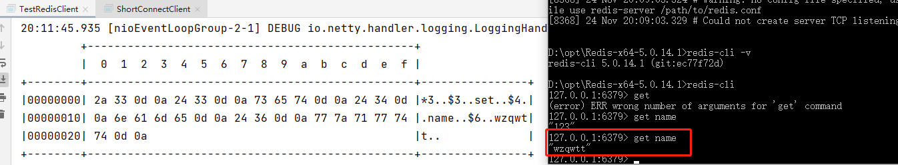
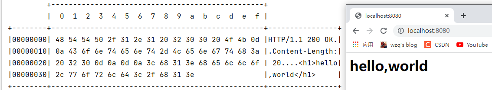

# 协议设计与解析

本节中所有的代码均可以在[com.wzq.netty.protocol](https://github.com/wzqwtt/BigData/tree/master/Netty/NettyLearn/src/main/java/com/wzq/netty/protocol)包中

**协议的目的就是划定消息的边界，制定通信双方要共同遵守的通信规则**


# 一、Redis

Redis客户端可以通过命令行发送信息。假设我们要向Redis发送一条`set name wzqwtt`的指令。Redis会根据自己协议的规则发送消息给服务器端。协议如下：

```bash
# Redis会把一条命令看作一个数组，以“空格”分割
# 第一条要发的消息就是 *加数组的长度
*3
# 接下来发每个字段的长度与内容
# 第一个字段3个字符：$3，换行之后填充 set
$3
set
# 第二个字段4个字符：$4，换行之后把内容写上去
$4
name
# 第三个字段6个字符：$6，换行之后把内容写上去
$6
wzqwtt
```

多个部分使用换行分割。

使用Netty模拟Redis客户端发送消息：

```java
@Slf4j
public class TestRedisClient {
    private static final String HOST = "localhost";
    private static final int PORT = 6379;
    // 行
    private static final byte[] LINE = {13, 10};

    private static void sendToRedis(String request) {
        EventLoopGroup group = new NioEventLoopGroup();
        try {
            Bootstrap bootstrap = new Bootstrap()
                    .group(group)
                    .channel(NioSocketChannel.class)
                    .handler(new ChannelInitializer<NioSocketChannel>() {
                        @Override
                        protected void initChannel(NioSocketChannel ch) throws Exception {
                            ch.pipeline().addLast(new LoggingHandler());
                            // 将RedisClientHandler绑定到pipeline
                            ch.pipeline().addLast(new RedisClientHandler(request));
                        }
                    });

            ChannelFuture channelFuture = bootstrap.connect(HOST, PORT).sync();

            channelFuture.channel().close().sync();
        } catch (InterruptedException e) {
            e.printStackTrace();
            log.debug("client error");
        } finally {
            group.shutdownGracefully();
        }
    }

    public static void main(String[] args) {
        sendToRedis("set name wzqwtt");
    }

    // RedisClient的Handler
    private static class RedisClientHandler extends ChannelInboundHandlerAdapter {

        private String command;

        public RedisClientHandler(String command) {
            this.command = command;
        }

        @Override
        public void channelActive(ChannelHandlerContext ctx) throws Exception {
            // 新建一个ByteBuf
            ByteBuf buf = ByteBufAllocator.DEFAULT.buffer();

            // TODO 判断消息是否合法

            log.debug("command = {}", command);
            // 解析消息开始填充
            String[] request = command.split(" ");
            // *3, 数组长度
            buf.writeBytes(("*" + request.length).getBytes());
            buf.writeBytes(LINE);

            for (int i = 0; i < request.length; i++) {
                // $n，第i个指令的长度
                buf.writeBytes(("$" + request[i].length()).getBytes());
                buf.writeBytes(LINE);
                // content，第i条指令内容
                buf.writeBytes(request[i].getBytes());
                buf.writeBytes(LINE);
            }

            // 将ByteBuf发送出去
            ctx.writeAndFlush(buf);

            // 结束程序
            ctx.channel().close();
        }
    }
}
```

成功发送信息到Redis：



# 二、HTTP协议

HTTP协议在请求行请求头中都有很多的内容，自己实现较为困难，可以使用`HttpServerCodec`作为**服务器端的解码器与编码器，来处理HTTP请求**

```java
// HttpServerCodec 中既有请求的解码器 HttpRequestDecoder 又有响应的编码器 HttpResponseEncoder
// Codec(CodeCombine) 一般代表该类既作为 编码器 又作为 解码器
public final class HttpServerCodec extends CombinedChannelDuplexHandler<HttpRequestDecoder, HttpResponseEncoder>
        implements HttpServerUpgradeHandler.SourceCodec
```

**服务器代码**

```java
@Slf4j
public class TestHttpServer {
    private static final int PORT = 8080;
    
    public static void main(String[] args) {
        EventLoopGroup boss = new NioEventLoopGroup();
        EventLoopGroup worker = new NioEventLoopGroup();

        try {
            ServerBootstrap bootstrap = new ServerBootstrap()
                    .group(boss, worker)
                    .channel(NioServerSocketChannel.class)
                    .childHandler(new ChannelInitializer<NioSocketChannel>() {
                        @Override
                        protected void initChannel(NioSocketChannel ch) throws Exception {
                            ch.pipeline().addLast(new LoggingHandler());
                            // 加上一个HttpServer编解码器
                            ch.pipeline().addLast(new HttpServerCodec());
                            // 查看HttpServerCodec解析出来的数据格式是什么
                            ch.pipeline().addLast(new ChannelInboundHandlerAdapter() {
                                @Override
                                public void channelRead(ChannelHandlerContext ctx, Object msg) throws Exception {
                                    log.debug("{}", msg.getClass());
                                    // 打印出来，HttpCodec会将请求拆分为两个格式的数据：
                                    // - DefaultHttpRequest  继承自 HttpRequest
                                    // - LastHttpContent$1   继承自 HttpContent

                                    // 接下来应该分别处理信息
                                    if (msg instanceof HttpRequest) {
                                        log.debug("处理DefaultHttpRequest格式信息");
                                    } else if (msg instanceof HttpContent) {
                                        log.debug("处理LastHttpContent格式信息");
                                    }

                                    super.channelRead(ctx, msg);
                                }
                            });
                            // 如果只对某个数据格式感兴趣，可以使用SimpleChannelInboundHandler
                            ch.pipeline().addLast(new SimpleChannelInboundHandler<HttpRequest>() {
                                @Override
                                protected void channelRead0(ChannelHandlerContext ctx, HttpRequest msg) throws Exception {
                                    // 获取请求
                                    log.debug(msg.uri());

                                    // 返回响应需要一个DefaultFullHttpResponse对象
                                    // 该对象需要两个参数
                                    // - HttpVersion：Http协议版本
                                    // - HttpResponseStatus：响应的状态码
                                    DefaultFullHttpResponse response =
                                            new DefaultFullHttpResponse(msg.protocolVersion(), HttpResponseStatus.OK);

                                    // 添加返回内容
                                    byte[] bytes = "<h1>hello,world</h1>".getBytes();

                                    // 如果不指定响应长度，那么浏览器会一直尝试接收信息。浏览器会认为消息没有接收完
                                    response.headers().setInt(CONTENT_LENGTH, bytes.length);

                                    response.content().writeBytes(bytes);

                                    //写回响应
                                    ctx.writeAndFlush(response);
                                }
                            });
                        }
                    });

            ChannelFuture channelFuture = bootstrap.bind(PORT).sync();

            channelFuture.channel().closeFuture().sync();
        } catch (InterruptedException e) {
            e.printStackTrace();
            log.debug("server error");
        } finally {
            boss.shutdownGracefully();
            worker.shutdownGracefully();
        }

    }
}
```

服务器负责处理请求并响应浏览器。所以**只需要处理HTTP请求**即可

```java
// 服务器只处理HTTPRequest
ch.pipeline().addLast(new SimpleChannelInboundHandler<HttpRequest>()
```

获得请求后，需要返回响应给浏览器。需要创建响应对象`DefaultFullHttpResponse`，设置HTTP版本号及状态码，为避免浏览器获得响应后，因为获得`CONTENT_LENGTH`而一直空转，需要添加`CONTENT_LENGTH`字段，表明响应体中数据的具体长度

```java
// 获得完整响应，设置版本号与状态码
DefaultFullHttpResponse response = new DefaultFullHttpResponse(msg.protocolVersion(), HttpResponseStatus.OK);
// 设置响应内容
byte[] bytes = "<h1>Hello, World!</h1>".getBytes(StandardCharsets.UTF_8);
// 设置响应体长度，避免浏览器一直接收响应内容
response.headers().setInt(CONTENT_LENGTH, bytes.length);
// 设置响应体
response.content().writeBytes(bytes);
```

**运行结果**




# 三、自定义协议

Netty运行用户自定义协议，自定义协议有以下几个重要的要素需要遵守：

- 魔数：用来在第一时间判定是否是无效数据包
- 版本号：可以支持协议的升级
- 序列化算法：消息正文到底采用哪种序列化反序列化方式，可以由此扩展。例如：json、protobuf、hessian、jdk
- 指令类型：是登录、注册、单聊、群聊……，跟业务相关
- 请求序号：为了双工通信，提高异步能力
- 正文长度
- 消息正文

这部分的内容将在下一节：群聊系统学习。