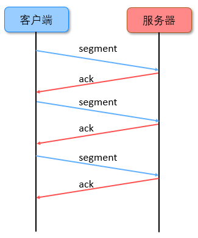
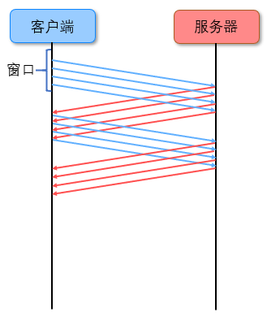
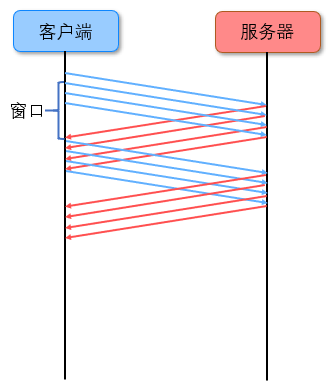
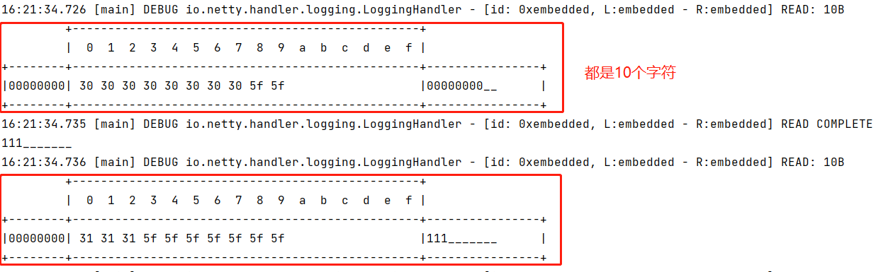
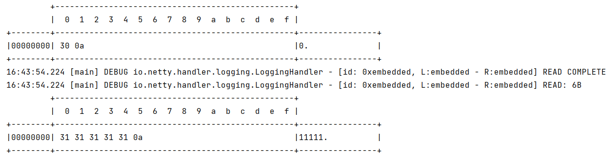

# 粘包与半包

本节中所有的代码均可以在[com.wzq.netty.sticyhalf](https://github.com/wzqwtt/BigData/tree/master/Netty/NettyLearn/src/main/java/com/wzq/netty/sticyhalf)包中找到


# 一、粘包半包现象展示

先来展示粘包现象，编写一个服务端，只有一个简单的`LoggingHandler`用于打印日志：

```java
@Slf4j
public class Server {
    public void start(int port) {
        EventLoopGroup boss = new NioEventLoopGroup();
        EventLoopGroup worker = new NioEventLoopGroup();

        try {
            ServerBootstrap bootstrap = new ServerBootstrap()
                    .group(boss, worker)
                    .channel(NioServerSocketChannel.class)
                    .childHandler(new ChannelInitializer<NioSocketChannel>() {
                        @Override
                        protected void initChannel(NioSocketChannel ch) throws Exception {
                            // 添加Handler
                            ch.pipeline().addLast(new LoggingHandler());
                        }
                    });

            ChannelFuture channelFuture = bootstrap.bind(port).sync();
            // 等待关闭
            channelFuture.channel().closeFuture().sync();
        } catch (InterruptedException e) {
            e.printStackTrace();
        } finally {
            boss.shutdownGracefully();
            worker.shutdownGracefully();
        }
    }

    public static void main(String[] args) {
        Server server = new Server();
        server.start(7);
    }
}
```

再来编写一个客户端，在客户端中，一次发送16个字节，总共发十次。我们希望服务端可以接收十次信息：

```java
@Slf4j
public class Client {

    private static final String HOST = "localhost";
    private static final int PORT = 7;

    public static void main(String[] args) {
        EventLoopGroup group = new NioEventLoopGroup();

        try {
            Bootstrap bootstrap = new Bootstrap()
                    .group(group)
                    .channel(NioSocketChannel.class)
                    .handler(new ChannelInitializer<NioSocketChannel>() {
                        @Override
                        protected void initChannel(NioSocketChannel ch) throws Exception {
                            ch.pipeline().addLast(new ChannelInboundHandlerAdapter() {
                                // 当链接成功建立，触发activate事件
                                @Override
                                public void channelActive(ChannelHandlerContext ctx) throws Exception {
                                    for (int i = 0; i < 10; i++) {
                                        ByteBuf buf = ByteBufAllocator.DEFAULT.buffer(16);
                                        buf.writeBytes(new byte[]{1, 2, 3, 4, 5, 6, 7, 8, 9, 10, 11, 12, 13, 14, 15, 16});
                                        ctx.writeAndFlush(buf);
                                    }
                                }
                            });
                        }
                    });

            ChannelFuture channelFuture = bootstrap.connect(HOST, PORT).sync();

            channelFuture.channel().closeFuture().sync();
        } catch (InterruptedException e) {
            e.printStackTrace();
        } finally {
            group.shutdownGracefully();
        }
    }
}
```

运行服务端再运行客户端，事与愿违，服务端一次性收到了160个字节，出现了粘包现象：

```bash
         +-------------------------------------------------+
         |  0  1  2  3  4  5  6  7  8  9  a  b  c  d  e  f |
+--------+-------------------------------------------------+----------------+
|00000000| 01 02 03 04 05 06 07 08 09 0a 0b 0c 0d 0e 0f 10 |................|
|00000010| 01 02 03 04 05 06 07 08 09 0a 0b 0c 0d 0e 0f 10 |................|
|00000020| 01 02 03 04 05 06 07 08 09 0a 0b 0c 0d 0e 0f 10 |................|
|00000030| 01 02 03 04 05 06 07 08 09 0a 0b 0c 0d 0e 0f 10 |................|
|00000040| 01 02 03 04 05 06 07 08 09 0a 0b 0c 0d 0e 0f 10 |................|
|00000050| 01 02 03 04 05 06 07 08 09 0a 0b 0c 0d 0e 0f 10 |................|
|00000060| 01 02 03 04 05 06 07 08 09 0a 0b 0c 0d 0e 0f 10 |................|
|00000070| 01 02 03 04 05 06 07 08 09 0a 0b 0c 0d 0e 0f 10 |................|
|00000080| 01 02 03 04 05 06 07 08 09 0a 0b 0c 0d 0e 0f 10 |................|
|00000090| 01 02 03 04 05 06 07 08 09 0a 0b 0c 0d 0e 0f 10 |................|
+--------+-------------------------------------------------+----------------+
```


接下来展示半包现象：在服务器端代码设置一个选项：**设置服务器端ByteBuf缓冲区大小为10**，只需加一个`option`就好了：

```java
ServerBootstrap bootstrap = new ServerBootstrap()
                    .group(boss, worker)
                    // 设置服务器端的ByteBuf一次只可以接收10个字节
                    .option(ChannelOption.SO_RCVBUF,10)
                    .channel(NioServerSocketChannel.class)
```

客户端不变，再次运行代码，截取部分服务端的打印结果，已经出现了半包现象：

```bash
         +-------------------------------------------------+
         |  0  1  2  3  4  5  6  7  8  9  a  b  c  d  e  f |
+--------+-------------------------------------------------+----------------+
|00000000| 05 06 07 08 09 0a 0b 0c 0d 0e 0f 10 01 02 03 04 |................|
|00000010| 05 06 07 08 09 0a 0b 0c 0d 0e 0f 10 01 02 03 04 |................|
|00000020| 05 06 07 08 09 0a 0b 0c                         |........        |
+--------+-------------------------------------------------+----------------+

         +-------------------------------------------------+
         |  0  1  2  3  4  5  6  7  8  9  a  b  c  d  e  f |
+--------+-------------------------------------------------+----------------+
|00000000| 0d 0e 0f 10                                     |....            |
+--------+-------------------------------------------------+----------------+
```


# 二、为什么会出现粘包半包？

**TCP的滑动窗口是出现粘包半包现象的根本原因**

TCP以一个段（segment）为单位，每发送一个段就需要进行一次确认应答（ack）处理，但如果这么做，缺点就是：**包的往返时间越长性能就越差**



于是，TCP引入了滑动窗口解决这个问题，**客户端的多个请求可以在窗口内同时发送**



假设窗口的大小是4，**在第一个ack到达客户端的时候，滑动窗口就可以向下移动了，这代表着下一个信息也可以发送了，当然接收方也有一个窗口做同样的工作：**



滑动窗口的作用：

- 窗口大小决定了无需等待应答而可以继续发送的数据最大值
- 起到了一个缓冲区的作用，同时也能起到流量控制的作用
  - 只有窗口内的数据才允许被发送，当应答未到之前，窗口必须停止滑动
  - 接收方也会维护一个窗口，只有落在窗口内的数据才能允许接收


这就可能导致粘包半包：

- **粘包：**
  - 现象：发送`abc`，`def`，接收`abcdef`
  - 原因：
    - 应用层：接收方ByteBuf设置太大（Netty默认1024）
    - 滑动窗口：假设发送方256bytes表示一个完整报文，但由于接收方处理不及时且窗口大小足够大，这256bytes字节就会缓冲在接收方的滑动窗口中，当滑动窗口中缓冲了多个报文就会粘包
    - Nagle算法：会造成粘包
- **半包：**
  - 现象：发送`abcdef`，接收`abc`，`def`
  - 原因：
    - 应用层：接收方ByteBuf设置太小，西澳娱实际发送数据量
    - 滑动窗口：假设接收方的窗口只剩下了128bytes，发送方的报文大小是156bytes，这时放不下了，只能先发送128bytes，等待ack之后才能发送剩余部分，这就造成了半包
    - MSS限制：当发生的数据超过了MSS限制后，会将数据切分发送，就会造成半包
- **本质还是因为TCP是流式协议，消息无边界。**


# 三、解决方案

## 1、短链接

**所谓短链接就是：链接建立好之后发送一次消息，随后断开连接；再次连接、再次发送；直到消息全部发送完毕。**

先把此前设置服务端的`option(ChannelOption.SO_RCVBUF,10)`注释掉

然后我们以短链接的形式，重写客户端，只需要分10次建立连接并发送buf就好了：

```java
@Slf4j
public class ShortConnectClient {
    // 定义HOST和PORT常量
    private static final String HOST = "localhost";
    private static final int PORT = 7;

    public void send() {
        EventLoopGroup group = new NioEventLoopGroup();
        try {
            Bootstrap bootstrap = new Bootstrap()
                    .group(group)
                    .channel(NioSocketChannel.class)
                    .handler(new ChannelInitializer<NioSocketChannel>() {
                        @Override
                        protected void initChannel(NioSocketChannel ch) throws Exception {
                            ch.pipeline().addLast(new ChannelInboundHandlerAdapter() {
                                @Override
                                public void channelActive(ChannelHandlerContext ctx) throws Exception {
                                    ByteBuf buf = ctx.alloc().buffer(16);
                                    buf.writeBytes(new byte[]{1, 2, 3, 4, 5, 6, 7, 8, 9, 10, 11, 12, 13, 14, 15, 16});
                                    ctx.writeAndFlush(buf);
                                    // 在此处关闭此次连接！
                                    log.debug("关闭连接");
                                    ctx.channel().close();
                                }
                            });
                        }
                    });

            ChannelFuture channelFuture = bootstrap.connect(HOST, PORT).sync();

            // 关闭连接的异步事件
            channelFuture.channel().closeFuture().sync();
        } catch (InterruptedException e) {
            e.printStackTrace();
        } finally {
            group.shutdownGracefully();
        }

    }

    public static void main(String[] args) {
        ShortConnectClient client = new ShortConnectClient();
        // 连续发送10次
        for (int i = 0; i < 10; i++) {
            client.send();
        }
    }
}
```

在这种情况下，绝对不会出现粘包问题，因为客户端发一次就断一次。

但是**短链接不能解决半包问题。** 只需要调整一下服务端的接收缓冲区大小，就芭比Q了：

```java
// 调整服务端缓冲区大小
ServerBootstrap bootstrap = new ServerBootstrap()
    .group(boss, worker)
    // 调整netty的接收缓冲区，设置最大最小初始缓冲区都是8个字节
    .option(ChannelOption.RCVBUF_ALLOCATOR, new AdaptiveRecvByteBufAllocator(8, 8, 8))
    .channel(NioServerSocketChannel.class)
```


## 2、定长解码器 FixedLengthFrameDecoder

定长编码器FixedLengthFrameDecoder，这个解码器**可以以固定的字节数分割收到的ByteBuf**。

比如，你收到下面四个分片的包：

```
A | BC | DEFG | HI
```

`FixedLengthFrameDeocder(3)`将会按照固定长度3，将上面四个分片的包解码到三个包中：

```
ABC | DEF | GHI
```

案例：**按照10个字符进行分割。**

```java
@Slf4j
public class TestFixedLengthFrameDeocder {
    public static void main(String[] args) {
        // 使用EmbeddedChannel进行测试
        EmbeddedChannel embeddedChannel = new EmbeddedChannel(
                new LoggingHandler(),
                new FixedLengthFrameDecoder(10)
        );

        // 发送一些数据
        ByteBuf buf = ByteBufAllocator.DEFAULT.buffer();
        Random r = new Random();
        char c = '0';
        for (int i = 0; i < 10; i++) {
            buf.writeBytes(fill10Bytes(c++, r.nextInt(10) + 1));
            embeddedChannel.writeInbound(buf);
        }
    }

    public static byte[] fill10Bytes(char c, int len) {
        byte[] bytes = new byte[10];
        for (int i = 0; i < len; i++) {
            bytes[i] = (byte) c;
            System.out.print(c);
        }
        for (int i = len; i < 10; i++) {
            bytes[i] = '_';
            System.out.print('_');
        }
        System.out.println();
        return bytes;
    }
}
```

结果如下，可以看到每次接收的都是10个字符：



FixedLengthFrameDecoder也有明显的缺点，那就是：**它占用的字节数比较多，即使本身内容比较少，也要占用固定长度的字节。**


## 3、分隔符解码器

基于分隔符的解码操作，我们在[NIO基础](https://github.com/wzqwtt/BigData/blob/master/Netty/NIO%E5%9F%BA%E7%A1%80.md#6%E7%B2%98%E5%8C%85%E4%B8%8E%E5%8D%8A%E5%8C%85)中有自己写过一个简单的。Netty为我们提供了两个基于分隔符的协议：

- `LineBasedFrameDecoder`：提取由行尾符（\n或者\r\n）分隔的帧的解码器

  它的构造方法要求我们传递一个最大长度`maxLength`，这是合理的，因为如果一直没有遇到分隔符，那么不可能永远的去开辟、占用空间

- `DelimiterBasedFrameDecoder`：使用任何由用户提供的分隔符来提取帧的通用解码器，速度没有`LineBased...`的快

  它的构造方法要求传递两个参数：

  ```java
  // maxFrameLength：最大长度，同上
  // delimiter：分隔符（支持是多个字节的分隔符）
  public DelimiterBasedFrameDecoder(int maxFrameLength, ByteBuf delimiter)
  ```

LineBasedFrameDecoder的演示：

```java
@Slf4j
public class TestLinedBasedFrameDecoder {
    public static void main(String[] args) {
        // 使用EmbeddedChannel进行测试
        EmbeddedChannel embeddedChannel = new EmbeddedChannel(
                new LoggingHandler(),
                new LineBasedFrameDecoder(1024)
        );

        // 发送数据
        ByteBuf buf = ByteBufAllocator.DEFAULT.buffer();
        char c = '0';
        Random random = new Random();
        for (int i = 0; i < 10; i++) {
            buf.writeBytes(makeString(c++, random.nextInt(10) + 1));
            embeddedChannel.writeInbound(buf);
        }
    }

    public static byte[] makeString(char c, int len) {
        StringBuilder sb = new StringBuilder();
        for (int i = 0; i < len; i++) {
            sb.append(c);
        }
        sb.append("\n");
        return sb.toString().getBytes();
    }
}
```

结果如下，没有半包粘包问题：




## 4、LTC解码器

LTC编码器指：`LengthFieldBasedFrameDecoder`基于长度字段的帧解码器。

在传送数据时可以在数据中**添加一个用于表示有用数据长度的字段**，在解码时读取出这个用于表明长度的字段，同时读取其他相关参数，即可知道最终需要的数据是什么样子的

`LengthFieldBasedFrameDecoder`解码器可以提供更为丰富的拆分方法，其构造方法有五个参数

```java
public LengthFieldBasedFrameDecoder(
    int maxFrameLength,
    int lengthFieldOffset, int lengthFieldLength,
    int lengthAdjustment, int initialBytesToStrip)
```

**参数解析**

- maxFrameLength 数据最大长度
  - 表示数据的最大长度（包括附加信息、长度标识等内容）
- lengthFieldOffset **数据长度标识的起始偏移量**
  - 用于指明数据第几个字节开始是用于标识有用字节长度的，因为前面可能还有其他附加信息
- lengthFieldLength **数据长度标识所占字节数**（用于指明有用数据的长度）
  - 数据中用于表示有用数据长度的标识所占的字节数
- lengthAdjustment **长度表示与有用数据的偏移量**
  - 用于指明数据长度标识和有用数据之间的距离，因为两者之间还可能有附加信息
- initialBytesToStrip **数据读取起点**
  - 读取起点，**不读取** 0 ~ initialBytesToStrip 之间的数据

**参数图解**


```
lengthFieldOffset   = 0
lengthFieldLength   = 2
lengthAdjustment    = 0
initialBytesToStrip = 0 (= do not strip header)
  
BEFORE DECODE (14 bytes)         AFTER DECODE (14 bytes)
+--------+----------------+      +--------+----------------+
| Length | Actual Content |----->| Length | Actual Content |
| 0x000C | "HELLO, WORLD" |      | 0x000C | "HELLO, WORLD" |
+--------+----------------+      +--------+----------------+
```

从0开始即为长度标识，长度标识长度为2个字节

**0x000C** 即为后面 `HELLO, WORLD`的长度

------

```
lengthFieldOffset   = 0
lengthFieldLength   = 2
lengthAdjustment    = 0
initialBytesToStrip = 2 (= the length of the Length field)
  
BEFORE DECODE (14 bytes)         AFTER DECODE (12 bytes)
+--------+----------------+      +----------------+
| Length | Actual Content |----->| Actual Content |
| 0x000C | "HELLO, WORLD" |      | "HELLO, WORLD" |
+--------+----------------+      +----------------+
```

从0开始即为长度标识，长度标识长度为2个字节，**读取时从第二个字节开始读取**（此处即跳过长度标识）

因为**跳过了用于表示长度的2个字节**，所以此处直接读取`HELLO, WORLD`

------

```
lengthFieldOffset   = 2 (= the length of Header 1)
lengthFieldLength   = 3
lengthAdjustment    = 0
initialBytesToStrip = 0
  
BEFORE DECODE (17 bytes)                      AFTER DECODE (17 bytes)
+----------+----------+----------------+      +----------+----------+----------------+
| Header 1 |  Length  | Actual Content |----->| Header 1 |  Length  | Actual Content |
|  0xCAFE  | 0x00000C | "HELLO, WORLD" |      |  0xCAFE  | 0x00000C | "HELLO, WORLD" |
+----------+----------+----------------+      +----------+----------+----------------+
```

长度标识**前面还有2个字节的其他内容**（0xCAFE），第三个字节开始才是长度标识，长度表示长度为3个字节(0x00000C)

Header1中有附加信息，**读取长度标识时需要跳过这些附加信息来获取长度**

------

```
lengthFieldOffset   = 0
lengthFieldLength   = 3
lengthAdjustment    = 2 (= the length of Header 1)
initialBytesToStrip = 0
  
BEFORE DECODE (17 bytes)                      AFTER DECODE (17 bytes)
+----------+----------+----------------+      +----------+----------+----------------+
|  Length  | Header 1 | Actual Content |----->|  Length  | Header 1 | Actual Content |
| 0x00000C |  0xCAFE  | "HELLO, WORLD" |      | 0x00000C |  0xCAFE  | "HELLO, WORLD" |
+----------+----------+----------------+      +----------+----------+----------------+
```

从0开始即为长度标识，长度标识长度为3个字节，**长度标识之后还有2个字节的其他内容**（0xCAFE）

长度标识(0x00000C)表示的是**从其后lengthAdjustment（2个字节）开始的数据的长度，即`HELLO, WORLD`**，不包括0xCAFE

------

```
lengthFieldOffset   = 1 (= the length of HDR1)
lengthFieldLength   = 2
lengthAdjustment    = 1 (= the length of HDR2)
initialBytesToStrip = 3 (= the length of HDR1 + LEN)
  
BEFORE DECODE (16 bytes)                       AFTER DECODE (13 bytes)
+------+--------+------+----------------+      +------+----------------+
| HDR1 | Length | HDR2 | Actual Content |----->| HDR2 | Actual Content |
| 0xCA | 0x000C | 0xFE | "HELLO, WORLD" |      | 0xFE | "HELLO, WORLD" |
+------+--------+------+----------------+      +------+----------------+
```

长度标识**前面有1个字节的其他内容，后面也有1个字节的其他内容，读取时从长度标识之后3个字节处开始读取**，即读取 `0xFE HELLO, WORLD`