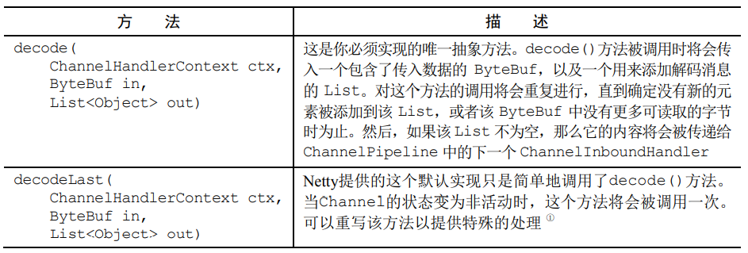
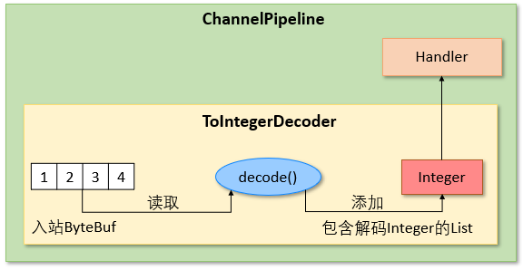
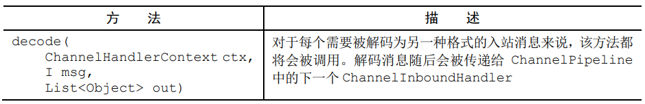
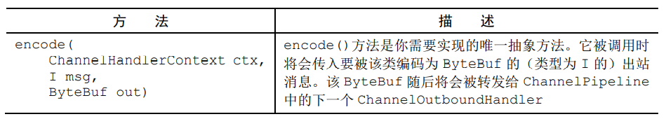
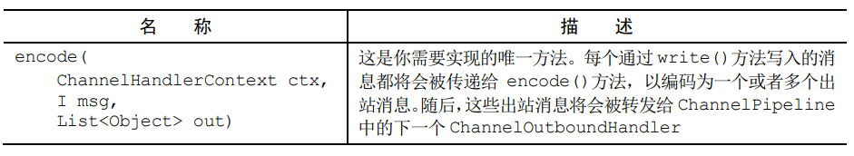
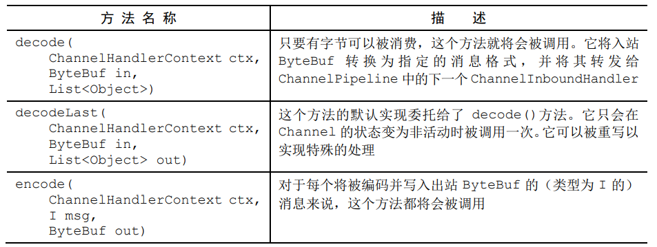

# 编解码器 Codec

本节中所有的代码均可以在[com.wzq.netty.codec](https://github.com/wzqwtt/BigData/tree/master/Netty/NettyLearn/src/main/java/com/wzq/netty/codec)包中找到


# 一、什么是编解码器

**真正在网络中传输的数据都是字节序列。** 每个网络应用程序都应该定义**如何解析在两个节点之间来回传输的原始字节，以及如何将其和目标应用程序的数据格式做相互转换。** 这种转换逻辑由Netty的编解码器处理。

编解码器由编码器和解码器组成：

- 编码器：将消息转换为适合于传输的格式（最有可能的就是字节流）
- 解码器：将网络字节流转换回应用程序的消息格式

**Netty中的编解码器实际上就是ChannelHandler**，下面看一下Netty所提供的编解码器


# 二、解码器 Decoder

解码器负责将入站数据从一种格式转换到另一种格式，所以Netty中的解码器实现了ChannelInboundHandler接口

在Netty中解码器分为两种：

- **将字节解码为消息：** ByteToMessageDecoder和ReplayingDecoder
- **将一种消息类型解码为另一种：** MessageToMessageDecoder


## 1、抽象类ByteToMessageDecoder

ByteToMessageDecoder负责将字节解码为消息

由于网络传输数据的不稳定性，我们不可能知道远程节点是否会一次性发送一个完整的消息，所以这个类会对入站数据进行缓冲，直到它准备好处理

下表是ByteToMessageDecoder的两个重要的方法：




案例：接收一个包含简单int的字节流，每个int都需要被单独处理。需要从入站ByteBuf中读取每个int，并将它传递给下一个Handler。该需求如下图所示：



code：

```java
@Slf4j
public class TestByteToMessageDecoder {
    public static void main(String[] args) {
        // 使用EmbeddedChannel测试Handler
        EmbeddedChannel channel = new EmbeddedChannel(
                // 编写一个ByteToMessageDecoder
                new ByteToMessageDecoder() {
                    // decode必须要实现
                    @Override
                    protected void decode(ChannelHandlerContext ctx, ByteBuf in, List<Object> out) throws Exception {
                        // 如果发送过来的数据大于等于4个字节，才可以读取一个int值
                        if (in.readableBytes() >= 4) {
                            // 使用out把数据推送到下游
                            out.add(in.readInt());
                        }
                    }
                },
                // 添加一个入站适配器，用于输出上游传递的信息
                new ChannelInboundHandlerAdapter() {
                    @Override
                    public void channelRead(ChannelHandlerContext ctx, Object msg) throws Exception {
                        log.debug(String.valueOf(msg));
                    }
                }
        );

        // 向EmbeddedChannel发送测试数据
        ByteBuf buf = ByteBufAllocator.DEFAULT.buffer();
        for (int i = 0; i < 100; i++) {
            buf.writeInt(i);
        }
        // 发送测试的ByteBuf
        channel.writeInbound(buf);
    }
}
```

虽然ByteToMessageDecoder可以实现这个小功能，但是你会发现，在调用`readInt`方法的时候，我们不得不先判断ByteBuf中的数据是否足够，这个环节优点繁琐。下面介绍的ReplayingDecoder则以少量的开销消除了这个步骤。


## 2、抽象类ReplayingDecoder

ReplayingDecoder继承了ByteToMessageDecoder类：

```java
public abstract class ReplayingDecoder<S> extends ByteToMessageDecoder
```

它要求我们指定一个泛型，这个泛型S指定了用于状态管理的类型，即帮助我们自动判断当前ByteBuf中的数据是否达到了可以解析的字节数。简单说：我们不需要使用`in.readableBytes() >= n`判断了，这个类帮助我们做了！


所以，在上面的案例中，第一个Decoder，我们就可以改写为：

```java
// 使用ReplayingDecoder，指定Integer为泛型
new ReplayingDecoder<Integer>() {
    @Override
    protected void decode(ChannelHandlerContext ctx, ByteBuf in, List<Object> out) throws Exception {
        out.add(in.readInt());
    }
}
```


> :warning:需要注意的是：
>
> - 如果没有足够的字节可用，这个readInt()方法的实现将会抛出一个Error，其将在基类中被捕获并处理
> - 并不是所有的ByteBuf操作都被支持，如果调用了一个不被支持的方法，将会抛出一个UnsupportedOperationException
> - ReplayingDecoder稍慢于ByteToMessageDecoder
> - **如果使用ByteToMessageDecoder不会引入太多的复杂性，那么请使用它；否则请使用ReplayingDecoder**


## 3、抽象类MessageToMessageDecoder

MessgaeToMessageDecoder可以在两个消息格式之间进行转换（例如，从一种POJO类型转换为另外一种）

```java
public abstract class MessageToMessageDecoder<I> extends ChannelInboundHandlerAdapter
```

这个`类型参数I`指定了decode方法的输入参数msg类型，这是必须要实现的方法：



案例：在ReplayingDecoder解码为Integer之后，将Integer转换为String类型

```java
@Slf4j
public class TestMessageToMessageDecoder {
    public static void main(String[] args) {
        // 使用EmbeddedChannel进行测试
        EmbeddedChannel channel = new EmbeddedChannel(
                // 使用ReplayingDecoder将消息转换为Integer
                new ReplayingDecoder<Integer>() {
                    @Override
                    protected void decode(ChannelHandlerContext ctx, ByteBuf in, List<Object> out) throws Exception {
                        out.add(in.readInt());
                    }
                },
                // 使用MessageToMessageDecoder将Integer转换为String
                new MessageToMessageDecoder<Integer>() {
                    @Override
                    protected void decode(ChannelHandlerContext ctx, Integer msg, List<Object> out) throws Exception {
                        out.add(String.valueOf(msg));
                    }
                },
                // 一个普通的Handler
                new ChannelInboundHandlerAdapter() {
                    @Override
                    public void channelRead(ChannelHandlerContext ctx, Object msg) throws Exception {
                        log.debug(String.valueOf(msg.getClass()));
                    }
                }
        );

        // 向channel中添加一些数据
        ByteBuf buf = ByteBufAllocator.DEFAULT.buffer();
        for (int i = 0; i < 100; i++) {
            buf.writeInt(i);
        }
        channel.writeInbound(buf);
    }
}
```


## 4、TooLongFrameException类

- 由于Netty是一个异步框架，所以需要在字节可以解码之前在内存中缓冲它们
- 不能让解码器缓冲大量的数据以至于耗尽可用的内存
- Netty提供了TooLongFrameException类，其将由解码器在帧超出指定的大小限制时抛抛出

下面的代码展示了如何使用TooLongFrameException，来通知其他Handler发生了帧大小溢出的：

```java
@Slf4j
public class TestTooLongFrameException {
    // 最大帧数
    private static final int MAX_FRAME_SIZE = 32;

    public static void main(String[] args) {
        EmbeddedChannel channel = new EmbeddedChannel(
                new ByteToMessageDecoder() {
                    @Override
                    protected void decode(ChannelHandlerContext ctx, ByteBuf in, List<Object> out) throws Exception {
                        int readable = in.readableBytes();
                        // 检测缓冲区中是否有超过MAX_FRAME_SIZE个字节
                        if (readable > MAX_FRAME_SIZE) {
                            // 跳过所有可读字节，并抛出异常
                            in.skipBytes(readable);
                            throw new TooLongFrameException("Frame too big!");
                        }
                    }
                }
        );

        ByteBuf buf = ByteBufAllocator.DEFAULT.buffer();
        for (int i = 0; i < 10; i++) {
            buf.writeInt(i);
        }
        channel.writeInbound(buf);
    }
}
```


# 三、编码器 Encoder

解码器实现了ChannelInboundHandler，编码器则实现了ChannelOutboundHandler

- 将消息编码为字节
- 将消息编码为消息


## 1、抽象类MessageToByteEncoder

MessageToByteEncoder可以将消息转换为字节，与ByteToMessageDecoder的功能相反，它需要实现一个方法：



案例：接收一个Int值，将它写入到ByteBuf中

```java
public class TestMessageToByteEncoder {
    public static void main(String[] args) {
        // 使用EmbeddedChannel测试
        EmbeddedChannel channel = new EmbeddedChannel(
                // 由于是出站，要读取outBound的Handler，因此顺序应该是从tail到head，倒着使用handler
                // 再使用一个Handler接收上游的信息
                new ChannelOutboundHandlerAdapter() {
                    @Override
                    public void write(ChannelHandlerContext ctx, Object msg, ChannelPromise promise) throws Exception {
                        ByteBuf buf = (ByteBuf) msg;
                        MyByteBufUtil.log(buf);
                    }
                },
                // 编码器
                new MessageToByteEncoder<Integer>() {
                    @Override
                    protected void encode(ChannelHandlerContext ctx, Integer msg, ByteBuf out) throws Exception {
                        out.writeInt(msg);
                    }
                }
        );
        // 写入一些数据到channel
        channel.writeOutbound((Integer) 1, (Integer) 2, (Integer) 3);
    }
}
```

最终输出，可以看到已经编码为了ByteBuf：

```bash
read index:0 write index:4 capacity:256
         +-------------------------------------------------+
         |  0  1  2  3  4  5  6  7  8  9  a  b  c  d  e  f |
+--------+-------------------------------------------------+----------------+
|00000000| 00 00 00 01                                     |....            |
+--------+-------------------------------------------------+----------------+
read index:0 write index:4 capacity:256
         +-------------------------------------------------+
         |  0  1  2  3  4  5  6  7  8  9  a  b  c  d  e  f |
+--------+-------------------------------------------------+----------------+
|00000000| 00 00 00 02                                     |....            |
+--------+-------------------------------------------------+----------------+
read index:0 write index:4 capacity:256
         +-------------------------------------------------+
         |  0  1  2  3  4  5  6  7  8  9  a  b  c  d  e  f |
+--------+-------------------------------------------------+----------------+
|00000000| 00 00 00 03                                     |....            |
+--------+-------------------------------------------------+----------------+
```


## 2、抽象类MessageToMessageEncoder

MessageToMessageEncoder可以将出站的数据从一种消息编码为另一种消息，这个方法需要重写一个encode方法：



案例：将出站的Int转换为String类型的数据：

```java
@Slf4j
public class TestMessageToMessageEncoder {
    public static void main(String[] args) {
        // 使用EmbeddedChannel进行测试
        EmbeddedChannel channel = new EmbeddedChannel(
                // 再来一个Handler查看是否为String类型的数据
                new ChannelOutboundHandlerAdapter() {
                    @Override
                    public void write(ChannelHandlerContext ctx, Object msg, ChannelPromise promise) throws Exception {
                        log.debug(msg.getClass().toString());
                    }
                },
                // 将Int转换为String的编码器
                new MessageToMessageEncoder<Integer>() {
                    @Override
                    protected void encode(ChannelHandlerContext ctx, Integer msg, List<Object> out) throws Exception {
                        out.add(String.valueOf(msg));
                    }
                }
        );

        // 往channel写一些int数据
        channel.writeOutbound((Integer) 1, (Integer) 2, (Integer) 3);
    }
}
```

输出已经成功将Integer转换为String：

```bash
14:23:44.360 [main] DEBUG com.wzq.netty.codec.encoder.TestMessageToMessageEncoder - class java.lang.String
14:23:44.360 [main] DEBUG com.wzq.netty.codec.encoder.TestMessageToMessageEncoder - class java.lang.String
14:23:44.361 [main] DEBUG com.wzq.netty.codec.encoder.TestMessageToMessageEncoder - class java.lang.String
```


# 四、抽象的编解码器类

在上面的部分，一直将编码器和解码器作为单独的实体讨论。但是，有时会发现**在同一个类中管理入站数据和出站数据和消息的转换**是很有用的

Netty的抽象编解码器类正好可以达到这个目的。这些类同时实现了ChannelInboundHandler和ChannelOutboundHandler接口


## 1、抽象类ByteToMessageCodec

ByteToMessageCodec结合了ByteToMessageDecoder以及MessageToByteEncoder，用于在同一个类中对消息进行编解码



只需要继承该类实现三个方法即可


## 2、抽象类MessageToMessageCodec

通过使用MessageToMessageCodec可以在单一的类中实现消息格式的转换：

```java
public abstract class MessageToMessageCodec<INBOUND_IN, OUTBOUND_IN> extends ChannelDuplexHandler
```

有两个方法需要我们实现：


它要求指定两个参数，这两个参数和两个方法是有关系的

- decode方法是将INBOUND_IN类型的消息转换为OUTBOUND_IN类型的消息
- encode方法相反

在后续的章节，将演示这个类的强大之处


## 3、CombinedChannelDuplexHandler类

结合一个解码器和编码器可能会对可重用性造成影响。但是`CombinedChannelDuplexHandler`类能避免这个缺陷，也不会牺牲将一个解码器和一个编码器作为一个单独的单元部署的便利性。

```java
public class CombinedChannelDuplexHandler<I extends ChannelInboundHandler, O extends ChannelOutboundHandler>
        extends ChannelDuplexHandler
```

这个类充当了ChannelInboundHandler和ChannelOutboundHandler的容器，其中需要传递的参数就是一个入站和一个出站处理器

通过提供分别继承了解码器类和编码器类的类型，可以实现一个编解码器，而又不必直接扩展抽象的编解码器类


我们可以这样结合一个解码器和一个编码器：

```java
public class CombinedChannelDuplexCodec extends CombinedChannelDuplexHandler
    <一个解码器实现类,一个编码器实现类> {
    public CombinedChannelDuplexCodec() {
        super(new 解码器实现类,new 编码器实现类);
    }
}
```

通过调用父类的方法使两者结合。


---

在后面的部分，将学习Netty提供的现成的基于某种协议的编解码器。