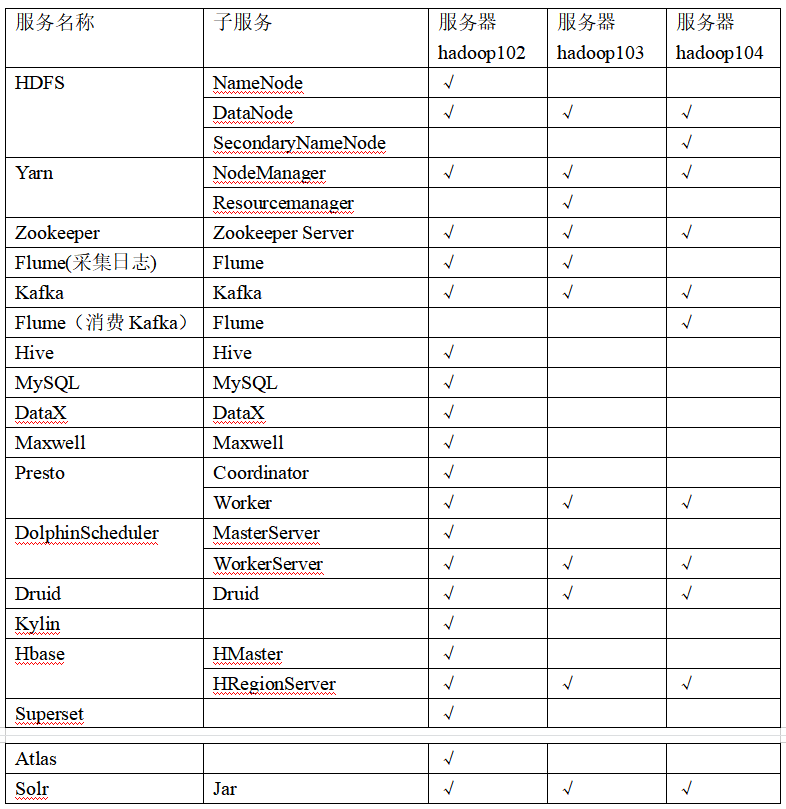

# 一、项目需求分析

该模块为**电商数仓**的数据采集模块，主要包括：

- 用户行为数据采集：是指用户在电商平台的页面浏览记录、动作记录、商品的曝光记录、启动记录以及错误记录等；该部分数据通常**存储在服务器的文件**里面。
- 用户业务数据采集：是指用户在电商平台一系列操作数据，比如下单、支付、参与的活动等等；这部分数据通常**存储在数据库**里面。

该项目的主要目的就是对上面两种类型的数据进行采集到`HDFS`分布式文件系统，再使用`Hive`建立起数据仓库，随后使用`Spark`或其他工具对这些数据进行分析

# 二、系统数据流程设计

数据采集平台系统架构如下：

对于两种数据：

- 行为数据：使用Flume工具监控服务器文件随后输出到Kafka做缓冲并过滤一些文件，再将数据发送到Flume，随后输出到HDFS里面

- 业务数据：使用DataX、Maxwell工具读取MySQL数据库数据，输出到HDFS里面

两者数据都输出到HDFS之后，可以使用Hive搭建数据仓库，分析之后的数据可以再输出到MySQL或其他数据库软件里面，方便进行下一步可视化的工作

# 三、技术选型

技术选型如下：

| 产品      | 版本   |
| --------- | ------ |
| Java      | 1.8    |
| Hadoop    | 3.1.3  |
| Hive      | 3.1.2  |
| Flume     | 1.9.0  |
| Zookeeper | 3.5.7  |
| Kafka     | 3.0.0  |
| DataX     | 3.0    |
| Maxwell   | 1.29.2 |

# 四、集群资源规划

集群资源规划如下图所示：（里面有些技术数据采集平台没有涉及，之后的blog会慢慢提到）

# 参考资料

- [尚硅谷电商数仓V5.0学习视频](https://www.bilibili.com/video/BV1nf4y1F7Bn)