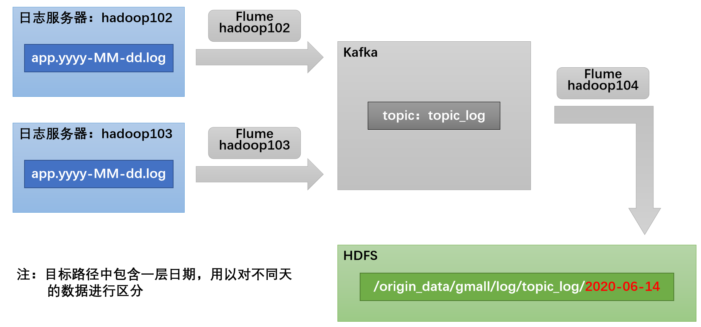
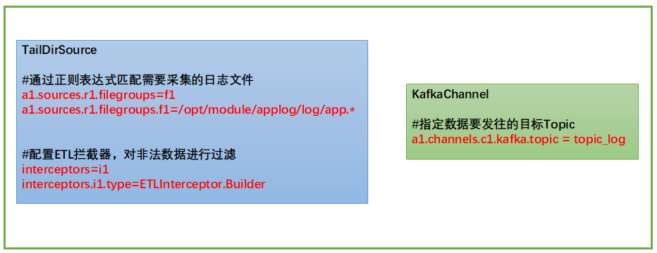
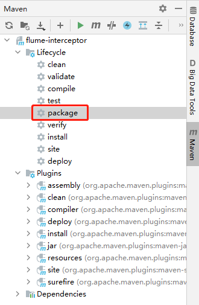
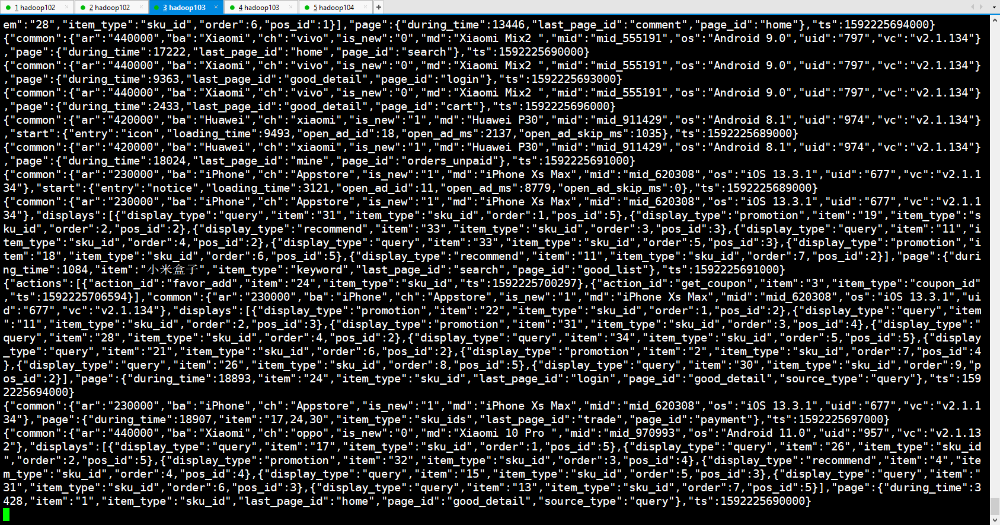
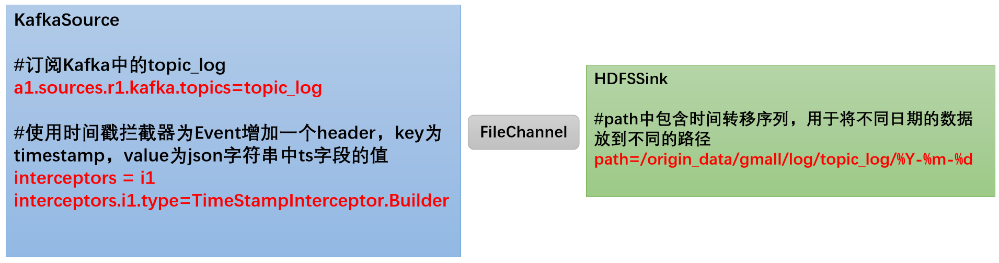
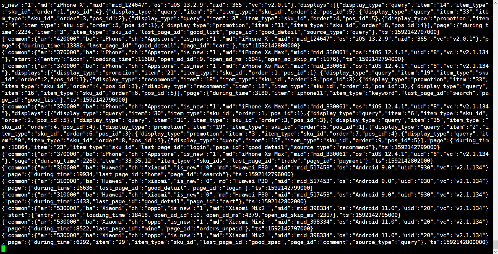
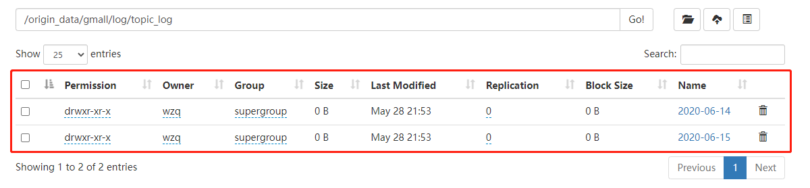

> 本blog正式开始数据采集，在开始之前，应该确保服务器集群有Hadoop、Hive、Kafka、Flume等环境，如果没有安装，请访问以下链接进行安装：
>
> - 安装Hadoop：
>
>   - [准备三台CentOS虚拟机](https://github.com/ZongqinWang/BigData/blob/main/Hadoop/2、准备三台虚拟机.md)
>
>   - [安装Java、Hadoop以及编写集群分发脚本](https://github.com/ZongqinWang/BigData/blob/main/Hadoop/3、安装Java、Hadoop以及集群分发脚本.md)
>
>   - [配置Hadoop集群](https://github.com/ZongqinWang/BigData/blob/main/Hadoop/4、配置Hadoop集群.md)
>
>   - [群起集群并进行测试](https://github.com/ZongqinWang/BigData/blob/main/Hadoop/5、群起集群进行测试.md)
>
>   - [编写Hadoop集群启停脚本以及查看集群Java进程脚本](https://github.com/ZongqinWang/BigData/blob/main/Hadoop/6、编写Hadoop集群启停脚本以及查看集群Java进程脚本.md)
>
> - 安装Zookeeper：
>
>   - [ Zookeeper 分布式安装部署](https://github.com/ZongqinWang/BigData/blob/main/Zookeeper/2、Zookeeper本地与分布式安装.md)
>
> - 安装Hive：
>
>   - [ Hive安装部署并替换derby为MySQL](https://github.com/ZongqinWang/BigData/blob/main/Hive/2、Hive安装部署并替换derby为MySQL.md)
>
> - 安装Flume：
>
>   - [Flume 分布式安装部署](https://github.com/ZongqinWang/BigData/blob/main/Flume/2、Flume分布式安装部署以及入门案例.md)
>
> - 安装Kafka：
>
>   - [Kafka 分布式安装部署](https://github.com/ZongqinWang/BigData/blob/main/Kafka/2、Kafka-分布式安装部署.md)


# 一、行为日志数据通道

行为日志一般存储在服务器的文件里面，所以这一part可以使用`Flume`的`TailDirSource`监控日志文件，再使用`Kafka Channel`发送到`Kafka`，进行一些过滤之后，再使用`Flume`发送到`HDFS`里面。具体过程如下图所示：




# 二、从文件到Kafka

## 1、规划

按照规划，需要采集的用户行为日志文件分布在hadoop102，hadoop103两台日志服务器，故需要在hadoop102，hadoop103两台节点配置日志采集Flume。日志采集Flume需要采集日志文件内容，并对日志格式（JSON）进行校验，然后将校验通过的日志发送到Kafka

第一个要写的应该是从文件到`Kafka`中，Flume共有三大组件，分别是`Source`、`Channel`、`Sink`，对于这三个组件，这一部分选用：

- `TailDir Source`：因为他可以实现断点续传、多目录的监控
- `Kafka Channel`：Flume这么流行的一个主要原因就是与Kafka的集成，如果Flume传输数据的目的地是Kafka，那么只需要配置`Kafka Channel`就好，可以不用配置`Kafka Sink`

综上所述，这一部分使用：**`TailDir Source`监控目录、使用`Kafka Channel`直接输出到Kafka，再TailDir之后还需要编写一个拦截器，用于拦截不是JSON格式的数据**





## 2、编写Flume配置文件

有了规划之后，直接开始写配置文件吧，进入flume的job文件，创建一个目录project，专门存储这个项目的flume配置文件

```bash
[wzq@hadoop102 ~]$ cd /opt/module/flume-1.9.0/job/
[wzq@hadoop102 job]$ mkdir project
[wzq@hadoop102 job]$ cd project
```


紧接着创建一个配置文件：（[可以点我看完整版配置文件](./resource/file_to_kafka.conf)）

```bash
[wzq@hadoop102 project]$ touch file_to_kafka.conf
```

然后就开始写这个配置文件吧！[对于没有学过Flume的同学，欢迎访问Flume系列blog！](https://github.com/wzqwtt/BigData#%E5%9B%9Bflume)


这个文件由四个部分组成：命名、Source、Channel和绑定，因为使用`Kafka Channel`可以不写Sink，所以这一部分没有Sink：

```properties
# Name the components on this agent
a1.sources = r1
a1.channels = c1

# Configure the TailDir source
a1.sources.r1.type = TAILDIR
a1.sources.r1.filegroups = f1
a1.sources.r1.filegroups.f1 = /opt/module/applog/log/app.*
a1.sources.r1.positionFile = /opt/module/flume-1.9.0/tail_dir.json
# 拦截器稍后配置


# Use Kafka Channel
a1.channels.c1.type = org.apache.flume.channel.kafka.KafkaChannel
a1.channels.c1.kafka.bootstrap.servers = hadoop102:9092,hadoop103:9092
a1.channels.c1.kafka.topic = topic_log
# 这里不转换为FlumeEvent到Kafka
a1.channels.c1.parseAsFlumeEvent = false 

# Bind the source and sink to the channel
a1.sources.r1.channels = c1
```

## 3、编写拦截器

配置好`Flume`之后，需要写一个拦截器，这个拦截器的作用是过滤掉文件中不是JSON格式的数据，这一部分在idea里面编写，[读者可以直接点击这串字访问代码文件！](./resource/flume-interceptor)

打开`idea`，新建一个`Maven`项目，名字为`collect`，随后打开`pom.xml`添加以下依赖：

```xml
<dependencies>
    <!-- flume依赖，scope设置为provided，打包时候不包含此包 -->
    <dependency>
        <groupId>org.apache.flume</groupId>
        <artifactId>flume-ng-core</artifactId>
        <version>1.9.0</version>
        <scope>provided</scope>
    </dependency>
    <!-- fastjson依赖，用于判断一个数据是否为JSON格式 -->
    <dependency>
        <groupId>com.alibaba</groupId>
        <artifactId>fastjson</artifactId>
        <version>1.2.62</version>
    </dependency>
</dependencies>

<!-- 打包插件 -->
<build>
    <plugins>
        <plugin>
            <artifactId>maven-compiler-plugin</artifactId>
            <version>2.3.2</version>
            <configuration>
                <source>1.8</source>
                <target>1.8</target>
            </configuration>
        </plugin>
        <plugin>
            <artifactId>maven-assembly-plugin</artifactId>
            <configuration>
                <descriptorRefs>
                    <descriptorRef>jar-with-dependencies</descriptorRef>
                </descriptorRefs>
            </configuration>
            <executions>
                <execution>
                    <id>make-assembly</id>
                    <phase>package</phase>
                    <goals>
                        <goal>single</goal>
                    </goals>
                </execution>
            </executions>
        </plugin>
    </plugins>
</build>
```


随后创建一个包：`com.wzq.flume.interceptor`，在该包下创建一个`JSONUtils`类，这个类将作为工具类判断一个字符串是否为JSON文件：

```java
package com.wzq.flume.interceptor;

import com.alibaba.fastjson.JSON;
import com.alibaba.fastjson.JSONException;

public class JSONUtils {
    // 判断是否为JSON格式文件
    public static boolean isJSONValidate(String log) {
        try {
            JSON.parse(log);    // 如果解析过来不报异常就是JSON格式文件
            return true;
        } catch (JSONException e) {
            return false;
        }
    }
}
```

然后就是编写正儿八经的拦截器了，配置拦截器有以下几个步骤：

- 实现`flume`提供的`Interceptor`接口

- 实现该接口的四个方法

  - `initialize`方法：初始化方法，如果希望配置一些什么参数，在这里可以写；当然如果要配合数据库的字段完成拦截这里也可以配置`JDBC`或其他链接

  - `intercept`方法：

    - ```java
      // 处理单个Event的方法，为了解耦使用
      public Event intercept(Event event)
      ```

    - ```java
      // 处理一个批次的Event，Flume内部调用该方法，这个方法调用上面的方法
      public List<Event> intercept(List<Event> events)
      ```

  - `close`方法：关闭连接方法

- 实现`Interceptor.Builder`接口，需要在`build`方法中返回当前对象的实例

代码如下：

```java
package com.wzq.flume.interceptor;

import org.apache.flume.Context;
import org.apache.flume.Event;
import org.apache.flume.interceptor.Interceptor;

import java.nio.charset.StandardCharsets;
import java.util.Iterator;
import java.util.List;

public class LogInterceptor implements Interceptor {
    @Override
    public void initialize() {

    }

    @Override
    public Event intercept(Event event) {
        // 获取Event的body信息，转换为String格式
        byte[] body = event.getBody();
        String log = new String(body, StandardCharsets.UTF_8);

        if (JSONUtils.isJSONValidate(log)) {
            return event;
        } else {
            return null;
        }
    }

    @Override
    public List<Event> intercept(List<Event> events) {
        Iterator<Event> iterator = events.iterator();
        while (iterator.hasNext()) {
            Event event = iterator.next();
            if (intercept(event) == null) {
                iterator.remove();
            }
        }
        return events;
    }

    @Override
    public void close() {

    }

    public static class Builder implements Interceptor.Builder {

        @Override
        public Interceptor build() {
            return new LogInterceptor();
        }

        @Override
        public void configure(Context context) {

        }
    }
}
```

这就算写完这个拦截器了，在这之后可以打为jar包：




随后将比较大的这个jar包上传到服务器flume安装路径的`lib`目录下：


上传之后可以查看是否上传成功：

```bash
[wzq@hadoop102 flume-1.9.0]$ ll lib/ | grep flume-interceptor
-rw-r--r--. 1 wzq wzq  660656 5月  28 17:21 flume-interceptor-1.0-SNAPSHOT-jar-with-dependencies.jar
```


不要忘记了还有一步，还需要在第二步编写的`file_to_kafka.conf`配置文件中，配置拦截器，加入以下内容：

```properties
a1.sources.r1.interceptors = i1
a1.sources.r1.interceptors.i1.type = com.wzq.flume.interceptor.LogInterceptor$Builder
```


## 4、测试运行

这时候从文件到Kafka这块算是已经打通了，现在可以测试了，我们期望的是在Hadoop102与Hadoop103运行flume，所以在开始之前应该做好分发工作：

```bash
[wzq@hadoop102 module]$ xsync flume-1.9.0/
```

为了这个脚本方便运行，可以写一个脚本控制Flume的启停：

```bash
[wzq@hadoop102 module]$ cd ~/bin/
[wzq@hadoop102 bin]$ vim f1.sh
```

在里面添加如下内容：（[查看源文件](./resource/f1.sh)）

```bash
#!/bin/bash

case $1 in
"start") {
	for i in hadoop102 hadoop103
	do
		echo "-------------------启动 $i 采集flume-------------------"
		ssh $i "nohup /opt/module/flume-1.9.0/bin/flume-ng agent -n a1 -c /opt/module/flume-1.9.0/conf/ -f /opt/module/flume-1.9.0/job/project/file_to_kafka.conf >/dev/null 2>&1 &"
	done
};;
"stop") {
	for i in hadoop102 hadoop103
	do
		echo "-------------------停止 $i 采集flume-------------------"
		ssh $i "ps -ef | grep file_to_kafka.conf | grep -v grep |awk  '{print \$2}' | xargs -n1 kill -9 "
	done
};;
*) {
	echo "Input Args Error..."
};;
esac
```

增加该文件的可执行权限：

```bash
[wzq@hadoop102 bin]$ chmod +x f1.sh 
```


还有一步工作就是创建一个Kafka的topic：`topic_log`

```bash
[wzq@hadoop102 bin]$ zk.sh start	# 启动zookeeper
[wzq@hadoop102 bin]$ kf.sh start	# 启动kafka
[wzq@hadoop102 bin]$ cd /opt/module/kafka-3.0.0/
[wzq@hadoop102 kafka-3.0.0]$ bin/kafka-topics.sh --bootstrap-server hadoop102:9092 --create --topic topic_log --partitions 3 --replication-factor 3
```

然后在hadoop103主机上创建一个消费者，消费`topic_log`主题的数据：

```bash
[wzq@hadoop103 kafka-3.0.0]$ bin/kafka-console-consumer.sh --bootstrap-server hadoop102:9092 --topic topic_log
```


ok，这时候在hadoop102启动flume的f1脚本，并且生产一点日志：

```bash
[wzq@hadoop102 bin]$ f1.sh start
-------------------启动 hadoop102 采集flume-------------------
-------------------启动 hadoop103 采集flume-------------------
[wzq@hadoop102 bin]$ lg.sh start
-------------------hadoop102-------------------
-------------------hadoop103-------------------
```

启动成功稍等片刻，可以看到hadoop103的消费者正在源源不断的消费数据：



至此，从文件到Kafka的通道就打通了！

# 三、从Kafka到HDFS

## 1、规划

**看第一节的规划，这个Flume配置应该在hadoop104主机！**

接下来打通第二条通道， 从Kafka到HDFS，这一步的主要工作就是用Flume消费Kafka的`topic_log`主题，然后使用一个Channel，再使用HDFS Sink输出到HDFS：





在这一步，使用：

- `Kafka Source`：因为要消费Kafka的topic，这里还需要另外配置一个拦截器，这个拦截器的主要功能是为Event增加一个header，key是timestap时间戳，value为json字符串中ts字段（[这个字段请参考行为日志数据格式的JSON格式](./2、模拟生成用户行为日志.md)）的值
- `File Channel`：使用文件信道，保证可靠性
- `HDFS Sink`：因为要输出到HDFS，所以需要使用这个Sink


## 2、编写Flume配置文件

有了规划之后，直接写配置文件，进入flume的job/project目录，创建一个文件：

```bash
[wzq@hadoop104 ~]$ cd /opt/module/flume-1.9.0/job/project/
[wzq@hadoop104 project]$ touch kafka_to_hdfs.conf
```

这个Flume配置文件由命名、kafka Source、file Channel、hdfs Sink、绑定信道组成：（[可以点我看完整版配置文件](./resource/kafka_to_hdfs.conf)）

```properties
# Name the components on this agent
a1.sources = r1
a1.sinks = k1
a1.channels = c1

# Kafka source
a1.sources.r1.type = org.apache.flume.source.kafka.KafkaSource
a1.sources.r1.kafka.bootstrap.servers = hadoop102:9092,hadoop103:9092,hadoop104:9092
a1.sources.r1.kafka.topics = topic_log
a1.sources.source1.batchSize = 5000
a1.sources.source1.batchDurationMillis = 2000
# 后面配置拦截器

# HDFS sink
a1.sinks.k1.type = hdfs
a1.sinks.k1.hdfs.path = /origin_data/gmall/log/topic_log/%Y-%m-%d
a1.sinks.k1.hdfs.filePrefix = log-
a1.sinks.k1.hdfs.rollInterval = 10
a1.sinks.k1.hdfs.rollSize = 134217728
a1.sinks.k1.hdfs.rollCount = 0

## 控制输出文件是原生文件
a1.sinks.k1.hdfs.fileType = CompressedStream
a1.sinks.k1.hdfs.codeC = gzip

# File Channel
a1.channels.c1.type = file
a1.channels.c1.checkpointDir = /opt/module/flume-1.9.0/checkpoint/behavior1
a1.channels.c1.dataDirs = /opt/module/flume-1.9.0/data/behavior1/
a1.channels.c1.maxFileSize = 2146435071
a1.channels.c1.capacity = 1000000
a1.channels.c1.keep-alive = 6

# Bind the source and sink to the channel
a1.sources.r1.channels = c1
a1.sinks.k1.channel = c1
```


## 3、编写拦截器


这个拦截器的作用主要就是给每个Event的头加上时间戳，在`com.wzq.flume.interceptor`包下创建`TimeStampInterceptor`类：[读者可以直接点击这串字访问代码文件！](./resource/flume-interceptor)

```java
package com.wzq.flume.interceptor;

import com.alibaba.fastjson.JSONObject;
import org.apache.flume.Context;
import org.apache.flume.Event;
import org.apache.flume.interceptor.Interceptor;

import java.nio.charset.StandardCharsets;
import java.util.List;
import java.util.Map;

public class TimeStampInterceptor implements Interceptor {
    @Override
    public void initialize() {

    }

    @Override
    public Event intercept(Event event) {
        Map<String, String> headers = event.getHeaders();
        String log = new String(event.getBody(), StandardCharsets.UTF_8);

        JSONObject jsonObject = JSONObject.parseObject(log);
        String ts = jsonObject.getString("ts");

        headers.put("timestamp", ts);   // 设置时间戳
        return event;
    }

    @Override
    public List<Event> intercept(List<Event> events) {
        for (Event event : events) {
            intercept(event);
        }
        return events;
    }

    @Override
    public void close() {

    }

    public static class Builder implements Interceptor.Builder {

        @Override
        public Interceptor build() {
            return new TimeStampInterceptor();
        }

        @Override
        public void configure(Context context) {

        }
    }
}
```


写完之后按照上面的步骤打为jar包，把这个比较大的文件上传到hadoop104，flume安装目录的lib目录下（首先删除旧的这个文件）


然后在flume配置文件中，加入拦截器：

```properties
a1.sources.r1.interceptors = i1
a1.sources.r1.interceptors.i1.type = com.wzq.flume.interceptor.TimeStampInterceptor$Builder
```


## 4、测试运行


首先启动`Hadoop`：

```bash
[wzq@hadoop104 lib]$ myhadoop.sh start
 =================== 启动 hadoop 集群 ===================
 --------------- 启动 hdfs ---------------
Starting namenodes on [hadoop102]
Starting datanodes
Starting secondary namenodes [hadoop104]
 --------------- 启动 yarn ---------------
Starting resourcemanager
Starting nodemanagers
 --------------- 启动 historyserver ---------------
```


为了方便起见，直接在hadoop102主机上编写一个第二条通道的flume启停脚本：

```bash
[wzq@hadoop102 project]$ cd ~/bin/
[wzq@hadoop102 bin]$ vim f2.sh
```

在该文件中写入：（[查看源文件](./resource/f2.sh)）

```bash
#!/bin/bash

case $1 in
"start") {
	echo "-------------------启动 hadoop104 采集flume-------------------"
	ssh hadoop104 "nohup /opt/module/flume-1.9.0/bin/flume-ng agent -n a1 -c /opt/module/flume-1.9.0/conf/ -f /opt/module/flume-1.9.0/job/project/kafka_to_hdfs.conf >/dev/null 2>&1 &"
};;
"stop") {
	echo "-------------------停止 hadoop104 采集flume-------------------"
	ssh hadoop104 "ps -ef | grep kafka_to_hdfs.conf | grep -v grep |awk  '{print \$2}' | xargs -n1 kill -9 "
};;
*) {
	echo "Input Args Error..."
};;
esac
```

增加该文件的可执行权限：

```bash
[wzq@hadoop102 bin]$ chmod +x f2.sh
```


ok！至此大功告成啦！现在从第一个通道开始测试一下：

```bash
# hadoop103 消费topic_log数据
[wzq@hadoop103 kafka-3.0.0]$ bin/kafka-console-consumer.sh --bootstrap-server hadoop102:9092 --topic topic_log
# hadoop102 启动f1.sh脚本
[wzq@hadoop102 bin]$ f1.sh start
# hadoop102 启动f2.sh脚本
[wzq@hadoop102 bin]$ f2.sh start
# hadoop102 生成一些日志
[wzq@hadoop102 bin]$ lg.sh start
```

hadoop103可以消费到数据：




Hadoop接收到数据：





**大功告成！！！**


# 五、用户行为日志数据启停脚本

为了方便启动停止这个采集通道，可以写一个脚本：（[查看源文件](./resource/cluster.sh)）

```bash
[wzq@hadoop102 bin]$ cd ~/bin/
[wzq@hadoop102 bin]$ vim cluster.sh
```

写入以下内容：

```bash
#!/bin/bash

case $1 in
"start") {
	echo "=======================启动用户行为日志采集======================="

	# 启动zookeeper
	zk.sh start

	# 启动Hadoop集群
	myhadoop.sh start

	# 启动Kafka集群
	kf.sh start

	# 启动Flume第一条通道
	f1.sh start

	# 启动Flume第二条通道
	f2.sh start
};;
"stop") {
	echo "=======================停止用户行为日志采集======================="

	#停止 Flume消费集群
	f2.sh stop

	#停止 Flume采集集群
	f1.sh stop

	#停止 Kafka采集集群
	kf.sh stop

	#停止 Hadoop集群
	myhadoop.sh stop

	#停止 Zookeeper集群
	zk.sh stop
};;
*) {
	echo "Input Args Error..."
};;
esac
```


赋予权限：

```bash
[wzq@hadoop102 bin]$ chmod +x cluster.sh
```


# 参考资料

- [尚硅谷电商数仓V5.0学习视频](https://www.bilibili.com/video/BV1nf4y1F7Bn)