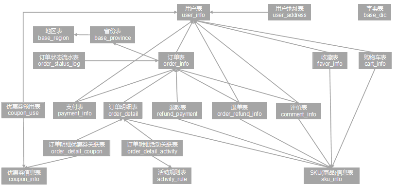
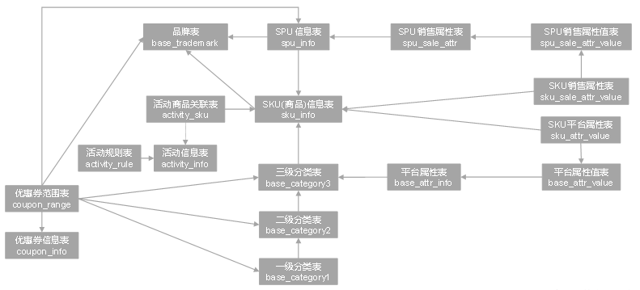
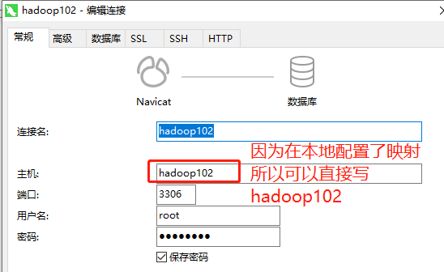
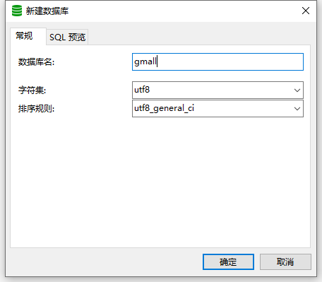
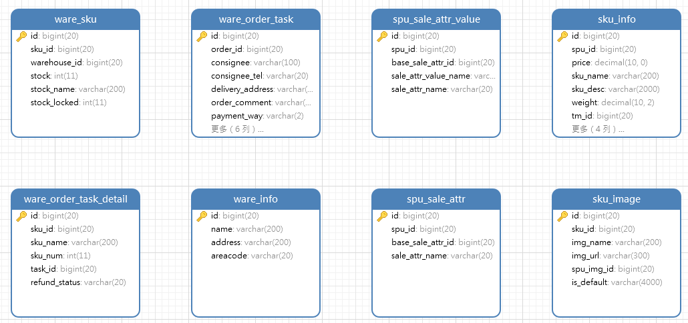
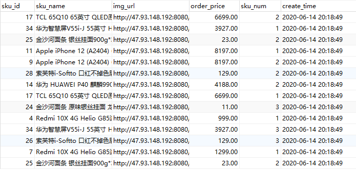

本节开始电商业务数据的采集！

# 一、电商业务简介

## 1、电商业务流程

电商的业务流程，其实就是我们用户到电商平台之后加入购物车呀、下订单呀、进行支付呀等等的操作，电商业务数据是要**被记录到数据库的！**也就是说：**在这个子项目中，要完成的工作就是把数据库的数据输出到HDFS里面**


如下图所示，这就是整个的一个电商业务流程，就是平常买东西后台的一系列记录到数据库的操作：


## 2、电商常识

做电商的项目肯定需要了解一点电商的一些基本常识：

### 2.1 SKU和SPU

- SKU（Stock Keeping Unit）：库存量基本单位
- SPU（Standard Product Unit）：商品信息聚合的最小单位

这专业术语，看了是真的懵逼，举个例子，比如说：我们想买一个IPhone13，一个手机对应的肯定有不同的颜色、型号之类的，那么这个IPhone13就是SPU，一台黑色的、128G内存的IPhone13就是SKU，如下图所示：


### 2.2  平台属性与销售属性

平台属性：


销售属性：


# 二、电商业务数据表结构


本次项目共有34张表（当然实际业务中可能有成百上千张表）；这34个表以订单表、用户表、SKU商品表、活动表和优惠券表为中心，延伸出了优惠券领用表、支付流水表、活动订单表、订单详情表、订单状态表、商品评论表、编码字典表退单表、SPU商品表等，用户表提供用户的详细信息，支付流水表提供该订单的支付详情，订单详情表提供订单的商品数量等情况，商品表给订单详情表提供商品的详细信息。


关于用户和订单的表之间的联系：




关于商品表之间的联系：




因为表比较多，这里就不贴出来所有表的样子了，先看下一部分的内容，下一部分生成每个表的数据！


# 三、模拟生成业务数据

上面的电商数据应该存储在MySQL或其他关系型数据库里面的，本次项目所有表的数据都存储在`MySQL`数据库

所以在开始本节内容之前应该确保你的三台集群装的有`MySQL`，[如果没装MySQL读者可以点击我查看怎么装！](https://github.com/wzqwtt/BigData/blob/main/Hive/2%E3%80%81Hive%E5%AE%89%E8%A3%85%E9%83%A8%E7%BD%B2%E5%B9%B6%E6%9B%BF%E6%8D%A2derby%E4%B8%BAMySQL.md#%E4%BA%8C%E5%AE%89%E8%A3%85mysql)

现在我们可以打开本地的数据库连接工具（我用的是Navicat，sqlyog等其他的也可以），然后连接到`hadoop102`主机的MySQL：




然后新建一个数据库`gmall`，选择编码为`utf-8`，排序规则为：`utf8_general_ci`



然后导入该项目数据库结构脚本（gmall.sql），[该文件点我前去下载](./resource/gmall.sql)，创建完成之后如下图所示：（表太多了，下图只展示部分）




[读者可以点击这串文字去下载生成业务数据的jar包](./resource/模拟生成业务数据)，下载完成打开虚拟机，来到`/opt/module/`目录下，新建一个`db_log`目录，这个目录就是放生成业务数据的jar包的：

```bash
[wzq@hadoop102 ~]$ cd /opt/module/
[wzq@hadoop102 module]$ mkdir db_log
[wzq@hadoop102 module]$ cd db_log/
[wzq@hadoop102 db_log]$ ll
总用量 15288
-rw-r--r--. 1 wzq wzq     1792 5月  18 19:57 application.properties
-rw-r--r--. 1 wzq wzq 15648406 5月  18 19:57 gmall2020-mock-db-2021-11-14.jar
```

两个文件，一个是jar包用以生成业务数据，另外一个是配置文件，打开这个配置文件：

```properties
spring.datasource.driver-class-name=com.mysql.jdbc.Driver
spring.datasource.url=jdbc:mysql://hadoop102:3306/gmall?useUnicode=true&characterEncoding=utf-8&useSSL=false&serverTimezone=GMT%2B8
# 记得改连接数据库用户名和密码，还有上面的连接
spring.datasource.username=root	
spring.datasource.password=root

#业务日期
mock.date=2020-06-14
#是否重置，首日须置为1，之后置为0
mock.clear=1
#是否重置用户，首日须置为1，之后置为0
mock.clear.user=1

# ......还有许多配置不用管，上面的是比较重要的几个配置
```


运行这个jar包，就可以帮助我们生成`2020-06-14`日数据：

```bash
[wzq@hadoop102 db_log]$ java -jar gmall2020-mock-db-2021-11-14.jar
```

打开数据库的某个表就可以看到数据生成了！





# 参考资料


- [尚硅谷电商数仓V5.0学习视频](https://www.bilibili.com/video/BV1nf4y1F7Bn)


