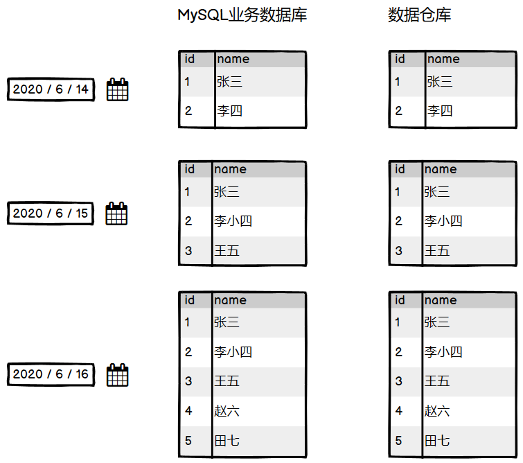
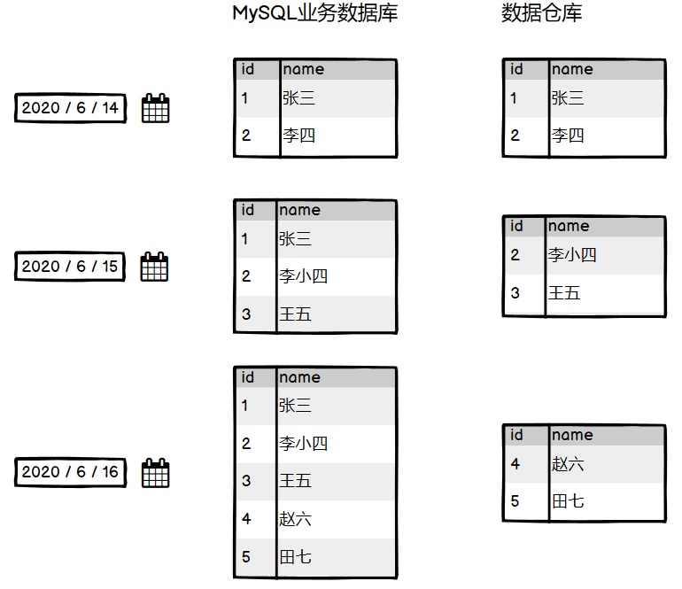

# 一、数据同步策略

业务数据是数仓的重要数据来源，需要每天定时的从业务数据库里面拉取数据到数据仓库里面，之后再进行分析统计

数据的同步策略分为：**全量同步**和**增量同步**

## 1.1 全量同步

对于全量同步，就是每天都把业务数据库中的每个表的所有数据都同步到数仓里面，如下图所示：

共有三天的数据，每天的数仓和MySQL的数据都保持一模一样，这就是全量同步，这种全量同步明显效率低，需要同步的数据太多了，不适合大型数据，但是优点就是逻辑比较简单

## 1.2 增量同步

增量同步，就是只将每天**新增的或变化**的数据同步到数据仓库（如下图所示），对于需要进行增量同步的表，在第一条通常需要进行一次全量同步

共有三天的数据，增量同步只同步修改过的和新增的数据

# 二、数据同步策略的选择

全量和增量同步各有优缺点：

| **同步策略** | **优点**                       | **缺点**                                                     |
| ------------ | ------------------------------ | ------------------------------------------------------------ |
| **全量同步** | 逻辑简单                       | 在某些情况下效率较低。例如某张表数据量较大，但是每天数据的变化比例很低，若对其采用每日全量同步，则会重复同步和存储大量相同的数据。 |
| **增量同步** | 效率高，无需同步和存储重复数据 | 逻辑复杂，需要将每日的新增及变化数据同原来的数据进行整合，才能使用 |

对于本项目而言，我们有大表也有小表，两种同步的方法我们都需要用到，下图是采用全量和增量的表：

对于`cart_info`表既需要全量同步也需要进行增量同步，这里暂不解释为什么

# 三、有哪些数据同步工具？

数据同步工具种类繁多，大致可分为两类，一类是以DataX、Sqoop为代表的基于Select查询的离线、批量同步工具，另一类是以Maxwell、Canal为代表的基于数据库数据变更日志（例如MySQL的binlog，其会实时记录所有的insert、update以及delete操作）的实时流式同步工具。

全量同步通常使用DataX、Sqoop等基于查询的离线同步工具。而增量同步既可以使用DataX、Sqoop等工具，也可使用Maxwell、Canal等工具，下面对增量同步不同方案进行简要对比。

| **增量同步方案**   | **DataX / Sqoop**                                            | **Maxwell / Canal**                                          |
| ------------------ | ------------------------------------------------------------ | ------------------------------------------------------------ |
| **对数据库的要求** | 原理是基于查询，故若想通过select查询获取新增及变化数据，就要求数据表中存在create_time、update_time等字段，然后根据这些字段获取变更数据。 | 要求数据库记录变更操作，例如MySQL需开启binlog。              |
| **数据的中间状态** | 由于是离线批量同步，故若一条数据在一天中变化多次，该方案只能获取最后一个状态，中间状态无法获取。 | 由于是实时获取所有的数据变更操作，所以可以获取变更数据的所有中间状态。 |

在本项目中，全量同步采用`DataX`，增量同步采用`Maxwell`

# 参考资料

- [尚硅谷电商数仓V5.0学习视频](https://www.bilibili.com/video/BV1nf4y1F7Bn)