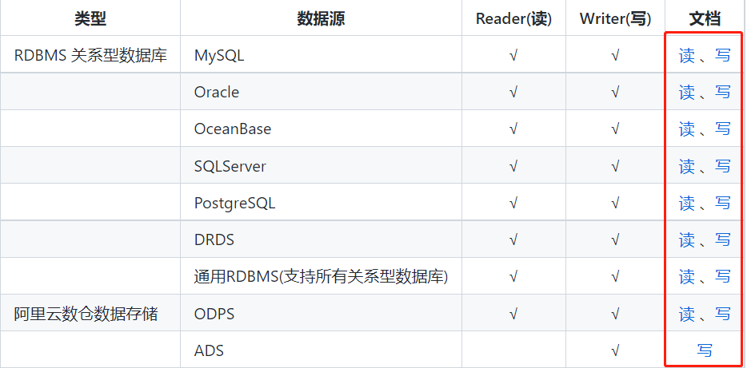
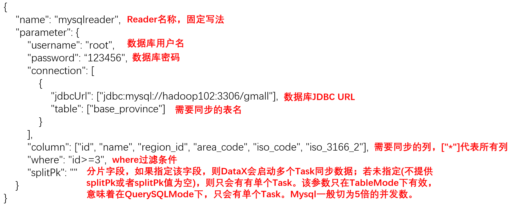
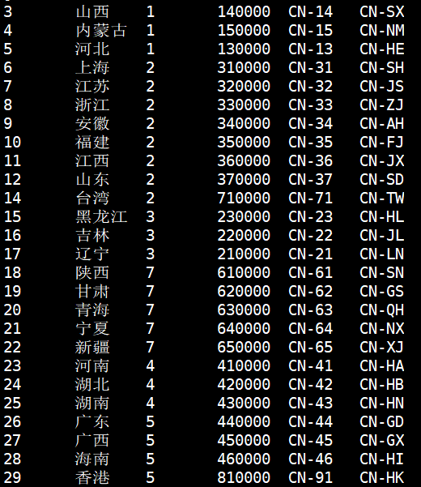
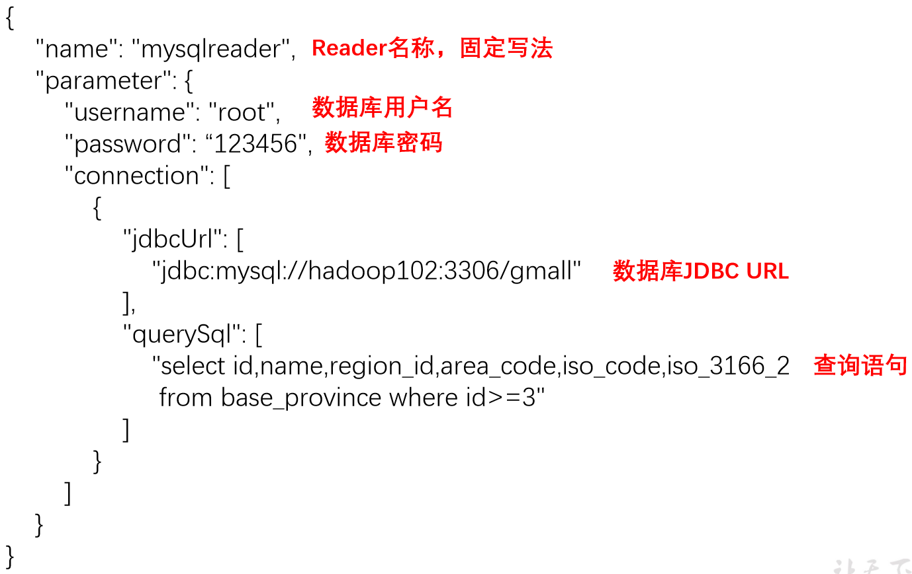
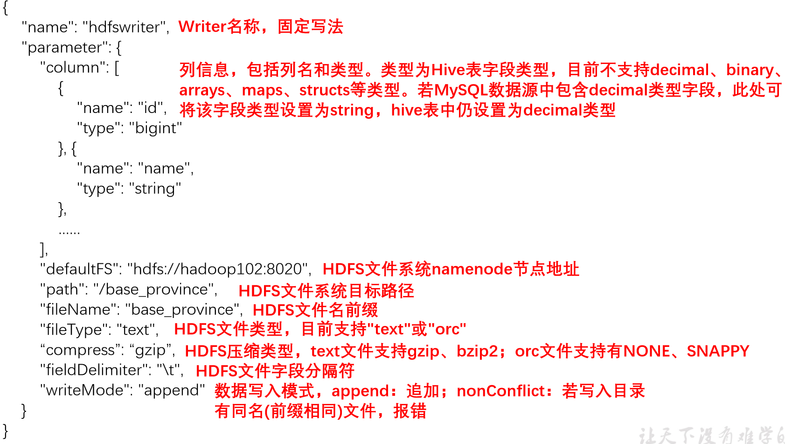
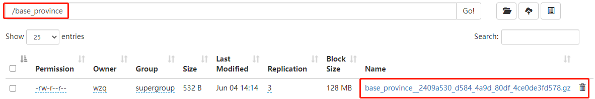
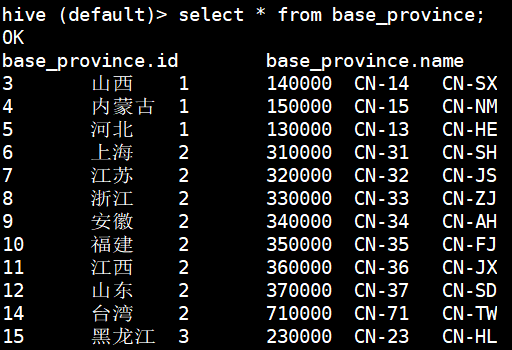
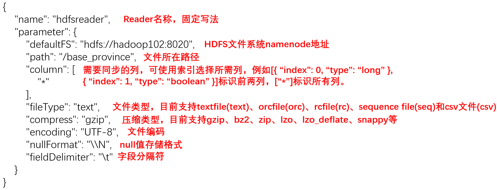
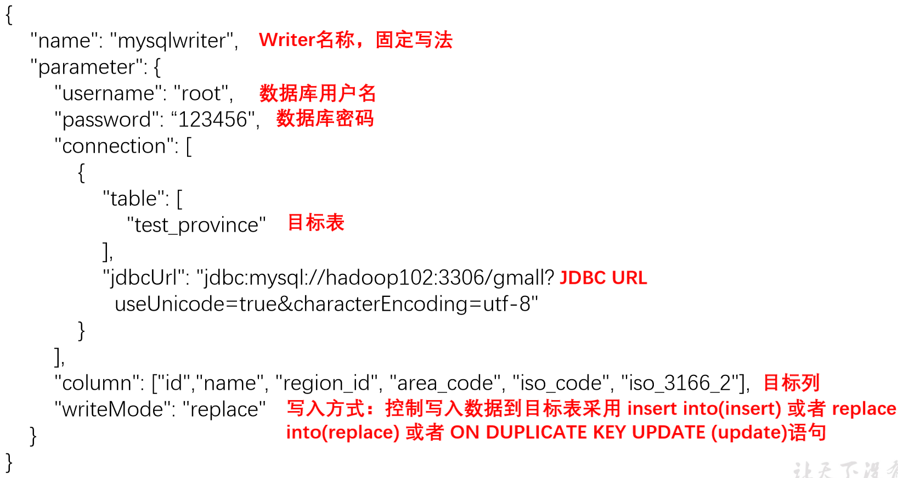
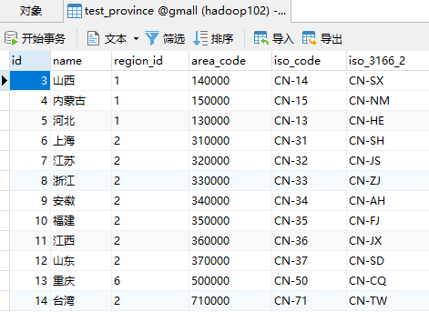

`DataX`其实是有中文文档的，而且写的也比较详细（[可以直接访问DataX的GitHub地址](https://github.com/alibaba/DataX)）。基于本项目的需要这里仅介绍DataX的MySQL和HDFS的读写组件！其实会了一个组件之后其他的组件也都会了……，OK！下面开始吧！


# 一、DataX介绍


## 1、简介

`DataX`是阿里开源的一个异构数据源离线同步工具，致力于实现包括关系型数据库(MySQL、Oracle等)、HDFS、Hive、ODPS、HBase、FTP等各种异构数据源之间稳定高效的数据同步功能。

**本项目使用DataX做表的全量同步**


目前DataX支持的数据源有很多：（还是非常全面的）

| 类型               | 数据源                          | Reader(读) | Writer(写) | 文档                                                         |
| ------------------ | ------------------------------- | ---------- | ---------- | ------------------------------------------------------------ |
| RDBMS 关系型数据库 | MySQL                           | √          | √          | [读](https://github.com/alibaba/DataX/blob/master/mysqlreader/doc/mysqlreader.md) 、[写](https://github.com/alibaba/DataX/blob/master/mysqlwriter/doc/mysqlwriter.md) |
|                    | Oracle                          | √          | √          | [读](https://github.com/alibaba/DataX/blob/master/oraclereader/doc/oraclereader.md) 、[写](https://github.com/alibaba/DataX/blob/master/oraclewriter/doc/oraclewriter.md) |
|                    | OceanBase                       | √          | √          | [读](https://open.oceanbase.com/docs/community/oceanbase-database/V3.1.0/use-datax-to-full-migration-data-to-oceanbase) 、[写](https://open.oceanbase.com/docs/community/oceanbase-database/V3.1.0/use-datax-to-full-migration-data-to-oceanbase) |
|                    | SQLServer                       | √          | √          | [读](https://github.com/alibaba/DataX/blob/master/sqlserverreader/doc/sqlserverreader.md) 、[写](https://github.com/alibaba/DataX/blob/master/sqlserverwriter/doc/sqlserverwriter.md) |
|                    | PostgreSQL                      | √          | √          | [读](https://github.com/alibaba/DataX/blob/master/postgresqlreader/doc/postgresqlreader.md) 、[写](https://github.com/alibaba/DataX/blob/master/postgresqlwriter/doc/postgresqlwriter.md) |
|                    | DRDS                            | √          | √          | [读](https://github.com/alibaba/DataX/blob/master/drdsreader/doc/drdsreader.md) 、[写](https://github.com/alibaba/DataX/blob/master/drdswriter/doc/drdswriter.md) |
|                    | 通用RDBMS(支持所有关系型数据库) | √          | √          | [读](https://github.com/alibaba/DataX/blob/master/rdbmsreader/doc/rdbmsreader.md) 、[写](https://github.com/alibaba/DataX/blob/master/rdbmswriter/doc/rdbmswriter.md) |
| 阿里云数仓数据存储 | ODPS                            | √          | √          | [读](https://github.com/alibaba/DataX/blob/master/odpsreader/doc/odpsreader.md) 、[写](https://github.com/alibaba/DataX/blob/master/odpswriter/doc/odpswriter.md) |
|                    | ADS                             |            | √          | [写](https://github.com/alibaba/DataX/blob/master/adswriter/doc/adswriter.md) |
|                    | OSS                             | √          | √          | [读](https://github.com/alibaba/DataX/blob/master/ossreader/doc/ossreader.md) 、[写](https://github.com/alibaba/DataX/blob/master/osswriter/doc/osswriter.md) |
|                    | OCS                             |            | √          | [写](https://github.com/alibaba/DataX/blob/master/ocswriter/doc/ocswriter.md) |
| NoSQL数据存储      | OTS                             | √          | √          | [读](https://github.com/alibaba/DataX/blob/master/otsreader/doc/otsreader.md) 、[写](https://github.com/alibaba/DataX/blob/master/otswriter/doc/otswriter.md) |
|                    | Hbase0.94                       | √          | √          | [读](https://github.com/alibaba/DataX/blob/master/hbase094xreader/doc/hbase094xreader.md) 、[写](https://github.com/alibaba/DataX/blob/master/hbase094xwriter/doc/hbase094xwriter.md) |
|                    | Hbase1.1                        | √          | √          | [读](https://github.com/alibaba/DataX/blob/master/hbase11xreader/doc/hbase11xreader.md) 、[写](https://github.com/alibaba/DataX/blob/master/hbase11xwriter/doc/hbase11xwriter.md) |
|                    | Phoenix4.x                      | √          | √          | [读](https://github.com/alibaba/DataX/blob/master/hbase11xsqlreader/doc/hbase11xsqlreader.md) 、[写](https://github.com/alibaba/DataX/blob/master/hbase11xsqlwriter/doc/hbase11xsqlwriter.md) |
|                    | Phoenix5.x                      | √          | √          | [读](https://github.com/alibaba/DataX/blob/master/hbase20xsqlreader/doc/hbase20xsqlreader.md) 、[写](https://github.com/alibaba/DataX/blob/master/hbase20xsqlwriter/doc/hbase20xsqlwriter.md) |
|                    | MongoDB                         | √          | √          | [读](https://github.com/alibaba/DataX/blob/master/mongodbreader/doc/mongodbreader.md) 、[写](https://github.com/alibaba/DataX/blob/master/mongodbwriter/doc/mongodbwriter.md) |
|                    | Hive                            | √          | √          | [读](https://github.com/alibaba/DataX/blob/master/hdfsreader/doc/hdfsreader.md) 、[写](https://github.com/alibaba/DataX/blob/master/hdfswriter/doc/hdfswriter.md) |
|                    | Cassandra                       | √          | √          | [读](https://github.com/alibaba/DataX/blob/master/cassandrareader/doc/cassandrareader.md) 、[写](https://github.com/alibaba/DataX/blob/master/cassandrawriter/doc/cassandrawriter.md) |
| 无结构化数据存储   | TxtFile                         | √          | √          | [读](https://github.com/alibaba/DataX/blob/master/txtfilereader/doc/txtfilereader.md) 、[写](https://github.com/alibaba/DataX/blob/master/txtfilewriter/doc/txtfilewriter.md) |
|                    | FTP                             | √          | √          | [读](https://github.com/alibaba/DataX/blob/master/ftpreader/doc/ftpreader.md) 、[写](https://github.com/alibaba/DataX/blob/master/ftpwriter/doc/ftpwriter.md) |
|                    | HDFS                            | √          | √          | [读](https://github.com/alibaba/DataX/blob/master/hdfsreader/doc/hdfsreader.md) 、[写](https://github.com/alibaba/DataX/blob/master/hdfswriter/doc/hdfswriter.md) |
|                    | Elasticsearch                   |            | √          | [写](https://github.com/alibaba/DataX/blob/master/elasticsearchwriter/doc/elasticsearchwriter.md) |
| 时间序列数据库     | OpenTSDB                        | √          |            | [读](https://github.com/alibaba/DataX/blob/master/opentsdbreader/doc/opentsdbreader.md) |
|                    | TSDB                            | √          | √          | [读](https://github.com/alibaba/DataX/blob/master/tsdbreader/doc/tsdbreader.md) 、[写](https://github.com/alibaba/DataX/blob/master/tsdbwriter/doc/tsdbhttpwriter.md) |
|                    | TDengine                        | √          | √          | [读](https://github.com/taosdata/DataX/blob/master/tdenginereader/doc/tdenginereader.md) 、[写](https://github.com/taosdata/DataX/blob/master/tdenginewriter/doc/tdenginewriter-CN.md) |


## 2、设计理念

DataX致力于异构数据源的同步，目前数据源非常多，比如说MySQL、Oracle、HDFS等，如果我们想同步MySQL到Oracle，我们就需要专门写代码桥接这两个部分，这时候我又想把MySQL数据同步到HDFS，又需要写这两个部分连接同步的代码；如果想把Oracle同步到HDFS又需求重新写。

这样实在是太麻烦了，我们需要对每个数据源之间建立连接写专门的代码。所以DataX设计的就很巧妙直接在中间建立连接的部分，并作一些数据的格式化，再转交给其他数据源，这样就避免了写重复的代码，架构如下图所示：


## 3、框架设计

DataX和Flume一样有三大组件（名字不同，内部执行原理可能也不同，但意思一样），如下图所示：


首先DataX采用`Framework + plugin`模式，将数据源读取和写入抽象成为`Reader`和`Writer`插件，然后纳入整个同步框架中：

- `Reader`：数据采集模块，负责采集数据源的数据，并将数据发送给`Framework`
- `FrameWork`：用于连接`Reader`和`Writer`模块，作为两者的数据传输通道，并处理缓冲、流控、并发、数据转换等核心技术问题
- `Writer`：数据写入模块，不断的向`FrameWork`取数据，并将数据写入到目的地数据源


## 4、运行流程

下图为DataX运行流程：


- `Job`：单个数据同步的作业，称为一个Job，一个Job启动一个进程
- `Task`：根据不同数据源的切分策略，一个Job会切分为多个`Task`，`Task`是DataX作业的最小单元，每个`Task`负责一部分数据的同步工作
- `TaskGroup`：调度模块会对Task进行分组，每个Task组称为一个Task Group，每个Task Group负责以一定的并发度运行其所分得的Task，单个Task Group得并发度为5
- `Reader -> Channel -> Writer`：每个Task启动后，都会固定启动`Reader -> Channel -> Writer`得线程来完成同步工作


## 5、调度思路

举例来说，用户提交了一个DataX作业，并且配置了总的并发度为20，目的是对一个有100张分表的mysql数据源进行同步。DataX的调度决策思路是：

1）DataX Job根据分库分表切分策略，将同步工作分成100个Task。

2）根据配置的总的并发度20，以及每个Task Group的并发度5，DataX计算共需要分配4个TaskGroup。

3）4个TaskGroup平分100个Task，每一个TaskGroup负责运行25个Task。


## 6、DataX与Sqoop对比

| **功能** | **DataX**                    | **Sqoop**                    |
| -------- | ---------------------------- | ---------------------------- |
| 运行模式 | 单进程多线程                 | MR                           |
| 分布式   | 不支持，可以通过调度系统规避 | 支持                         |
| 流控     | 有流控功能                   | 需要定制                     |
| 统计信息 | 已有一些统计，上报需定制     | 没有，分布式的数据收集不方便 |
| 数据校验 | 在core部分有校验功能         | 没有，分布式的数据收集不方便 |
| 监控     | 需要定制                     | 需要定制                     |


# 二、部署DataX

DataX目前开源的只有一个版本，可以访问下面的地址下载：（有800多兆）

http://datax-opensource.oss-cn-hangzhou.aliyuncs.com/datax.tar.gz


下载完成之后打开虚拟机，上传到`/opt/software`目录，然后解压到`/opt/module`目录：

```bash
[wzq@hadoop102 software]$ tar -zxvf datax.tar.gz -C /opt/module/
[wzq@hadoop102 software]$ cd /opt/module/datax
[wzq@hadoop102 datax]$ ll
总用量 4
drwxr-xr-x. 2 wzq wzq  118 6月   3 20:06 bin
drwxr-xr-x. 2 wzq wzq  136 6月   3 20:09 conf
drwxr-xr-x. 2 wzq wzq   40 6月   3 20:20 job
drwxr-xr-x. 2 wzq wzq 4096 6月   3 20:05 lib
drwxr-xr-x. 5 wzq wzq   60 6月   3 20:07 log
drwxr-xr-x. 5 wzq wzq   60 6月   3 20:07 log_perf
drwxr-xr-x. 4 wzq wzq   66 6月   3 20:05 plugin
drwxr-xr-x. 2 wzq wzq   42 6月   3 20:05 script
drwxr-xr-x. 2 wzq wzq   44 10月 12 2019 tmp
```


然后运行以下命令，出现下面的内容则说明部署成功：（**往下看一点，有坑！**）

```bash
# 这里是python脚本，使用Linux自带的python就好
[wzq@hadoop102 datax]$ python bin/datax.py job/job.json
```

运行结果：

```bash
任务启动时刻                    : 2022-06-03 20:28:09
任务结束时刻                    : 2022-06-03 20:28:19
任务总计耗时                    :                 10s
任务平均流量                    :          253.91KB/s
记录写入速度                    :          10000rec/s
读出记录总数                    :              100000
读写失败总数                    :                   0
```


> 注意！这里需要删除一些文件才能正常运行：
>
> ```bash
> [wzq@hadoop102 datax]$ cd plugin/reader
> [wzq@hadoop102 reader]$ rm -rf ._*
> [wzq@hadoop102 reader]$ cd ../writer
> [wzq@hadoop102 writer]$ rm -rf ._*
> ```
>
> 这些个文件不删会报错！


# 三、DataX的基本使用

## 1、DataX使用概述

### 1.1 提交任务命令

DataX的使用非常简单，只需要写好配置文件，然后执行以下命令就可以完成数据同步：

```bash
# 注意路径！在datax目录下
[wzq@hadoop102 datax]$ python bin/datax.py job/path/job.json
```

- `bin/datax.py`：执行任务的脚本
- `job/path/job.json`：用户写的配置文件，一般放在`job`目录下


### 1.2 配置文件格式

配置文件是一个`JSON`格式的文件，如下面的结构所示：


整个配置文件最外层是一个`job`，然后里面是`content`和`setting`，`content`里面又包含`reader`和`writer`

对于这些配置文件的模板，DataX官方对每个数据源提供的都有配置文件模板，可以点击下图的按钮直达：




## 2、案例：同步MySQL数据到HDFS

**案例需求：**在[上上节](./4、模拟生成电商业务数据.md)中我们已经把电商的34张表导入到MySQL数据库了，在本节任务就是：把`gmall`数据库的`base_province`表里面的内容同步到HDFS上

其中`MySQL Reader`有两种模式，分别是：

- `QueryMode`：使用table、column、where等属性声明需要同步的数据
- `QuerySQLMode`：仅需要声明一句SQL查询语句就可以同步数据了

本案例两种模式都将使用一下：

> 关于Reader和Writer如何编写，读者都可以到DataX GitHub官方仓库参照配置文件，写的非常全面！

### 2.1 MySQL QueryMode模式

首先创建一个配置文件吧：

```bash
[wzq@hadoop102 datax]$ vim job/base_province.json
```

配置文件就写下面的：

```json
{
    "job": {
        "setting": {
            "speed": {
                "channel": 1
            }
        },
        "content": [{
            "reader": {
                "name": "mysqlreader",
                "parameter": {
                    "username": "root",
                    "password": "root",
                    "column": ["id", "name", "region_id", "area_code", "iso_code", "iso_3166_2"],
                    "where": "id >= 3",
                    "splitPk": "",
                    "connection": [{
                        "table": ["base_province"],
                        "jdbcUrl": ["jdbc:mysql://hadoop102:3306/gmall"]
                    }]
                }
            },
            "writer": {
                "name": "streamwriter",
                "parameter": {
                    "print": true
                }
            }
        }]
    }
}
```

关于`setting`部分的参数说明如下：（后面的容错比例配置上面没有配）


关于`Reader`部分的参数说明如下：



这里的`writer`使用的`streamwriter`模式，它可以直接输出到控制台，可以执行这个配置文件试一下效果，运行：

```bash
[wzq@hadoop102 datax]$ python bin/datax.py job/base_province.json
```

可以看到这个表`id>=3`的字段已经被输出到控制台了：




### 2.2 MySQL QuerySQLMode模式

MySQL的`Reader`还有一种`QuerySQLMode`模式，可以直接写SQL查询语句进行查询，但是缺点就是不能分割Task：

删除刚刚创建的配置文件的所有内容，写入下面的配置文件：

```json
{
    "job": {
        "setting": {
            "speed": {
                "channel": 1
            }
        },
        "content": [{
            "reader": {
                "name": "mysqlreader",
                "parameter": {
                    "username": "root",
                    "password": "root",
                    "connection": [{
                        "querySql": [
                            "select id, name, region_id, area_code, iso_code, iso_3166_2 from base_province where id >= 3;"
                        ],
                        "jdbcUrl": ["jdbc:mysql://hadoop102:3306/gmall"]
                    }]
                }
            },
            "writer": {
                "name": "streamwriter",
                "parameter": {
                    "print": true,
                    "encoding": "UTF-8"
                }
            }
        }]
    }
}
```

关于`Reader`的参数说明：



然后执行DataX可以得到和上面`QueryMode`模式一样的结果


### 2.3 HDFS Writer

现在我们已经完成了对MySQL两种模式的读取，现在开始写`HDFS Writer`

对刚刚的配置文件，删除原有的`streamwriter`，添加下面的`HDFS Writer`：

```json
"writer": {
    "name": "hdfswriter",
    "parameter": {
        "defaultFS": "hdfs://hadoop102:8020",
        "fileType": "text",
        "path": "/base_province",
        "fileName": "base_province",
        "column": [
            {
                "name" : "id",
                "type" : "bigint"
            },
            {
                "name" : "name",
                "type" : "string"
            },
            {
                "name" : "region_id",
                "type" : "string"
            },
            {
                "name" : "area_code",
                "type" : "string"
            },
            {
                "name" : "iso_code",
                "type" : "string"
            },
            {
                "name" : "iso_3166_2",
                "type" : "string"
            }
        ],
        "writeMode": "append",
        "fieldDelimiter": "\t",
        "compress": "gzip"
    }
}
```


关于`HDFS Writer`的参数说明：




注意：使用DataX传输数据到`HDFS`，目的地路径必须在HDFS上存在，否则会报错，所以在开始之前需要先创建该文件夹：

```bash
# 启动Hadoop
[wzq@hadoop102 ~]$ myhadoop.sh start
 =================== 启动 hadoop 集群 ===================
 --------------- 启动 hdfs ---------------
Starting namenodes on [hadoop102]
Starting datanodes
Starting secondary namenodes [hadoop104]
 --------------- 启动 yarn ---------------
Starting resourcemanager
Starting nodemanagers
 --------------- 启动 historyserver ---------------
 
# 创建文件夹
[wzq@hadoop102 ~]$ hadoop fs -mkdir /base_province
```


这下我们就可以启动DataX了：

```bash
[wzq@hadoop102 ~]$ cd /opt/module/datax/
[wzq@hadoop102 datax]$ python bin/datax.py job/base_province.json
```

出现以下信息就是执行成功：

```bash
任务启动时刻                    : 2022-06-04 14:14:47
任务结束时刻                    : 2022-06-04 14:15:05
任务总计耗时                    :                 17s
任务平均流量                    :               66B/s
记录写入速度                    :              3rec/s
读出记录总数                    :                  32
读写失败总数                    :                   0
```

也可以去到HDFS上看一下：




> 现在这个文件是`gzip`类型的压缩数据，直接打开看是乱码，如果想查看这个文件，有以下两种方式：
>
> - 运行Hadoop的命令查看文件：
>
>   ```bash
>   [wzq@hadoop102 datax]$ hadoop fs -cat /base_province/* | zcat
>   2022-06-04 14:17:27,767 INFO sasl.SaslDataTransferClient: SASL encryption trust check: localHostTrusted = false, remoteHostTrusted = false
>   # 这里只截取了部分
>   3	山西	1	140000	CN-14	CN-SX
>   4	内蒙古	1	150000	CN-15	CN-NM
>   5	河北	1	130000	CN-13	CN-HE
>   6	上海	2	310000	CN-31	CN-SH
>   7	江苏	2	320000	CN-32	CN-JS
>   ```
>
> - 第二种方式就是在[Hive](https://github.com/wzqwtt/BigData#%E4%B8%89hive)上看了，首先启动Hive：
>
>   ```bash
>   [wzq@hadoop102 datax]$ hiveservices.sh start
>   # 启动Hive比较慢，需要等一下
>   [wzq@hadoop102 datax]$ hiveservices.sh status
>   Metastore服务运行正常
>   HiveServer2服务运行正常
>   ```
>
>   然后运行下面的SQL，创建表：
>
>   ```sql
>   drop table if exists base_province;
>   create external table base_province(
>   	id string comment '编号',
>   	name string comment '省份名称',
>   	region_id string comment '地区ID',
>   	area_code string comment '地区编码',
>   	iso_code string comment '旧版ISO-3166-2编码，供可视化使用',
>   	iso_3166_2 string comment '新版IOS-3166-2编码，供可视化使用'
>   ) comment '省份表'
>   row format delimited fields terminated by '\t'
>   null defined as ''
>   location '/base_province/';
>   ```
>
>   查看这个表：
>
>   ```sql
>   select * from base_province;
>   ```
>
>   


## 3、案例：同步HDFS数据到MySQL

这个案例就刚好跟上面的案例反过来，将HDFS的数据同步到MySQL


需求就是：把HDFS上的`/base_province`目录下的数据同步到MySQL下的`gmall`数据库下的`test_province`表

先来创建一个配置文件：`test_province.json`：

```json
{
    "job": {
        "setting": {
            "speed": {
                "channel": 1
            }
        },
        "content": [{
            "reader": {
                "name": "hdfsreader",
                "parameter": {
                    "path": "/base_province/*",
                    "defaultFS": "hdfs://hadoop102:8020",
                    "column": ["*"],
                    "fileType": "text",
                    "encoding": "UTF-8",
                    "fieldDelimiter": "\t",
                    "nullformat": "\\N",
                    "compress": "gzip"
                }
            },
            "writer": {
                "name": "mysqlwriter",
                "parameter": {
                    "writeMode": "replace",
                    "username": "root",
                    "password": "root",
                    "column": ["id", "name", "region_id", "area_code", "iso_code", "iso_3166_2"],
                    "connection": [{
                        "jdbcUrl": "jdbc:mysql://hadoop102:3306/gmall?useUnicode=true&characterEncoding=utf-8",
                        "table": ["test_province"]
                    }]
                }
            }
        }]
    }
}
```

关于`HDFS Reader`的参数说明：




关于`MySQL Writter`的参数说明：




在运行前，应该先在MySQL下gmall数据库创建test_province表：

```sql
DROP TABLE IF EXISTS `test_province`;
CREATE TABLE `test_province`  (
  `id` bigint(20) NOT NULL,
  `name` varchar(20) CHARACTER SET utf8 COLLATE utf8_general_ci NULL DEFAULT NULL,
  `region_id` varchar(20) CHARACTER SET utf8 COLLATE utf8_general_ci NULL DEFAULT NULL,
  `area_code` varchar(20) CHARACTER SET utf8 COLLATE utf8_general_ci NULL DEFAULT NULL,
  `iso_code` varchar(20) CHARACTER SET utf8 COLLATE utf8_general_ci NULL DEFAULT NULL,
  `iso_3166_2` varchar(20) CHARACTER SET utf8 COLLATE utf8_general_ci NULL DEFAULT NULL,
  PRIMARY KEY (`id`)
) ENGINE = InnoDB CHARACTER SET = utf8 COLLATE = utf8_general_ci ROW_FORMAT = Dynamic;
```


最后就可以运行DataX了：

```bash
[wzq@hadoop102 datax]$ python bin/datax.py job/test_province.json
```

出现下面的结果即为数据同步成功：

```bash
任务启动时刻                    : 2022-06-04 14:44:52
任务结束时刻                    : 2022-06-04 14:45:07
任务总计耗时                    :                 14s
任务平均流量                    :               66B/s
记录写入速度                    :              3rec/s
读出记录总数                    :                  32
读写失败总数                    :                   0
```

也可以到MySQL里面看一眼：





## 4、DataX传参

通常情况下，这种全量同步表需要每天定时重复执行，所以HDFS数据上面通常会包含一层日期，以日期对数据进行区分，也方便在Hive里面建立分区表，所以说每天同步到HDFS的数据的路径应该是动态的，所以需要用到DataX的传参功能


这里使用**同步MySQL数据到HDFS**这个案例，只需要在`HDFS Writer`的`path`里面添加一个`${参数}`就好了：

```json
"path": "/base_province/${dt}"
```

提交DataX任务的时候，只需要在命令行传递日期参数就可以了：

```bash
# 仍然需要在HDFS创建目录
[wzq@hadoop102 datax]$ hadoop fs -mkdir /base_province/2020-06-14
# 提交DataX任务
[wzq@hadoop102 datax]$ python bin/datax.py job/base_province.json -p"-Ddt=2020-06-14"
```


运行成功：

```bash
任务启动时刻                    : 2022-06-04 14:55:18
任务结束时刻                    : 2022-06-04 14:55:31
任务总计耗时                    :                 12s
任务平均流量                    :               66B/s
记录写入速度                    :              3rec/s
读出记录总数                    :                  32
读写失败总数                    :                   0
```


# 四、DataX优化


## 1、速度控制

DataX3.0 提供了包括通道(并发)、记录流、字节流三种流控模式，可以随意控制你的作业速度，让你的作业在数据库可以承受的范围内达到最佳的同步速度。


关键的优化参数如下：

| **参数**                                | **说明**                                            |
| --------------------------------------- | --------------------------------------------------- |
| **job.setting.speed.channel**           | 总并发数                                            |
| **job.setting.speed.record**            | 总record限速                                        |
| **job.setting.speed.byte**              | 总byte限速                                          |
| **core.transport.channel.speed.record** | 单个channel的record限速，默认值为10000（10000条/s） |
| **core.transport.channel.speed.byte**   | 单个channel的byte限速，默认值1024*1024（1M/s）      |

**注意事项：**

- 若配置了总record限速，则必须配置单个channel的record限速

- 若配置了总byte限速，则必须配置单个channe的byte限速

- 若配置了总record限速和总byte限速，channel并发数参数就会失效。因为配置了总record限速和总byte限速之后，实际channel并发数是通过计算得到的：

**计算公式为:**

```
min(总byte限速/单个channle的byte限速，总record限速/单个channel的record限速)
```


**配置示例：**

```json
{
    "core": {
        "transport": {
            "channel": {
                "speed": {
                    "byte": 1048576 //单个channel byte限速1M/s
                }
            }
        }
    },
    "job": {
        "setting": {
            "speed": {
                "byte" : 5242880 //总byte限速5M/s
            }
        },
        ...
    }
}
```


## 2、内存调整

当提升DataX Job内Channel并发数时，内存的占用会显著增加，因为DataX作为数据交换通道，在内存中会缓存较多的数据。例如Channel中会有一个Buffer，作为临时的数据交换的缓冲区，而在部分Reader和Writer的中，也会存在一些Buffer，为了防止OOM等错误，需调大JVM的堆内存。

建议将内存设置为4G或者8G，这个也可以根据实际情况来调整。

调整JVM xms xmx参数的两种方式：一种是直接更改datax.py脚本；另一种是在启动的时候，加上对应的参数，如下：

```
python datax/bin/datax.py --jvm="-Xms8G -Xmx8G" /path/to/your/job.json
```


# 参考资料

- [DataX GitHub地址](https://github.com/alibaba/DataX)
- [尚硅谷电商数仓V5.0学习视频](https://www.bilibili.com/video/BV1nf4y1F7Bn)