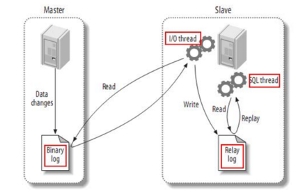
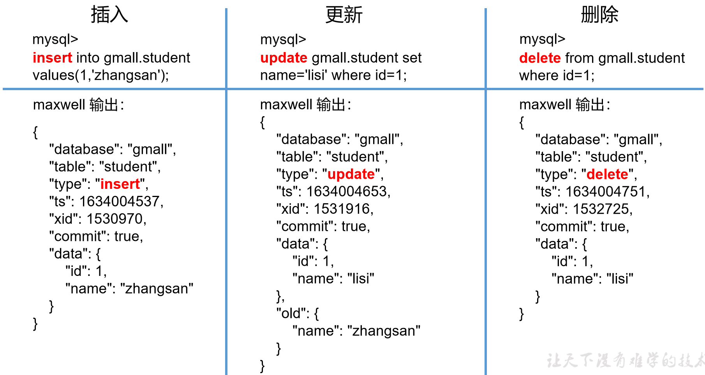
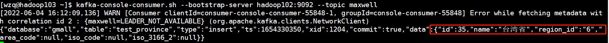

`Maxwell`可以监控MySQL数据库的变更（insert、update、delete），并将变更后的数据以`JSON`格式发送到`Kafka`等流处理平台，本项目使用`Maxwell`作为数据增量同步工具


# 一、Maxwell 介绍

## 1、Maxwell运行原理


MySQL有一个非常重要的日志`Binlog`，这个日志会保存MySQL数据库的所有数据变更记录，这个日志的主要作用就是主从复制和数据恢复，Maxwell的工作原理和主从复制密切相关


下面来看一下什么是MySQL的主从复制：

一般在实际应用中，MySQL一般有好几台主机，有的主机专门负责读，有的主机专门负责写，还有的主机负责做备份，每台主机之间实际上一种**主从**的形式，分别由Master和Slave，这种模式的工作原理如下图所示：



- Master主库将数据变更记录，写到二进制日志`binary log`（binlog）中
- Slave从库向Master发送dump协议，将master主库的`binary log events`拷贝到它的中继日志（`relay log`）
- Slave从库读取并回放中继日志中的事件，将改变的数据同步到自己的数据库


**Maxwell实质上就是将自己伪装成Slave，并遵循MySQL主从复制协议，从Master中同步数据，再把binlog中的日志数据转换为JSON文件发往Kafka等流处理平台**


## 2、Maxwell输出数据格式

数据库的变更无非只有：增、删、改这三种形式，Maxwell的输出文件（JSON）对应这三种格式的文件：




下表是对JSON文件中每个字段的说明：

| 字段     | 解释                                                         |
| -------- | ------------------------------------------------------------ |
| database | 变更数据所属的数据库                                         |
| table    | 表更数据所属的表                                             |
| **type** | 数据变更类型                                                 |
| **ts**   | 数据变更发生的时间 10位s，13位ms                             |
| xid      | 事务id                                                       |
| commit   | 事务提交标志，可用于重新组装事务                             |
| **data** | 对于insert类型，表示插入的数据；对于update类型，标识修改之后的数据；对于delete类型，表示删除的数据 |
| **old**  | 对于update类型，表示修改之前的数据，只包含变更字段           |


# 二、部署Maxwell

## 1、安装Maxwell

首先需要下载Maxwell安装包，基于本项目的需要：需要造不同日期的数据，但是Maxwell默认的日期是当前时间，不方便后续项目的需要，因此尚硅谷团队特别贴心的帮我们封装好了一个改过的Maxwell，下面是下载连接：

- 官方版本（实际项目使用）：https://github.com/zendesk/maxwell/releases
- 尚硅谷版：[./resource/maxwell-1.29.2.tar.gz](./resource/maxwell-1.29.2.tar.gz)


下载之后将安装包上传到hadoop102主机的`/opt/software`目录下，解压到`/opt/module`下，并更名为`maxwell`：

```bash
[wzq@hadoop102 ~]$ cd /opt/software/
# 上传到这个目录
[wzq@hadoop102 software]$ tar -zxvf maxwell-1.29.2.tar.gz -C /opt/module/
[wzq@hadoop102 software]$ cd /opt/module/
[wzq@hadoop102 module]$ mv maxwell-1.29.2/ maxwell
```


## 2、配置MySQL

### 2.1 启用MySQL Binlog

默认情况下MySQL的BinLog是不开启的，所以我们需要手动开启binlog

修改MySQL的配置文件`/etc/my.cnf`：

```bash
[wzq@hadoop102 module]$ sudo vim /etc/my.cnf
```

添加下面的配置到这个文件末尾：

```
[mysqld]

#数据库id
server-id = 1
#启动binlog，该参数的值会作为binlog的文件名
log-bin=mysql-bin
#binlog类型，maxwell要求为row类型
binlog_format=row
#启用binlog的数据库，需根据实际情况作出修改
binlog-do-db=gmall
```

最后一步就是重启MySQL使Binlog生效了：

```bash
[wzq@hadoop102 module]$ sudo systemctl restart mysqld
```

### 2.2 创建Maxwell所需数据库和用户

Maxwell在运行的时候需要在MySQL中存储一些所需的数据，包括binlog同步的断点位置（断点续传）等，所以需要在MySQL里面创建对应的数据库和用户：

打开MySQL：

```bash
[wzq@hadoop102 module]$ mysql -uroot -proot
```

**创建数据库：**

```sql
mysql> create database maxwell;
```

**创建Maxwell用户并赋予权限：**

```sql
mysql> use mysql;

# 调整MySQL数据库密码级别
mysql> set global validate_password_policy=0;
mysql> set global validate_password_length=4;

# 创建用户赋予权限
mysql> CREATE USER 'maxwell'@'%' IDENTIFIED BY 'maxwell';
mysql> GRANT ALL ON maxwell.* TO 'maxwell'@'%';
mysql> GRANT SELECT, REPLICATION CLIENT, REPLICATION SLAVE ON *.* TO 'maxwell'@'%';
```


## 3、配置Maxwell

然后就是配置Maxwell，到maxwell的安装目录，修改配置文件：

```bash
[wzq@hadoop102 module]$ cd maxwell/
[wzq@hadoop102 maxwell]$ cp config.properties.example config.properties
# 修改配置文件
[wzq@hadoop102 maxwell]$ vim config.properties
```

写入以下内容：（这里配置Maxwell和Kafka连接）

```bash
log_level=info

#Maxwell数据发送目的地，可选配置有stdout|file|kafka|kinesis|pubsub|sqs|rabbitmq|redis
producer=kafka
#目标Kafka集群地址
kafka.bootstrap.servers=hadoop102:9092,hadoop103:9092,hadoop104:9092
#目标Kafka topic，可静态配置，例如:maxwell，也可动态配置，例如：%{database}_%{table}
kafka_topic=maxwell

#MySQL相关配置
host=hadoop102
user=maxwell
password=maxwell
jdbc_options=useSSL=false&serverTimezone=Asia/Shanghai
```

这就算配置完成了，接下来看看咋用Maxwell


# 三、如何使用Maxwell？

首先我们先启动Kafka：

```bash
# 启动Kafka需要启动zookeeper
[wzq@hadoop102 maxwell]$ zk.sh start
[wzq@hadoop102 maxwell]$ kf.sh start
```

## 1、Maxwell启停

Maxwell是一个服务，只要配置的数据库有变更，这里就会同步过来转换为JSON发到Kafka里，所以启动之后不用做什么事情，都是在后台运行的：

**启动Maxwell：**

```bash
[wzq@hadoop102 maxwell]$ bin/maxwell --config config.properties --daemon
Redirecting STDOUT to /opt/module/maxwell/bin/../logs/MaxwellDaemon.out
Using kafka version: 1.0.0
```

现在我们在hadoop103上监听maxwell topic，然后修改一波数据库内容，看一看：



Kafka这里已经收到信息了！

**停止Maxwell：**

```bash
[wzq@hadoop102 maxwell]$ ps -ef | grep maxwell | grep -v grep | grep maxwell | awk '{print $2}' | xargs kill -9
```


所以可以写一个`Maxwell`的启停脚本了：（[完整脚本在这个路径](./resource/mxw.sh)）

```bash
[wzq@hadoop102 maxwell]$ cd ~/bin/
[wzq@hadoop102 bin]$ vim mxw.sh
```

填入以下内容：

```bash
#!/bin/bash

MAXWELL_HOME=/opt/module/maxwell

status_maxwell(){
    result=`ps -ef | grep maxwell | grep -v grep | wc -l`
    return $result
}


start_maxwell(){
    status_maxwell

    if [[ $? -lt 1 ]]; then
        echo "========================= 启动Maxwell ========================="
        $MAXWELL_HOME/bin/maxwell --config $MAXWELL_HOME/config.properties --daemon
    else
        echo "Maxwell 正在运行"
    fi        
}

stop_maxwell(){
    status_maxwell

    if [[ $? -gt 0 ]]; then
        echo "========================= 停止Maxwell ========================="
        ps -ef | grep maxwell | grep -v grep | awk '{ print $2 }' | xargs kill -9
    else
        echo "Maxwell 没有在运行"        
    fi
}


case $1 in
"start"){
    start_maxwell
}
;;
"stop"){
    stop_maxwell
}
;;
"restart"){
    stop_maxwell
    start_maxwell
}
;;
*){
    echo "Input Args Error! Args: start \ stop \ restart "
}
;;
esac
```


然后赋予这个文件可执行权限：

```bash
[wzq@hadoop102 bin]$ chmod +x mxw.sh
```


## 2、全量数据同步

在启动Maxwell底下，已经演示过了增量数据同步，但是有时候只有增量同步的功能是不够的，所以可以使用`bootstrap`命令做历史数据的全量同步：

```bash
[wzq@hadoop102 maxwell]$ bin/maxwell-bootstrap --database gmall --table user_info --config config.properties
```


bootstrap形式的数据格式：

```json
{
    "database": "fooDB",
    "table": "barTable",
    "type": "bootstrap-start",
    "ts": 1450557744,
    "data": {}
}
{
    "database": "fooDB",
    "table": "barTable",
    "type": "bootstrap-insert",
    "ts": 1450557744,
    "data": {
        "txt": "hello"
    }
}
{
    "database": "fooDB",
    "table": "barTable",
    "type": "bootstrap-insert",
    "ts": 1450557744,
    "data": {
        "txt": "bootstrap!"
    }
}
{
    "database": "fooDB",
    "table": "barTable",
    "type": "bootstrap-complete",
    "ts": 1450557744,
    "data": {}
}
```

**需要注意的是：**

- 第一条type为bootstrap-start和最后一条type为bootstrap-complete的数据，是bootstrap开始和结束的标志，不包含数据，中间的type为bootstrap-insert的数据才包含数据。

- 一次bootstrap输出的所有记录的ts都相同，为bootstrap开始的时间。


# 参考资料

- [Maxwell 官方文档](https://maxwells-daemon.io/)
- [尚硅谷电商数仓V5.0学习视频](https://www.bilibili.com/video/BV1nf4y1F7Bn)