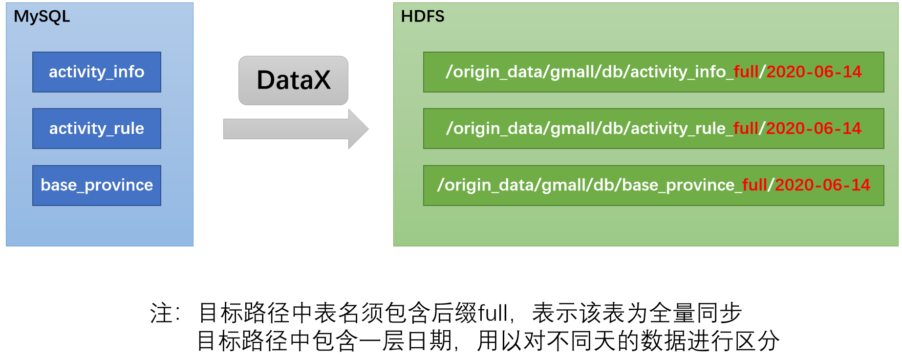
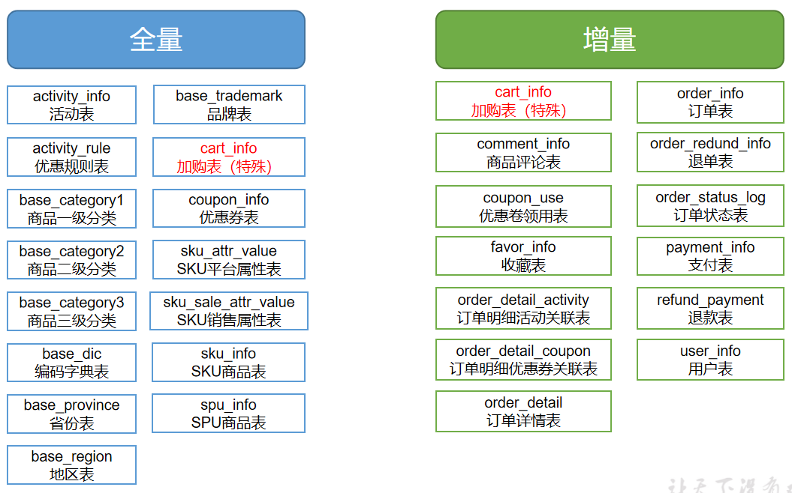
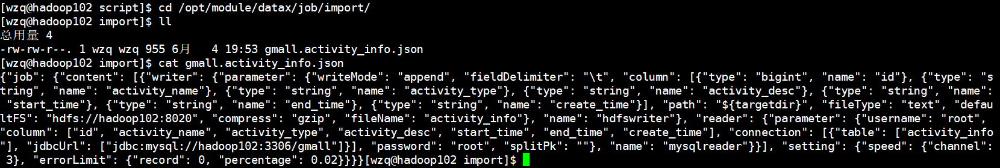
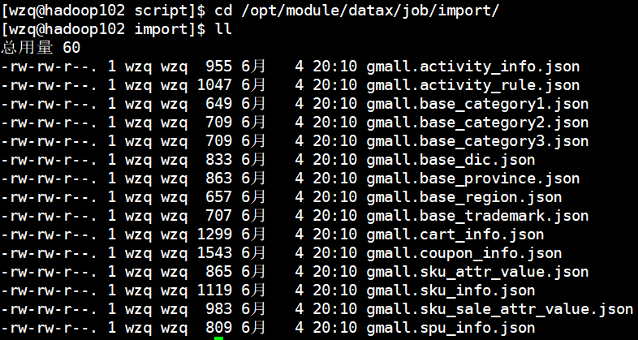
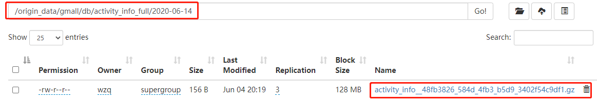

本篇正式开始用户业务数据采集，在数据全量同步中使用DataX，把MySQL的数据同步到HDFS；在数据增量同步中，使用Maxwell把数据传输到Kafka，再使用Flume读取Kafka的Topic，传递到HDFS。

在开始之前需要会的有：

- [数据全量同步工具DataX的使用](./6、一文学会DataX.md)
- [数据增量同步工具Maxwell的使用](./7、数据增量同步工具Maxwell.md)

本节先做全量同步

# 一、数据通道

全量表的同步使用DataX，就是把MySQL的数据同步到HDFS，如下图所示：



对于全量表每个HDFS文件后面都加一个`full`表示全量表


在[全量同步？增量同步？都是什么？](./5、全量同步与增量同步.md)中，介绍了需要全量同步的表有哪些，如下图所示：




这节的任务就是把全量表的这边都给同步到HDFS


# 二、DataX配置文件生成脚本

既然使用DataX，我们就需要为每张表都写一个DataX配置文件，在[数据全量同步工具DataX的使用](./6、一文学会DataX.md)这篇文章中，介绍了如何从MySQL同步数据到HDFS，但是每个配置文件都那么长，一个一个写实在太浪费时间了，所以我们可以写脚本自动化创建配置文件。

> **Note：** 由于每张表的HDFS路径不一样，所以在配置文件中HDFS Writer的path，我们使用DataX传参传入，这一行的code：
>
> ```json
> "path": "${targetdir}",
> ```


## 2.1 使用Python生成DataX配置文件

使用Python生成DataX的配置文件，需求是：调**用这个`Python`脚本传递两个字段，一个是数据库名，一个是表名，然后这个程序可以自动生成DataX从MySQL同步到HDFS的JSON形式配置文件**


首先在`DataX`安装目录的`script`目录下创建该文件`gen_import_config.py`：

```bash
[wzq@hadoop102 ~]$ cd /opt/module/datax/script
[wzq@hadoop102 script]$ vim gen_import_config.py
```

这个py脚本由以下几个部分组成：

- 生成JSON文件的函数
- 获取MySQL对应数据库对应表的所有字段名称和类型
- 将MySQL的类型映射为Hive的类型（因为DataX支持的HDFS Writer需要传递Hive类型的数据类型）


有了这些就可以写代码了：（[访问该文件全部内容](./resource/gen_import_config.py)）

```python
#获取表格的元数据  包含列名和数据类型
def get_mysql_meta(database, table):
    connection = get_connection()
    cursor = connection.cursor()
    sql = "SELECT COLUMN_NAME,DATA_TYPE from information_schema.COLUMNS WHERE TABLE_SCHEMA=%s AND TABLE_NAME=%s ORDER BY ORDINAL_POSITION"
    cursor.execute(sql, [database, table])
    fetchall = cursor.fetchall()
    cursor.close()
    connection.close()
    return fetchall

#获取mysql表的列名
def get_mysql_columns(database, table):
    return map(lambda x: x[0], get_mysql_meta(database, table))

#将获取的元数据中mysql的数据类型转换为hive的数据类型  写入到hdfswriter中
def get_hive_columns(database, table):
    def type_mapping(mysql_type):
        mappings = {
     		# ...这里写类型的映射
        }
        return mappings[mysql_type]
    meta = get_mysql_meta(database, table)
    return map(lambda x: {"name": x[0], "type": type_mapping(x[1].lower())}, meta)

#生成json文件
def generate_json(source_database, source_table):
    job = {
        "job": {
			# ... 这里还有setting 省略
            "content": [{
                # MySQL Reader部分
                "reader": {
                    "name": "mysqlreader",
                    "parameter": {
                        "username": mysql_user,
                        "password": mysql_passwd,
                        # 调用方法获得列
                        "column": get_mysql_columns(source_database, source_table),
                        "splitPk": "",
                        "connection": [{
                            "table": [source_table],
                            "jdbcUrl": ["jdbc:mysql://" + mysql_host + ":" + mysql_port + "/" + source_database]
                        }]
                    }
                },
                # HDFS Writer部分
                "writer": {
                    "name": "hdfswriter",
                    "parameter": {
                        "defaultFS": "hdfs://" + hdfs_nn_host + ":" + hdfs_nn_port,
                        "fileType": "text",
                        "path": "${targetdir}", # 这里需要传参
                        "fileName": source_table,
                        # 调用方法获的列
                        "column": get_hive_columns(source_database, source_table),
                        "writeMode": "append",
                        "fieldDelimiter": "\t",
                        "compress": "gzip"
                    }
                }
            }]
        }
    }
    with open(os.path.join(output_path, ".".join([source_database, source_table, "json"])), "w") as f:
        json.dump(job, f)
```


下载过来代码之后，贴到刚刚创建的文件里面，给这个文件赋予可执行权限：

```bash
[wzq@hadoop102 script]$ chmod +x gen_import_config.py
```


这个脚本使用起来非常简单，需要传递两个参数：

```bash
python gen_import_config.py -d 数据库名 -t 表格名
```


现在来试玩一下，创建`gmall`数据库下的`activity_info`表的DataX配置文件：

```bash
[wzq@hadoop102 script]$ python gen_import_config.py -d gmall -t activity_info
```

> 如果运行这个脚本报了下面的错：
>
> ```bash
> [wzq@hadoop102 script]$ python gen_import_config.py -d gmall -t activity_info
> Traceback (most recent call last):
>   File "gen_import_config.py", line 6, in <module>
>     import MySQLdb
> ImportError: No module named MySQLdb
> ```
>
> 这个错误是python没有对应的模块，需要自行安装，运行以下命令安装就好了：
>
> ```bash
> [wzq@hadoop102 script]$ sudo yum install -y MySQL-python
> ```
>
> 

运行完成之后，到路径`/opt/module/datax/job/import/`下，就可以看到生成的文件了：



## 2.2 Shell脚本创建所有表的配置文件

现在写一个脚本，这个脚本很简单就是运行十几次这个脚本生成表

在`/opt/module/datax/script/`目录下创建一个shell脚本`gen_import_config.sh`

```bash
[wzq@hadoop102 script]$ vim gen_import_config.sh
```


填入以下内容：（[访问该文件全部内容](./resource/gen_import_config.sh)）

```bash
#!/bin/bash

GEN_CONFIG_HOME=/opt/module/datax/script

python $GEN_CONFIG_HOME/gen_import_config.py -d gmall -t activity_info
python $GEN_CONFIG_HOME//gen_import_config.py -d gmall -t activity_rule
python $GEN_CONFIG_HOME/gen_import_config.py -d gmall -t base_category1
python $GEN_CONFIG_HOME/gen_import_config.py -d gmall -t base_category2
python $GEN_CONFIG_HOME/gen_import_config.py -d gmall -t base_category3
python $GEN_CONFIG_HOME/gen_import_config.py -d gmall -t base_dic
python $GEN_CONFIG_HOME/gen_import_config.py -d gmall -t base_province
python $GEN_CONFIG_HOME/gen_import_config.py -d gmall -t base_region
python $GEN_CONFIG_HOME/gen_import_config.py -d gmall -t base_trademark
python $GEN_CONFIG_HOME/gen_import_config.py -d gmall -t cart_info
python $GEN_CONFIG_HOME/gen_import_config.py -d gmall -t coupon_info
python $GEN_CONFIG_HOME/gen_import_config.py -d gmall -t sku_attr_value
python $GEN_CONFIG_HOME/gen_import_config.py -d gmall -t sku_info
python $GEN_CONFIG_HOME/gen_import_config.py -d gmall -t sku_sale_attr_value
python $GEN_CONFIG_HOME/gen_import_config.py -d gmall -t spu_info
```


赋予权限：

```bash
[wzq@hadoop102 script]$ chmod +x gen_import_config.sh 
```


运行该脚本：

```bash
[wzq@hadoop102 script]$ ./gen_import_config.sh
```

查看结果：




现在测试一个生成表`activity_info`的配置文件：

首先在HDFS创建路径：

```bash
[wzq@hadoop102 import]$ myhadoop.sh start
 =================== 启动 hadoop 集群 ===================
 --------------- 启动 hdfs ---------------
Starting namenodes on [hadoop102]
Starting datanodes
Starting secondary namenodes [hadoop104]
 --------------- 启动 yarn ---------------
Starting resourcemanager
Starting nodemanagers
 --------------- 启动 historyserver ---------------
[wzq@hadoop102 import]$ hadoop fs -mkdir -p /origin_data/gmall/db/activity_info_full/2020-06-14
```

然后运行DataX：（需要传递一个targetdir的参数，指定目录）

```bash
[wzq@hadoop102 datax]$ python bin/datax.py job/import/gmall.activity_info.json -p"-Dtargetdir=/origin_data/gmall/db/activity_info_full/2020-06-14"
```

任务执行成功：

```bash
任务启动时刻                    : 2022-06-04 20:19:11
任务结束时刻                    : 2022-06-04 20:19:24
任务总计耗时                    :                 13s
任务平均流量                    :                9B/s
记录写入速度                    :              0rec/s
读出记录总数                    :                   3
读写失败总数                    :                   0
```



# 三、全量表数据同步脚本

可以看到，每张表都需要同步并且每张表在同步之前都需要在HDFS上创建目录，所以可以写一个脚本一键运行所有同步

在家目录，创建一个脚本`mysql_to_hdfs.sh`：

```bash
[wzq@hadoop102 datax]$ cd
[wzq@hadoop102 ~]$ cd bin/
[wzq@hadoop102 bin]$ vim mysql_to_hdfs.sh
```

填入以下内容：（[访问该文件全部内容](./resource/mysql_to_hdfs.sh)）

```bash
#!/bin/bash

DATAX_HOME=/opt/module/datax

# 如果传入日期则do_date等于传入的日期，否则等于前一天日期
if [ -n "$2" ]; then
	do_date=$2
else
	do_date=`date -d "-1 day" +%F`	
fi

# 处理目标路径，如果目标路径不存在则创建，若存在则清空，目的是宝子同步任务可重复执行
handle_targetdir(){
	hadoop fs -test -e $1
	if [[ $? -eq 1 ]]; then
		echo "路径$1不存在，正在创建..."
		hadoop fs -mkdir -p $1
	else
		echo "路径$1已存在"
		fs_count=$(hadoop fs -count $1)
		content_size=$(echo $fs_count | awk '{print $3}')
		if [[ $content_size -eq 0 ]]; then
			echo "路径$1为空"
		else
			echo "路径$1不为空，正在清空..."
			hadoop fs -rm -r -f $1/*
		fi
	fi
}

#数据同步
import_data() {
  datax_config=$1
  target_dir=$2

  handle_targetdir $target_dir
  python $DATAX_HOME/bin/datax.py -p"-Dtargetdir=$target_dir" $datax_config
}

case $1 in
"activity_info")
  import_data /opt/module/datax/job/import/gmall.activity_info.json /origin_data/gmall/db/activity_info_full/$do_date
  ;;
 # 还有其他表，篇幅有限这里不显示
"all")
  #.... 导入所有
  ;;
esac
```


赋予这个脚本可执行权限：

```bash
[wzq@hadoop102 bin]$ chmod +x mysql_to_hdfs.sh
```

然后运行这个脚本，这个脚本可以传递两个参数，第一个参数可以传递表名也可以传递`all`表示同步所有表，第二个参数填写日期：

```bash
[wzq@hadoop102 bin]$ ./mysql_to_hdfs.sh all 2020-06-14
```

这个脚本就需要运行一会儿了，等待片刻，运行成功：


# 参考资料

- [DataX GitHub地址](https://github.com/alibaba/DataX)
- [尚硅谷电商数仓V5.0学习视频](https://www.bilibili.com/video/BV1nf4y1F7Bn)